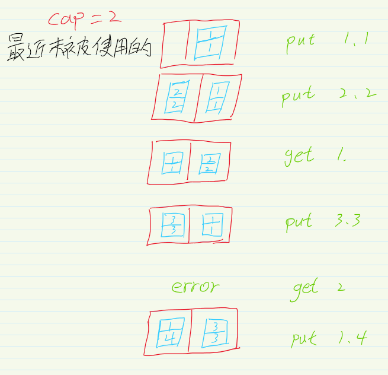
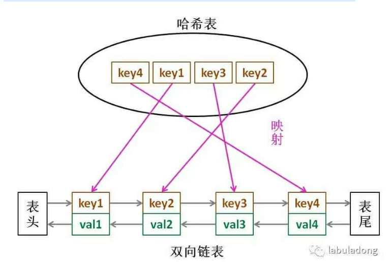

使用C++和Go实现LRU缓存

<!--more-->

## LRU缓存介绍

LRU是Least Recently Used ，就是最近使用过的数据最有可能会继续使用的。很长时间没有用过的数据就认为是之后不会再用到了。在容量有限的情况下，如果数据存满了，又有新的数据过来了。那么就要把最久没被使用的给删了。

LeeCode上有个老哥举例很生动

> 举个简单的例子，安卓手机都可以把软件放到后台运行，比如我先后打开了「设置」「手机管家」「日历」，那么现在他们在后台排列的顺序是这样的：
>
> 
>
> 但是这时候如果我访问了一下「设置」界面，那么「设置」就会被提前到第一个，变成这样：
>
> 
>
> 假设我的手机只允许我同时开 3 个应用程序，现在已经满了。那么如果我新开了一个应用「时钟」，就必须关闭一个应用为「时钟」腾出一个位置，关那个呢？
>
> 按照 LRU 的策略，就关最底下的「手机管家」，因为那是最久未使用的，然后把新开的应用放到最上面：
>
> 

## LRU的操作

对于一个LRU缓存来说都是有一个缓冲区的大小(capacity),可以向缓存中放数据 put(key,val),也可以从缓存中拿到数据get(key),注意在put和get的时候都是O(1)的时间复杂度.

> /* 缓存容量为 2 */
> LRUCache cache = new LRUCache(2);
> // 你可以把 cache 理解成一个队列
> // 假设左边是队头，右边是队尾
> // 最近使用的排在队头，久未使用的排在队尾
> // 圆括号表示键值对 (key, val)
>
> cache.put(1, 1);
> // cache = [(1, 1)]
>
> cache.put(2, 2);
> // cache = [(2, 2), (1, 1)]
>
> cache.get(1);       // 返回 1
> // cache = [(1, 1), (2, 2)]
> // 解释：因为最近访问了键 1，所以提前至队头
> // 返回键 1 对应的值 1
>
> cache.put(3, 3);
> // cache = [(3, 3), (1, 1)]
> // 解释：缓存容量已满，需要删除内容空出位置
> // 优先删除久未使用的数据，也就是队尾的数据
> // 然后把新的数据插入队头
>
> cache.get(2);       // 返回 -1 (未找到)
> // cache = [(3, 3), (1, 1)]
> // 解释：cache 中不存在键为 2 的数据
>
> cache.put(1, 4);    
> // cache = [(1, 4), (3, 3)]
> // 解释：键 1 已存在，把原始值 1 覆盖为 4
> // 不要忘了也要将键值对提前到队头
>
> 

## LRU的设计

根据上述的描述,对于put和get为O(1)的时间复杂度的数据结构要进行设计

- 题目中有"最近使用",就说明数据是有序的,这个有序是相对于使用的时间而言的
- 要在某个位置进行O(1)的插入
- 查找也是O(1)

要同时满足以上的条件单一的数据结构肯定是不行的.对于查找是来说可以使用哈希表来满足条件,有序可以使用链表,但是要进行O(1)的插入,就要使用双链表了,单链表不能进行O(1)的时间复杂度的插入.

> LRU 缓存算法的核心数据结构就是哈希链表，双向链表和哈希表的结合体。这个数据结构长这样：
>
> 

借助这个结构，我们来逐一分析上面的 3 个条件：

1、如果我们每次默认从**链表尾部添加元素**，那么显然**越靠尾部的元素就是最近使用的**，越靠头部的元素就是最久未使用的,如果容量满了之后,要删的也是删除头部的。

2、对于某一个 key，我们可以通过哈希表快速定位到链表中的节点，从而取得对应 val,也就是哈希表存的是值所对应的结点的地址,通过这个地址就可以拿到对应的val。

3、链表显然是支持在任意位置快速插入和删除的，改改指针就行。只不过传统的链表无法按照索引快速访问某一个位置的元素，而这里借助哈希表，可以通过 key 快速映射到任意一个链表节点，然后进行插入和删除。

也许读者会问，为什么要是双向链表，单链表行不行？另外，既然哈希表中已经存了 key，为什么链表中还要存 key 和 val 呢，只存 val 不就行了？

想的时候都是问题，只有做的时候才有答案。这样设计的原因，必须等我们亲自实现 LRU 算法之后才能理解，所以我们开始看代码吧～

## 代码实现

### c++

虽然系统中实现了双向链表,但是这里还是想自己实现一遍.

#### 实现Node

```c++
struct Node{
    int key;
    int val;
    Node *pre; // 指向之前的结点
    Node *next;// 指向之后的结点
    Node(int key,int val):key(key),val(val){}
}
```

#### 实现双向链表

```c++
struct DoubleList{
private:
    Node *head; // 头结点,不存数据
    Node *tail; // 尾结点,不存数据
    int size; // 元素的个数
    
public:
    DoubleList(){
        head = new Node(0,0);
        tail = new Node(0,0);
        size = 0;
        head->next = tail; // 头结点的next指向尾结点
        tail->pre = head;  // 尾结点的pre指向头结点
    }
    
    // 在尾部添加元素
    void addTail(Node *x){
        x->pre = tail->pre; // 插入的之前的指向尾巴的前结点
        x->next = tail; // 插入的next指向尾结点
        tail->pre->next = x; // 尾巴之前的结点的next指向x
        tail->pre = x; // 尾巴之前的变为x
        size++;
    }
    
    // 移除某个结点
    void remove(Node *x) {
        x->pre->next = x->next; 
        x->next->pre = x->pre;
        size--;
    }
    
    // 移除头结点
    Node *removeFirst() {
        if (head == nullptr) {
            return nullptr;
        }
        Node *first = head->next;
        remove(first);
        return first;
    }
    
    
     int len() {
        return size;
    }
}
```

到这里就能回答刚才「为什么必须要用双向链表」的问题了，因为我们需要删除操作。删除一个节点不光要得到该节点本身的指针，也需要操作其前驱节点的指针，而双向链表才能支持直接查找前驱，保证操作的时间复杂度 O(1)。

注意我们实现的双链表 API 只能从尾部插入，也就是说靠尾部的数据是最近使用的，靠头部的数据是最久为使用的。

#### 实现LRU

LRU中要使用到之前实现的链表和哈希表。

```c++
struct LRU {
    map<int, Node *> *m;
    DoubleList *cache;
    int cap;

    // 初始化
    LRU(int cap) {
        this->cap = cap;
        m = new map<int, Node *>;
        cache = new DoubleList();
    }

// 封装底层的接口
private:
    // 将某个key提升为最近使用的
    void makeRecently(int key) {
        auto item = m->find(key);
        if (item == m->end()) {
            return;
        }
        // 先删除
        cache->remove(item->second);
        // 再加到链表的尾部
        cache->addLast(item->second);
    }
    // 添加最近使用过的元素
    void addRecently(int key, int val) {
        Node *x = new Node(key, val);
        // 添加到尾部
        cache->addLast(x);
        // 在map中也要添加
        m->insert(pair<int, Node *>(key, x));
    }

    // 删除某个缓存
    void deleteKey(int key) {
        auto temp = m->find(key);
        // 如果没有找到就算了
        if (temp == m->end()) {
            return;
        }
        // 在链表和map中都删除
        cache->remove(temp->second);
        m->erase(key);
    }
    
    // 删除最久没被使用的
    void removedLeastRecently() {
        // 链表删除头
        Node *deleteNode = cache->removeFirst();
        // map 直接删除
        m->erase(deleteNode->key);
    }

// 封装对外的get和set
public:
    int get(int key) {
        auto temp = m->find(key);
        if (temp == m->end()) {
            return -1;
        }
        // 找到之后要提升
        makeRecently(key);
        return temp->second->val;
    }

    void put(int key, int val) {
        auto temp = m->find(key);
        // 如果找到了 就是要修改值
        if (temp != m->end()) {
            // 先删除key
            deleteKey(key);
            // 再添加
            addRecently(key, val);
            return;
        }
        // 容量超了就删除最久没有使用的
        if (cap == cache->len()) {
            removedLeastRecently();
        }
        addRecently(key, val);
    }
};
```

### c++另一个版本

使用iterator迭代器进行实现

```c++
class LRUCache {
public:
    LRUCache(int capacity) : cap(capacity) {
    }

    int get(int key) {
        // 如果没有就返回-1
        if (map.find(key) == map.end()) return -1;
        auto keyAndValue = *map[key];
        cache.erase(map[key]);
        cache.push_front(keyAndValue);
        map[key] = cache.begin();
        return keyAndValue.second;
    }

    void put(int key, int value) {
        // 如果缓存中没有
        if (map.find(key) == map.end()) {
            // 缓存中满了
            if (cache.size() == cap) {
                // 删除头部的元素，也就是最久没被使用的
                map.erase(cache.back().first);
                cache.pop_back();
            }
        } else {
            // 如果缓存中有就删除
            cache.erase(map[key]);
        }
        // 重新插在末尾
        cache.push_front({key, value});
        map[key] = cache.begin();
    }

private:
    int cap;
    // 一个双向链表，存顺序
    list<pair<int, int>> cache;
    // 加速访问
    unordered_map<int, list<pair<int, int>>::iterator> map;
};
```

这个版本不用实现双向链表，只需要自己手动调用就行

### go

和之前c++1.0版本一样自己实现一个双向链表，之后使用自带的map。这次使用了1.18的泛型进行实现。

#### Node

```go
// 通用的结点，保存的val可以是任何类型
type Node[T any] struct {
	Val  T
	Pre  *Node[T]
	Next *Node[T]
}

func NewNode[T any](val T) *Node[T] {
	return &Node[T]{
		Val: val,
	}
}

// 一个key-value的数据结构 
type KeyValue[Key, Value any] struct {
	Key   Key
	Value Value
}

```

#### double-list

```go
// 链表的数据结构
// 使用的时候要给传入Node中val的类型
type DoubleList[T any] struct {
   head *Node[T] // 头结点
   tail *Node[T] // 尾巴结点
   size int
}

func NewDoubleList[T any]() *DoubleList[T] {
   dl := DoubleList[T]{
      head: new(Node[T]),
      tail: new(Node[T]),
      size: 0,
   }
   dl.head.Next = dl.tail
   dl.tail.Pre = dl.head
   return &dl
}

// 在尾巴插入一个结点
func (dl *DoubleList[T]) PushBack(node *Node[T]) {
   node.Pre = dl.tail.Pre
   node.Next = dl.tail
   dl.tail.Pre.Next = node
   dl.tail.Pre = node
   dl.size++
}

// 删除一个结点
func (dl *DoubleList[T]) Remove(node *Node[T]) {
   if node == nil || node.Pre == nil || node.Next == nil {
      return
   }
   node.Pre.Next = node.Next
   node.Next.Pre = node.Pre
   dl.size--
}

// 返回头结点
func (dl *DoubleList[T]) Front() *Node[T] {
   if dl.head == nil {
      return nil
   }
   return dl.head.Next
}

// 删除头结点
func (dl *DoubleList[T]) PopFront() {
   if dl.head == nil {
      return
   }
   dl.Remove(dl.head.Next)
   return
}

// 返回链表长度
func (dl *DoubleList[T]) Size() int {
   return dl.size
}
```

#### LRU实现

```go
var (
   NotFoundErr = errors.New("not found")
)

// lru的数据结构
type lru[K comparable, Value any] struct {
   // lock  sync.RWMutex
   data  map[K]*Node[KeyValue[K, Value]]
   cache *DoubleList[KeyValue[K, Value]]
   cap   int
}

func NewLRU[K comparable, Value any](cap int) *lru[K, Value] {
   return &lru[K, Value]{
      data:  make(map[K]*Node[KeyValue[K, Value]]),
      cache: NewDoubleList[KeyValue[K, Value]](),
      cap:   cap,
   }
}

// 提升某个结点
func (lru *lru[K, Value]) makeRecently(key K) {
   find, ok := lru.data[key]
   if !ok {
      return
   }
   lru.cache.Remove(find)
   lru.cache.PushBack(find)
}

// 新添加一个结点
func (lru *lru[K, Value]) addRecently(key K, value Value) {
   node := NewNode[KeyValue[K, Value]](KeyValue[K, Value]{Key: key, Value: value})
   lru.cache.PushBack(node)
   lru.data[key] = node
}

// 删除某个结点
func (lru *lru[K, Value]) deleteKey(key K) {
   find, ok := lru.data[key]
   if !ok {
      return
   }
   lru.cache.Remove(find)
   delete(lru.data, key)
}

// 删除最久没有使用的
func (lru *lru[K, Value]) removerLeastRecently() {
   head := lru.cache.Front()
   lru.cache.PopFront()
   delete(lru.data, head.Val.Key)
}

// Put
func (lru *lru[K, Value]) Put(key K, val Value) {
   _, ok := lru.data[key]
   if ok {
      lru.deleteKey(key)
   }
   if lru.cap == lru.cache.Size() {
      lru.removerLeastRecently()
   }
   lru.addRecently(key, val)
}

// Get
func (lru *lru[K, Value]) Get(key K) (Value, error) {
   find, ok := lru.data[key]
   if !ok {
      var t Value
      return t, NotFoundErr
   }
   lru.makeRecently(key)
   return find.Val.Value, nil
}
```

# 参考

[LRU 策略详解和实现 - LRU 缓存 - 力扣（LeetCode）](https://leetcode.cn/problems/lru-cache/solution/lru-ce-lue-xiang-jie-he-shi-xian-by-labuladong/)
