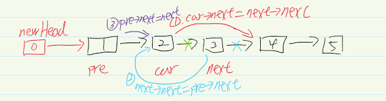
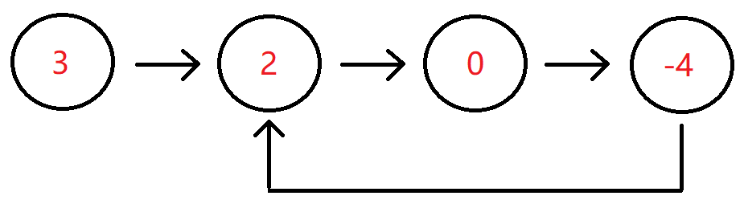
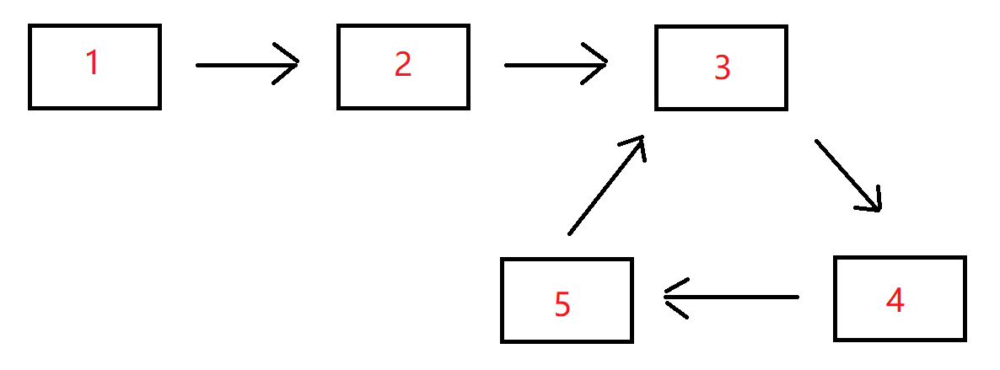

牛客算法必刷TOP101，包含：链表、二分查找/排序、二叉树、堆/栈/队列、哈希、递归/回溯、动态规划、字符串、双指针、贪心算法、模拟总共101道题。

[牛客网 (nowcoder.com)](https://www.nowcoder.com/exam/oj?page=1&tab=算法篇&topicId=295)

<!--more-->

## 链表

### 反转链表

#### 描述

给定一个单链表的头结点**pHead**(该头节点是有值的，比如在下图，它的val是1)，长度为n，反转该链表后，返回新链表的表头。

数据范围： 0≤*n*≤1000

要求：空间复杂度 O*(1) ，时间复杂度 O*(*n) 。

如当输入链表{1,2,3}时，

经反转后，原链表变为{3,2,1}，所以对应的输出为{3,2,1}。

以上转换过程如下图所示：


#### 示例1

输入：

```tex
{1,2,3}
```

返回值：

```tex
{3,2,1}	
```

#### 示例2

输入：

```tex
{}
```

返回值：

```
{}
```

说明：

```tex
空链表则输出空                  
```

#### 解法

##### 原地置换

分别用三个指针`pre`,`cur`,`next`代表之前的结点，当前的结点，下一个结点。改变链表的指向关系就可以原地改变顺序。

以下是模拟的过程


代码如下：

```c++
class Solution {
public:
    ListNode* ReverseList(ListNode* pHead) {
        ListNode*pre = nullptr;
        ListNode*cur = pHead;
        while(cur){
            ListNode*next = cur->next; // 第四步
            cur->next = pre; //第一步
            pre = cur; //第二步
            cur = next; // 第三步
        }
        return pre;
    }
};
```

### 链表内指定区间反转

#### 描述

将一个节点数为 size 链表 m 位置到 n 位置之间的区间反转，要求时间复杂度 O(n)*O*(*n*)，空间复杂度 O(1)*O*(1)。
例如：
给出的链表为 1→2→3→4→5→NULL, m*=2,*n=4,
返回 1→4→3→2→5→NULL

要求：时间复杂度 O(n)*O*(*n*) ，空间复杂度 O(n)*O*(*n*)

进阶：时间复杂度 O(n)*O*(*n*)，空间复杂度 O(1)*O*(1)

#### 示例1

输入：

```
{1,2,3,4,5},2,4
```

返回值：

```
{1,4,3,2,5}
```

#### 示例2

输入：

```
{5},1,1
```

返回值：

```
{5}
```

#### 解析

##### 解法一

对于这道题，我们可以参考反转链表的题，只需要直到指定的区间的链表，然后断开，将这个区间的链表进行反转。

注意，由于在此过程中需要保存区间左边和右边的链表，所以需要加上一个新的头结点来处理边界问题。

```c++
// 反转当前链表
ListNode *reverse(ListNode *head) {
    ListNode *pre = nullptr;
    ListNode *cur = head;
    ListNode *next = nullptr;
    while (cur) {
        next = cur->next;
        cur->
                next = pre;
        pre = cur;
        cur = next;
    }
    return pre;
}


ListNode *reverseBetween(ListNode *head, int m, int n) {
    if (head->next == nullptr || head == nullptr || m == n) {
        return
                head;
    }
    // 防止出现pre的问题
    auto *newHead = new ListNode(0);
    newHead->next = head;
    ListNode *pre = newHead;
    // 从哪里开始的
    ListNode *begin = head;
    // 结束的最后一个结点
    ListNode *end = nullptr;
    // 结束断开的下一个
    ListNode *endEnd = nullptr;
    // 找到从哪里开始断开
    for (int i = 0; i < m - 1; i++) {
        pre = begin;
        begin = begin->next;
    }
    // 断开左边的
    pre->next = nullptr;

    // 从哪里结束
    end = begin;
    for (int i = m; i < n; i++) {
        end = end->next;
    }
    // 右边断开的
    endEnd = end->next;
    // 断开
    end->next = nullptr;
    // 反转区间的链表
    end = reverse(begin);
    // 反转之后接上， 区间头变成尾，尾巴变成了头
    pre->next = end;
    begin->next = endEnd;
    return newHead->next;
}

```

#### 解法二

利用头插法将新遍历的结点放到前面来。



1. 将cur的next指向next的next
2. next的next指向pre的next
3. pre的next指向next。

```c++
ListNode *reverseBetween(ListNode *head, int m, int n) {
    // 防止出现pre的问题
    auto *newHead = new ListNode(0);
    newHead->next = head;
    ListNode *pre = newHead;	
    for(int i = 1;i<m;i++){
        pre = pre->next;
    }
    cur = pre->next;
    for(int i = m;i<n;i++){
        ListNode*next = cur->next;
        cur->next= next->next;
        next->next= pre->next;
        pre->next= next;
    }
    return newHead->next;
}
```

### 链表中的节点每k个一组翻转

#### 描述

将给出的链表中的节点每 k 个一组翻转，返回翻转后的链表
如果链表中的节点数不是 k 的倍数，将最后剩下的节点保持原样
你不能更改节点中的值，只能更改节点本身。

数据范围： 0≤*n*≤2000 ， 1≤*k*≤2000 ，链表中每个元素都满足 0≤val≤1000
要求空间复杂度 O(1)，时间复杂度 O(n)

例如：

给定的链表是 1→2→3→4→5

对于 k=2 , 你应该返回 2→1→4→3→5

对于 k=3 , 你应该返回 3→2→1→4→5

#### 示例1

输入：

```
{1,2,3,4,5},2
```

复制

返回值：

```
{2,1,4,3,5}
```

复制

#### 示例2

输入：

```
{},1
```

复制

返回值：

```
{}
```

#### 解析

通过链表指定区间的反转我们知道了利用头插法进行转换链表，这个题也是类似。都反转，对每一组都是指定区间的反转。只需要将k个结点分为一组就行。

```c++
    ListNode* reverseKGroup(ListNode* head, int k) {
        int len = 0;
        ListNode*cur = head;
        ListNode*newHead = new ListNode(0);
        newHead->next = head;
        // 求出总共有多长
        while(cur){
            len++;
            cur = cur->next;
        }
        ListNode *pre = newHead;
        cur = head;
        // 分成多少组
        for(int i = 0;i<len/k;i++){
            // 组内进行区间反转
            for(int j = 1;j<k;j++){
                ListNode*next = cur->next;
                cur->next=next->next;
                next->next= pre->next;
                pre->next= next;
            }
            pre = cur;
            cur = cur->next;
        }
        return newHead->next;
    }
```

### 合并两个排序的链表

#### 描述

输入两个递增的链表，单个链表的长度为n，合并这两个链表并使新链表中的节点仍然是递增排序的。

如输入{1,3,5},{2,4,6}时，合并后的链表为{1,2,3,4,5,6}，所以对应的输出为{1,2,3,4,5,6}

#### 示例1

输入：

```
{1,3,5},{2,4,6}
```

返回值：

```
{1,2,3,4,5,6}
```

复制

#### 示例2

输入：

```
{},{}
```

返回值：

```
{}
```

#### 示例3

输入：

```
{-1,2,4},{1,3,4}
```

返回值：

```
{-1,1,2,3,4,4}
```

#### 解析

##### 解法一

利用归并排序的思想，进行模拟即可。

```c++
ListNode* Merge(ListNode* pHead1, ListNode* pHead2) {
    ListNode *res = new ListNode(0);
    ListNode *cur = res;
    while(pHead1&&pHead2){
        if(pHead1->val<=pHead2->val){
            cur->next = pHead1;
            pHead1 = pHead1->next;
        }else{
            cur->next = pHead2;
            pHead2 = pHead2->next;
      	}
        cur = cur->next;
    }
    if(pHead1){
        cur->next = pHead1;
    }
    if(pHead2){
        cur->next = pHead2;
    }
    return res->next;
}
```

##### 解法二

我们利用归并思想不断合并两个链表，每当我们添加完一个节点后，该节点指针后移，相当于这个链表剩余部分与另一个链表剩余部分合并，两个链表剩余部分合并就是原问题两个有序链表合并的子问题，因此也可以使用递归：

- **终止条件：** 当一个链表已经因为递归到了末尾，另一个链表剩余部分一定都大于前面的，因此我们可以将另一个链表剩余部分拼在结果后面，结束递归。
- **返回值：** 每次返回拼接好的较大部分的子链表。
- **本级任务：** 每级不断进入下一个较小的值后的链表部分与另一个链表剩余部分，再将本次的节点接在后面较大值拼好的结果前面。

**具体做法：**

- step 1：每次比较两个链表当前节点的值，然后取较小值的链表指针往后，另一个不变，两段子链表作为新的链表送入递归中。
- step 2：递归回来的结果我们要加在当前较小值的节点后面，相当于不断在较小值后面添加节点。
- step 3：递归的终止是两个链表有一个为空。

```c++
// 每次返回拼接好的较大部分的子链表
ListNode* Merge(ListNode* pHead1, ListNode* pHead2) {
    //一个已经为空了，返回另一个
    if(pHead1==nullptr){
        return pHead2;
    }
    if(pHead2==nullptr){
        return pHead1;
    }

    if(pHead1->val<=pHead2->val){
        pHead1->next = Merge(pHead1->next, pHead2);
        return pHead1;
    }else{
        pHead2->next = Merge(pHead1, pHead2->next);
        return pHead2;
    }
}
```

### 合并k个已排序的链表

#### 描述

合并 k 个升序的链表并将结果作为一个升序的链表返回其头节点。

数据范围：节点总数满足 0≤*n*≤105，链表个数满足 1≤*k*≤10^5 ，每个链表的长度满足 1≤len≤200 ，每个节点的值满足 |val| <= 1000

要求：时间复杂度 O(nlogk)

#### 示例1

输入：

```
[{1,2,3},{4,5,6,7}]
```

返回值：

```
{1,2,3,4,5,6,7}
```

#### 示例2

输入：

```
[{1,2},{1,4,5},{6}]
```

返回值：

```
{1,1,2,4,5,6}
```

#### 解析

##### 解析1-超时

上面已经完成了`两个排序链表的合并`,两个链表两两进行合并就行。但是时间复杂度是`O(n*k)`不满足时间要求。

```c++
    ListNode*merge(ListNode*list1,ListNode*list2){
        ListNode * res = new ListNode(0);
        ListNode *cur = res;
        while(list1&&list2){
            if(list1->val<=list2->val){
                cur->next = list1;
                list1 = list1->next;
            }else{
                cur->next = list2;
                list2 = list2->next;
            }
            cur =cur->next;
        }
        if(list1){
            cur->next = list1;
        }
        if(list2){
            cur->next = list2;
        }
        return res->next;
    }
    ListNode *mergeKLists(vector<ListNode *> &lists) {
        ListNode *res ;
        for(int i = 0;i<lists.size();i++){
            res = merge(res, lists[i]);
        }
        return res;
    }
```

##### 解析2

上述中，我们是让合并好的再和新的进行合并，其实我们可以让新的链表两两合并，减少额外的合并次数。降低时间复杂度。

```c++
   ListNode*merge(ListNode*list1,ListNode*list2){
        ListNode * res = new ListNode(0);
        ListNode *cur = res;
        while(list1&&list2){
            if(list1->val<=list2->val){
                cur->next = list1;
                list1 = list1->next;
            }else{
                cur->next = list2;
                list2 = list2->next;
            }
            cur =cur->next;
        }
        if(list1){
            cur->next = list1;
        }
        if(list2){
            cur->next = list2;
        }
        return res->next;
    }
    
    // 分组进行合并
    ListNode* groupMerge(vector<ListNode *> &lists,int left,int right){
        // 中间只有一个的情况
        if(left==right){
            return lists[left];
        }
        if(left>right){
            return nullptr;
        }
        // 从中间分开两段，分开的部分进行合并
        int mid = (left+right)>>1;
        // 合并的两部分再进行合并
        return merge(groupMerge(lists, left, mid), groupMerge(lists, mid+1, right));
        
    }
    ListNode *mergeKLists(vector<ListNode *> &lists) {
        return groupMerge(lists, 0, lists.size()-1);
    }
```

### 判断链表中是否有环

#### 描述

判断给定的链表中是否有环。如果有环则返回true，否则返回false。

数据范围：链表长度 0≤*n*≤10000，链表中任意节点的值满足 |val| <= 100000

要求：空间复杂度 O(1),时间复杂度 O(n)

输入分为两部分，第一部分为链表，第二部分代表是否有环，然后将组成的head头结点传入到函数里面。-1代表无环，其它的数字代表有环，这些参数解释仅仅是为了方便读者自测调试。实际在编程时读入的是链表的头节点。

例如输入{3,2,0,-4},1时，对应的链表结构如下图所示：



可以看出环的入口结点为从头结点开始的第1个结点（注：头结点为第0个结点），所以输出true。

#### 示例1

输入：

```
{3,2,0,-4},1
```

返回值：

```
true
```

说明：

```
第一部分{3,2,0,-4}代表一个链表，第二部分的1表示，-4到位置1（注：头结点为位置0），即-4->2存在一个链接，组成传入的head为一个带环的链表，返回true             
```

#### 示例2

输入：

```
{1},-1
```

返回值：

```
false
```

说明：

```
第一部分{1}代表一个链表，-1代表无环，组成传入head为一个无环的单链表，返回false             
```

#### 示例3

输入：

```
{-1,-7,7,-4,19,6,-9,-5,-2,-5},6
```

返回值：

```
true
```

#### 解析

##### 方法1-哈希表

将已经遍历过的结点保存在map中，如果map中已经有了，就说明有环，整个链表遍历完之后都没有，就说明没有环。

```c++
bool hasCycle(ListNode* head) {
        map<ListNode*, bool> m;
        while (head) {
            auto a = m.find(head);
            if (a != m.end()) {
                return true;
            } else {
                m[head] = true;
            }
            head = head->next;
        }
    return false;
}
```

##### 方法2-双指针

一个快指针走两步，一个慢指针走一步。当两个指针相遇的时候就说明，是有环的。证明过程如下：

[「代码随想录」你的疑惑，这里都讲清楚了！142. 环形链表 II - 环形链表 II - 力扣（LeetCode） (leetcode-cn.com)](https://leetcode-cn.com/problems/linked-list-cycle-ii/solution/142-huan-xing-lian-biao-ii-jian-hua-gong-shi-jia-2/)

```c++
bool hasCycle(ListNode* head) {
        ListNode* fast = head;
        ListNode* slow = head;
        while (fast && fast->next) {
            fast = fast->next->next;
            slow = slow->next;
            if (fast == slow) {
                return true;
            }
        }
        return false;
}
```

### 链表中环的入口结点

给一个长度为n链表，若其中包含环，请找出该链表的环的入口结点，否则，返回null。

数据范围：n*≤10000，1<=结点值<=10000

要求：空间复杂度 O(1)，时间复杂度 O(n)

例如，输入{1,2},{3,4,5}时，对应的环形链表如下图所示：



可以看到环的入口结点的结点值为3，所以返回结点值为3的结点。

#### 输入描述：

输入分为2段，第一段是入环前的链表部分，第二段是链表环的部分，后台会根据第二段是否为空将这两段组装成一个无环或者有环单链表

#### 返回值描述：

返回链表的环的入口结点即可，我们后台程序会打印这个结点对应的结点值；若没有，则返回对应编程语言的空结点即可。

#### 示例1

输入：

```
{1,2},{3,4,5}
```

返回值：

```
3
```

说明：

```
返回环形链表入口结点，我们后台程序会打印该环形链表入口结点对应的结点值，即3    
```

#### 示例2

输入：

```
{1},{}
```

返回值：

```
"null"
```

说明：

```
没有环，返回对应编程语言的空结点，后台程序会打印"null"    
```

#### 示例3

输入：

```
{},{2}
```

返回值：

```
2
```

说明：

```
环的部分只有一个结点，所以返回该环形链表入口结点，后台程序打印该结点对应的结点值，即2 
```

#### 解析

##### 解析1-哈希表

和`判断链表中是否有环`是一样的，如果map中有就说明这个位置就是环，否则就是没有环。

```c++
ListNode* EntryNodeOfLoop(ListNode* head) {
        map<ListNode*, bool> m;
        while (head) {
            auto a = m.find(head);
            if (a != m.end()) {
                return a.first;
            } else {
                m[head] = true;
            }
            head = head->next;
        }
    return nullptr;
}
```

##### 解析2-双指针

一个快指针走两步，一个慢指针走一步。当两个指针相遇的时候就说明，是有环的。有环之后，让头指针和相遇的指针一起走，相遇之后就是环的入口：

[「代码随想录」你的疑惑，这里都讲清楚了！142. 环形链表 II - 环形链表 II - 力扣（LeetCode） (leetcode-cn.com)](https://leetcode-cn.com/problems/linked-list-cycle-ii/solution/142-huan-xing-lian-biao-ii-jian-hua-gong-shi-jia-2/)

```c++
ListNode* EntryNodeOfLoop(ListNode* pHead) {
        ListNode* fast = pHead;
        ListNode* slow = pHead;
        while (fast && fast->next) {
            fast = fast->next->next;
            slow = slow->next;
            if (fast == slow) {
                while(fast!=pHead){
                    fast  = fast->next;
                    pHead = pHead->next;
                }
                return fast;
            }
        }
        return nullptr;
    }
```

### 链表中倒数最后k个结点

#### 描述

输入一个长度为 n 的链表，设链表中的元素的值为 ai ，返回该链表中倒数第k个节点。

如果该链表长度小于k，请返回一个长度为 0 的链表。

数据范围：0 \leq n \leq 10^50≤*n*≤105，0 \leq a_i \leq 10^90≤*a**i*≤109，0 \leq k \leq 10^90≤*k*≤109

要求：空间复杂度 O(n)*O*(*n*)，时间复杂度 O(n)*O*(*n*)

进阶：空间复杂度 O(1)*O*(1)，时间复杂度 O(n)*O*(*n*)

例如输入{1,2,3,4,5},2时，对应的链表结构如下图所示：


其中蓝色部分为该链表的最后2个结点，所以返回倒数第2个结点（也即结点值为4的结点）即可，系统会打印后面所有的节点来比较。

#### 示例1

输入：

```
{1,2,3,4,5},2
```

返回值：

```
{4,5}
```

说明：

```
返回倒数第2个节点4，系统会打印后面所有的节点来比较。 
```

#### 示例2

输入：

```
{2},8
```

返回值：

```
{}
```

#### 解析

##### 解法1-数组

将链表的每一个结点按照顺序保存到数组中，按照要求求出当前倒数第几个结点。

##### 解法2-遍历两遍

第一遍求出链表的长度，第二遍遍历到倒数第k个结点。

```c++
ListNode* FindKthToTail(ListNode* pHead, int k) {
        int len = 0;
        ListNode* cur = pHead;
        // 求长度
        while (cur) {
            len++;
            cur = cur->next;
        }
        // 指向头
        cur = pHead;
        // 如果超过长度了，返回空
        if (k > len) {
            return nullptr;
        }
        len -= k;
        while (len > 0) {
            cur = cur->next;
            len--;
        }
        return cur;
    }
```

