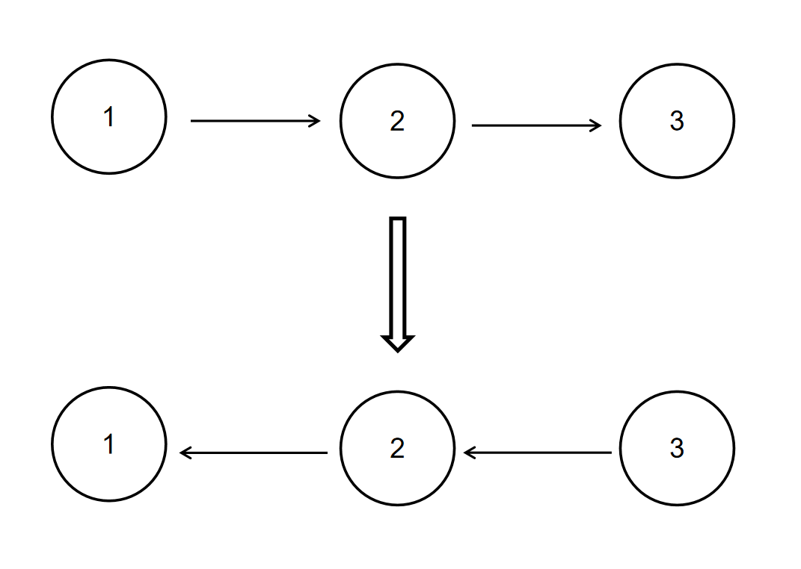
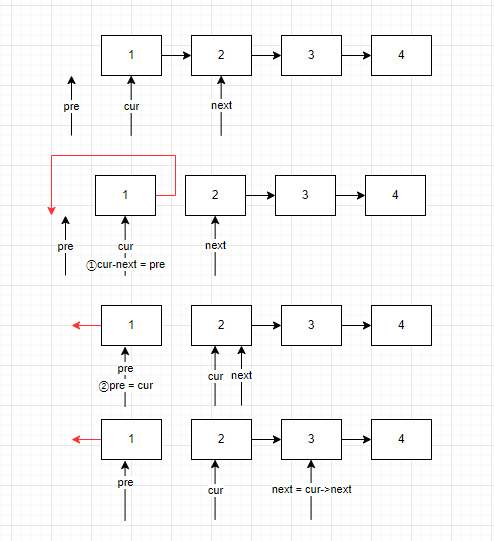
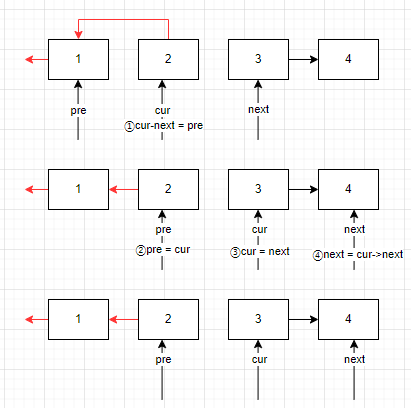
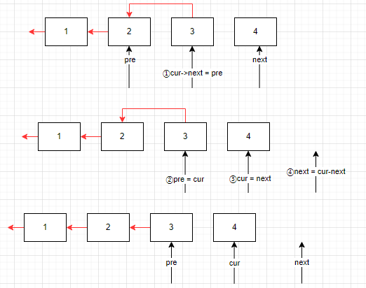
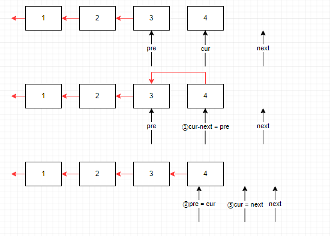

牛客算法必刷TOP101，包含：链表、二分查找/排序、二叉树、堆/栈/队列、哈希、递归/回溯、动态规划、字符串、双指针、贪心算法、模拟总共101道题。

[牛客网 (nowcoder.com)](https://www.nowcoder.com/exam/oj?page=1&tab=算法篇&topicId=295)

<!--more-->

## 链表

### 反转链表

#### 描述

给定一个单链表的头结点**pHead**(该头节点是有值的，比如在下图，它的val是1)，长度为n，反转该链表后，返回新链表的表头。

数据范围： 0≤*n*≤1000

要求：空间复杂度 O*(1) ，时间复杂度 O*(*n) 。

如当输入链表{1,2,3}时，

经反转后，原链表变为{3,2,1}，所以对应的输出为{3,2,1}。

以上转换过程如下图所示：



#### 示例1

输入：

```tex
{1,2,3}
```

返回值：

```tex
{3,2,1}	
```

#### 示例2

输入：

```tex
{}
```

返回值：

```
{}
```

说明：

```tex
空链表则输出空                  
```

#### 解法

##### 原地置换

分别用三个指针`pre`,`cur`,`next`代表之前的结点，当前的结点，下一个结点。改变链表的指向关系就可以原地改变顺序。

以下是模拟的过程









代码如下：

```c++
class Solution {
public:
    ListNode* ReverseList(ListNode* pHead) {
        ListNode*pre = nullptr;
        ListNode*cur = pHead;
        while(cur){
            ListNode*next = cur->next; // 第四步
            cur->next = pre; //第一步
            pre = cur; //第二步
            cur = next; // 第三步
        }
        return pre;
    }
};
```

### 链表内指定区间反转

#### 描述

将一个节点数为 size 链表 m 位置到 n 位置之间的区间反转，要求时间复杂度 O(n)*O*(*n*)，空间复杂度 O(1)*O*(1)。
例如：
给出的链表为 1→2→3→4→5→NULL, m*=2,*n=4,
返回 1→4→3→2→5→NULL

要求：时间复杂度 O(n)*O*(*n*) ，空间复杂度 O(n)*O*(*n*)

进阶：时间复杂度 O(n)*O*(*n*)，空间复杂度 O(1)*O*(1)

#### 示例1

输入：

```
{1,2,3,4,5},2,4
```

复制

返回值：

```
{1,4,3,2,5}
```

复制

#### 示例2

输入：

```
{5},1,1
```

复制

返回值：

```
{5}
```

#### 解析

对于这道题，我们可以参考反转链表的题，只需要直到指定的区间的链表，然后断开，将这个区间的链表进行反转。

注意，由于在此过程中需要保存区间左边和右边的链表，所以需要加上一个新的头结点来处理边界问题。

```c++
// 反转当前链表
ListNode *reverse(ListNode *head) {
    ListNode *pre = nullptr;
    ListNode *cur = head;
    ListNode *next = nullptr;
    while (cur) {
        next = cur->next;
        cur->
                next = pre;
        pre = cur;
        cur = next;
    }
    return pre;
}


ListNode *reverseBetween(ListNode *head, int m, int n) {
    if (head->next == nullptr || head == nullptr || m == n) {
        return
                head;
    }
    // 防止出现pre的问题
    auto *newHead = new ListNode(0);
    newHead->next = head;
    ListNode *pre = newHead;
    // 从哪里开始的
    ListNode *begin = head;
    // 结束的最后一个结点
    ListNode *end = nullptr;
    // 结束断开的下一个
    ListNode *endEnd = nullptr;
    // 找到从哪里开始断开
    for (int i = 0; i < m - 1; i++) {
        pre = begin;
        begin = begin->next;
    }
    // 断开左边的
    pre->next = nullptr;

    // 从哪里结束
    end = begin;
    for (int i = m; i < n; i++) {
        end = end->next;
    }
    // 右边断开的
    endEnd = end->next;
    // 断开
    end->next = nullptr;
    // 反转区间的链表
    end = reverse(begin);
    // 反转之后接上， 区间头变成尾，尾巴变成了头
    pre->next = end;
    begin->next = endEnd;
    return newHead->next;
}

```

