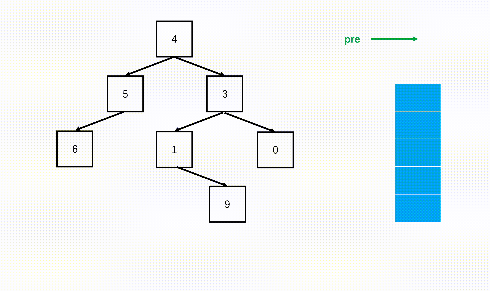
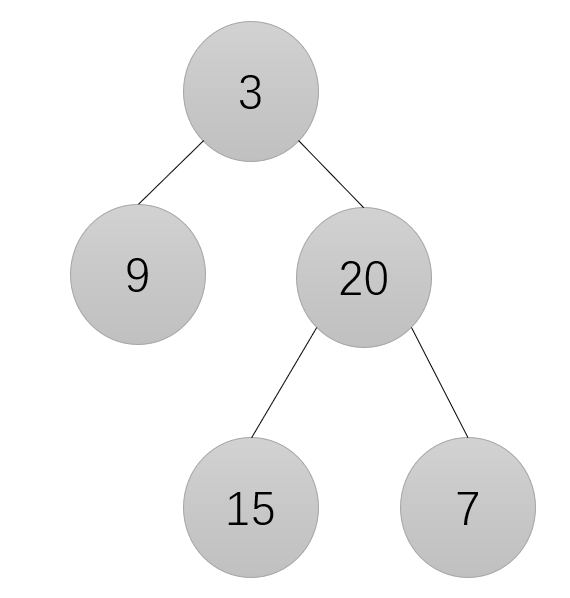

牛客算法必刷TOP101，包含：链表、二分查找/排序、二叉树、堆/栈/队列、哈希、递归/回溯、动态规划、字符串、双指针、贪心算法、模拟总共101道题。

此部分是**二叉树专题**。

[牛客网 (nowcoder.com)](https://www.nowcoder.com/exam/oj?page=1&tab=算法篇&topicId=295)

<!--more-->

## 二叉树的前序遍历

### 描述

给你二叉树的根节点 root ，返回它节点值的 前序 遍历。

数据范围：二叉树的节点数量满足$ 0 \le n \le 100$ ，二叉树节点的值满足 $1 \le val \le 100$  ，树的各节点的值各不相同

示例 1：


### 解析

#### 解析1-递归

按照前序遍历的定义，先遍历中间结点，接着遍历左孩子，在遍历右孩子。

```c++
void preorderTraversal(vector<int> &res,TreeNode*root){
        if(root==nullptr){
            return ;
        }
        res.push_back(root->val);
        preorderTraversal(res, root->left);
        preorderTraversal(res, root->right);
    }
    
    vector<int> preorderTraversal(TreeNode* root) {
        vector<int> res;
        preorderTraversal(res,root);
        return res;
    }
```

#### 解析2-迭代法

递归的方式使用到了函数栈，我们也可以自己用栈进行模拟。

对于前序遍历，我们先访问中间结点，再访问左边结点，最后访问右结点。但是根据栈的特性：先进后出。应该先放入右结点，再放入左结点。

```c++
vector<int> preorderTraversal(TreeNode* root){
    vector<int> res;
    if(root==nullptr){
        return res;
    }
    // 辅助栈
    stack<TreeNode*> help;
    help.push(root);
    // 不为空就继续
    while(!help.empty()){
        TreeNode*temp = help.top();
        help.pop();
        res.push_back(temp->val);
        // 要先放入右孩子
        if(temp->right){
            help.push(temp->right);
        }
        // 再放入左孩子
        if(temp->left){
            help.push(temp->left);
        }
    }
    return res;
}
```

## 二叉树的中序遍历

### 描述

给定一个二叉树的根节点root，返回它的中序遍历结果。

数据范围：树上节点数满足 $0 \le n \le 1000$，树上每个节点的值满足 $0 \le val \le 1000$
进阶：空间复杂度 O(n)，时间复杂度 O(n)

### 示例1

输入：

```
{1,2,#,#,3}
```

返回值：

```
[2,3,1]
```

说明：


### 示例2

输入：

```
{}
```

返回值：

```
[]
```

### 示例3

输入：

```
{1,2}
```

返回值：

```
[2,1]
```

说明：


### 示例4

输入：

```
{1,#,2}
```

返回值：

```
[1,2]
```

说明：


### 解析

#### 解析1-递归法

根据题意进行模拟

```c++
void inorderTraversal(vector<int> &res,TreeNode* root){
        if(root==nullptr){
            return ;
        }
        if(root->left){
            inorderTraversal(res,root->left);
        }
        res.push_back(root->val);
        if(root->right){
            inorderTraversal(res,root->right);
        }
    }
    vector<int> inorderTraversal(TreeNode* root) {
        vector<int>res;
        inorderTraversal(res,root);
        return res;
    }
```

#### 解析2-迭代法

由于中序遍历是先访问左孩子，我们就要先找到左孩子，一直要找到树叶的左孩子。一直深度优先找到左孩子，然后访问左孩子，之后访问中间结点，之后对右孩子进行这样迭代遍历。

```c++
vector<int> inorderTraversal(TreeNode* root){
    vector<int>res;
    if(root==nullptr){
        return res;
    }
    stack<TreeNode*>help;
    while(root||!help.empty()){
        while(root){
            help.push(root);
            root = root->left;
        }
        TreeNode*temp = help.top();
        help.pop();
        res.push_back(temp->val);
        root = temp->right;
    }
    return res;
}
```

## 二叉树的后序遍历

### 描述

给定一个二叉树，返回他的后序遍历的序列。

后序遍历是值按照 左节点->右节点->根节点 的顺序的遍历。

数据范围：二叉树的节点数量满足 $0 \le n \le 100$，二叉树节点的值满足 $1 \le val \le 100$ ，树的各节点的值各不相同

样例图


### 解析

#### 解析1-递归

根据题意进行模拟

```c++
 void postorderTraversal(vector<int>&res,TreeNode*root){
        if(root==nullptr){
            return;
        }
        postorderTraversal(res,root->left);
        postorderTraversal(res,root->right);
        res.push_back(root->val);
    }
    vector<int> postorderTraversal(TreeNode* root) {
        vector<int>res;
        postorderTraversal(res,root);
        return res;
    }
```

#### 解析2-迭代

根据后序遍历“左右中”的顺序，那么后序遍历也与中序遍历类似，要先找到每棵子树的最左端节点：

```c++
//每次找到最左节点
while(root != NULL){ 
    s.push(root);
    root = root->left;
}
```

然后我们就要访问该节点了嘛？不不不，如果它还有一个右节点呢？根据“左右根”的原则，我还要先访问右子树。我们只能说它是最左端的节点，它左边为空，但是右边不一定，因此这个节点必须被看成是这棵最小的子树的根。要怎么访问根节点呢？

我们都知道从栈中弹出根节点，一定是左节点已经被访问过了，因为左节点是子问题，访问完了才回到父问题，那么我们还必须要确保右边也已经被访问过了。如果右边为空，那肯定不用去了，如果右边不为空，那我们肯定优先进入右边，此时再将根节点加入栈中，等待右边的子树结束。

```c++
//该节点再次入栈
s.push(node);
//先访问右边
root = node->right;
```

不过，当右边被访问了，又回到了根，我们的根怎么知道右边被访问了呢？用一个前序指针pre标记一下，每个根节点只对它的右节点需要标记，而每个右节点自己本身就是一个根节点，因此每次访问根节点的时候，我们可以用pre标记为该节点，回到上一个根节点时，检查一下，如果pre确实是它的右子节点，哦那正好，刚刚已经访问过了，我现在可以安心访问这个根了。

```c++
//如果该元素的右边没有或是已经访问过
if(node->right == NULL || node->right == pre){ 
    //访问中间的节点
    res.push_back(node->val); 
    //且记录为访问过了
    pre = node; 
}
```

**具体做法：**

- step 1：开辟一个辅助栈，用于记录要访问的子节点，开辟一个前序指针pre。
- step 2：从根节点开始，每次优先进入每棵的子树的最左边一个节点，我们将其不断加入栈中，用来保存父问题。
- step 3：弹出一个栈元素，看成该子树的根，判断这个根的右边有没有节点或是有没有被访问过，如果没有右节点或是被访问过了，可以访问这个根，并将前序节点标记为这个根。
- step 4：如果没有被访问，那这个根必须入栈，进入右子树继续访问，只有右子树结束了回到这里才能继续访问根。

**图示：**



```c++
    vector<int> postorderTraversal(TreeNode* root) {
        vector<int>res;
        stack<TreeNode*>help;
        TreeNode*pre = nullptr;
        while(root||!help.empty()){
            //每次先找到最左边的节点
            while(root){
                help.push(root);
                root = root->left;
            }
            //弹出栈顶
            TreeNode*temp = help.top();
            help.pop();
            //如果该元素的右边没有或是已经访问过
            if(temp->right==nullptr||temp->right==pre){
                //访问中间的节点
                res.push_back(temp->val);
                //且记录为访问过了
                pre = temp;
            }else{
                //该节点入栈
                help.push(temp);
                //先访问右边
                root = temp->right;
            }
        }
        return res;
    }
```

## 求二叉树的层序遍历

### 描述

给定一个二叉树，返回该二叉树层序遍历的结果，（从左到右，一层一层地遍历）
例如：
给定的二叉树是{3,9,20,#,#,15,7},



该二叉树层序遍历的结果是

> [[3],
> [9,20],
> [15,7]]

数据范围：二叉树的节点数满足 $1 \le n \le 10^5$ 

### 解析

主要思路：广度优先，一层一层的遍历二叉树，
1、遍历到一个节点，将左右个孩子加入队列；
2、一次遍历二叉树的一层；
3、怎么确定能遍历一层：每次遍历队列，先记录队列的大小size，出队size次，这些值即为一层，存入res数组，并通过1、2将下一层的节点存入队列；

```c++
  vector<vector<int> > levelOrder(TreeNode* root) {
        vector<vector<int>> res;
        if(root==nullptr){
            return res;
        }
        queue<TreeNode*> q;
        q.push(root);
        while(!q.empty()){
            // 对每一层都进行处理
            int size = q.size();
            vector<int> levelVals;
            // 这一层右多少个结点
            while(size--){

                TreeNode* cur = q.front();
                q.pop();
                levelVals.push_back(cur->val);
                // 将这层的孩子结点加入队列
                if(cur->left){
                    q.push(cur->left);
                }
                if(cur->right){
                    q.push(cur->right);
                }
            }
            // 这层的结果
            res.push_back(levelVals);
        }
        return res;
    }
```

## 按之字形顺序打印二叉树

### 描述

给定一个二叉树，返回该二叉树的之字形层序遍历，（第一层从左向右，下一层从右向左，一直这样交替）

数据范围：0≤*n*≤1500,树上每个节点的val满足 |val| <= 1500

要求：空间复杂度：O(n)，时间复杂度：O(n)

### 解析

如果我们不按照之字形打印二叉树，只是按照层遍历，那么就成了层序遍历。在层序遍历中都是从左到右遍历，之字形是要相反的，先放进“队列”里面的要最后出来。如下图


可以用两个栈交替保存“父节点和子节点”。

```c++
vector<vector<int> > Print(TreeNode* pRoot) {
        TreeNode* head = pRoot;
        vector<vector<int>> res;
        if(head==nullptr){
            return res;
        }
  			// 交替保存 父亲节点和子节点
        stack<TreeNode*> cen;
        stack<TreeNode*> children;
        cen.push(head);
  			// 如果有一个不为空就可以执行
        while(!cen.empty() || !children.empty()){
            vector<int> temp;
            // 父亲节点有 这里的父亲节点和子节点是相对的，由于这里一次可以遍历两层，所以第一层就是父亲节点，
            while(!cen.empty()){
                TreeNode*node  = cen.top();
                temp.push_back(node->val);
              	// 父亲节点，是从左到右 要先从左孩子判断
                if(node->left){
                    children.push(node->left);
                }
                if(node->right){
                    children.push(node->right);
                }
                cen.pop();
            }
            if(temp.size()){
                res.push_back(temp);
            }
            temp.clear();
          	// 孩子不为空就是
            while(!children.empty()){
                TreeNode*node = children.top();
                temp.push_back(node->val);
              	// 偶数层是从右向左遍历的，要先开始判断右边的。
                if(node->right){
                    cen.push(node->right);
                }
                if(node->left){
                    cen.push(node->left);
                }
                children.pop();
            }
            if(temp.size()){
                res.push_back(temp);
            }
        }
        return res;
    }
```


## 总结

### 刷题时间

| 时间 | 题目               |
| ---- | ------------------ |
| 5-3  | 前序遍历           |
| 5-3  | 中序遍历           |
| 5-3  | 后序遍历           |
| 5-4  | 层序遍历           |
| 6-22 | 按之字形打印二叉树 |

### 总结

1. 前序遍历要先遍历中间结点，之后遍历左孩子，再遍历右孩子，但是要先在栈中放入右孩子，再放入左孩子。
2. 中序遍历是要先遍历左孩子，之后遍历中间结点，再遍历右孩子。要找到最左边的孩子，就要深度优先可是进行搜索(root = root->left),之后访问中间结点。对访问的中间结点的右孩子也执行这个过程。
3. 后序遍历看解析
3. 层序遍历是要记录当前层有多少个结点，对这些结点进行遍历。
3. 按之字形打印是交替打印的，要考虑好两层的打印方式

