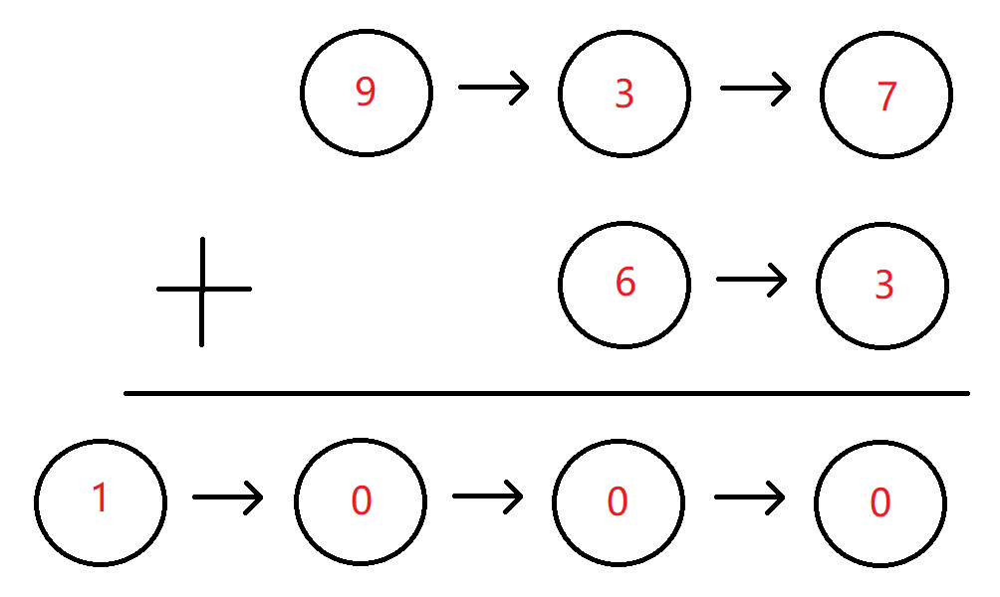

牛客算法必刷TOP101，包含：链表、二分查找/排序、二叉树、堆/栈/队列、哈希、递归/回溯、动态规划、字符串、双指针、贪心算法、模拟总共101道题。

此部分是**链表专题**。

[牛客网 (nowcoder.com)](https://www.nowcoder.com/exam/oj?page=1&tab=算法篇&topicId=295)

<!--more-->

### 反转链表

#### 描述

给定一个单链表的头结点**pHead**(该头节点是有值的，比如在下图，它的val是1)，长度为n，反转该链表后，返回新链表的表头。

数据范围： 0≤*n*≤1000

要求：空间复杂度 O*(1) ，时间复杂度 O*(*n) 。

如当输入链表{1,2,3}时，

经反转后，原链表变为{3,2,1}，所以对应的输出为{3,2,1}。

以上转换过程如下图所示：


#### 示例1

输入：

```tex
{1,2,3}
```

返回值：

```tex
{3,2,1}	
```

#### 示例2

输入：

```tex
{}
```

返回值：

```
{}
```

说明：

```tex
空链表则输出空                  
```

#### 解法

##### 原地置换

分别用三个指针`pre`,`cur`,`next`代表之前的结点，当前的结点，下一个结点。改变链表的指向关系就可以原地改变顺序。

以下是模拟的过程


代码如下：

```c++
class Solution {
public:
    ListNode* ReverseList(ListNode* pHead) {
        ListNode*pre = nullptr;
        ListNode*cur = pHead;
        while(cur){
            ListNode*next = cur->next; // 第四步
            cur->next = pre; //第一步
            pre = cur; //第二步
            cur = next; // 第三步
        }
        return pre;
    }
};
```

### 链表内指定区间反转

#### 描述

将一个节点数为 size 链表 m 位置到 n 位置之间的区间反转，要求时间复杂度 O(n)*O*(*n*)，空间复杂度 O(1)*O*(1)。
例如：
给出的链表为 1→2→3→4→5→NULL, m*=2,*n=4,
返回 1→4→3→2→5→NULL

要求：时间复杂度 O(n)*O*(*n*) ，空间复杂度 O(n)*O*(*n*)

进阶：时间复杂度 O(n)*O*(*n*)，空间复杂度 O(1)*O*(1)

#### 示例1

输入：

```
{1,2,3,4,5},2,4
```

返回值：

```
{1,4,3,2,5}
```

#### 示例2

输入：

```
{5},1,1
```

返回值：

```
{5}
```

#### 解析

##### 解法一

对于这道题，我们可以参考反转链表的题，只需要直到指定的区间的链表，然后断开，将这个区间的链表进行反转。

注意，由于在此过程中需要保存区间左边和右边的链表，所以需要加上一个新的头结点来处理边界问题。

```c++
// 反转当前链表
ListNode *reverse(ListNode *head) {
    ListNode *pre = nullptr;
    ListNode *cur = head;
    ListNode *next = nullptr;
    while (cur) {
        next = cur->next;
        cur->
                next = pre;
        pre = cur;
        cur = next;
    }
    return pre;
}


ListNode *reverseBetween(ListNode *head, int m, int n) {
    if (head->next == nullptr || head == nullptr || m == n) {
        return
                head;
    }
    // 防止出现pre的问题
    auto *newHead = new ListNode(0);
    newHead->next = head;
    ListNode *pre = newHead;
    // 从哪里开始的
    ListNode *begin = head;
    // 结束的最后一个结点
    ListNode *end = nullptr;
    // 结束断开的下一个
    ListNode *endEnd = nullptr;
    // 找到从哪里开始断开
    for (int i = 0; i < m - 1; i++) {
        pre = begin;
        begin = begin->next;
    }
    // 断开左边的
    pre->next = nullptr;

    // 从哪里结束
    end = begin;
    for (int i = m; i < n; i++) {
        end = end->next;
    }
    // 右边断开的
    endEnd = end->next;
    // 断开
    end->next = nullptr;
    // 反转区间的链表
    end = reverse(begin);
    // 反转之后接上， 区间头变成尾，尾巴变成了头
    pre->next = end;
    begin->next = endEnd;
    return newHead->next;
}

```

#### 解法二

利用头插法将新遍历的结点放到前面来。


1. 将cur的next指向next的next
2. next的next指向pre的next
3. pre的next指向next。

```c++
ListNode *reverseBetween(ListNode *head, int m, int n) {
    // 防止出现pre的问题
    auto *newHead = new ListNode(0);
    newHead->next = head;
    ListNode *pre = newHead;	
    for(int i = 1;i<m;i++){
        pre = pre->next;
    }
    cur = pre->next;
    for(int i = m;i<n;i++){
        ListNode*next = cur->next;
        cur->next= next->next;
        next->next= pre->next;
        pre->next= next;
    }
    return newHead->next;
}
```

### 链表中的节点每k个一组翻转

#### 描述

将给出的链表中的节点每 k 个一组翻转，返回翻转后的链表
如果链表中的节点数不是 k 的倍数，将最后剩下的节点保持原样
你不能更改节点中的值，只能更改节点本身。

数据范围： 0≤*n*≤2000 ， 1≤*k*≤2000 ，链表中每个元素都满足 0≤val≤1000
要求空间复杂度 O(1)，时间复杂度 O(n)

例如：

给定的链表是 1→2→3→4→5

对于 k=2 , 你应该返回 2→1→4→3→5

对于 k=3 , 你应该返回 3→2→1→4→5

#### 示例1

输入：

```
{1,2,3,4,5},2
```

复制

返回值：

```
{2,1,4,3,5}
```

复制

#### 示例2

输入：

```
{},1
```

复制

返回值：

```
{}
```

#### 解析

通过链表指定区间的反转我们知道了利用头插法进行转换链表，这个题也是类似。都反转，对每一组都是指定区间的反转。只需要将k个结点分为一组就行。

```c++
    ListNode* reverseKGroup(ListNode* head, int k) {
        int len = 0;
        ListNode*cur = head;
        ListNode*newHead = new ListNode(0);
        newHead->next = head;
        // 求出总共有多长
        while(cur){
            len++;
            cur = cur->next;
        }
        ListNode *pre = newHead;
        cur = head;
        // 分成多少组
        for(int i = 0;i<len/k;i++){
            // 组内进行区间反转
            for(int j = 1;j<k;j++){
                ListNode*next = cur->next;
                cur->next=next->next;
                next->next= pre->next;
                pre->next= next;
            }
            pre = cur;
            cur = cur->next;
        }
        return newHead->next;
    }
```

### 合并两个排序的链表

#### 描述

输入两个递增的链表，单个链表的长度为n，合并这两个链表并使新链表中的节点仍然是递增排序的。

如输入{1,3,5},{2,4,6}时，合并后的链表为{1,2,3,4,5,6}，所以对应的输出为{1,2,3,4,5,6}

#### 示例1

输入：

```
{1,3,5},{2,4,6}
```

返回值：

```
{1,2,3,4,5,6}
```

复制

#### 示例2

输入：

```
{},{}
```

返回值：

```
{}
```

#### 示例3

输入：

```
{-1,2,4},{1,3,4}
```

返回值：

```
{-1,1,2,3,4,4}
```

#### 解析

##### 解法一

利用归并排序的思想，进行模拟即可。

```c++
ListNode* Merge(ListNode* pHead1, ListNode* pHead2) {
    ListNode *res = new ListNode(0);
    ListNode *cur = res;
    while(pHead1&&pHead2){
        if(pHead1->val<=pHead2->val){
            cur->next = pHead1;
            pHead1 = pHead1->next;
        }else{
            cur->next = pHead2;
            pHead2 = pHead2->next;
      	}
        cur = cur->next;
    }
    if(pHead1){
        cur->next = pHead1;
    }
    if(pHead2){
        cur->next = pHead2;
    }
    return res->next;
}
```

##### 解法二

我们利用归并思想不断合并两个链表，每当我们添加完一个节点后，该节点指针后移，相当于这个链表剩余部分与另一个链表剩余部分合并，两个链表剩余部分合并就是原问题两个有序链表合并的子问题，因此也可以使用递归：

- **终止条件：** 当一个链表已经因为递归到了末尾，另一个链表剩余部分一定都大于前面的，因此我们可以将另一个链表剩余部分拼在结果后面，结束递归。
- **返回值：** 每次返回拼接好的较大部分的子链表。
- **本级任务：** 每级不断进入下一个较小的值后的链表部分与另一个链表剩余部分，再将本次的节点接在后面较大值拼好的结果前面。

**具体做法：**

- step 1：每次比较两个链表当前节点的值，然后取较小值的链表指针往后，另一个不变，两段子链表作为新的链表送入递归中。
- step 2：递归回来的结果我们要加在当前较小值的节点后面，相当于不断在较小值后面添加节点。
- step 3：递归的终止是两个链表有一个为空。

```c++
// 每次返回拼接好的较大部分的子链表
ListNode* Merge(ListNode* pHead1, ListNode* pHead2) {
    //一个已经为空了，返回另一个
    if(pHead1==nullptr){
        return pHead2;
    }
    if(pHead2==nullptr){
        return pHead1;
    }

    if(pHead1->val<=pHead2->val){
        pHead1->next = Merge(pHead1->next, pHead2);
        return pHead1;
    }else{
        pHead2->next = Merge(pHead1, pHead2->next);
        return pHead2;
    }
}
```

### 合并k个已排序的链表

#### 描述

合并 k 个升序的链表并将结果作为一个升序的链表返回其头节点。

数据范围：节点总数满足 0≤*n*≤105，链表个数满足 1≤*k*≤10^5 ，每个链表的长度满足 1≤len≤200 ，每个节点的值满足 |val| <= 1000

要求：时间复杂度 O(nlogk)

#### 示例1

输入：

```
[{1,2,3},{4,5,6,7}]
```

返回值：

```
{1,2,3,4,5,6,7}
```

#### 示例2

输入：

```
[{1,2},{1,4,5},{6}]
```

返回值：

```
{1,1,2,4,5,6}
```

#### 解析

##### 解析1-超时

上面已经完成了`两个排序链表的合并`,两个链表两两进行合并就行。但是时间复杂度是`O(n*k)`不满足时间要求。

```c++
    ListNode*merge(ListNode*list1,ListNode*list2){
        ListNode * res = new ListNode(0);
        ListNode *cur = res;
        while(list1&&list2){
            if(list1->val<=list2->val){
                cur->next = list1;
                list1 = list1->next;
            }else{
                cur->next = list2;
                list2 = list2->next;
            }
            cur =cur->next;
        }
        if(list1){
            cur->next = list1;
        }
        if(list2){
            cur->next = list2;
        }
        return res->next;
    }
    ListNode *mergeKLists(vector<ListNode *> &lists) {
        ListNode *res ;
        for(int i = 0;i<lists.size();i++){
            res = merge(res, lists[i]);
        }
        return res;
    }
```

##### 解析2

上述中，我们是让合并好的再和新的进行合并，其实我们可以让新的链表两两合并，减少额外的合并次数。降低时间复杂度。

```c++
   ListNode*merge(ListNode*list1,ListNode*list2){
        ListNode * res = new ListNode(0);
        ListNode *cur = res;
        while(list1&&list2){
            if(list1->val<=list2->val){
                cur->next = list1;
                list1 = list1->next;
            }else{
                cur->next = list2;
                list2 = list2->next;
            }
            cur =cur->next;
        }
        if(list1){
            cur->next = list1;
        }
        if(list2){
            cur->next = list2;
        }
        return res->next;
    }
    
    // 分组进行合并
    ListNode* groupMerge(vector<ListNode *> &lists,int left,int right){
        // 中间只有一个的情况
        if(left==right){
            return lists[left];
        }
        if(left>right){
            return nullptr;
        }
        // 从中间分开两段，分开的部分进行合并
        int mid = (left+right)>>1;
        // 合并的两部分再进行合并
        return merge(groupMerge(lists, left, mid), groupMerge(lists, mid+1, right));
        
    }
    ListNode *mergeKLists(vector<ListNode *> &lists) {
        return groupMerge(lists, 0, lists.size()-1);
    }
```

### 判断链表中是否有环

#### 描述

判断给定的链表中是否有环。如果有环则返回true，否则返回false。

数据范围：链表长度 0≤*n*≤10000，链表中任意节点的值满足 |val| <= 100000

要求：空间复杂度 O(1),时间复杂度 O(n)

输入分为两部分，第一部分为链表，第二部分代表是否有环，然后将组成的head头结点传入到函数里面。-1代表无环，其它的数字代表有环，这些参数解释仅仅是为了方便读者自测调试。实际在编程时读入的是链表的头节点。

例如输入{3,2,0,-4},1时，对应的链表结构如下图所示：


可以看出环的入口结点为从头结点开始的第1个结点（注：头结点为第0个结点），所以输出true。

#### 示例1

输入：

```
{3,2,0,-4},1
```

返回值：

```
true
```

说明：

```
第一部分{3,2,0,-4}代表一个链表，第二部分的1表示，-4到位置1（注：头结点为位置0），即-4->2存在一个链接，组成传入的head为一个带环的链表，返回true             
```

#### 示例2

输入：

```
{1},-1
```

返回值：

```
false
```

说明：

```
第一部分{1}代表一个链表，-1代表无环，组成传入head为一个无环的单链表，返回false             
```

#### 示例3

输入：

```
{-1,-7,7,-4,19,6,-9,-5,-2,-5},6
```

返回值：

```
true
```

#### 解析

##### 方法1-哈希表

将已经遍历过的结点保存在map中，如果map中已经有了，就说明有环，整个链表遍历完之后都没有，就说明没有环。

```c++
bool hasCycle(ListNode* head) {
        map<ListNode*, bool> m;
        while (head) {
            auto a = m.find(head);
            if (a != m.end()) {
                return true;
            } else {
                m[head] = true;
            }
            head = head->next;
        }
    return false;
}
```

##### 方法2-双指针

一个快指针走两步，一个慢指针走一步。当两个指针相遇的时候就说明，是有环的。证明过程如下：

[「代码随想录」你的疑惑，这里都讲清楚了！142. 环形链表 II - 环形链表 II - 力扣（LeetCode） (leetcode-cn.com)](https://leetcode-cn.com/problems/linked-list-cycle-ii/solution/142-huan-xing-lian-biao-ii-jian-hua-gong-shi-jia-2/)

```c++
bool hasCycle(ListNode* head) {
        ListNode* fast = head;
        ListNode* slow = head;
        while (fast && fast->next) {
            fast = fast->next->next;
            slow = slow->next;
            if (fast == slow) {
                return true;
            }
        }
        return false;
}
```

### 链表中环的入口结点

给一个长度为n链表，若其中包含环，请找出该链表的环的入口结点，否则，返回null。

数据范围：n*≤10000，1<=结点值<=10000

要求：空间复杂度 O(1)，时间复杂度 O(n)

例如，输入{1,2},{3,4,5}时，对应的环形链表如下图所示：


可以看到环的入口结点的结点值为3，所以返回结点值为3的结点。

#### 输入描述：

输入分为2段，第一段是入环前的链表部分，第二段是链表环的部分，后台会根据第二段是否为空将这两段组装成一个无环或者有环单链表

#### 返回值描述：

返回链表的环的入口结点即可，我们后台程序会打印这个结点对应的结点值；若没有，则返回对应编程语言的空结点即可。

#### 示例1

输入：

```
{1,2},{3,4,5}
```

返回值：

```
3
```

说明：

```
返回环形链表入口结点，我们后台程序会打印该环形链表入口结点对应的结点值，即3    
```

#### 示例2

输入：

```
{1},{}
```

返回值：

```
"null"
```

说明：

```
没有环，返回对应编程语言的空结点，后台程序会打印"null"    
```

#### 示例3

输入：

```
{},{2}
```

返回值：

```
2
```

说明：

```
环的部分只有一个结点，所以返回该环形链表入口结点，后台程序打印该结点对应的结点值，即2 
```

#### 解析

##### 解析1-哈希表

和`判断链表中是否有环`是一样的，如果map中有就说明这个位置就是环，否则就是没有环。

```c++
ListNode* EntryNodeOfLoop(ListNode* head) {
        map<ListNode*, bool> m;
        while (head) {
            auto a = m.find(head);
            if (a != m.end()) {
                return a.first;
            } else {
                m[head] = true;
            }
            head = head->next;
        }
    return nullptr;
}
```

##### 解析2-双指针

一个快指针走两步，一个慢指针走一步。当两个指针相遇的时候就说明，是有环的。有环之后，让头指针和相遇的指针一起走，相遇之后就是环的入口：

[「代码随想录」你的疑惑，这里都讲清楚了！142. 环形链表 II - 环形链表 II - 力扣（LeetCode） (leetcode-cn.com)](https://leetcode-cn.com/problems/linked-list-cycle-ii/solution/142-huan-xing-lian-biao-ii-jian-hua-gong-shi-jia-2/)

```c++
ListNode* EntryNodeOfLoop(ListNode* pHead) {
        ListNode* fast = pHead;
        ListNode* slow = pHead;
        while (fast && fast->next) {
            fast = fast->next->next;
            slow = slow->next;
            if (fast == slow) {
                while(fast!=pHead){
                    fast  = fast->next;
                    pHead = pHead->next;
                }
                return fast;
            }
        }
        return nullptr;
    }
```

### 链表中倒数最后k个结点

#### 描述

输入一个长度为 n 的链表，设链表中的元素的值为 ai ，返回该链表中倒数第k个节点。

如果该链表长度小于k，请返回一个长度为 0 的链表。

数据范围：$0 \leq n \leq 10^50≤*n*≤105$，$0 \leq a_i \leq 10^9$，$0 \leq k \leq 10^9$

要求：空间复杂度 O(n)，时间复杂度 O(n)

进阶：空间复杂度 O(1)，时间复杂度 O(n)

例如输入{1,2,3,4,5},2时，对应的链表结构如下图所示：


其中蓝色部分为该链表的最后2个结点，所以返回倒数第2个结点（也即结点值为4的结点）即可，系统会打印后面所有的节点来比较。

#### 示例1

输入：

```
{1,2,3,4,5},2
```

返回值：

```
{4,5}
```

说明：

```
返回倒数第2个节点4，系统会打印后面所有的节点来比较。 
```

#### 示例2

输入：

```
{2},8
```

返回值：

```
{}
```

#### 解析

##### 解法1-数组

将链表的每一个结点按照顺序保存到数组中，按照要求求出当前倒数第几个结点。

##### 解法2-遍历两遍

第一遍求出链表的长度，第二遍遍历到倒数第k个结点。

```c++
ListNode* FindKthToTail(ListNode* pHead, int k) {
        int len = 0;
        ListNode* cur = pHead;
        // 求长度
        while (cur) {
            len++;
            cur = cur->next;
        }
        // 指向头
        cur = pHead;
        // 如果超过长度了，返回空
        if (k > len) {
            return nullptr;
        }
        len -= k;
        while (len > 0) {
            cur = cur->next;
            len--;
        }
        return cur;
    }
```

### 删除链表的倒数第n个节点

#### 描述

给定一个链表，删除链表的倒数第 n 个节点并返回链表的头指针.

例如，给出的链表为: $1\to 2\to 3\to 4\to 5$, n= 2,删除了链表的倒数第 *n* 个节点之后,链表变为$1\to 2\to 3\to 5$。

数据范围： 链表长度 $0\le n \le 1000$，链表中任意节点的值满足 $0 \le val \le 100$

要求：空间复杂度 $O(1)$，时间复杂度 $O(n)$

题目保证 $n$一定是有效的

#### 示例1

输入：

```
{1,2},2    
```

返回值：

```
{2} 
```

#### 解析

##### 解析1-求长度，找到倒数第n+1个结点

利用`链表中倒数第k个结点`可以找到倒数第`n+1`个结点，根据倒数第$n+1$个结点，使用$cur\to next = cur\to next\to next$删除倒数第`n`个结点。

```c++
ListNode* removeNthFromEnd(ListNode* head, int n) {
    ListNode *newHead = new ListNode(0);
    newHead->next = head;
    // 找到倒数第n+1个元素
    int len = 0;
    ListNode *cur = newHead;
    while(cur){
        len++;
        cur = cur->next;
    }
    cur = newHead;
   	// 这里的n+2是因为添加了一个新的头结点。
    len-=n+2;
    while(len>-1){
        cur = cur->next;
        len--;
    }
        
    cur->next = cur->next->next;
    return newHead->next;
}
```

##### 解析2-双指针

**快指针指向`head`,快指针先走`n`步**。慢指针指向新的头结点，**当快指针走完`n`步之后，慢指针跟着快指针走完全部的**。这时候慢指针指向的是`倒数第n+1`个结点，然后利用$cur\to next = cur\to next\to next$删除倒数第`n`个结点。

**重要！！！！**

1. 快指针指向head,快指针先走n步
2. 慢指针指向newHead,跟随快指针走，等到快指针走完，这时候，慢指针就在`倒数第n+1个结点`。

```c++
ListNode* removeNthFromEnd(ListNode* head, int n) {
    ListNode *newHead = new ListNode(0);
    newHead->next = head;
    // 快指针指向head
    ListNode*fast = head;
    // 慢指针指向newHead
    ListNode*slow = newHead;
    // 快指针先走n步
    while(n>0){
        n--;
        fast = fast->next;
    }
    // 快指针走完全部
    while(fast){
        fast = fast->next;
        slow = slow->next;
    }
    // 慢指针在倒数第n+1个结点
    slow->next = slow->next->next;
    return newHead->next;
}
```

### 两个链表的第一个公共结点

#### 描述

输入两个无环的单向链表，找出它们的第一个公共结点，如果没有公共节点则返回空。（注意因为传入数据是链表，所以错误测试数据的提示是用其他方式显示的，保证传入数据是正确的）

数据范围： $n \le 1000$
要求：空间复杂度 O(1)*O*(1)，时间复杂度 $O(n)$

例如，输入{1,2,3},{4,5},{6,7}时，两个无环的单向链表的结构如下图所示：


可以看到它们的第一个公共结点的结点值为6，所以返回结点值为6的结点。

##### 输入描述：

输入分为是3段，第一段是第一个链表的非公共部分，第二段是第二个链表的非公共部分，第三段是第一个链表和第二个链表的公共部分。 后台会将这3个参数组装为两个链表，并将这两个链表对应的头节点传入到函数FindFirstCommonNode里面，用户得到的输入只有pHead1和pHead2。

##### 返回值描述：

返回传入的pHead1和pHead2的第一个公共结点，后台会打印以该节点为头节点的链表。

#### 示例1

输入：

```
{1,2,3},{4,5},{6,7}
```

返回值：

```
{6,7}
```

说明：

```
第一个参数{1,2,3}代表是第一个链表非公共部分，第二个参数{4,5}代表是第二个链表非公共部分，最后的{6,7}表示的是2个链表的公共部分
这3个参数最后在后台会组装成为2个两个无环的单链表，且是有公共节点的          
```

#### 示例2

输入：

```
{1},{2,3},{}
```

返回值：

```
{}
```

说明：

```
2个链表没有公共节点 ,返回null，后台打印{}       
```

#### 解析

##### 解析1-求长度，从最短的进行比较。

求出两个链表的长度，找出最短的一个链表，较长的链表遍历到和较短的链表长度一样，进行比较链表。

**注意**：

1. 比较的是链表指针，不是值。

```c++
ListNode* FindFirstCommonNode( ListNode* pHead1, ListNode* pHead2) {
        int len1 = 0;
        int len2 = 0;
        ListNode*cur = pHead1;
    	// 求链表1的长度
        while(cur){
            len1++;
            cur = cur->next;
        }
    	// 求链表二的长度
        cur = pHead2;
        while(cur){
            len2++;
            cur=cur->next;
        }
        // 找出长的一个，遍历到和短的一样。
        if(len1>len2){
            len1-=len2;
            while(len1>0){
                pHead1=pHead1->next;
                len1--;
            }
        }else{
            len2-=len1;
            while(len2>0){
                pHead2 = pHead2->next;
                len2--;
            }
        }
    	// 两个进行比较
        while(pHead1){
            if(pHead1==pHead2){
                return pHead1;
            }
            pHead1 = pHead1->next;
            pHead2 = pHead2->next;
        }
        return nullptr;
    }
```

##### 解析2-遍历两次结点


使用两个指针N1,N2，一个从链表1的头节点开始遍历，我们记为N1，一个从链表2的头节点开始遍历，我们记为N2。

让N1和N2一起遍历，当N1先走完链表1的尽头（为null）的时候，则从链表2的头节点继续遍历，同样，如果N2先走完了链表2的尽头，则从链表1的头节点继续遍历，也就是说，N1和N2都会遍历链表1和链表2。

因为两个指针，同样的速度，走完同样长度（链表1+链表2），不管两条链表有无相同节点，都能够到达同时到达终点。

（N1最后肯定能到达链表2的终点，N2肯定能到达链表1的终点）。

所以，如何得到公共节点：

- 有公共节点的时候，N1和N2必会相遇，因为长度一样嘛，速度也一定，必会走到相同的地方的，所以当两者相等的时候，则会第一个公共的节点
- 无公共节点的时候，此时N1和N2则都会走到终点，那么他们此时都是null，所以也算是相等了

[题解 | #两个链表的第一个公共结点#_牛客博客 (nowcoder.net)](https://blog.nowcoder.net/n/35c57499566646e7b3ecb250d0b99907)

```c++
ListNode* FindFirstCommonNode( ListNode* pHead1, ListNode* pHead2) {
    ListNode*n1 = pHead1;
    ListNode*n2 = pHead2;
    while(n1!=n2){
        if(!n1){
            n1 = pHead2;
        }else{
            n1 = n1->next;
        }
            
        if(!n2){
            n2 = pHead1;
        }else{
            n2 = n2->next;
        }
    }
    return n1;     
    }
```

### 链表相加(二)

#### 描述

假设链表中每一个节点的值都在 0 - 9 之间，那么链表整体就可以代表一个整数。

给定两个这种链表，请生成代表两个整数相加值的结果链表。

数据范围：$0 \le n,m \le 1000000$，链表任意值
要求：空间复杂度 $O(n)$，时间复杂度 $O(n)$

例如：链表 1 为 9->3->7，链表 2 为 6->3，最后生成新的结果链表为 1->0->0->0。



#### 示例1

输入：

```
[9,3,7],[6,3]
```

返回值：

```
{1,0,0,0}
```

说明：

```
如题面解释     
```

#### 示例2

输入：

```
[0],[6,3]
```

返回值：

```
{6,3}
```

#### 解析

##### 解析1-链表反转求和

由于所给的链表的头结点是最高位，而我们运算是从最低位开始相加，在运算之前先将链表反转为从低位开始。

对于求和可以正常的模拟加法求和就可以。

**注意**

1. 逢十进一
2. 如果有进位要相加
3. 最后有进位要额外新建结点。

```c++
ListNode*reverse(ListNode*list){
    ListNode*pre = nullptr;
    ListNode*cur = list;
    while(cur){
        ListNode*next = cur->next;
        cur->next = pre;
        pre = cur;
        cur = next;
    }
    return pre;
}
ListNode* addInList(ListNode* head1, ListNode* head2){
    int add = 0;
    head1 = reverse(head1);
    head2 = reverse(head2);
    ListNode *pre = nullptr;
    while(add||head1||head2){
        int val = add;
        if(head1){
            val+=head1->val;
            head1=head1->next;
        }
        if(head2){
            val+=head2->val;
            head2 =head2->next;
        }
        add = val/10;
        val = val%10;
        ListNode*cur = new ListNode(val);
        cur->next = pre;
        pre = cur;
    }
    return pre;
}
```

##### 解析2-栈实现反转链表

与方法一相同，只不过反转链表的时候是用了栈。

### 单链表的排序

#### 描述

给定一个节点数为n的无序单链表，对其按升序排序。

数据范围：$0 < n \le 100000$

要求：时间复杂度 $O(nlogn)$

#### 示例1

输入：

```
{1,3,2,4,5}
```

返回值：

```
{1,2,3,4,5}
```

#### 解析

##### 解析1-归并排序

```c++
 //合并两段有序链表
    ListNode* merge(ListNode* pHead1, ListNode* pHead2) {
        if(pHead1 == NULL)
            return pHead2;
        if(pHead2 == NULL)
            return pHead1;
        ListNode* head = new ListNode(0);
        ListNode* cur = head;
        while(pHead1 && pHead2){
            if(pHead1->val <= pHead2->val){
                cur->next = pHead1;
                pHead1 = pHead1->next;
            }else{
                cur->next = pHead2;
                pHead2 = pHead2->next;
            }
            cur = cur->next;
        }
        if(pHead1)
            cur->next = pHead1;
        else
            cur->next = pHead2;
        return head->next;
    }

	// 归并排序递归版
    ListNode* sortInList(ListNode* head) {
        if(head==nullptr||head->next==nullptr){
            return head;
        }
        // 中间结点的前一个，整个链表要断开
        ListNode*midPre = head;
        ListNode*mid  = head->next;
        ListNode*right = head->next->next;
        while(right&&right->next){
            midPre = midPre->next;
            mid = mid->next;
            right = right->next->next;
        }
        // 断开链表
        midPre->next = nullptr;
        // 归并排序的左边和右边。
        return merge(sortInList(head),sortInList(mid));
        
    }
```

### 判断一个链表是否为回文结构

#### 描述

给定一个链表，请判断该链表是否为回文结构。

回文是指该字符串正序逆序完全一致。

数据范围： 链表节点数 0 \le n \le 10^50≤*n*≤105，链表中每个节点的值满足 |val| \le 10^7∣*v**a**l*∣≤107

#### 示例1

输入：

```
{1}
```

返回值：

```
true
```

#### 示例2

输入：

```
{2,1}
```

返回值：

```
false
```

说明：

```
2->1  
```

#### 示例3

输入：

```
{1,2,2,1}
```

返回值：

```
true
```

说明：

```
1->2->2->1    
```

#### 解析

##### 解析1-反转链表进行比较

从中间将整个链表一分为二，对右边进行反转，反转过来的链表在与之前的链表进行比较。

**注意**

1. 区分链表结点个数是奇数还是偶数，如果是奇数，应该把多的一部分的结点放在左边，例如是`1->2->4->2->3`,分开的链表应该是`1->2->4`和`2->3`,然后将右边的进行反转。只要将结点少的进行反转就可以

```c++
// 链表反转
ListNode*reverse(ListNode*list){
        ListNode*pre = nullptr;
        ListNode*cur = list;
        ListNode*next = nullptr;
        while(cur){
            next = cur->next;
            cur->next = pre;
            pre = cur;
            cur = next;
        }
        return pre;
    }
    /**
     * 
     * @param head ListNode类 the head
     * @return bool布尔型
     */
    bool isPail(ListNode* head) {
        // 如果只有一个结点，肯定是回文的。
        if(head->next==nullptr){
            return true;
        }
        ListNode*midPre = head;
        ListNode*mid = head->next;
        ListNode*right =mid->next;
        // 找到中间的结点
        while(right&&right->next){
            midPre = midPre->next;
            mid = mid->next;
            right = right->next->next;
        }
        // 断开中间的结点
        midPre->next = nullptr;
        // 反转结点少的链表
        mid = reverse(mid);
        // 判断
        while(head&&mid){
            if(head->val!=mid->val){
                return false;
            }
            head = head->next;
            mid = mid->next;
        }
        return true;
    }
```

### 删除有序链表中重复的元素-I

#### 描述

删除给出链表中的重复元素（链表中元素从小到大有序），使链表中的所有元素都只出现一次
例如：
给出的链表为$1\to1\to2$,返回$1 \to 2$.
给出的链表为$1\to1\to 2 \to 3 \to 3$,返回$1\to 2 \to 3$.

数据范围：链表长度满足 $0 \le n \le 100$，链表中任意节点的值满足$ |val| \le 100$

进阶：空间复杂度 O(1)，时间复杂度 O(n)

#### 示例1

输入：

```
{1,1,2}
```

返回值：

```
{1,2}
```

#### 示例2

输入：

```
{}
```

返回值：

```
{}
```

#### 解析

##### 解析1-模拟

比较当前结点的值和之前结点的值是否一样，如果一样当前结点的next指向`cur->next->next`。否则指向`cur->next`。

```c++
ListNode* deleteDuplicates(ListNode* head) {
        ListNode*cur = head;
        while(cur&&cur->next){
            if(cur->val==cur->next->val){
                cur->next = cur->next->next;
            }else{
                cur = cur->next;
            }
        }
        return head;
    }
```

### 链表的奇偶重排

给定一个单链表，请设定一个函数，将链表的奇数位节点和偶数位节点分别放在一起，重排后输出。

注意是节点的编号而非节点的数值。

数据范围：节点数量满足 $0 \le n \le 10^5$，节点中的值都满足 $0 \le val \le 1000$

要求：空间复杂度 O(n)，时间复杂度 O(n)

#### 示例1

输入：

```
{1,2,3,4,5,6}
```

返回值：

```
{1,3,5,2,4,6}
```

说明：

```
1->2->3->4->5->6->NULL
重排后为1->3->5->2->4->6->NULL
   
```

#### 示例2

输入：

```
{1,4,6,3,7}
```

返回值：

```
{1,6,7,4,3}
```

说明：

```
1->4->6->3->7->NULL
重排后为
1->6->7->4->3->NULL
奇数位节点有1,6,7，偶数位节点有4,3。重排后为1,6,7,4,3
```

#### 解析

##### 解析1-分别保存奇偶指针

分别保存奇偶指针，奇指针指向head，偶指针指向head->next，奇偶指针每次向后移动两位就可以。


```c++
ListNode* oddEvenList(ListNode* head) {
    // 如果只有一或两个结点，就返回head
    if(head==nullptr||head->next==nullptr){
        return head;
    }
    // 开始奇数指针指向头
    ListNode*jishu = head;
    // 偶数指针要记录偶数的头结点，后面要连起来
    ListNode*oushuBegin = head->next;
    // 每次更新的偶数结点
    ListNode*oushuCur = oushuBegin;
    // 偶数结点有
    while(oushuCur&&oushuCur->next){
        // 更新奇数结点
        jishu->next = oushuCur->next;
        jishu = jishu->next;
        // 更新偶数结点，此时奇数结点指向的时上一个偶数结点的next
        oushuCur->next = jishu -> next;
        oushuCur = oushuCur->next;
    }
    // ji
    jishu->next = oushuBegin;        
    return head;
}
```

### 删除有序链表中重复的元素-II

#### 描述

给出一个升序排序的链表，删除链表中的所有重复出现的元素，只保留原链表中只出现一次的元素。
例如：
给出的链表为$1 \to 2\to 3\to 3\to 4\to 4\to5$, 返回$1\to 2\to5$.
给出的链表为$1\to1 \to 1\to 2 \to 3$, 返回$2\to 3$.

数据范围：链表长度 $0 \le n \le 10000$，链表中的值满足 $|val| \le 1000$

要求：空间复杂度 O(n)，时间复杂度 O(n)

进阶：空间复杂度 O(1)，时间复杂度 O(n)

#### 示例1

输入：

```
{1,2,2}
```

返回值：

```
{1}
```

#### 示例2

输入：

```
{}
```

返回值：

```
{}
```

#### 解析

##### 解析一

一次判断两个结点，如果两个结点的值不一样，就向前探索。

如果这两个结点的值一样，那么就一直往下探索到下一个值得结点。


```c++
ListNode* deleteDuplicates(ListNode* head) {
    if(head==nullptr){
        return head;
    }
    ListNode *newHead = new ListNode(head->val-1);
    newHead->next = head;
    ListNode *cur = head;
    ListNode *pre =newHead;
    while(cur&&cur->next){
        if(cur->val==cur->next->val){
            int t = cur->val;
            while(cur&&cur->val==t){
                cur = cur->next;
            }
            pre->next = cur;
        }else{
            pre = cur;
            cur=cur->next;
        }
    }
    return newHead->next;
}
```

### 总结

#### 刷题时间

| 时间 | 题目                       |
| ---- | -------------------------- |
| 4-22 | 反转链表                   |
| 4-22 | 链表指定区间反转           |
| 4-24 | 链表每k个结点反转          |
| 4-24 | 合并两个有序链表           |
| 4-25 | 合并k个有序链表            |
| 4-25 | 判断链表中有环             |
| 4-25 | 判断链表中环的入口         |
| 4-25 | 链表中倒数第k个结点        |
| 4-26 | 删除链表的倒数第n个结点    |
| 4-26 | 两个链表的第一个公共结点   |
| 4-26 | 链表相加                   |
| 4-26 | 单链表排序                 |
| 4-26 | 判断链表是否为回文链表     |
| 4-26 | 删除有序链表中的重复元素-Ⅰ |
| 4-28 | 链表的奇偶重拍             |
| 4-28 | 删除有序链表中重复元素-Ⅱ   |

#### 技巧总结

1. 链表的题目首先要在纸上模拟好过程，对于结点的指向清楚之后写代码很清楚。
2. 新的头结点很重要，可以帮助我们处理很多边界问题。
3. 反转链表有两种高效的方法
   1. 利用头插法反转，每次探索到的新结点都以头插法的方式放到头部。
   2. 断开遍历的下一个结点
4. 合并链表就是归并处理。
5. 合并k个有序链表，链表两两进行合并，合并之后再合并。归并排序的思想
6. 链表是否有环，如果有环，类似两个不同速度的人一起在环里跑步，一定会相遇。
7. 判断环的入口，要涉及到数学证明
8. 链表中的倒数第k个结点，最优的应该是快慢指针，让快指针先走k次，然后慢指针一起走完。同时删除也是类似。
9. 链表相加，可以先将链表反转之后进行模拟
10. 单链表排序，链表排序使用不了快排，只能用归并排序
11. 判断是否是回文，反转后半部分链表与前半部分进行比较

#### 重刷总结

// todo
