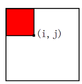
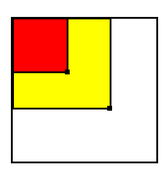
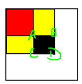

假设我们有一个字符串ABCDE，什么是这个单词的前缀，A、AB、ABC、ABCD、ABCDE就是这个单词的前缀，就是从第一个字母开始，依次往后拼接。E、ED、EDC、EDCB、EDCBA被称为这个单词的后缀。

那么对于一个数组的前缀，例如数组a = [a1,a2,a3,a4,a5]，我们维护一个由前缀的和组成的数组sum，sum[i]表示数组中前i个数的和。

sum[i] = a1+a2+...+ai

sum数组就被称为前缀和数组。

<!--more-->

### 一维前缀和

#### 如何求sum数组

求sum数组很简单

```c++
# num 表示原来的数组
# n表示num.size();
# sum表示前缀和数组
# 其中sum[0] = 0 下面解释为什么
for(int i = 1;i<=n){
    sum[i] = sum[i-1]+num[i];
}
```

#### 前缀和作用

前缀和的最主要目的就是求子数组的和的大小。例如元素`a[1]`到`a[3]`的和。
a[1] + a[2] + a[3] = sum[3] - sum[0]
注意：这里sum中的i表示的是前i个数的和，不是下标，因为题目中需要用到前0个数的和。

前缀和sum的下标一般从`1`开始，这样就不用处理边界问题了。

前缀和是一种预处理，用于降低查询时的时间复杂度。

举个例子：给定 `n`个整数，然后进行 `m` 次询问，每次询问求一个区间内值的和。

如果用暴力写法，那每次询问都需要从区间左端点循环到区间右端点求和，时间复杂度较大。

这种时候就可以预先求出该数组的一维前缀和。例如我们需要求[left,right]区间上的和（包括断点）


由于$$sum[right] = num[1]+num[2]+...+num[left-1]+num[left]+...+num[right]$$

$$sum[left-1] = num[1]+num[2]+...+...num[left-1]$$

我们发现要求的结果为$$num[left]+num[left+1]+...+num[right] = sum[right]-sum[left - 1]$$

则$$ans = sum[right]-sum[left - 1] $$

这时候如果我们需要求[1,5]区间上的和就是sum[5]，我们为了统一，所以规定sum[0] = 0，则结果可以表示为：

$$ans = sum[5]-sum[0]$$

这时候就需要sum[0]了

其中`right`和`left`是给定的区间，每次询问可直接输出答案，这样时间复杂度就降到了`O(m+n)`

#### 例子

[560. 和为 K 的子数组 - 力扣（LeetCode） (leetcode-cn.com)](https://leetcode-cn.com/problems/subarray-sum-equals-k/)

给你一个整数数组 nums 和一个整数 k ，请你统计并返回该数组中和为 k 的连续子数组的个数。
> 示例 1：
> 输入：nums = [1,1,1], k = 2
> 输出：2
> 示例 2：
> 输入：nums = [1,2,3], k = 3
> 输出：2

题目中很明确`连续子数组`，我们可以使用前缀和来求

代码如下：

```c++
int subarraySum(vector<int> &nums, int k) {
    	//定义一个前缀和数组，下标从1开始，所以比num要多1
        vector<int> sum(nums.size() + 1, 0);
        for (int i = 1; i <= nums.size(); i++) {
            // 原来num中的下标还是从0开始的，所以这里要用num[i-1]
            sum[i] = sum[i - 1] + nums[i - 1];
        }
    	// 记录共有多少次
        int ans = 0;
    	// 双指针进行遍历，
        for (int i = 0; i < sum.size(); i++) {
            for (int j = i + 1; j < sum.size(); j++) {
                // 如果某个区间的和为k ans++
                if ((sum[j] - sum[i] == k)) {
                    ans++;
                }
            }
        }
        return ans;
    }
```

一运行发现，超时了。虽然超时了，但证明我们的想法是没错的，只需要一点点优化就行。

```c++
int subarraySum(vector<int>& nums, int k) {
    	// map记录前几个数字之和为K出现相同和的次数为V
        unordered_map<int, int> mp;
    	// 初始化
        mp[0] = 1;
    	// hash
        // 记录合适的连续字符串数量
        int count = 0;
	    // 记录前面数字相加之和
    	int pre = 0;
        for (auto& x:nums) {
            pre += x;
            / 前缀和
            // 设
            // pre[i]=pre[i−1]+nums[i]
            // 由于补上了0，1这个情况 问题由多少个连续数字之和等于k 转为
            // pre[i]−pre[j−1]==k （前缀和之差为k，代表这两个前缀和中间的数字相加就是K）
            // 如果前面某些数字之和加上这个数字正好等于K（存在一个数字加上nums[i]结果为K
            // 说明找到了
            if (mp.find(pre - k) != mp.end()) {
                // 累计
                count += mp[pre - k];
            }
            // 计算新的和放入map
            mp[pre]++;
        }
        return count;
    }
```

### 二维前缀和

类似一维前缀和，二维前缀和就是对于一个二维数组`num[m][n]`，前缀和数组`sum[i][j]`表示如下图红色所示的区域的之和。



#### 二维前缀和求矩阵元素和

我们首先推出来如何求矩阵元素和，再求二维前缀和怎么构造。

一维前缀和你可以用来O(1)求某个点的值
那么类比一下
二维前缀和也是可以用来求某个矩阵的值的

但是怎么来求呢？



就如图中
知道了两个点的位置和他们的二维前缀和
图中红色是左上角的那个点的二维前缀和
红色+黄色部分是右下角的那个点的二维前缀和
是不是可以用这个来求出他们之间的矩阵的和呢？
也就是这一部分：



> D点表示的二维前缀和值是红色部分+两个黄色部分+黑色部分 
>
> A点表示的是红色部分 
>
> B点表示的是上面的黄色部分+红色部分 
>
> C点表示的是下面的黄色部分+红色部分

这样是不是发现有什么神奇的东西快要出现了
这里面只有D的前缀和里面包括黑色部分
只要减去D里面的哪两个黄色部分和红色部分是不是就剩下了我们要求的黑色部分了？
那怎么减去呢？
可以这样：
D - B - C + A
这就是二维前缀和最重要的部分了
化成二维数组的形式就是这样的

$$ans = sum[x2][y2] - sum[x1-1][y2]-sum[x2][y1-1]+sum[x1-1][y1-1]$$

#### 构造sum

这个可以类比上面求矩阵的思想
只是这个矩阵的右下角是（i，j），左上角也是（i,j）
就是一个`1X1`的矩阵
所以也是很好求的
但是上面是已知D，A，B，C求黑色部分
这里你只知道A，B，C和黑色部分
因为是一个`1X1`的矩阵吗
所以黑色部分就只有一个元素也就是（i，j）坐标上的那个元素值
所以就可以个加法变减法，减法变加法一个性质的
通过A，B，C和黑色部分来求出D

```cpp
D点表示的二维前缀和值是红色部分+两个黄色部分+黑色部分
A点表示的是红色部分
B点表示的是上面的黄色部分+红色部分
C点表示的是下面的黄色部分+红色部分
```

所以D就可以等于B+C-D+黑色部分：
上面的黄色部分+红色部分+下面的黄色部分+红色部分-红色部分+黑色部分
=上面的黄色部分+红色部分+下面的黄色部分+黑色部分
刚好等于D
方程式为

$$sum[i][j]=sum[i-1][j]+sum[i][j-1]-sum[i-1][sum[j-1]]+num[i][j]$$

#### 例子

[304. 二维区域和检索 - 矩阵不可变 - 力扣（LeetCode） (leetcode-cn.com)](https://leetcode-cn.com/problems/range-sum-query-2d-immutable/)

给定一个二维矩阵 `matrix`，以下类型的多个请求：

- 计算其子矩形范围内元素的总和，该子矩阵的 **左上角** 为 `(row1, col1)` ，**右下角** 为 `(row2, col2)` 。

实现 `NumMatrix` 类：

- `NumMatrix(int[][] matrix)` 给定整数矩阵 `matrix` 进行初始化
- `int sumRegion(int row1, int col1, int row2, int col2)` 返回 **左上角** `(row1, col1)` 、**右下角** `(row2, col2)` 所描述的子矩阵的元素 **总和** 。

 

**示例 1：**


```powershell
输入: 
["NumMatrix","sumRegion","sumRegion","sumRegion"]
[[[[3,0,1,4,2],[5,6,3,2,1],[1,2,0,1,5],[4,1,0,1,7],[1,0,3,0,5]]],[2,1,4,3],[1,1,2,2],[1,2,2,4]]
输出: 
[null, 8, 11, 12]

解释:
NumMatrix numMatrix = new NumMatrix([[3,0,1,4,2],[5,6,3,2,1],[1,2,0,1,5],[4,1,0,1,7],[1,0,3,0,5]]);
numMatrix.sumRegion(2, 1, 4, 3); // return 8 (红色矩形框的元素总和)
numMatrix.sumRegion(1, 1, 2, 2); // return 11 (绿色矩形框的元素总和)
numMatrix.sumRegion(1, 2, 2, 4); // return 12 (蓝色矩形框的元素总和)
```

**代码**

直接套模板就行

```c++
vector<vector<int>> sum;
NumMatrix(vector<vector<int>> &matrix) {
    sum = vector<vector<int>>(matrix.size() + 2, vector<int>(matrix[0].size() + 2, 0));
    for (int i = 1; i <= matrix.size(); i++) {
        for (int j = 1; j <= matrix[0].size(); j++) {
            sum[i][j] = sum[i - 1][j] + sum[i][j - 1] - sum[i - 1][j - 1] + matrix[i - 1][j - 1];
        }
    }
}
int sumRegion(int row1, int col1, int row2, int col2) {
    return sum[row2 + 1][col2 + 1] - sum[row1][col2 + 1] - sum[row2 + 1][col1] + sum[row1 ][col1];
}
```

