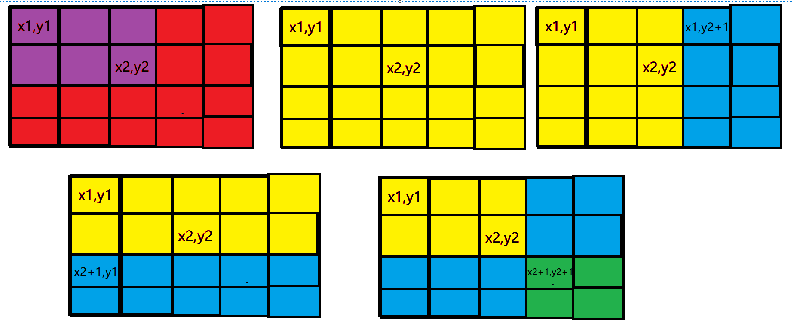

差分与前缀和相对，可以视为前缀和的逆运算。差分它可以维护多次对序列的一个区间修改一个数。

<!--more-->

### 一维差分

#### 定义

给定一个数组`num = [a1,a2,a3,a4,...,an]`,构造一个数组`b = [b1,b2,...,bn]`,使得数组b满足

$$a_i = b_1+b_2+...+b_{i-1}+b_i$$

构造完成之后就可以使得，num数组是b数组的前缀和数组

#### 构造

构造其实不是很重要

> b1 = a1
>
> b2  = a2-a1
>
> b3 = a3-a2
>
> ...
>
> bn =an-a(n-1)

#### 作用

1. 可以在O(n)时间内求得前缀和数组num
2. 假设要求在[l,r]区间内，给原数组num的第l到第r项每一项都加上一个常数`c`，求区间内所有数的和的速度可以在O(1)时间复杂度完成

利用差分后再做前缀和可以得到原数列的性质，可以通过改变差分后的数组从而改变原数组。

使差分数组的第一个元素加上了常数`C`,可以想到，在做前缀和处理，回到原数组的时候，由递推公式为：

$$num[i] = num[i-1]+b[i]$$

可以得到原数组所有的元素都将加上`C`
再通过这个性质，做一点变形，

对于作用2，我们对于`b[l]+c`，就相当于给`num[l]+c,num[l+1]+c,...,num[n]+c`，就是给num数组中`l`后面所有数全加上`c`。同理对于`b[r]-c`，就相当于给num中`r`后面的所有数减去`c`，对于num中`r`之后的数字加c减c之后相当于没有变化。

如果我们需要给原数组某个区间加上同一个数字，我们只需要给差分数组做`b[l]+c`和`b[r]-c`处理就行。

基于此，我们甚至可以使用全初始化为0的数组来初始化原数组。只要把区间[l,r]缩小到每一个元素(l和r重合时)，根据**函数可以将原数组**[l,r]**部分每个元素都加上c**可以将一个元素赋予要赋的值。

对于原数组`num = [a1,a2,a3,a4,...,an]`可以看作是n次插入操作，

> 给num[1,1]加上a1
>
> 给num[2,2]加上a2
>
> ....
>
> 给num[n,n]加上an

所以所有的操作可以直接从差分数组本身开始，而不必用原数组做差分后操作，最后再前缀和。

#### 例子

#### [1094. 拼车](https://leetcode-cn.com/problems/car-pooling/)

假设你是一位顺风车司机，车上最初有 `capacity` 个空座位可以用来载客。由于道路的限制，车 **只能** 向一个方向行驶（也就是说，**不允许掉头或改变方向**，你可以将其想象为一个向量）。

这儿有一份乘客行程计划表 `trips[][]`，其中 `trips[i] = [num_passengers, start_location, end_location]` 包含了第 `i` 组乘客的行程信息：

- 必须接送的乘客数量；
- 乘客的上车地点；
- 以及乘客的下车地点。

这些给出的地点位置是从你的 **初始** 出发位置向前行驶到这些地点所需的距离（它们一定在你的行驶方向上）。

请你根据给出的行程计划表和车子的座位数，来判断你的车是否可以顺利完成接送所有乘客的任务（当且仅当你可以在所有给定的行程中接送所有乘客时，返回 `true`，否则请返回 `false`）。

 

**示例 1：**

```
输入：trips = [[2,1,5],[3,3,7]], capacity = 4
输出：false
```

**示例 2：**

```
输入：trips = [[2,1,5],[3,3,7]], capacity = 5
输出：true
```

**示例 3：**

```
输入：trips = [[2,1,5],[3,5,7]], capacity = 3
输出：true
```

**示例 4：**

```
输入：trips = [[3,2,7],[3,7,9],[8,3,9]], capacity = 11
输出：true
```

 

**提示：**

- 你可以假设乘客会自觉遵守 “**先下后上**” 的良好素质
- `trips.length <= 1000`
- `trips[i].length == 3`
- `1 <= trips[i][0] <= 100`
- `0 <= trips[i][1] < trips[i][2] <= 1000`
- `1 <= capacity <= 100000`

##### 代码

此处建立差分数组diff,遍历到trips[i]时,diff[trips[i][1]]加上该地上车的乘客数目trips[i][0]表示比上一位置增加了这么多乘客,在diff[trip[i][2]]处减去trips[i][0]表示乘客已下车，那么数组diff的前缀和prefixSum[i]就表示i处的当前乘客数目，如果超过容量capacity就不能完成任务了。

由于我们只需要判断当前车上的人数是否超过capacity，所以我们对于差分数组之和就用不到了，我们可以把前缀和更新到原来的差分数组中。或者重新声明一个变量来存当前车上的人数。

```c++
// 构造差分
void insert(vector<int> &d, int l, int r, int c) {
    // 在l站上车
    d[l] += c;
    // 在r站下车
    // 满足先下后上，将位置腾出来了。
    d[r] -= c;
}

bool carPooling(vector<vector<int>> &trips, int capacity) {
    // 1001是因为最远断点是1000
    vector<int> difference(1001, 0);
    // 构造差分
    for (int i = 1; i <= trips.size(); i++) {
        insert(difference,trips[i-1][1],trips[i-1][2],trips[i-1][0]);
    }
    // 单独判断第一站的乘客
    if(difference[0]>capacity){
        return false;
    }
    for(int i = 1;i<1001;i++){
        // 计算第i站的车上乘客数量
        difference[i]+=difference[i-1];
        if(difference[i]>capacity){
            return false;
        }
    }
    return true;
}
```

#### [1893. 检查是否区域内所有整数都被覆盖](https://leetcode-cn.com/problems/check-if-all-the-integers-in-a-range-are-covered/)

给你一个二维整数数组 `ranges` 和两个整数 `left` 和 `right` 。每个 `ranges[i] = [starti, endi]` 表示一个从 `starti` 到 `endi` 的 **闭区间** 。

如果闭区间 `[left, right]` 内每个整数都被 `ranges` 中 **至少一个** 区间覆盖，那么请你返回 `true` ，否则返回 `false` 。

已知区间 `ranges[i] = [starti, endi]` ，如果整数 `x` 满足 `starti <= x <= endi` ，那么我们称整数`x` 被覆盖了。

 

**示例 1：**

```
输入：ranges = [[1,2],[3,4],[5,6]], left = 2, right = 5
输出：true
解释：2 到 5 的每个整数都被覆盖了：
- 2 被第一个区间覆盖。
- 3 和 4 被第二个区间覆盖。
- 5 被第三个区间覆盖。
```

**示例 2：**

```
输入：ranges = [[1,10],[10,20]], left = 21, right = 21
输出：false
解释：21 没有被任何一个区间覆盖。
```

##### 代码

其中 `diff[i] `对应覆盖整数 `i`的区间数量相对于覆盖 `i-1`的区间数量变化量。

这样，当遍历到闭区间`[l,r] `时，`l`相对于`l−1 `被覆盖区间数量多 1，`r+1` 相对于 `r` 被覆盖区间数量少 `1`。对应到差分数组上，我们需要将`diff[l]`加上 1，并将 `diff[r+1] `减去 1。

在维护完差分数组 diff 后，我们遍历diff 求前缀和得出覆盖每个整数的区间数量。下标 `i` 对应的被覆盖区间数量即为初始数量 00 加上 `[1,i]` 闭区间的变化量之和。在计算被覆盖区间数量的同时，我们可以一并判断 `[left,right]` 闭区间内的所有整数是否都被覆盖。

```c++
// 构造差分
void insert(vector<int> &d, int l, int r, int c) {
    d[l] += c;
    d[r+1] -= c;
}
bool isCovered(vector<vector<int>>& ranges, int left, int right) {
    vector<int>difference(60,0);
    for(int i = 1;i<=ranges.size();i++){
        insert(difference,ranges[i-1][0],ranges[i-1][1],1);
    }
    // 
    int preSum = 0;
    for(int i =1;i<=right;i++){
        preSum+=difference[i];
        if(i>=left&&i<=right){
            if(preSum<=0){
                return false;
            }
        }
    }
    return true;
}
```

### 二维差分

二位前缀和是计算矩阵中的一个点包括其和左上角的所有点的值的和，那么差分的作用就是在时间复杂度是 O(1) 的情况下对一个矩阵操作，比如某区域的点都加上一个数。

那么我们应该怎么构建差分数组呢，其实和一维差分差不多，只不过是多了一维。那么有了一维差分的构建经验对于二位差分我们直接用插入函数即可，原理下面会说。

由一维差分我们可以知道， a[i] 是 b[1]...b[i] 的前缀和，如果我们要对区间 [l , r] 中的数都加上一个数c的话只需要让 b[l] += c 并且 b[r + 1] -= c 即可，这样用差分数组构建新数组时，区间 [l , r] 中的数都会在原基础上加上c。

如果我们把这个区间放缩一下，并且让数组元素都为0的这个数组a作为我们的原数组，那么数组a的差分数组b也是全为0，这样我们就构成了差分数组，那么我们真正需要输入到数组中的数就可以利用二位差分的性质进行了，也就是当区间 l = r时，我们让其加上一个需要输入的数，这样既输入了数据，也构成了差分数组。

我们来看一下对任意子矩阵都加上一个数的话，应该怎么利用差分数组。

从图中我们可以很清楚的看到，如果在x1，y1上加一个数c那么它右下角的数都会加上c，那么该怎么办呢，其实这也是容斥定理。我们只需要减去右边多加的部分和下边多加的部分最后再加上重复减去的部分即可



$$dif[x1][y1]+=c  $$

$$dif[x1][y2+1]-=c$$

$$ dif[x2+1][y1]-=c  $$

$$dif[x2+1][y2+1]+=c$$

#### 例子

输入一个n行m列的整数矩阵，再输入q个操作，每个操作包含五个整数 x 1 , y 1 , x 2 , y 2 , c ， 其 中 ( x 1 , y 1 ) 和 ( x 2 , y 2 ) 表 示 一 个 子 矩 阵 的 左 上 角 坐 标 和 右 下 角 坐 标 。 x1,y1,x2,y2,c，其中 (x1,y1) 和 (x2,y2) 表示一个子矩阵的左上角坐标和右下角坐标。x1,y1,x2,y2,c，其中(x1,y1)和(x2,y2)表示一个子矩阵的左上角坐标和右下角坐标。

每 个 操 作 都 要 将 选 中 的 子 矩 阵 中 的 每 个 元 素 的 值 加 上 c 。 每个操作都要将选中的子矩阵中的每个元素的值加上 c。每个操作都要将选中的子矩阵中的每个元素的值加上c。

请 你 将 进 行 完 所 有 操 作 后 的 矩 阵 输 出 。 请你将进行完所有操作后的矩阵输出。请你将进行完所有操作后的矩阵输出。

输入格式

> 第 一 行 包 含 整 数 n , m , q 。 第一行包含整数 n,m,q。第一行包含整数n,m,q。
接 下 来 n 行 ， 每 行 包 含 m 个 整 数 ， 表 示 整 数 矩 阵 。 接下来 n 行，每行包含 m 个整数，表示整数矩阵。接下来n行，每行包含m个整数，表示整数矩阵。
接 下 来 q 行 ， 每 行 包 含 5 个 整 数 x 1 , y 1 , x 2 , y 2 , c ， 表 示 一 个 操 作 。 接下来 q 行，每行包含 5 个整数 x1,y1,x2,y2,c，表示一个操作。接下来q行，每行包含5个整数x1,y1,x2,y2,c，表示一个操作。

输出格式

> 共 n 行 ， 每 行 m 个 整 数 ， 表 示 所 有 操 作 进 行 完 毕 后 的 最 终 矩 阵 。 共 n 行，每行 m 个整数，表示所有操作进行完毕后的最终矩阵。共n行，每行m个整数，表示所有操作进行完毕后的最终矩阵。

数据范围
> 1 ≤ n , m ≤ 1000 , 1≤n,m≤1000,1≤n,m≤1000,
> 1 ≤ q ≤ 100000 , 1≤q≤100000,1≤q≤100000,
> 1 ≤ x 1 ≤ x 2 ≤ n , 1≤x1≤x2≤n,1≤x1≤x2≤n,
> 1 ≤ y 1 ≤ y 2 ≤ m , 1≤y1≤y2≤m,1≤y1≤y2≤m,
> − 1000 ≤ c ≤ 1000 , −1000≤c≤1000,−1000≤c≤1000,
> − 1000 ≤ 矩 阵 内 元 素 的 值 ≤ 1000 −1000≤矩阵内元素的值≤1000−1000≤矩阵内元素的值≤1000

输入样例：

> 3 4 3
> 1 2 2 1
> 3 2 2 1
> 1 1 1 1
> 1 1 2 2 1
> 1 3 2 3 2
> 3 1 3 4 1
> 1
> 2
> 3
> 4
> 5
> 6
> 7

输出样例：

> 2 3 4 1
> 4 3 4 1
> 2 2 2 2

```c++
#include <iostream>

using namespace std;

const int N = 1010;

int n, m, q;
int a[N][N], b[N][N];

void insert(int x1, int y1, int x2, int y2, int c)
{
    b[x1][y1] += c;
    b[x2 + 1][y1] -= c;
    b[x1][y2 + 1] -= c;
    b[x2 + 1][y2 + 1] += c;
}

int main()
{
    scanf("%d%d%d", &n, &m, &q);

    for (int i = 1; i <= n; i ++ )
        for (int j = 1; j <= m; j ++ )
            scanf("%d", &a[i][j]);

    for (int i = 1; i <= n; i ++ )
        for (int j = 1; j <= m; j ++ )
            insert(i, j, i, j, a[i][j]);

    while (q -- )
    {
        int x1, y1, x2, y2, c;
        cin >> x1 >> y1 >> x2 >> y2 >> c;
        insert(x1, y1, x2, y2, c);
    }

    for (int i = 1; i <= n; i ++ )
        for (int j = 1; j <= m; j ++ )
            b[i][j] += b[i - 1][j] + b[i][j - 1] - b[i - 1][j - 1];

    for (int i = 1; i <= n; i ++ )
    {
        for (int j = 1; j <= m; j ++ ) printf("%d ", b[i][j]);
        puts("");
    }

    return 0;
}
```

