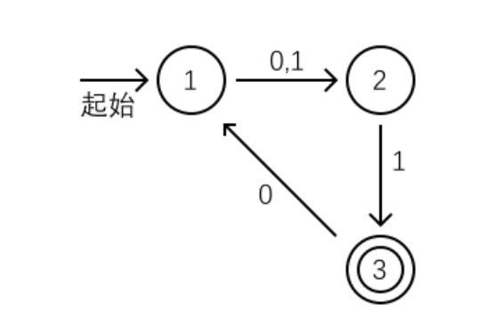
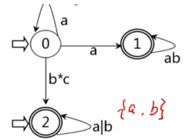
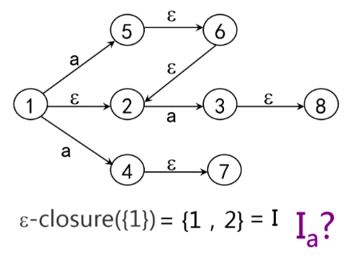

有限自动机是对语言有穷描述的一种方法，下面将介绍确定有限自动机、非确定有限自动机和他们之间的转化以及确定有限自动机的最小化。

<!--more-->

### 确定有限自动机

确定有限状态自动机A是由

1. 一个非空有限的状态集合Q
2. 一个输入字母表（非空有限的字符集合）
3. 一个转移函数
4. 唯一开始状态
5. 一个接受状态的集合(终止状态集合)

组成的五元组。

#### 转换函数

> f(0,a) = 1

处于状态0时输入字符状态迁移为1

#### 转换矩阵

| 状态\输入符号 | a    | b    |
| :-----------: | ---- | ---- |
|       0       | 1    | 2    |
|       1       | 3    | 2    |

> 状态为0时输入字符a状态迁移为1
>
> 状态为1时输入字符a状态迁移为3

#### 状态转换图

从起点状态1开始，如果输入字符0或1状态迁移为2；在状态2输入字符1时状态转移为3。

两个圆圈的为终止状态。

### 非确定有限自动机

在确定有限自动状态机上稍加修改，使其在某状态下输入一个字符的转换状态不是唯一的，而允许转换为多个状态，并允许不扫描字符就可以转换状态。

非确定有限状态自动机A是由

1. 一个非空有限的状态集合Q
2. 一个输入字母表（非空有限的字符集合）
3. 转移函数
4. 开始状态集合
5. 一个接受状态的集合(终止状态集合)

组成的五元组。

#### 与确定有限状态机区别

1. 状态转换函数是一个子集，一个状态结点出发可以有不止一条同一标记的弧
2. 不处理任何符号就可以转换
3. 初态不止一个
4. DFA是NFA的特例

#### 转换函数

> f(0,a) = {0，1，2，3}

处于状态0时输入字符状态迁移为0，1，2，3

#### 转换矩阵

| 状态\输入符号 | a    | b    |
| :-----------: | ---- | ---- |
|       0       | 1，2 | 2，5 |
|       1       | 3，4 | 2，3 |

> 状态为0时输入字符a状态迁移为1，2
>
> 状态为1时输入字符a状态迁移为3，4

### NFA转DFA

对于任何一个NFA，都存在一个DFA，使其等价。

### 思路

根据NFA和DFA的不同构造DFA

|            | NFA       | DFA  |
| ---------- | --------- | ---- |
| 初始状态   | 不唯一    | 唯一 |
| 弧上的标记 | 单字符、ε | 字符 |
| 转换关系   | 非确定    | 确定 |

##### 消除初始状态不同

引进初态结点X和终态结点Y，从X到原来的初态各连接一条ε弧，从原所有来终态各引出一条ε弧到终态Y。现在只有一个唯一的初态，唯一的终态。

##### 状态替换

1. i--AB-->j  代之为 i--A--k--B-->j。引入新状态k

#### 子集法

##### ε-闭包

I是状态集的一个子集，I的ε-闭包为：

ε-closure(I) = I∪{s1 | 从某个s∈I 出发经过任意条ε弧能达到S1}

设a是字符集中一个字符，定义

$$I_a  = ε-closure(J)$$

其中，J为I中的某个状态出发经过一条a弧而到达的状态集合。也就是说经过任意(0-n)个ε弧到a再经过任意(0-n)个ε弧到达的状态的集合就是I_a。

###### 例题

要求I_a,则要求J，J = {5，4，3}

I_a = ε-closure(J) = {5,4,3,6,2,7,8}

##### 确定化

不失一般性，设字母表只含两个字符a、b，构造计算状态集的转化表

| I    | I_a  | I_b  |
| ---- | ---- | ---- |
|      |      |      |

1. 置第一行第一列为ε-closure(X)，求这一列的I_a,I_b
2. 检查这两个 I_a,I_b是否在表中出现过，把没有出现的在填在空行的第一列。
3. 直到所有的I_a,I_b全部出现过。

