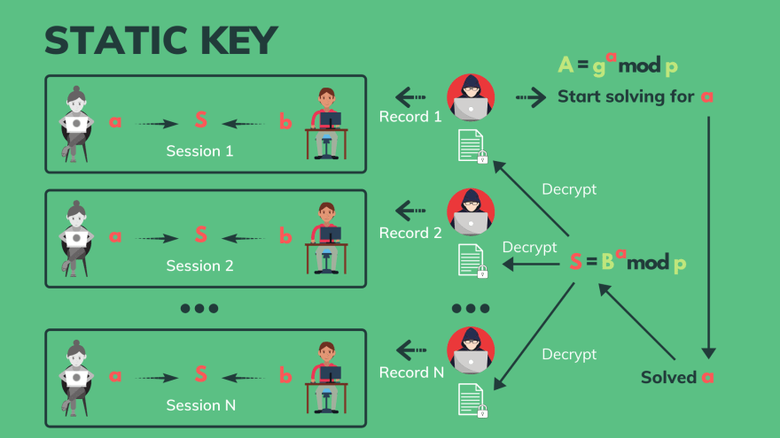

介绍SSL/TLS的原理及其加密方式。

<!--more-->

我猜你们中的许多人都知道 HTTPS，有些人可能已经为你的 web 服务器设置了 SSL/TLS。但是，有多少人深刻理解 SSL/TLS 是如何工作的呢？

你知道吗:

- TLS 握手过程中到底发生了什么？

- TLS 使用哪些加密算法来保护数据？

- 客户机和服务器如何交换密钥？

- 区分-赫尔曼临时密钥交换是如何工作的？

- 我们为何需要数码证书？

- 为什么需要由证书颁发机构签署？

- 什么是数字签名? 如何签名和验证？

- 完备的前向安全性是什么意思？

- 运输及房屋事务助理署、互助委员会、香港发展基金及0-rtt 如何运作？

- 什么是椭圆曲线密码体制？

- 与 TLS 1.2相比，TLS 1.3有什么新特性？

有很多问题，我不想只触及表面。因此，这将是一篇非常详尽的文章，告诉您关于 SSL/TLS 的一切，SSL/TLS 是构建互联网安全性的一个极其重要的构件。

# 什么是 SSL/TLS?

SSL 代表安全套接字层，它是 TLS 的前身。

是传输层安全的简称，它是一个安全协议安全协议，通过计算机网络提供安全通信。

# SSL/TLS的历史


## SSL 和 TLS 的一些历史

- SSL 最初是由 Netscape 开发的，1995年第一次发布了2.0版本
- 由于一些严重的安全缺陷，SSL 版本1.0从未公开发布。
- 1996年，SSL 版本3.0作为协议的重新设计发布。
- 3年后，IETF 在 RFC 2246中首次定义了 TLS 1.0，作为 SSL Version 3.0的升级
- 2006年，我们花了7年时间将其升级到 TLS 1.1
- 1.2紧随其后在2008年发布。
- 最终，经过10年的努力，我们在2018年得到了一个巨大的改进: TLS 1.3。

## 目前哪个 SSL/TLS 版本仍然存在

- 2.0在2011年就被弃用了
- 3.0在2015年就被否决了
- 最近，在2020年3月，TLS 1.0和 TLS 1.1也消失了。这意味着只有 TLS 1.2和1.3仍处于活动状态。

# TLS被用在哪里

首先，它在网络上被广泛使用。所有你用 HTTPS 访问的网站都是用 TLS 保护的，或者我们常说的 HTTP over TLS。

类似地，使用 SMTPS 协议的电子邮件实际上是 SMTP 和 TLS。

然后 FTPS 的安全文件传输协议也是 FTP 加上 TLS。


# 为什么我们需要TLS


因为 TLS 给了我们三样东西:

## 认证

- TLS 验证通信方的身份，通常是客户端和服务器。
- 在非对称加密的帮助下，TLS 确保我们访问的是真实的网站，而不是假的网站。

## 加密

- TLS 通过使用对称加密算法对交换的数据进行加密来保护数据不受未经授权的访问。

## 完整性

- 在传输过程中，TLS 可以通过检查消息代码来识别数据的任何变化，我们稍后将了解这一点。


# TLS是怎么工作的？


基本上，TLS 由两个阶段或两个协议组成:

## 握手协议

在这个阶段，客户机和服务器将:

1. 协商协议版本
2. 选择加密算法(或密码组合)
3. 使用**非对称密码**系统进行身份验证
4. 建立一个**共享密钥**，该密钥将在下一阶段用于对称加密。

因此，握手的主要目的是为了进行**身份验证**和**密钥**交换。

## 记录协议

在这个阶段

1. 所有发出的消息都将使用在握手中建立的**共享密钥**进行加密。
2. 然后将加密的消息传送到另一端。
3. 他们将验证，在传输过程中看看是否有任何修改。
4. 如果没有，则将使用相同的对称密钥解密消息。

因此，我们将实现该记录协议的保密性和完整性。

由于此阶段的加密数据量很大，因此通常称为批量加密。

# 为什么 TLS 同时使用对称和非对称加密

为什么不把一个用于所有目的呢？

很容易看出，对称加密不能提供身份验证。由于客户机和服务器只有一个秘密密钥，因此它们不知道对方的任何信息以供验证。更不用说他们如何在不向公众泄露密钥的情况下找到相同的密钥是很困难的。

那么非对称密码学呢？听起来是个不错的候选人。不幸的是，它比对称加密慢得多。我说的“很多”是指从100倍甚至10000倍慢下来。所以它显然不适合大容量加密。

# 对称加密


好了，现在让我们学习更多关于对称密码学的知识。我想您已经了解了基础知识。

1. 首先，爱丽丝有一条纯文本信息，她想发给鲍勃，但不想让公共区域的任何人看到。
2. 所以她用他们之前**共享的密钥**加密了信息。然后她通过公共互联网将加密的信息发送给鲍勃。
3. 在收到加密消息后，Bob 将很容易地使用相同的秘密密钥对其进行解密。
4. 由于使用相同的密钥进行加密和解密，所以它是对称的，因此我们称之为对称密码术。
5. 现在可能有一个黑客哈里，他可以在公共网络上捕捉他们交换的信息。然而，消息已经被加密了，而 Harry 没有秘密密钥，所以他无法解密。

但是他仍然可以改变它！

## Bit-flipping攻击


有一种技术叫做**位翻转攻击**，它是这样工作的:

假设这次爱丽丝不是在和鲍勃说话，而是在和她的网上银行说话。她想寄100美元给某人。该信息用一个秘密密钥加密，并通过互联网发送到银行。

现在哈利捕捉到了加密的信息。虽然他不能解密，但他可以将其中的一些比特从1翻转到0，从0翻转到1，然后将修改后的消息转发给银行。

现在当银行解密它时，他们会得到一个不同的纯文本内容。在这种情况下，它变成了900美元而不是100美元。

所以这是非常危险的，这就是为什么我们需要确保加密的信息在传输过程中没有被改变。

但是怎么做呢？

## 认证加密Authenticated Encryption (AE)

一种方法是使用身份验证加密。这个想法不仅要加密，还要验证加密的消息。


### The first step is to encrypt

Alice 的明文消息通过一个对称加密算法，如 AES-256-GCM 或 cha20。

这种加密算法还接受一个共享的密钥和一个随机的 nonce，或者一个初始向量密码(IV)作为输入。它会返回加密的消息。

### The second step is to authenticate

加密的消息、密钥和 nonce 成为 MAC 算法的输入，如果使用 AES-256-GCM，则为 GMAC; 如果使用 cha20加密算法，则为 POLY1305。

这个 MAC 算法就像一个密码**HASH**函数，它的输出是一个 MAC，或者是消息的认证码。

现在，这个 MAC 将与加密的消息一起被标记，最终的结果将发送给 Bob。正因为如此，我们有时把这个 MAC 称为身份验证标记。

### Add some Associated Data (AD)


在 TLS 1.3中，除了加密消息之外，我们还希望对一些相关数据进行身份验证，例如: 地址、端口、协议版本或序列号。此信息未经加密，通信双方都知道。

所以相关的数据也是 MAC 算法的输入。正因为如此，整个过程被称为带有相关数据的认证加密，或简称为 AEAD。

### Decryption and MAC verification

现在让我们看看 Bob 如何检查加密消息在传输过程中是否被更改。


这只是一个简单的反向过程，从加密的 MAC 消息开始，我们从加密的消息中取消标记 MAC。

然后将加密的消息与共享密钥和现有密钥一起送到 MAC 算法。注意，这与加密过程中使用的 nonce 是相同的。通常，nonce 在发送到接收方之前被填充到加密的消息中。

相关的数据也将进入 MAC 算法，并且它的输出将是另一个 MAC。


现在 Bob 可以简单地比较2个 MAC 值。如果他们是不同的，那么他知道加密的信息已经被更改。否则，他可以安全地解密消息，并使用它的信心，它是相同的明文信息，爱丽丝发送。

## Secret key exchange

但是，有一个问题: Bob 和 Alice 如何在不泄露给公众的情况下彼此共享密钥？


答案是: 他们需要使用不对称或者公开密钥加密。具体地说，他们可以使用 Diffie-Hellman Ephemeral，或者椭圆曲线 Diffie-Hellman Ephemeral。

### Diffie-Hellman key exchange


首先，Alice 和 Bobs 都同意两个数字: 基数 g 和模数 p。这些数字众所周知的。

然后他们每个人秘密地选择一个私人号码。Alice 的私钥是 a ，Bob 的私钥是 b 。

然后 Alice 计算她的公钥并发送给 Bob

```tex
A = (g^a) mod p
```

类似地，Bob 计算他的公钥并将其发送给 Alice

```tex
B = (g^b) mod p
```

然后爱丽丝将接收到鲍勃的公钥 b，而鲍勃将接收爱丽丝的公钥 a。

现在奇迹发生了！

爱丽丝计算:

```tex
S = (B^a) mod p
```

Bob计算：

```
S = (A^b) mod p
```

这两个值神奇地等于同一个数 s。

为什么? 我们来算算

```tex
(B^a) mod p = (g^b)^a mod p = ( g^(b*a) ) mod p
(A^b) mod p = (g^a)^b mod p = ( g^(a*b) ) mod p
```

所以爱丽丝和鲍勃想出了同样的密码 s，而没有泄露给公众


### Key Derivation Function - KDF

每种加密算法可能需要不同长度的密钥。因此，为了创建密钥，Alice 和 Bob 必须将 s 放到相同的密钥导出函数，并且输出将是一个所需长度的共享密钥。

在 TLS 1.3中，我们使用了一个基于 hmac 的密钥导出函数，这就是为什么 HKDF 这个名字的原因


一般而言，KDF采用以下输入:

1. 输入键材料(或 IKM)。在我们的例子中，IKM 是数字 s。
2. 我们希望输出键有多长，比如128位。
3. 一个密码杂凑函数，例如 HMAC-SHA256。
4. 可以选择一些特定于上下文或应用程序的信息
5. 一种可选的盐。

有了所有这些输入，KDF 将生成一个所需长度的密钥。

### Trapdoor function 

现在让我们回到Diffie-Hellman密钥交换。

我们知道公众知道 p，g，A，B，这意味着黑客 Harry 也可以访问这些数字。

我们可能会想: 这个密钥交换机制安全吗？或者给定 p，g，A，B，Harry 能算出秘密数字: a，b，s 吗？


幸运的是，如果我们为 p，g，a，b 选择好的值，这些函数就会成为陷门。

例如:

- 选择 p 作为2048位素数,
- 选择 g 作为模 p 的基本根,
- 然后选择 a，b 作为256位随机整数。


一个陷门函数基本上意味着一种方法很容易计算，而另一种方法很难计算:

- 给定 p，g，a，很容易计算A 。
- 但是给定 p，g，A，很难计算a。

显而易见，使用 o (log (a))时间复杂度可以非常快地计算 A。这是一个众所周知的模幂运算问题。

计算一个a要困难得多。这是一个离散对数的问题，需要我们现在这一代的计算机花费很长的时间来解决。

所以我们至少现在是安全的，或者直到下一代强大的量子计算机投入使用。

然而，就目前而言，“需要很长时间才能解决”并不意味着无法解决，对吗？

### Static or Ephemeral key?



如果 Alice 和 Bob 对他们通信的每个会话使用相同的私钥 a 和 b，那么会发生的是，Harry 可以记录所有这些会话，并从会话1开始求解 a。

尽管他需要很长时间来解决这个问题，但是我们假设在第 n 个会话之后，他得到了正确的 a。现在他可以用它来计算秘密数字 s，这样，他就能够解密所有的对话录音。

这听起来可怕吗? 我们如何预防它？


答案是临时的钥匙。顾名思义，我们使用不同的私钥或每个会话。因此，即使 Harry 能够在一个会话中解决这个密钥，他也不能在其他会话中使用它。

这在 TLS 中被称为**完备的前向安全性**。

所以现在你明白了 Diffie-Hellman Ephemeral 的意思，它只是 Diffie-Hellman 的短命音调。

Elliptic-Curve Diffie-Hellman Ephemeral如何？

# Elliptic-Curve Cryptography


椭圆曲线密码体制(ECC)是一种非对称密码体制，其算法相似，但使用了不同的陷门函数。

这个陷门函数是基于椭圆曲线的代数结构，这就是为什么这个名字。

椭圆曲线密码学的一个惊人的价值是: 它需要更小的密钥来提供同等的安全级别。你可以在这个与 RSA 的比较中看到它。

美国国家安全局(NSA)过去用 ECC 384位密钥来保护他们的最高机密，这种密钥用 rsa-7680位密钥提供同样的安全级别。

听起来很棒，对吧？

然而，量子计算攻击的目标更容易对付椭圆曲线密码学。[肖尔的算法](https://en.wikipedia.org/wiki/Shor%27s_algorithm)可以用比破解 RSA 更少的量子资源在假想的量子计算机上破解 ECC。

这种强大的量子计算机可能需要几十年的时间才能真正建成并投入使用。但是我们为此准备好了什么吗？有没有什么量子抵抗算法？

是的，有[超分子同源迪菲－赫尔曼](https://en.wikipedia.org/wiki/Supersingular_isogeny_key_exchange)密钥交换算法，这也是基于椭圆曲线密码学的。

但那是另一回事了。

# 非对称加密

现在让我们回到非对称密码学上来! 这是一项了不起的技术，有着广泛的应用。


我们已经研究了它的一个应用，即用于对称密钥交换的 Diffie-Hellman ephemal 和椭圆曲线 Diffie-Hellman ephemal。

实际上，RSA 算法过去也用于密钥交换，但在 TLS 1.3中由于各种攻击和没有前向保密能力而被删除。

非对称加密法也用于加密系统。以下是非对称加密算法:

- 具有最佳非对称加密填充(RSA-oaep)的 RSA。

- RSA 与公钥加密标准1(RSA-pkcs1)的最新版本2.2

- Elgamal 加密算法。

最后，非对称密码学的另一个重要特征是用于**数字签名**，TLS 广泛用于身份验证。

TLS 中使用的一些流行的数字签名算法如下:

- 基于概率签名的 RSA 方案。

- 椭圆曲线数字签名算法。

- Edwards 曲线数字签名算法。

我们将很快学习数字签名，但在此之前，让我们学习非对称加密系统是如何工作的。

## Asymmetric Encryption


与对称加密类似，Alice 有一条明文消息要发送给 Bob。

但是这一次，没有共享的密钥。相反，Alice 使用 Bob 的公钥对消息进行加密，并将加密的消息发送给 Bob。

当 Bob 收到消息时，他使用自己的私钥对其进行解密。

虽然公钥和私钥是不同的，但它们仍然通过一些活门函数连接，就像我们在 Diffie-Hellman 算法中看到的那样。

其思想是: 密钥成对存在，只有同一对的私钥才能解密使用其公钥加密的消息。

因此，即使黑客 Harry 可以访问 Alice 的加密消息和 Bob 的公钥，他也不能使用该公钥解密消息。

## Public key sharing


公开密钥共享非常简单。鲍勃只需通过公共互联网直接将密钥发送给爱丽丝，而不用担心密钥可以用来解密任何消息。

密钥是公开的，因此任何人都可以使用它来加密只有 Bob 能够读取的消息，即使他们之前从未交谈过。这真是令人兴奋，不是吗？

然而，生活并不是那么简单！

## 中间人交换key


尽管我们知道 Harry 不能用 Bob 的公钥解密消息，但他仍然可以干扰公钥共享，并用自己的公钥替换 Bob 的公钥。

现在，当 Alice 收到密钥时，她仍然认为那是 Bob 的公钥，但实际上那是 Harry 的。所以如果 Alice 用这个密钥加密她的消息，Harry 就能用他的私钥解密它。

之所以会发生这种情况，是因为钥匙只是一个数字，没有身份信息告诉我们钥匙的主人是谁。

那么我们能做些什么呢？显然，我们应该把密钥和一些身份信息放在一起。这只不过是一个数字证书。

## 数字证书


所以 Bob 将他的钥匙放在证书中，证书上有他的名字和其他身份信息。这张证书在现实世界中起到了护照的作用。

但是我们怎么知道真的是 Bob 拥有那张证书呢？是什么阻止了哈里用鲍勃的名字但是用哈里的公共钥匙制作一个假证书？

嗯，就像在现实世界中一样，护照必须经过身份验证后由护照当局签发。在数字世界中，证书必须由证书颁发机构进行验证和签名。

该证书颁发机构和护照颁发机构是值得信赖的第三方，帮助我们防止伪造护照和数字证书。

### 证书签发


证书签名过程如下:

- Bob 有一对公钥和私钥。
- 在第一步中，他创建一个证书签名请求，或 CSR。这个 CSR 包含他的公钥和一些身份信息，例如他的名字、组织和电子邮件。
- 然后，第二步，他用自己的私钥签署 CSR，并将其发送给证书颁发机构。
- 证书颁发机构将在证书中验证 Bob 的身份。如果有必要，他们可以联系他要求更多的证据。
- 然后，他们使用证书中 Bob 的公钥来验证他的签名。这是为了确保 Bob 真正拥有与证书中的公钥配对的私钥。
- 如果所有内容都有效，CA 将使用自己的私钥对证书进行签名，并将其发送回 Bob。

### 证书共享


现在，Bob 将与 Alice 共享这个包含他的公钥的证书，而不是像以前那样只发送公钥。

在接收到证书后，Alice 可以使用证书颁发机构的公钥轻松地验证其真实性。

因此，Harry 再也不能用他的密钥替换 Bob 的公钥，因为他没有 CA 的私钥来签署假证书。

**请注意，这仅仅是因为我们都信任证书颁发机构。如果 CA 不值得信任，例如，如果他们给了 Harry 他们的私钥，那么我们就有大麻烦了！**

## 证书颁发机构-信任链

在现实中,有一个证书authori链


在最高层是一个根证书认证机构，他们签署自己的认证证书，也签署他们的下属的认证证书，

这是一个中级认证机构。该机构可以签署其他中间机构的证书，也可以签署最终实体证书(或叶证书)。

每个证书将引用回到其更高级别的权威的证书，直到根目录。

你的操作系统和浏览器会存储一系列受信任的根证书证书。这样他们就可以很容易地验证所有证书的真实性。

## 数字签名

我们已经讨论了很多关于签署数字签名的问题，所以让我们来看看它是如何工作的！


签署文件:

- 签名者首先需要对其进行hash处理。
- 然后使用签名者的私钥对散列值进行加密。
- 结果就是数字签名。
- 然后这个签名将附在原始文件上。

这就是签名过程。现在我们如何验证签名是否有效？


好吧，我们只是做一个相反的过程:

- 首先我们将签名从文档中分离出来

- 使用签名者的公钥对其进行解密，以获得哈希值。

- 然后，我们使用签名过程中使用的相同散列算法对文档进行散列。

- 结果是另一个散列值。

- 然后我们只需要比较两个散列值。

- 如果它们是相同的，那么签名就是有效的。

# TLS 1.3 handshake protocol

好了，现在我们已经掌握了所有的知识，让我们仔细看看它们在 TLS 握手协议中是如何使用的。

## Full handshake


TLS 1.3完整的握手以客户端发送给服务器的 hello 消息开始。实际上，这条信息包含了很多东西，但在这里我只列出一些重要的信息:

- 首先，客户端支持的协议版本列表。

- 然后一个支持 AEAD 的对称密码套件列表。在这种情况下，有两个选项: AES-256-GCM 或 cha20-poly1305

- 在此之后，还有一个受支持的关键交换组列表。例如，此客户端同时支持有限域 Diffie-Hellman 和椭圆曲线 Diffie-Hellman 。

- 这就是为什么 client 也分享它的2个公钥，1个是 Diffie-Hellman 的，另一个是椭圆曲线 Diffie-Hellman 的。这样，无论选择什么算法，服务器都能够计算共享密钥。

- 此消息中的最后一个字段客户端发送的是它支持的签名算法的列表。这是让服务器选择它应该使用哪个算法来签署整个握手。稍后我们将看到它是如何工作的。


在收到客户端 hello 消息后，服务器还会发回 hello 消息，其中包含:

- 选定的协议版本 TLS 1.3

- 选定的密码套件: AES-256-GCM

- 选定的密钥交换方法: Diffie-Hellman Ephemeral

- 以及所选方法的服务器公钥。

- 下一个字段是对客户端证书的请求，这是可选的，只有当服务器希望通过其证书对客户端进行身份验证时才会发送这个请求。

- 通常在一个 HTTPS 网站上，只有服务器端需要将其证书发送到客户端。这是在这个信息的下一个字段中发送的。


- 下一个字段是 certificate verify，它实际上是到目前为止整个握手的签名。以下是如何生成它的: 从握手开始到证书请求的整个数据称为握手上下文。我们将此上下文与服务器的证书连接起来，对其进行哈希处理，并使用客户机支持的签名算法中的1个用服务器的私钥对哈希值进行签名。

- 以类似的方式，服务器完成是通过连接握手上下文、证书和证书验证、散列，并将散列值通过所选密码组的 MAC 算法来生成的。结果就是整个握手过程的 MAC。

在这里，服务器证书、证书验证和服务器完成被称为身份验证消息，因为它们用于对服务器进行身份验证。有了整个握手的签名和 MAC，TLS 1.3可以安全地抵御几种类型的中间人降级攻击。


现在，当客户端收到来自服务器的 hello 消息后，它将使用root权限验证服务器的证书，并检查整个握手过程的签名和 MAC，以确保它没有被篡改。

如果一切正常，那么客户端就会在整个握手过程中用 MAC 发送完成消息，并且在服务器请求的情况下，还可以选择客户端的证书和证书进行验证。

这就是整个 TLS 握手的流程。

## 简短的握手和PSK恢复

为了提高性能，客户机和服务器并不总是进行这种完整的握手。有时，他们使用预先按下的按键恢复来进行简短的握手。

其思想是: 在上一次握手之后，客户机和服务器已经互相认识，因此它们不需要再次验证。

因此，服务器可以向客户端发送一个或多个会话票据，这些票据可以在下一次握手中用作预共享密钥(PSK)标识。它伴随着一张票的生命周期以及其他一些信息。


现在，在下一次握手中，客户端将发送一个简单的 hello 消息，其中包含:

- 从前一次握手中获得的 PSK 身份(或门票)列表

- 一种 PSK 密钥交换模式，可以是只 PSK，也可以是与 Diffie-Hellman 的 PSK。

- 如果使用 Diffie-Hellman 模式的 PSK，那么客户端还需要共享 Diffie-Hellman 公钥。这将提供完备的前向安全性服务，并允许服务器在需要时回到完整的握手。

当服务器收到这个客户端 hello 消息时，它会发回 hello:

- 选定的预共享密钥标识

- 服务器的可选 Diffie-Hellman 公钥

- 和服务器完成就像在完整的握手。

最后，客户端返回其 Finish，这就是 PSK 恢复的结束。

正如您所看到的，在这种简短的握手中，客户机和服务器之间没有证书身份验证。

这也为零往返时间(0-RTT)数据打开了一个机会，这意味着客户机不需要等到握手完成后才将其第一个应用程序数据发送到服务器。

## 0-RTT handshake


在0-rtt 中，客户机将应用程序数据与客户机 hello 消息一起发送。此数据使用从票据列表中的第一个 PSK 中派生的密钥进行加密。

它还增加了另外一个字段: 早期数据指示，告诉服务器有早期应用程序数据被发送。

如果服务器接受这个0-rtt 请求，它将像正常的 PSK 恢复一样发送回服务器 hello，还可以选择发送一些应用程序数据。

客户端将以一个包含 MAC 的消息和一个早期数据结束指示器结束。这就是 TLS 1.3中0往返时间的工作原理。

它的优点是减少了1个往返时间的延迟。但是反对派正在挑起重放攻击的潜在威胁。这意味着，黑客可以将相同的加密的0-rtt 请求多次复制并发送到服务器。为了避免这种情况，服务器应用程序的实现方式必须能够弹性地抵御重复请求。

# Compare TLS 1.3 vs TLS 1.2

在我们结束之前，让我们对 TLS 1.3和 TLS 1.2做一个快速比较，看看有什么新的东西！


- 1.3具有更安全的密钥交换机制，去除了易受攻击的 RSA 和其他静态密钥交换方法，只保留了 Diffie-Hellman 或者椭圆曲线 Diffie-Hellman 的临时密钥交换方法，从而实现了完备的前向安全性密钥交换。

- TLS 1.3握手至少比 TLS 1.2握手快1个来回。

- TLS 1.3中的对称加密更加安全，因为 AEAD 密码套件是强制的，而且它还从列表中删除了一些弱算法，如块密码模式(CBC)、 rc4或三重 DES。

- TLS 1.3中的密码套件也更简单，因为它只包含 AEAD 算法和哈希算法。密钥交换和签名算法被移动到不同的字段。在 TLS 1.2中，它们被合并到密码套件中。这使得推荐的密码组合数量变得太大，如果我没有记错的话，TLS 1.2中有37个选项。而在 TLS 1.3中，只有5个。

- 接下来，TLS 1.3也给了我们更强有力的信号，因为它标志着整个握手过程，而不是像 TLS 1.2那样仅仅覆盖其中的某些部分。

- 最后，椭圆曲线密码体制在 TLS 1.3中得到了广泛的关注，增加了一些更好的曲线算法，如 edward 曲线数字签名算法，该算法在不牺牲安全性的前提下速度更快。

# 参考

[A complete overview of SSL/TLS and its cryptographic system - YouTube](https://www.youtube.com/watch?v=-f4Gbk-U758&list=PLy_6D98if3UINAba67DnhO4055OA6viSb)

