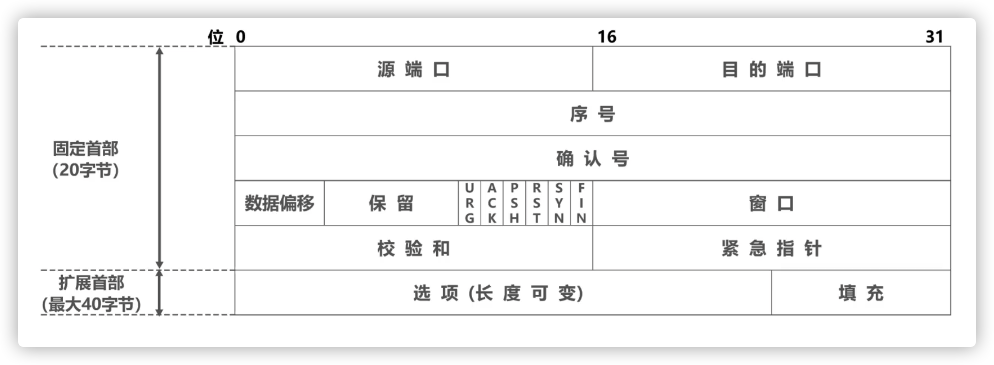
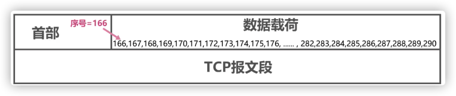
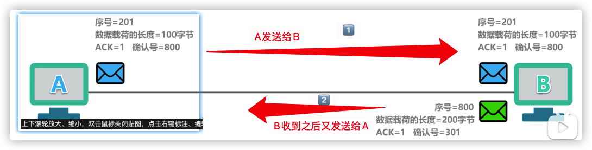
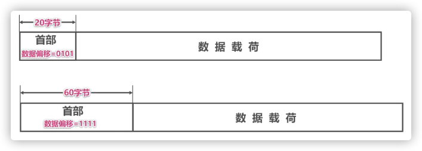
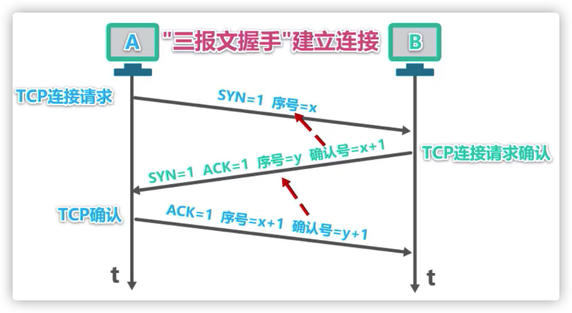
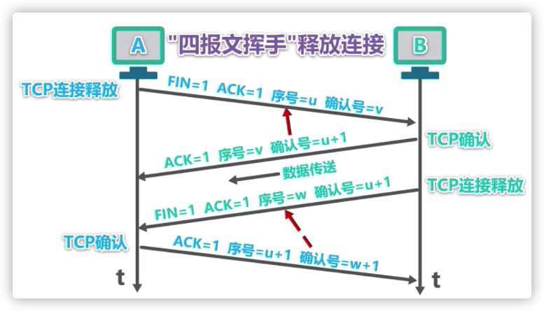
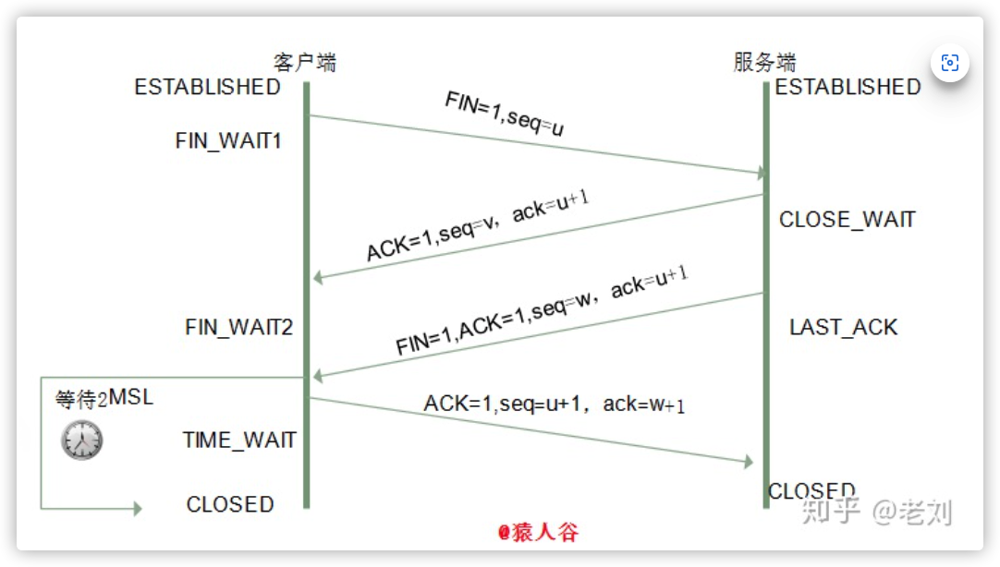

为了实现可靠传输，TCP采用了面向字节流的方式发送数据。TCP在发送数据时，是从发送缓冲区取出一部分或全部字节并给其添加一个首部使之成为TCP报文段后进行发送。

<!--more-->

## TCP报文介绍

TCP 报文是 TCP 层传输的数据单元，也称为报文段。TCP 报文中每个字段如图所示。

#### 源端口和目的端口字段

- 源端口（Source Port）：标识发送该TCP报文段的应用进程（端口号），占 16 位。
- 目的端口（Destination Port）：标识接受该TCP报文段的应用进程（端口号），占 16 位。

#### 序列号字段

TCP序列号（Sequence Number）：占 32 位，序号增加到最后一个后下一个序号又回到0。它表示本报文段所发送数据的**第一个字节的编号**。

#### 确认号字段

TCP 确认号（Acknowledgment Number，ACK Number）：占 32 位。它表示**期望收到发送方下一个TCP报文段的数据载荷的第一个字节数据的序号，同时也是对之前所有数据的确认**。其值是接收计算机即将接收到的下一个序列号，也就是下一个接收到的字节的序列号加1。

若确认号为n，则表明，到序号n-1为止的所有数据都已经正确接受，期望收到序号为n的数据

当确认标志位ACK为1是确认号字段有效，取值为0是无效。

TCP 规定，在建立连接之后的所有传送的TCP报文端都必须把ACK置为1.

A发送序号为201，载荷长度为100字节的数据给B。并且确认了`800`之前的数据（不包含800），ACK为1表示确认是有效的。

B收到A发来的数据报之后，又给A发送了A想要的800序号之后的数据，数据长度为200字节。并且确认了301（A的序号+长度）之前的数据（不包含301，其实数据只收到到300序号）

#### 数据偏移字段

TCP 首部长度（Header Length）：数据偏移是指数据段中的“数据”部分起始处距离 TCP 数据段起始处的字节偏移量，占 4 比特。其实这里的“数据偏移”也是在确定 TCP 数据段头部分的长度，告诉接收端的应用程序，数据从何处开始。

偏移量的是以4字节为单位，该字段实际指出了TCP报文段的首部长度，首部的固定长度为20字节（定义的）也就是5个单位的偏移量。用二进制表示是0101。最大为1111也就是15个单位，等于60个字节，所以首部最长是60个字节。

#### 保留字段

保留（Reserved）：占 6 位。为 TCP 将来的发展预留空间，目前必须全部为 0。

#### 标志位字段

- CWR（Congestion Window Reduce）：拥塞窗口减少标志，用来表明它接收到了设置 ECE 标志的 TCP 包。并且，发送方收到消息之后，通过减小发送窗口的大小来降低发送速率。
- ECE（ECN Echo）：用来在 TCP 三次握手时表明一个 TCP 端是具备 ECN 功能的。在数据传输过程中，它也用来表明接收到的 TCP 包的 IP 头部的 ECN 被设置为 11，即网络线路拥堵。
- URG（Urgent）：表示本报文段中发送的数据是否包含紧急数据。URG=1 时表示有紧急数据。当 URG=1 时，后面的紧急指针字段才有效。
- ACK：表示前面的确认号字段是否有效。ACK=1 时表示有效。只有当 ACK=1 时，前面的确认号字段才有效。TCP 规定，连接建立后，ACK 必须为 1。
- PSH（Push）：告诉对方收到该报文段后是否立即把数据推送给上层。如果值为 1，表示应当立即把数据提交给上层，而不是缓存起来。
- RST：表示是否重置连接。如果 RST=1，说明 TCP 连接出现了严重错误（如主机崩溃），必须释放连接，然后再重新建立连接。还可以用来拒绝一个非法的报文火拒绝打开一个TCP连接。
- SYN：在建立连接时使用，用来同步序号。当 SYN=1，ACK=0 时，表示这是一个请求建立连接的报文段；当 SYN=1，ACK=1 时，表示对方同意建立连接。SYN=1 时，说明这是一个请求建立连接或同意建立连接的报文。只有在前两次握手中 SYN 才为 1。
- FIN：标记数据是否发送完毕。如果 FIN=1，表示数据已经发送完成，可以释放连接。

#### 窗口字段

窗口大小（Window Size）：占 16 位。它表示从 Ack Number 开始还可以接收多少字节的数据量，也表示当前接收端的接收窗口还有多少剩余空间（发送本报文端的一方的接受窗口，是以接收方的接受能力来控制发送方的发送能力）。该字段可以用于 TCP 的流量控制。发送窗口的大小还取决于拥塞窗口的大小，是min（接受窗口，拥塞窗口）

#### TCP 校验和字段

校验位（TCP Checksum）：占 16 位。它用于确认传输的数据是否有损坏。发送端基于数据内容校验生成一个数值，接收端根据接收的数据校验生成一个值。两个值必须相同，才能证明数据是有效的。如果两个值不同，则丢掉这个数据包。

#### 紧急指针字段

紧急指针（Urgent Pointer）：仅当前面的 URG 控制位为 1 时才有意义。它指出本数据段中为紧急数据的字节数，占 16 位。当所有紧急数据处理完后，TCP 就会告诉应用程序恢复到正常操作。即使当前窗口大小为 0，也是可以发送紧急数据的，因为紧急数据无须缓存。

#### 可选项字段

选项（Option）：长度不定，但长度必须是 32bits 的整数倍。

## 三次握手

三次握手（Three-way Handshake）其实就是指建立一个TCP连接时，需要客户端和服务器总共发送3个包。进行三次握手的主要作用就是**为了确认双方的接收能力和发送能力是否正常**、指定自己的初始化序列号为后面的可靠性传送做准备。实质上其实就是连接服务器指定端口，建立TCP连接，并同步连接双方的序列号和确认号，交换TCP窗口大小信息。

#### 过程

首先A向B发起TCP连接请求，请求中不携带数据，报文首部的标志位SYN置为1表示这是一个TCP请求连接报文段，序号取值为x是A自己生成的序号。

主机B收到A发来的TCP连接请求报文段后给A发送TCP**连接请求确认报文段**，该报文段也不携带数据，只有首部。SYN和ACK都为1表示这是一个TCP连接请求确认报文段。序号为y是B自己生成的自己的初始序号，确认号x+1表示确认了连接请求。

A收到B发来的请求确认报文段，要再次发送一个**普通的TCP确认报文段**，这个报文段可以携带数据，也可以不携带数据。序号为x+1表示这是A发送的第二个数据报文段（第一个数据报文段没有携带数据），确认号为y+1表示收到了连接请求确认报文段。

#### 为什么需要三次握手，两次不行吗？

弄清这个问题，我们需要先弄明白三次握手的目的是什么，能不能只用两次握手来达到同样的目的。

第一次握手：客户端发送网络包，服务端收到了。

这样**服务端**就能得出结论：客户端的发送能力、服务端的接收能力是正常的。

第二次握手：服务端发包，客户端收到了。

这样**客户端**就能得出结论：服务端的接收、发送能力，客户端的接收、发送能力是正常的。不过此时**服务器**并不能确认客户端的接收能力是否正常。

第三次握手：客户端发包，服务端收到了。

这样**服务端**就能得出结论：客户端的接收、发送能力正常，服务器自己的发送、接收能力也正常。

因此，需要三次握手才能确认双方的接收与发送能力是否正常。

试想如果是用两次握手，则会出现下面这种情况：

> 如客户端发出连接请求，但因连接请求报文丢失而未收到确认，于是客户端再重传一次连接请求。
>
> 后来收到了确认，建立了连接。
>
> 数据传输完毕后，就释放了连接，客户端共发出了两个连接请求报文段，其中第一个丢失，第二个到达了服务端，但是第一个丢失的报文段只是在某些网络结点长时间滞留了，延误到连接释放以后的某个时间才到达服务端，
>
> 此时服务端误认为客户端又发出一次新的连接请求，于是就向客户端发出确认报文段，同意建立连接，不采用三次握手，只要服务端发出确认，就建立新的连接了，此时客户端忽略服务端发来的确认，也不发送数据，则服务端一致等待客户端发送数据，浪费资源。

#### 三次握手过程中可以携带数据吗？

其实第三次握手的时候，是可以携带数据的。但是，第一次、第二次握手不可以携带数据

为什么这样呢?假如第一次握手可以携带数据的话，如果有人要恶意攻击服务器，那他每次都在第一次握手中的 SYN 报文中放入大量的数据。因为攻击者根本就不理服务器的接收、发送能力是否正常，然后疯狂着重复发 SYN 报文的话，这会让服务器花费很多时间、内存空间来接收这些报文。

也就是说，第一次握手不可以放数据，其中一个简单的原因就是会让服务器更加容易受到攻击了。而对于第三次的话，此时客户端已经处于 **established** 状态。对于客户端来说，他已经建立起连接了，并且也已经知道服务器的接收、发送能力是正常的了，所以能携带数据也没啥毛病。

#### SYN攻击是什么？

服务器端的资源分配是在二次握手时分配的，而客户端的资源是在完成三次握手时分配的，所以服务器容易受到SYN洪泛攻击。

SYN攻击就是Client在短时间内伪造大量不存在的IP地址，并向Server不断地发送SYN包，Server则回复确认包，并等待Client确认，由于源地址不存在，因此Server需要不断重发直至超时，这些伪造的SYN包将长时间占用未连接队列，导致正常的SYN请求因为队列满而被丢弃，从而引起网络拥塞甚至系统瘫痪。SYN 攻击是一种典型的 DoS/DDoS 攻击。

检测 SYN 攻击非常的方便，当你在服务器上看到大量的半连接状态时，特别是源IP地址是随机的，基本上可以断定这是一次SYN攻击。

## 四次挥手

建立一个连接需要三次握手，而终止一个连接要经过四次挥手。这由TCP的半关闭（half-close）造成的。所谓的半关闭，其实就是TCP提供了连接的一端在结束它的发送后还能接收来自另一端数据的能力

#### 过程

A向B发起TCP释放报文段（FIN和ACK都为1表示这是一个释放报文段），序号为u表示之前已经发送过数据的序号+1，确认号为v表示之前已经收到的数据的最后一个字节+1。此时客户端处于 FIN_WAIT1 状态。即发出连接释放报文段，并停止再发送数据，主动关闭TCP连接，进入FIN_WAIT1（终止等待1）状态，等待服务端的确认。

B收到A发送的释放报文段后，给A发送普通的确认报文段（ACK=1 序号=v，确认号=u+1）。服务端收到连接释放报文段后即发出确认报文段，服务端进入CLOSE_WAIT（关闭等待）状态，此时的**TCP处于半关闭状态**，客户端到服务端的连接释放。客户端收到服务端的确认后，进入FIN_WAIT2（终止等待2）状态，等待服务端发出的连接释放报文段。

在此，如果B有数据还要传输，这时候还可以传输数据。如果B已经没有数据要传输了就要进行下一步。

B给A发送TCP释放报文段（FIN，ACK=1，序号=w【对之前收到的数据进行确认】，确认号=u+1）。服务端没有要向客户端发出的数据，服务端发出连接释放报文段，服务端进入LAST_ACK（最后确认）状态，等待客户端的确认。

A收到B的释放报文段后，还要给B发送一个普通的确认报文段（ACK=1，序号=u+1，确认号=w+1）。客户端收到服务端的连接释放报文段后，对此发出确认报文段，客户端进入TIME_WAIT（时间等待）状态。此时TCP未释放掉，需要经过时间等待计时器设置的时间2MSL后，客户端才进入CLOSED状态。

#### 挥手为什么需要四次？

因为当服务端收到客户端的SYN连接请求报文后，可以直接发送SYN+ACK报文。其中ACK报文是用来应答的，SYN报文是用来同步的。

但是关闭连接时，当服务端收到FIN报文时，很可能并不会立即关闭SOCKET，所以只能先回复一个ACK报文，告诉客户端，“你发的FIN报文我收到了”。

只有等到我服务端所有的报文都发送完了，我才能发送FIN报文，因此不能一起发送。故需要四次挥手。
