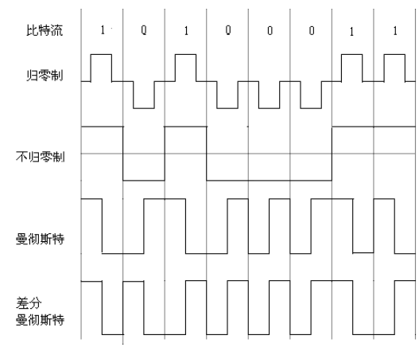

根据老师提供的范围整理的计算机网络原理的复习资料

<!--more-->

### 第一章

#### 1-1计算机网络向用户可以提供哪些服务？ 

1. 信息交互服务
2. 资源共享服务。

#### 1-2试简述分组交换的要点。

1. 采用存储转发技术
2. 发送数据不在源和目的之间先建立一条物理的通路，
3. 将要发送的报文分割为较小的数据段
4. 将控制信息作为首部加在每个数据段前面（构成分组）一起发送给分组交换机。
5. 每一个分组的首部都含有目的地址等控制信息。
6. 分组交换网中的分组交换机根据分组首部中的控制信息，把分组转发到下一个分组交换机。
7. 用这种存储转发方式将分组转发到达最终目的地

#### 1-3试从建立连接、何时需要地址、是否独占链路、网络拥塞、数据是否会失序、端到 端时延的确定性、适用的数据传输类型等多个方面比较分组交换与电路交换的特点

#### 1-7 小写和大写开头的英文名字 internet 和 Internet 在意思上有何重要区别？ 

- 以小写字母`i`开始的 internet（互联网或互连网）是一个通用名词，它泛指由多个 计算机网络互连而成的网络。在这些网络之间的通信协议可以是任意的。 
- 以大写字母 I 开始的 Internet（因特网）则是一个专用名词，它指当前全球最大的、开放 的、由众多网络相互连接而成的特定计算机网络，它采用 TCP/IP 协议族作为通信的规则。

#### 1-13 计算机网络有哪些常用的性能指标？ 

速率、带宽、吞吐量、时延、利用率

#### 1-14 收发两端之间的传输距离为1000 km，信号在媒体上的传播速率为2*10^8 m/s。试 计算以下两种情况的发送时延和传播时延。

 （1）数据长度为 10^7bit，数据发送速率为 100 kbit/s;

（2）数据长度为 10^3bit，数据发送速率为 1 Gbit/s。 

解答：(1) 发送时延为 100 s，传播时延为 5 ms。发送时延远大于传播时延。 (2) 发送时延为 1 µs，传播时延为 5 ms。发送时延远小于传播时延

#### 1-17 试述具有五层协议的网络体系结构的要点，包括各层的主要功能。 

- 物理层：在物理媒体上传送比特流。具体包括：与物理媒体的接口、比特的表示与 同步、数据率、线路配置、物理拓扑等。 

- 数据链路层：在两个相邻结点间（主机和路由器或路由器和路由器之间）的链路上 传送以帧为单位的数据。具体包括：组帧、差错控制、物理编址、接入控制、**流量**控制等。 
- 网络层：负责将分组从源主机（按照合适的路由）通过中间若干路由器的转发传送 到目的主机。核心功能是逻辑编址、路由选择和分组转发。 
- 运输层：负责主机中两个进程之间的逻辑通信（端到端通信）。具体包括：复用与分用、可靠数据传输、流量控制、拥塞控制等。 
- 应用层：通过应用进程间的交互来实现特定网络应用，直接为用户或应用进程提供特定的应用服务，如文件传输、电子邮件等

#### 1-18 试解释以下名词：协议栈、实体、对等层、协议数据单元、客户、服务器、客户-服务器方式。

- 协议栈：指网络中各层协议的总和，其形象的反映了一个网络中文件传输的过程，由上层协议到底层协议，再由底层协议到上层协议。
- 实体：表示任何可发送或接收信息的硬件或软件进程。 
- 对等层：通信双方实现同样功能的层。协议定义的就是对等层间的通信规则。
- 协议数据单元：OSI 参考模型把对等层次之间传送的数据单位称为该层的**协议数据单元 （PDU）**。 
- 客户：在计算机网络中进行通信的应用进程中的**服务请求方**。 
- 服务器：在计算机网络中进行通信的应用进程中的**服务提供方**。 
- 客户-服务器方式：网络应用程序的工作方式。描述的是进程之间服务和被服务的关系。服务器总是 一直运行并被动等待通信，而客户总是主动发起通信。服务器可以同时处理多个客户的请求， 而客户程序之间不直接进行通信。

### 第二章

#### 2-1 物理层要解决哪些问题？物理层协议的主要任务是什么？

- 物理层考虑的是怎样才能在连接各种计算机的传输媒体上传输数据比特流，而不是指具体的传输媒体。
  - 因此物理层要考虑如何用电磁信号表示“1”或“0”；
  - 考虑所采用的传输媒体的类型，如双绞线、同轴电缆、光缆等；
  - 考虑与物理媒体之间接口，如插头的引脚数 目和排列等；
  - 考虑每秒发送的比特数目，即数据率。 
- 物理层协议的主要任务就是确定与传输媒体的接口有关的一些特性，即机械特性、电气特性、功能特性和过程特性。

#### 2-4 试给出数据通信系统的模型并说明其主要组成构件的作用。 

一个数据通信系统可划分为三大部分，即源系统（或发送端、发送方）、传输系统（或传输网络）和目的系统（或接收端、接收方）

- 源系统一般包括以下两个部分

  -  源点：源点设备产生要传输的数据，例如，从 PC 的键盘输入汉字，PC 产生输出的数字 比特流。
  -  发送器：通常源点生成的数字比特流要通过发送器编码后才能够在传输系统中进行传输。 典型的发送器就是调制器。 

- 目的系统一般也包括以下两个部分：

  -  接收器：接收传输系统传送过来的信号，并把它转换为能够被目的设备处理的信息。典 型的接收器就是解调器，它把来自传输线路上的模拟信号进行解调，提取出在发送端置入的 消息，还原出发送端产生的数字比特流。 
  -  终点：终点设备从接收器获取传送来的数字比特流，然后进行信息输出。

#### 2-5 请画出数据流 1 0 1 0 0 0 1 1 的不归零编码、曼彻斯特编码和差分曼彻斯特编码的波 形（从高电平开始）。

曼彻斯特编码：在中间都会发生**跳变**想下跳变表示`1`，向上跳变表示`0`

查分曼彻斯特编码：码元的开始和上个码元的结束不同表示`0`,和上次码元一样表示`1`，中间时刻，信号都会发生跳变。

#### 2-7 假定某信道受奈氏准则限制的最高码元速率为 20000 码元/秒。如果采用幅移键控， 把码元的振幅划分为 16 个不同等级来传送，那么可以获得多高的数据率（b/s）？ 

- 奈式准则：每赫带宽的理想低道通信的最高码元传输速率位每秒2个码元，每赫带宽的带通信道的最高码元传输速率位每秒1个码元。

​	16 个等级可以表达 4 位二进制数，每个码元可以表示 4 个比特，因此，可以获得 4*20000 b/s 的数据率。

​	8个等级可以表达 3 位二进制数，每个码元可以表示 3个比特，因此，可以获得 3*20000 b/s 的数据率。

#### 2-8 假定用 3 kHz 带宽的电话信道传送 64 kb/s 的数据，试问这个信道应具有多高的信噪比？

- 香农公式： 信道的极限信息传输速率C = Wlog2(1+ S/N) 。
  - W是信道宽度(单位：Hz)
  - S：信道内所传信号的平均功率
  - N：信道内部的高斯噪声功率
  - S/N :信噪比 
  
  信噪比 = 2^(C/W)-1

#### 2-10 常用的传输媒体有哪几种？各有何特点？ 

- 双绞线，用两根绝缘铜线扭在一起的通信媒体，绞合在一起是为了减少相邻导线的电磁 干扰。双绞线价格便宜，布线方便，主要用于电话用户线和局域网中。
-  同轴电缆，由内导体铜质芯线、绝缘层、网状编织的外导体屏蔽层以及保护塑料外层所 组成。比双绞线带宽高和更好的抗干扰特性。用在有线电视网的居民小区中。 
- 光纤，是利用光导纤维传递光脉冲信号来进行通信，由于可见光的频率非常高（108MHz）， 因此一个光纤通信系统的传输带宽远远大于目前其他传输媒体的带宽。光纤通信容量大，传输损耗小，抗干扰和保密性能好。光纤通常用在主干网络中和高速局域网中。 
- 无线传输媒体，即利用自由空间传播电磁波。当通信距离很远，或跨越复杂地理环境时， 铺设电缆既昂贵又费时，利用无线电波在自由空间传播，可以实现多种通信。无线传输所使用的频段很广。无线 传输媒体的最大缺点就是容易被干扰，保密性差。

#### 2-11 为什么要使用信道复用技术？常用的信道复用技术有哪些？

-  许多用户可以通过复用技术共同使用一个共享的信道来进行通信。当网络中传输 媒体的传输容量大于单一信道传输的通信量时，可利用复用技术在一条物理线路上建立多条通信信道来充分利用传输媒体的带宽。 
- 常用的复用技术包括：频分复用、时分复用、波分复用、码分复用。

#### 2-12 试写出下列英文缩写的全文，并进行简单的解释。  FDM，TDM，STDM，WDM，DWDM，CDMA，SONET，SDH，STM-1，OC-48 

FDM(Frequency Division Multiplexing)频分复用，将传输线路的可用频带分割为若干条较窄的子频带，每一条子频带传输一路信号，从而实现在同一条线路上传输多路信号。 

TDM(Time Division Multiplexing)时分复用，将一条物理线路的传输时间分成若干个时间 片（时隙），按一定的次序轮流给各个信号源使用，从而实现在同一条线路上传输多路信号。 

STDM(Statistic TDM)统计时分复用，又称为异步时分复用，将线路的传输时间按需动态 地分配给各个信号源，而不是给每个信号源分配固定的时隙。 

WDM(Wavelength Division Multiplexing)波分复用，就是光的频分复用，将不同波长的光 信号复用到同一根光纤上。 

DWDM(Dense WDM)密集波分复用，最初，人们只能在一根光纤上复用两路光载波信号。 这种复用方式称为波分复用 WDM。随着技术的发展，在一根光纤上复用的光载波信号的路 数越来越多。现在已能做到在一根光纤上复用几十路或更多路数的光载波信号。于是就使用 了密集波分复用 DWDM 这一名词。DWDM 的波长间隔很小，不到 2 nm。

 CDMA(Code Division Multiplex Access)码分多址，给每个用户分配一个唯一的正交码， 在发送端，不同用户的数据用该正交码编码后复用到同一信道进行传输；在接收端，用同一 正交码解码进行分用。CDMA 主要用于无线通信，具有很强的抗干扰能力。 

SONET(Synchronous Optical Network)同步光纤网，美国在 1988 年首先推出的一个在光 纤传输基础上的数字传输标准。整个同步网络的各级时钟都来自一个非常精确的主时钟。 SONET 为光纤传输系统定义了同步传输的线路速率等级结构，其传输速率以 51.84 Mbit/s 为基础。 

SDH(Synchronous Digital Hierarchy)同步数字系列，ITU-T 以美国标准 SONET 为基础制 定的国际标准，SDH 的基本速率为 155.52 Mbit/s。 

STM-1(Synchronous Transfer Module-1)第 1 级同步传递模块，是 SDH 的一系列传输标准 之一，规定了 SDH 的基本速率为 155.52 Mbit/s。 

OC-48(Optical Carrier-48) 第 48 级光载波，是 SONET 的一系列传输标准之一，其速率是 SONET 第 1 级光载波 OC-1 速率（51.84 Mbit/s）的 48 倍，即 2488.32 Mbit/s。

#### 2-14 共有 4 个用户进行 CDMA 通信。

这 4 个用户的码片序列为： 

- A: (–1 –1 –1 +1 +1 –1 +1 +1)；
- B: (–1 –1 +1 –1 +1 +1 +1 –1) 
- C: (–1 +1 –1 +1 +1 +1 –1 –1)；
- D: (–1 +1 –1 –1 –1 –1 +1 –1) 

现收到码片序列：(–1 +1 –3 +1 –1 –3 +1 +1)。问是哪些用户发送了数据？发送的是 1 还 是 0？

(–1 +1 –3 +1 –1 –3 +1 +1)(–1 –1 –1 +1 +1 –1 +1 +1)/8:A 的内积为 1，

B 的内积为–1，C 的内积为 0，D 的内积为 1。因此，A 和 D 发送 的是 1，B 发送的是 0，而 C 未发送数据。

### 第三章

#### 3-2 数据链路层包括哪些主要功能？试讨论数据链路层做成可靠的链路层有哪些优点和缺点。

-  主要功能包括：封装成帧、透明传输和差错检测，可选功能包括可靠传输、流量控制等。 
- 优点是**通过点到点的差错检测**和**重传**能**及时纠正相邻结点间传输数据的差错**。
- 若在数据链路层不实现可靠传输由高层如运输层通过端到端的差错检测和重传来纠正这些差错会产生很大的**重传时延**。 但是在数据链路层实现可靠传输并不能保证端到端数据传输的可靠，如由于网络拥塞导 致路由器丢弃分组等。因此，即使数据链路层是可靠的，在高层如运输层仍然有必要实现端到端可靠传输。如果相邻结点间传输数据的差错率非常低，则在数据链路层重复实现可靠传 输就会给各结点增加过多不必要的负担。

#### 3-3 网络适配器的作用是什么？网络适配器工作在哪一层？ 

- 网络适配器的作用就是实现数据链路层和物理层的功能。
- **网络适配器工作在物理层和数据链路层**。
  - 适配器接收和发送各种帧时不使用计算机的 CPU。这时 CPU 可以处理其他任务。当适配器收到有差错的帧时，就把这个帧丢弃而不必通知计算机。
  - 当适配器收到正确的帧时，它就使用中断来通知该计算机 并交付给协议栈中的网络层。

#### 3-5 要发送的数据为 1101011011。采用 CRC 的生成多项式是 P(X) = X^4 + X +1 。

1. 试求应 添加在数据后面的余数。 
2. 数据在传输过程中最后一个 1 变成了 0，问接收端能否发现？ 
3. 若数据在传输过程中最后两个 1 都变成了 0，问接收端能否发现？ 
4. 采用 CRC 检验后，数据链路层的传输是否就变成了可靠的传输？ 

**多项式告诉我们除数为多少**、在原数据后面添几个0(最高项次数是几就添几个0)接下来做除法即可。

- 根据 CRC 生成多项式，除数 P=10011。用 11010110110000，模 2 除 P，余数即CRC 检验序列为 1110。添加检验序列后为 11010110111110。

- 数据（注意是数据，不包括检验序列）在传输过程 中最后一个 1 变成了 0，则接收方收到的数据为 11010110101110。除 P 得到的余数不为零 （0011），发现差错。 

- 若数据在传输过程中最后两个 1 都变成了 0，则接收方收到的数据为 11010110001110。 除 P 得到的余数也不为零（0101），发现差错。 

- **采用 CRC 检验仅能发现数据在传输过程中出现差错但并不能纠正差错，因此并不能实现可靠传输**。

#### **3-14 一条链路传输带宽为 2 Mbps，长度为 10000 km，信号传播速率为 2.0 × 10^5 km/s， 分组大小为 100 B，忽略应答帧大小。如果采用停止等待协议，问最大吞吐率（实际可达的最高平均数据速率）是多少？信道利用率是多少？如果采用滑动窗口协议，要想达到最高吞吐率，发送窗口最小是多少？**

##### 停止等待协议

传播时延 = 信道长度/信号传播速率 = 10000km/2*10^5km/s

发送(传输)时延 = 数据大小/传输带宽 = 100B/2Mbit/s 

发送的一个周期的时间 = 2*传播时延+发送时延 = 100.4ms

**平均的最高速率 = 数据量/时间 = 100B/100.4ms = 7968bit/s**

信道利用率 = 实际数据速率/带宽频率 = 7968bit/s / 2 Mbps = 0.3984%

##### 滑动窗口

个数 =  (周期长度)/(分组发送时间)=100.4ms/0.4ms=251。 所以，发送窗口最小为 251。

#### 3-15 假定卫星信道的数据率为 100 kbps，卫星信道的单程（即从发送方通过卫星到达接 收方）传输时延为 250 ms，每个数据帧长均为 2000 b，忽略误码、确认字长、首部和处理时间等开销，为达到传输的最大效率，帧的序号至少多少位？此时信道最高利用率是多少？

 RTT=250×2ms=0.5s 

1 个帧的发送时间=2000b/100kbps= 20 × 10−3s。 

1 个帧发送完后经过 1 个单程延迟到达接收方，再经过 1 个单程延迟发送方收到应答， 从而可以继续发送，理想的情况是此时窗口信息刚发送完或还没有发送完。

 假设窗口值等于 x，令(2000bit×x)/(100kb/s)= 20 × 10−3s+RTT= 20 × 10−3s+0.5s=0.52s。 得 x=26。 若要取得最大信道利用率，窗口值是 26 即可。

在此条件下，可以不间断地发送帧，所以 发送率保持在 100kbps。 由于 16<26<32，帧的顺序号应为 5 位。在使用后退 N 帧协议的情况下，最大窗口值是 31，大于 26，可以不间断地发送帧，此时信道利用率是 100%

#### 3-17 PPP 协议的主要特点是什么？为什么 PPP 不使用帧的编号？PPP 适用于什么情况？ 为什么 PPP 协议不能使数据链路层实现可靠传输？

 PPP 协议的主要特点如下

- **简单**，数据链路层的 PPP 协议非常简单，具有封装成帧、透明传输和差错检测功能， 但向上不提供可靠传输服务。 
- **支持多种网络层协议**，PPP 协议能够在在同一条物理链路上同时支持多种网络层协议， 如 IP 和 IPX 等。
-  **支持多种类型链路**，PPP 协议能够在多种类型的链路上运行。例如，串行的或并行的， 同步的或异步的，低速的或高速的，电的或光的点对点链路。
- **检测连接状态**，PPP 协议具有一种机制能够及时（不超过几分钟）自动检测出链路是 否处于正常工作状态。
- **网络层地址协商**，PPP 协议提供了一种机制使通信的两个网络层（例如，两个 IP 层） 的实体能够通过协商知道或能够配置彼此的网络层地址。 

帧的编号是可靠数据传输的基本机制，PPP 不使用帧的编号是因为 PPP 不实现可靠数据传输。

由于 PPP 没有编号和确认机制因此不能实现可靠数据传输，适用于线路质量较好的情况。

#### 3-18 一个 PPP 帧的数据部分（用十六进制写出）是 7D 5E FE 27 7D 5D 7D 5D 65 7D 5E。 试问真正的数据是什么（用十六进制写出）？ 

解答：**转义符为 7D**，**7D 5E** 还原为 7E，**7D 5D** 还原为 7D，真正的数据为：7E FE 27 7D  7D 65 7E

#### 3-19 PPP 协议使用同步传输技术传送比特串 0110111111111100。试问经过零比特填充后 变成怎样的比特串？若接收端收到的 PPP 帧的数据部分是 0001110111110111110110，问删除 发送端加入的零比特后变成怎样的比特串？

比特填充法的具体做法是：在发送端，当一串比特流尚未加上标志字段时，先用硬件扫描整个帧。只要发现5个连续1，则立即填入一个0。因此经过这种零比特填充后的数据，就可以保证不会出现6个连续1。在接收一个帧时，先找到F字段以确定帧的边界。接着再用硬件对其中的比特流进行扫描。每当发现5个连续1时，就将这5个连续1后的一个0删除，以还原成原来的比特流。

 解答：填充比特后为 011011111[0]11111[0]00（[]中是填充的比特）。删除比特后为 000111011111[0]11111[0]110（[]中是删除的比特）

#### 3-27 假定 1 km 长的 CSMA/CD 网络的数据率为 1 Gbit/s。设信号在网络上的传播速率为 200000 km/s。求能够使用此协议的最短帧长。

最小帧长 = 争用期*数据传输速率

争用期 ：**发送放到接收方再从接收方到发送方所经历的时间**

 解答：端到端往返时延为(2 km) / (200000 km/s) = 10 µs，

因此只有发送时延大于该往返时延才能保证检测出所有可能的碰撞。即，最短帧长为(1 Gbit/s)× (10 µs) = 10000 bit，即 1250 字节。

#### 3-39 以太网交换机有何特点？用它怎样组成虚拟局域网？ 

#### 特点

- 以太网交换机实质上就是一个**多接口网桥**，和工作在物理层的转发器和集线器有很大的差别。

- 以太网交换机的每个接口通常都直接与一个单个主机或另一个交换机相连，并且一般都工作在全双工方式。当主机需要通信时，交换机能同时连通许多对的接口， 使每一对相互通信的主机都能像独占通信媒体那样，无碰撞地传输数据。

- 是一种即插即用设备，其内部的帧转发表也是通过自学习算法自动地逐渐建立起来的，能够隔离碰撞但转发所有的广播帧。

- 以太网交换机由于使用了专用的交换结构芯片，其交换速率就较高。 

##### 组成虚拟局域网

虚拟局域网 VLAN 是由一些局域网网段构成的与物理位置无关的逻辑组。利用以太网交换机可以很方便地实现虚拟局域网 VLAN，连接到同一交换机的不同主机可以被划分到不同 的 VLAN 中（最常用的技术是根据交换机的端口来划分 VLAN），这些 VLAN 在逻辑上看起 来就像一些独立的 LAN，互相不能直接通信。当 VLAN 跨越多个交换机时，需要在以太网 的帧格式中插入一个 4 字节的标识符，称为 VLAN 标记(tag)，指明发送该帧的主机属于哪 一个 VLAN。

#### 3-40 网桥的工作原理和特点是什么？网桥与转发器以及以太网交换机有何异同？ 

网桥工作在数据链路层，根据 MAC 帧的目的地址向目的主机所连接的端口进行转发，采用存储转发方式，转发时在接口执行 CSMA/CD 协议。网桥能隔离碰撞域，但转发所有的广播帧。 

网桥与转发器最大的区别就是工作的层次不同。网桥工作在数据链路层，根据 MAC 帧 的目的 MAC 地址进行转发；而转发器工作在物理层，用于连接电缆扩大网络覆盖范围，转 发器仅仅将一个端口输入的信号放大整形转发到另一个端口，并不识别帧，也不执行 CSMA/CD 协议。 以太网交换机实质上就是一个多接口网桥，通常直接与主机或另一个交换机相连，并且 一般都工作在全双工方式。而网桥通常用于将两个独立的局域网网段连接成一个局域网。

**3-41 下图表示有五个站分别连接在三个局域网上，并且用网桥 B1 和 B2 连接起来。 每一个网桥都有两个接口（1 和 2）。在一开始，两个网桥中的转发表都是空的。以后有以下 各站向其他的站发送了数据帧：A 发送给 E，C 发送给 B，D 发送给 C，B 发送给 A。试把有 关数据填写在表 3-3 中。**

解答

**3-45 无线局域网的 MAC 协议有哪些特点？为什么在无线局域网中不能使用 CSMA/CD 协议而必须使用 CSMA/CA 协议？结合隐蔽站问题说明 RTS 帧和 CTS 帧的作用。** 

无线局域网的 MAC 协议是 CSMA/CA（载波监听多点接入/碰撞避免）。

不使用 CSMA/CD 的原因是：

- 要实现碰撞检测，就必须在发送信号的同时接收也接收信号。这 对于有线网络是很容易的事，但在无线网络中，接收信号的强度会远远小于发送信号的强度， 因此实现碰撞检测的代价较大。
- 另一方面，即使实现了碰撞检测，但由于隐蔽站问题发 送站也无法检测到所有的碰撞。因此，无线局域网不使用 CSMA/CD 协议而是使用 CSMA/CA 协议，尽可能减少碰撞。由于不可能避免所有的碰撞，CSMA/CA 通过确认机制实现可靠数 据传输。 

无线局域网的 MAC 协议的特点是：

- 由于不实现碰撞检测，要尽可能减少碰撞。因此 在监听信道时，若信道忙要执行退避算法，而不是像 CSMA/CD 一直坚持监听直到信道空闲。
- 由于不可能避免所有的碰撞，同时无线信道误码率比较高，无线局域网的 MAC 协议采用 停止等待协议，保证数据链路层数据传输的可靠性。
- 为进一步减少碰撞的概率，还采用 了虚拟载波监听机制，让源站把它要占用信道的时间（包括目的站发回确认帧所需的时间） 及时通知给所有其他站，以便使其他所有站在这一段时间都停止发送数据，这样就大大减少 了碰撞的机会。
- 标准规定了不同长度的帧间间隔。高优先级帧需要等待的时间较短，低优先级帧等待的时间较长。若低优先级帧还没来得及发送而其他站的高优先级帧已发送到媒 体，则媒体变为忙态因而低优先级帧就只能再推迟发送了。这样就减少了发生碰撞的机会。 
- 隐蔽站问题如下图所示，站 A 和 C 同时向 B 发送数据。但 A 和 C 相距较远，彼此都接 收不到对方发送的信号。当 A 和 C 都检测不到对方的无线信号时，就认为现在无线信道是 空闲的，因而都向 B 发送数据。结果 B 同时收到 A 和 C 发来的数据，发生了碰撞。可见， 在无线局域网中，即使在发送数据前未检测到传输媒体上有信号，也不能保证数据能够发送 成功。为了更好地解决隐蔽站带来的碰撞问题，802.11 允许要发送数据的站对信道进行预约。 源站（如 A）争取到信道后在发送数据帧之前先发送一个短的控制帧，叫做请求发送 RTS （Request To Send），它包括源地址、目的地址和这次通信（包括相应的确认帧）所需的持续 时间。若目的站（如 B）正确收到源站发来的 RTS 帧，且媒体空闲，就发送一个响应控制 帧，叫做允许发送 CTS (Clear To Send)，它也包括这次通信所需的持续时间（从 RTS 帧中将 此持续时间复制到 CTS 帧中）。源站收到 CTS 帧后，再等待一段时间 SIFS 后发送其数据帧。 若目的站正确收到了源站发来的数据帧，在等待时间 SIFS 后，就向源站发送确认帧 ACK。 在 A 的作用范围内的所有其他站监听到 RTS 后，执行虚拟载波监听，在 A 和 B 通信期间不 会发送数据。在 A 的作用范围外，但在 B 的作用范围内的其他站（如 C），虽然收不到 A 的 RTS，但能收到 B 的 CTS，因此 C 知道 A 和 B 将要通信，并在 A 和 B 通信期间也不会发送 数据。

### 第四章

#### 4-1 网络层向上提供的服务有哪两种？试比较其优缺点

提供的服务：面向连接的虚电路服务和无连接的数据报服务。

| 对比的方面                 | 虚电路服务                                      | 数据报服务                                         |
| -------------------------- | ----------------------------------------------- | -------------------------------------------------- |
| 思路                       | 可靠通信应当由网络来保证                        | 可靠通信应当由用户主机来保证                       |
| 连接的建立                 | 必须有                                          | 不需要                                             |
| 终点地址                   | 仅在连接建立阶段使用，每个 分组使用短的虚电路号 | 每个分组都有终点的完整地址                         |
| 分组的转发                 | 属于同一条虚电路的分组均按 照同一路由进行转发   | 每个分组独立选择路由进行转发                       |
| 当结点出故障时             | 所有通过出故障的结点的虚电路均不能工作          | 出故障的结点可能会丢失分组，一些路由可能会发生变化 |
| 分组的顺序                 | 总是按发送顺序到达终点                          | 到达终点时不一定按发送顺序                         |
| 端到端的差错处理和流量控制 | 可以由网络负责，也可以由用 户主机负责           | 由用户主机负责                                     |

#### 4-6 作为中间设备，转发器、网桥、路由器和网关有何区别？ 

- 物理层使用的中间设备叫做转发器(repeater)。
-  数据链路层使用的中间设备叫做网桥或桥接器(bridge)。
- 网络层使用的中间设备叫做路由器(router)。
- 在网络层以上使用的中间设备叫做网关(gateway)。用网关连接两个不兼容的系 统需要在高层进行协议的转换。

4-7 试简单说明下列协议的作用： IP, ARP 和 ICMP。 

- 网际协议 IP 用于互连异构网络，运行在主机和互连异构网络的路由器上，使这些 互连的异构网络在网络层上看起来好像是一个统一的网络。 
- 地址解析协议 ARP 用来把一个机器的 IP 地址解析为相应的物理地址。 
- 互联网控制报文协议 ICMP 允许主机或路由器报告差错情况和提供有关异常情况的报告。

#### 4-9 分类 IP 地址分为哪几类？各如何表示？IP 地址的主要特点是什么？ 

IP 地址分为五类： 

- A 类地址：网络号前 8 位，第 1 位为 0； [0-127]
- B 类地址：网络号前 16 位，前 2 位为 10； [128-191]
- C 类地址：网络号前 24 位，前 3 位为 110； [192-223]
- D 类地址：网络号前 32位，多播地址、前 4 位为 1110； [224-239]
- E 类地址：网络号前 32位，保留为今后使用、前 4 位为 1111。 [240-255]

IP 地址具有以下一些重要特点： 

-  每一个 IP 地址都由网络号和主机号两部分组成。从这个意义上说，IP 地址是一种分 等级的地址结构。
- 实际上 IP 地址是标志一个主机（或路由器）和一条链路的接口。
- 按照因特网的观点，一个网络是指具有相同网络号 net-id 的主机的集合，因此，用 转发器或网桥连接起来的若干个局域网仍为一个网络，因为这些局域网都具有同样的网络号。 具有不同网络号的局域网必须使用路由器进行互连。
- 在 IP 地址中，所有分配到网络号的网络(不管是范围很小的局域网，还是可能覆盖很大地理范围的广域网)都是平等的。

#### 4-10 对于分类编址方式，分别计算 A、B、C 三类网络各自可容纳的主机数量。 

- A:16777214; 
- B:65534;
- C:254

#### 4-12 试辨认分类编址方式中以下 IP 地址的网络类别。 

(1) 128.36.199.3  	

(2) 21.12.240.17 

(3) 183.194.76.253 

(4) 192.12.69.248 

(5) 89.3.0.1 

(6) 200.3.6.2 

(2)和(5)是 A 类，(1)和(3)是 B 类，(4)和(6)是 C 类。

#### 4-21 某单位分配到地址块 129.250.0.0/20。该单位有 4000 台机器，平均分布在 16 个不 同的地点。试给每一个地点分配一个网络地址和子网掩码，并算出每个地点能分配给主机的 IP 地址的最小值和最大值。 

给每一个地点分配子网掩码 255.255.255.0，每个子网有 254 个可分配地址。4000 多台计算机分布在 16 不同地点，所以每个地点最多 254 台电脑。每个地点的网络前缀和主机 IP 地址的最小值和最大值为: 129.250.0.0/24: 129.250.0.1~129.250.0.254 

129.250.1.0/24: 129.250.1.1~129.250.1.254 

129.250.2.0/24: 129.250.2.1~129.250.2.254 

129.250.3.0/24: 129.250.3.1~129.250.3.254 

………………………………… 

129.250.15.0/24: 129.250.15.1~129.250.15.25

#### 4-25 有如下的 4 个/24 地址块，试进行最大可能的聚合。 212.56.132.0/24  212.56.133.0/24  212.56.134.0/24 212.56.135.0/24 

共同的前缀有 22 位，即：11010100 00111000 1000001。 聚合的 CIDR 地址块是：212.56.132.0/22

#### 4-26 某主机的 IP 地址是 227.82.157.177/20。试问该主机所连接的网络的网络前缀是什 么？该网络的网络地址是什么？主机号占多少位？主机号的二进制表示是什么？ 

网络前缀是：11100011 01010010 1001，或用十进制表示为：227.82.144.0/20。 

网络地址是：11100011 01010010 10010000 00000000，或用十进制表示为：227.82.144.0。 

主机号占 12 位，其二进制这表示是：1101 10110001。

#### 4-27 设某路由器建立了如表 4-8 所示的路由表（这三列分别是目的网络、子网掩码和下 一跳路由器，若直接交付则最后一列表示应当从哪一个接口转发出去）

现共收到 5 个分组，其目的站 IP 地址分别为： 

(1) 128.96.39.10 

(2) 128.96.40.12 

(3) 128.96.40.151 

(4) 192.4.153.17 

(5) 192.4.153.90 

试分别计算这些分组转发的下一跳。 

用目的站和子网掩码做`与`运算，如果结果为对应的目的网络，那么下一跳就是那一个。

> 注意：第3小问

(1)接口 0; (2) R2; (3) R4; (4) R3; (5) R4。

#### 4-28 考虑某路由器具有下列路由表项:

| 网络前缀          | 下一跳 |
| ----------------- | ------ |
| 142.150.64.0/24   | A      |
| 142.150.71.128/28 | B      |
| 142.150.71.128/30 | C      |
| 142.150.0.0/16    | D      |

（1）假设路由器接收到一个目的地址为 142.150.71.132 的 IP 分组，请确定该路由器为该 IP 分组选择的下一跳，并解释说明。 

（2）在上面的路由表中增加一条路由表项，该路由表项使以 142.150.71.132 为目的地址 的 IP 分组选择“A”作为下一跳，而不影响其他目的地址的 IP 分组转发。 

（3）在上面的路由表中增加一条路由表项，使所有目的地址与该路由表中路由表项 都不匹配的 IP 分组被转发到下一跳“E”。 

（4）将 142.150.64.0/24 划分为 4 个规模尽可能大的等长子网，给出子网掩码及每个子网 的主机 IP 地址范围。

解答：

（1）B；与上一题相同

（2）<142.150.71.132/32, A>；唯一确定这个ip就是在哪

（3）<0.0.0.0/0, E>； 默认路由

（4）子网掩码 255.255.255.192，

 142.150.64.1~142.150.64.62, 

142.150.64.65~142.150.64.126, 

142.150.64.129~142.150.64.190, 

142.150.64.193~142.150.64.254

#### 4-29 如图 4-57 所示，某单位有两个局域网（各有 120 台计算机），通过路由器 R2 连接 到因特网，现获得地址块 108.112.1.0/24，为这两个局域网分配 CIDR 地址块，并为路由器 R2 的接口 1、接口 2 分配地址（分配最小地址）。配置 R2 的路由表（目的地址，子网掩码， 下一跳），在 R1 的路由表中增加一条项目使该单位的网络获得正确路由。

解答：

LAN1: 108.112.1.0/25; 

LAN2: 108.112.1.128/25; 

接口 1: 108.112.1.1; 

接口 2:  108.112.1.129（或 LAN1，LAN2 互换） 不会

#### 4-31 已知某地址块中的一个地址是 140.120.84.24/20。试问该地址块中的第一个地址是 什么？这个地址块共包含有多少个地址？最后一个地址是什么？

 解答：第一个地址：140.120.80.0。地址块中的地址数是 4096 个。最后一个地址： 140.120.95.255。

#### 4-32 某主机的 IP 地址为 140.252.20.68，子网掩码为 255.255.255.224，计算该主机所在 子网的网络前缀（采用 CIDR 地址表示法 a.b.c.d/x），该子网的地址空间大小和地址范围（含 特殊地址）。 

解答：140.252.20.64/27，32, 140.252.20.64 至 140.252.20.95

#### 4-33 某组织分配到一个地址块，其中的第一个地址是 14.24.74.0/24。这个组织需要划分为 11 个子网。具体要求是：具有 64 个地址的子网 2 个；具有 32 个地址的子网 2 个；具有 16 个地址的子网 3 个；具有 4 个地址的子网 4 个（这里的地址都包含全 1 和全 0 的主机号）。 试设计这些子网。分配结束后还剩下多少个地址？

具有 64 个地址的子网是：14.24.74.0/26，14.24.74.64/26。 

具有 32 个地址的子网是：14.24.74.128/27，14.24.74.160/27。 

具有 16 个地址的子网是：14.24.74.192/28，14.24.74.208/28，14.24.74.224/28。 

具有 4 个地址的子网是：14.24.74.240/30，14.24.74.244/30，14.24.74.248/30，14.24.74.252/30。 

全部 256 个地址已经分配完毕，没有剩下的地址。

#### 4-34 以下地址中的哪一个和 86.32/12 匹配？请说明理由。 

(1) 86.33.224.123; (2) 86.79.65.216; (3) 86.58.119.74; (4) 86.68.206.154。

只需要判断网络位是否大于 86.32即可。

解答：只有(1)是匹配的。

#### 4-35 以下的地址前缀中的哪一个地址和 2.52.90.140 匹配？请说明理由。 

(1) 0/4; (2) 32/4; (3) 4/6; (4) 80/4。 

只有(1)是匹配的

#### 4-37 考虑 RIP，假定网络中的路由器 B 的路由表有如下的项目（目的网络、距离、下 一跳）

| N1   | 7    | A    |
| ---- | ---- | ---- |
| N2   | 2    | C    |
| N6   | 8    | F    |
| N8   | 4    | E    |
| N9   | 4    | F    |

现在 B 收到从 C 发来的路由信息（目的网络、距离）: (N2, 4)、(N3, 8)、(N6, 4)、(N8, 3)、 (N9, 5)，试求路由器 B 更新后的路由表（详细说明每项的原因。

更新原则：

- 添加没有的路由
- 替换距离长的路由
- 更新过时的路由

解答：

写出收到的C的通告信息

| N2   | 4    | C    |
| ---- | ---- | ---- |
| N3   | 8    | C    |
| N6   | 4    | C    |
| N8   | 3    | C    |
| N9   | 5    | C    |

看C的通告和原来B的路由表。

N1新的，增加

N2下一跳相同（**一定要+1因为B到C还有一跳**），更新

N3新的，增加

N6下一跳不同，但是距离更短，替换（**+1跳**）

N8 距离相同，不更新

N9新的距离更大，不更新

| N1   | 7    | A    | 无新信息，不变             |
| ---- | ---- | ---- | -------------------------- |
| N2   | 5    | C    | 相同下一跳，更新           |
| N3   | 9    | C    | 新项目，增加               |
| N6   | 5    | C    | 不同下一跳，距离更短，更   |
| N8   | 4    | E    | 不同下一跳，距离一样，不变 |
| N9   | 4    | F    | 不同下一跳，距离更大，不变 |

#### 4-38 考虑 RIP，假定网络中的路由器 A 的路由表有如下的项目（目的网络、距离、下 一跳）

| N1   | 4    | B    |
| ---- | ---- | ---- |
| N2   | 2    | C    |
| N3   | 1    | F    |
| N4   | 5    | G    |

现在 A 收到从 C 发来的路由信息（目的网络、距离）: (N1, 2)、(N2, 1)、(N3, 3)、(N4, 7)， 试求路由器 A 更新后的路由表（详细说明每项的原因）。

解答：

| N1   | 4    | B    | 不同下一跳，距离更短，更新 |
| ---- | ---- | ---- | -------------------------- |
| N2   | 2    | C    | 相同下一跳，距离一样，不变 |
| N3   | 1    | F    | 不同下一跳，距离更大，不变 |
| N4   | 5    | G    | 不同下一跳，距离更大，不变 |

### 第五章

#### 5-1 试说明运输层在协议栈中的地位和作用。运输层的通信和网络层的通信有什么重要区别？ 

从通信和信息处理的角度看，运输层向它上面的应用层提供端到端通信服务，它属于面向通信部分的最高层，同时也是用户功能中的最低层。

当位于网络边缘部分的两台主 机使用网络核心部分的功能进行端到端的通信时，只有主机的协议栈才有运输层，而网络核 心部分中的路由器在转发分组时都只用到下三层的功能。 

虽然网络层实现了主机到主机的逻辑通信，但严格地讲，通信的真正端点并不是主机而 是主机中的进程。

因此，运输层在网络层之上提供应用进程间的逻辑通信。

#### 5-2 当应用程序使用面向连接的 TCP 和无连接的 IP 时，这种传输是面向连接的还是无 连接的？ 

从网络层看是无连接的，但从运输层看是面向连接的。

#### 5-3 接收方收到有差错的 UDP 用户数据报时应如何处理？ 

解答：丢弃且不通知发送方。

#### 5-4 在“滑动窗口”概念中，“发送窗口”和“接收窗口”的作用是什么？如果接收方 的接收能力不断地发生变化，则采取何种措施可以提高协议的效率。

 “发送窗口”作用是限制发送方连续发送数据的数量，即控制发送方发送数据的 平均速率。“接收窗口”反映了接收方当前接收缓存的大小，即接收方接收能力的大小。

当接 收方的接收能力不断地发生变化时，可以将接收窗口的大小发送给发送方，调节发送方的发 送速率，避免因发送方发送速率太大或太小而导致接收缓存的溢出或带宽的浪费，从而提高 协议的效率。

#### 5-5 简述 TCP 和 UDP 的主要区别。

TCP 提供的是面向连接、可靠字的字节流服务，并且有流量控制和拥塞控制功能。 UDP 提供的是无连接、不可靠的数据报服务，无流量控制和拥塞控制。

#### 5-9 试用具体例子说明为什么在运输连接建立时要使用三次联络。说明如不这样做可能 会出现什么情况。

这主要是为了防止已失效的连接请求报文段突然又传送到了 TCP 服务器，导致建 立错误的连接而浪费资源，如图所示。

#### 5-15 设 TCP 使用的最大窗口为 64 KB，即 64 × 1024 字节，而传输信道的带宽可认为是 不受限制的。若报文段的平均往返时延为 20 ms，问所能得到的最大吞量是多少？  

 (64×1024×8)/(20×10^-3 ) = 26.2×10^6  = 26.2 Mbit/s。

#### 5-32 简述 TCP 流量控制和拥塞控制的不同。

 流量控制解决因发送方发送数据太快而导致接收方来不及接收使接收方缓存溢出 的问题。

流量控制的基本方法就接收方根据自己的接收能力控制发送方的发送速率。

TCP 采 用接收方控制发送方发送窗口大小的方法来实现在 TCP 连接上的流量控制。 拥塞控制就是防止过多的数据注入到网络中，这样可以使网络中的路由器或链路不致过 载。

TCP 的发送方维持一个叫做拥塞窗口的状态变量。拥塞窗口的大小取决于网络的拥塞程 度，当网络拥塞时减小拥塞窗口的大小，控制 TCP 发送方的发送速率。

TCP 发送方的发送窗 口大小取接收窗口和拥塞窗口的最小值。

#### 5-33 在 TCP 的拥塞控制中，什么是慢开始、拥塞避免、快速重传和快速恢复算法？这 里每一种算法各起什么作用？“加性增”和“乘性减”各用在什么情况下？ 

慢开始就是当主机刚开始发送数据时完全不知到网络的拥塞情况，将拥塞窗口设 为很小，当收到确认时，由小到大逐渐增大发送方的拥塞窗口数值。 

在慢开始阶段发送速率以指数方式迅速增长，若持续以该速度增长发送速率必然导致网 络很快进入拥塞状态。因此需要设置一个状态变量，即慢开始门限 ssthresh，当拥塞窗口大于 该门限时，进入拥塞避免阶段，降低发送速率的增长速率（以线性方式增长），避免网络拥塞。 

快速重传就是当发送方收到 3 个冗余确认时，就认为现在可能是网络出现了拥塞造成分 组丢失，就立即重传确认号指示的报文段，而不必继续等待超时。

快速恢复就是，当发送方收到连续三个重复的 ACK 时，虽然有可能丢失了一些分组， 但这连续的三个重复 ACK 同时又表明丢失分组以外的另外三个分组已经被接收方接收了。 因此，与发生超时事件的情况不同，网络还有一定的分组交付能力，拥塞情况并不严重，直 接执行拥塞避免算法。 

采用快速恢复算法的情况下，长时间的 TCP 连接在稳定的时候通常处于下面描述的重复 状态。经过慢启动发送方迅速进入拥塞避免阶段，在该阶段，使拥塞窗口呈线性增长，即“加 性增”，发送速率缓慢增长，以防止网络过早出现拥塞。当流量逐渐超过网络可用带宽时会出 现拥塞，但由于发送速率增长缓慢，通常仅导致少量分组丢失。这种情况下发送方会收到 3 个重复 ACK 并将拥塞窗口减半，即“乘性减”，然后再继续执行“加性增”缓慢增长发送速 率，如此重复下去。

### 第六章

#### 6-1 简述应用层协议定义的内容。 

(1)交换的报文类型，如请求报文和响应报文； 

(2)各种报文类型的语法，如报文中的各个字段及其详细描述； 

(3)字段的语义，即包含在字段中的信息的含义； 

(4)进程何时，如何发送报文及对报文进行响应。

#### 6-2 因特网的域名结构是怎样的？这样的结构有什么优点？ 

因特网采用层次树状结构的命名方法，任何一个连接在因特网上的主机或路由器， 都有一个唯一的层次结构的名字，即域名(domain name)。这里，“域”（domain)是名字空间中 一个可被管理的划分。域还可以继续划分为子域，如二级域、三级域等等。域名的结构由若 干个分量组成，各分量之间用点（请注意，是小数点的点）隔开。各分量分别代表不同级别 的域名。每一级的域名都由英文字母和数字组成（不超过 63 个字符，并且不区分大小写字母）， 级别最低的域名写在最左边，而级别最高的顶级域名则写在最右边。 

因特网域名的层次结构便于管理，等级的命名方法便于维护名字的唯一性。同时针对层 次结构容易设计出高效的域名查询机制。

#### 6-6 DNS 有哪两种域名解析方式，简述这两种方式区别和特点。

递归查询: 被请求的域名服务器负责域名的解析，当被请求者自己无法解析时， 代替请求者查询，服务器负担重。 

迭代查询: 被请求的服务器不能解析时仅返回另一个服务器的域名和地址，让请求者自 己重新查询，即回答“我不知道这个名字, 请问这个服务器吧！”。请求这负担重。

#### 6-10 解释以下名词。各英文缩写词的原文是什么？ 

- WWW (World Wide Web)是万维网的英文缩写。万维网并非某种特殊的计算机网络。万 维网是一个大规模的、联机式的信息储藏所，现在经常只用一个英文字 Web 来表示万维网。 万维网利用网页之间的链接（或称为超链接，即到另一个网页的指针）将不同网站的网页链 接成一张逻辑上的信息网，从而用户可以方便地从因特网上的一个站点访问另一个站点，主动地按需获取丰富的信息。 

- URL (Uniform Resource Locator)是统一资源定位符的英文缩写。万维网使用 URL 来标志 万维网上的各种文档，并使每一个文档在整个因特网的范围内具有唯一的标识符 URL。 

- HTTP (HyperText Transfer Protocol) 是超文本传送协议的英文缩写。HTTP 是浏览器与万 维网服务器之间的交互所遵守的协议。HTTP 是一个应用层协议，它使用 TCP 连接进行可靠 的传送。 

- HTML (HyperText Markup Language)是超文本标记语言的英文缩写。使得万维网页面的 制作者可以很方便地用超链接从本页面的某处链接到因特网上的任何一个万万维网页面，并 且制作出来页面能够在任何浏览器的窗口中显示。 

- 浏览器是在万维网客户程序，用来向 Web 服务器请求页面，并向用户显示从 Web 服务 器请求的页面。 

- 超文本由多个信息源链接成，而这些信息源的数目实际上是不受限制的。利用一个链接 可使用户找到另一个文档，而这又可链接到其他的文档（依次类推）。这些文档可以位于世界 上任何一个接在因特网上的超文本系统中。超文本是万维网的基础。 

- 超媒体与超文本的区别是文档内容不同。超文本文档仅包含文本信息，而超媒体文档还 包含其他多媒体对象，如图形、图像、声音、动画，甚至活动视频图像。 

- 超链就是超文本的链接，超链是隐藏在页面文字或图片后面的 URL，该 URL 指向另一 个页面或文件，通常与超链关联文字是用特殊方式显示的（例如用不同的颜色，或添加了下 划线），而当我们将鼠标移动到这些地方时，鼠标的箭头就变成了一只手的形状。

-  页面就是显示在浏览器中的万维网文档，也称为网页。 

- 动态文档是指文档的内容是在浏览器访问万维网服务器时才由应用程序动态创建的。 

- 活动文档是一种能提供页面连续变化而无需不断请求服务器的技术。实际上一个活动文 档就是一段程序或嵌入了程序脚本的 HTML 文档。活动文档中的程序可以在浏览器运行，从 而产生页面的变化（例如弹出下拉菜单或显示动画等）

#### 6-20 试简述 SMTP 通信的三个阶段的过程。

- 连接建立。发件人的邮件送到发送方邮件服务器的邮件缓存后，SMTP 客户就每隔一 定时间对邮件缓存扫描一次。如发现有邮件，就使用 SMTP 的熟知端口号码(25)与接收方邮 件服务器的 SMTP 服务器建立 TCP 连接。
- 邮件传送。邮件的传送从 MAIL 命令开始。MAIL 命令后面有发件人的地址。下面跟 着一个或多个 RCPT 命令，取决于把同一个邮件发送给一个或多个收件人。RCPT 命令的作 用就是：先弄清接收方系统是否已做好接收邮件的准备，然后才发送邮件。再下面就是 DATA 命令，表示要开始传送邮件的内容了。
- 连接释放。邮件发送完毕后，SMTP 客户应发送 QUIT 命令。SMTP 若同意释放 TCP 连接，邮件传送的全部过程即结束。

#### 6-21 试述邮局协议 POP 的工作过程。在电子邮件中，为什么必须使用 POP 和 SMTP 这 两个协议？IMAP 与 POP 有何区别？ 

由于 SMTP 是一种“推”协议，不能用来完成读取邮件这样“拉”的任务，发送 邮件是客户主动将邮件“推送”到邮件服务器的过程，而接收邮件是客户主动从邮件服务器 “拉取”邮件的过程。因此 SMTP 协议用来发送电子邮件，而 POP 协议用来读取电子邮件。 

邮局协议 POP 是一个非常简单、但功能有限的邮件读取协议。当用户需要从邮件服务器 的邮箱中下载电子邮件时，客户就开始读取邮件。客户（用户代理）在 TCP 端口 110 打开到 服务器的连接。它然后发送用户名和口令，访问邮箱。用户可以列出邮箱中的邮件清单，并 逐个读取邮件文件。 

POP3 有两种工作方式：下载并删除方式和下载并保留方式。下载并删除方式就是在每 一次读取邮件后就把邮箱中的这个邮件删除。保存方式就是在读取邮件后仍然在邮箱中保存 这个邮件。删除方式通常用在用户使用固定计算机工作的情况，用户在本地计算机中保存和 管理所收到的邮件。下载并保留方式允许在不同的计算机上多次读取同一邮件。 

虽然 POP3 提供了下载并保留方式，但它不允许用户在服务器上管理他的邮件，例如创 建文件夹，对邮件进行分类管理等。因此 POP3 用户代理采用的主要模式是将所有邮件下载 到本地进行管理。这种方式对于经常使用不同计算机上网的移动用户来说是非常不方便的。 

另一个读取邮件的协议是因特网报文存取协议 IMAP。在使用 IMAP 时，在用户的 PC 上运行 IMAP 客户程序，然后与接收方的邮件服务器上的 IMAP 服务器程序建立 TCP 连接。 用户在自己的 PC 上就可以操纵邮件服务器的邮箱，就像在本地操纵一样，因此 IMAP 是一 个联机协议。用户可以根据需要为自己的邮箱创建便于分类管理的层次式的邮箱文件夹，并 且能够将存放的邮件从某一个文件夹中移动到另一个文件夹中。用户也可按某种条件对邮件 进行查找。在用户未发出删除邮件的命令之前，IMAP 服务器邮箱中的邮件一直保存着。这 样就省去了用户 PC 硬盘上的大量存储空间。 

IMAP 最大的好处就是用户可以在不同的地方使用不同的计算机（例如，使用办公室的 计算机、或家中的计算机，或在外地使用笔记本计算机）随时上网阅读和处理自己的邮件。

#### 6-27 文件传送协议 FTP 的主要工作过程是怎样的？主进程和从属进程各起什么作用？

FTP 基于客户/服务器体系结构。一个 FTP 服务器进程可同时为多个客户进程提供 服务。FTP 的服务器进程由两大部分组成：一个主进程，负责接受新的请求；另外有若干个 从属进程，负责处理单个请求。 主进程的工作步骤如下： 

- 打开熟知端口（端口号为 21），使客户进程能够连接上。 
- 等待客户进程发出连接请求。 
- 启动从属进程来处理客户进程发来的请求。从属进程对客户进程的请求处理完毕后即 终止，但从属进程在运行期间根据需要还可能创建其他一些子进程。
- 回到等待状态，继续接受其他客户进程发来的请求。主进程与从属进程的处理是并发 地进行。
