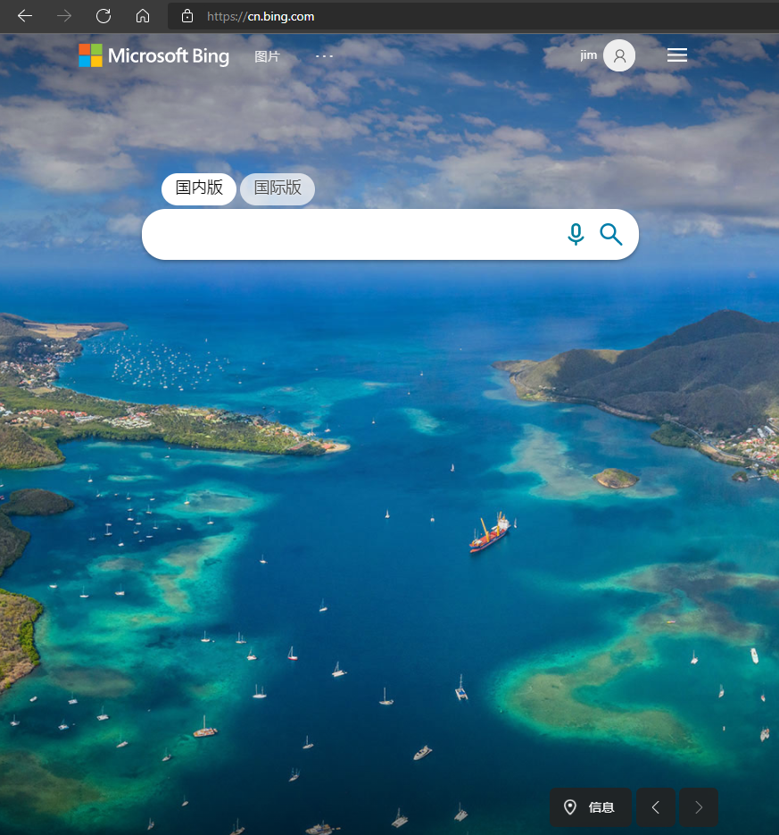
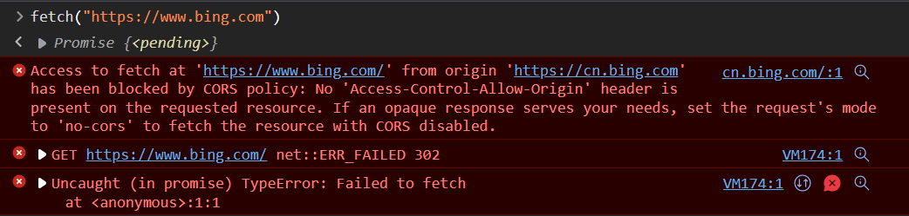

浏览器安全的基石是"同源政策"（[same-origin policy](https://en.wikipedia.org/wiki/Same-origin_policy)）。

本文介绍"同源政策"的各个方面

<!--more-->

1995年，同源政策由 Netscape 公司引入浏览器。目前，所有浏览器都实行这个政策。

最初，它的含义是指，A网页设置的 Cookie，B网页不能打开，除非这两个网页"同源"。所谓"同源"指的是"三个相同"。

> - 协议相同
> - 域名相同
> - 端口相同

如果两个 URL 的 `protocol port 和 host `都相同的话，则这两个 URL 是*同源*。这个方案也被称为“协议/主机/端口元组”，或者直接是 “元组”。（“元组” 是指一组项目构成的整体，双重/三重/四重/五重/等的通用形式）。

举例来说，`http://www.example.com/dir/page.html`这个网址，协议是`http://`，域名是`www.example.com`，端口是`80`（默认端口可以省略）。它的同源情况如下。

> - `http://www.example.com/dir2/other.html`：同源
> - `http://example.com/dir/other.html`：不同源（域名不同）
> - `http://v2.www.example.com/dir/other.html`：不同源（域名不同）
> - `http://www.example.com:81/dir/other.html`：不同源（端口不同）

比如我们打开bing主页

目前我所在的域就是`https://cn.bing.com)`,如果要向`https://www.bing.com`发请求，那么他们就不是同源，就会被拒绝。

### 为什么会出现同源政策？

同源政策的目的，是为了保证用户信息的安全，防止恶意的网站窃取数据。

设想这样一种情况：A网站是一家银行，用户登录以后，又去浏览其他网站。如果其他网站可以读取A网站的 Cookie，会发生什么？

很显然，如果 Cookie 包含隐私（比如存款总额），这些信息就会泄漏。更可怕的是，Cookie 往往用来保存用户的登录状态，如果用户没有退出登录，其他网站就可以冒充用户，为所欲为。因为浏览器同时还规定，提交表单不受同源政策的限制。

由此可见，"同源政策"是必需的，否则 Cookie 可以共享，互联网就毫无安全可言了。

### 同源政策限制什么？

随着互联网的发展，"同源政策"越来越严格。目前，如果非同源，共有三种行为受到限制。

> （1） Cookie、LocalStorage 和 IndexDB 无法读取。
>
> （2） DOM 无法获得。
>
> （3） AJAX 请求不能发送。

虽然这些限制是必要的，但是有时很不方便，合理的用途也受到影响。

