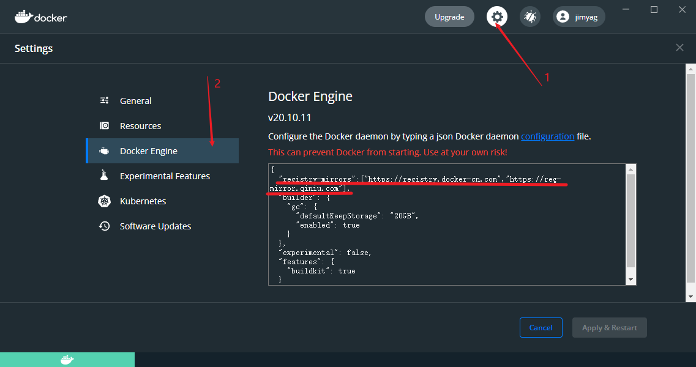
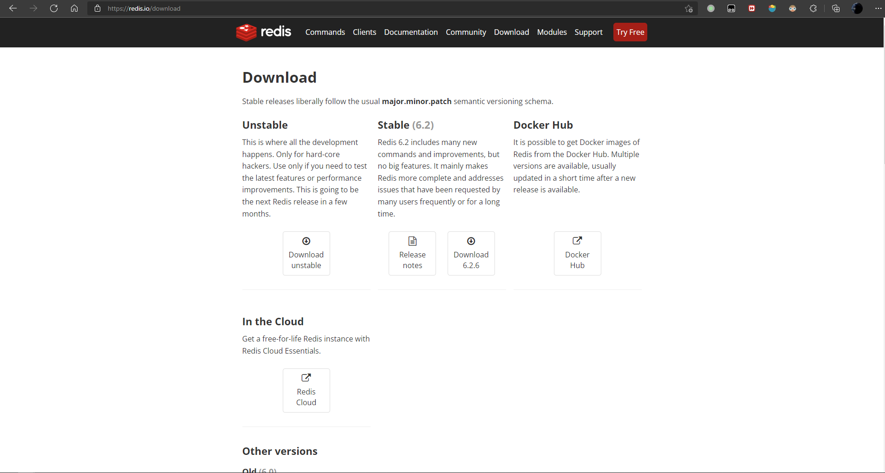
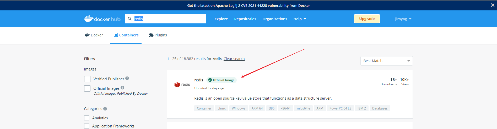
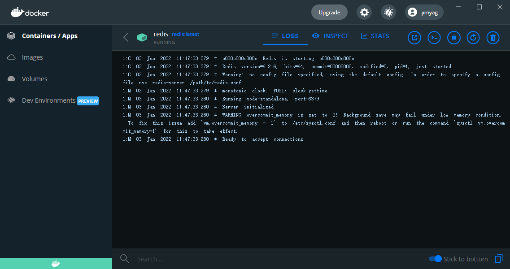
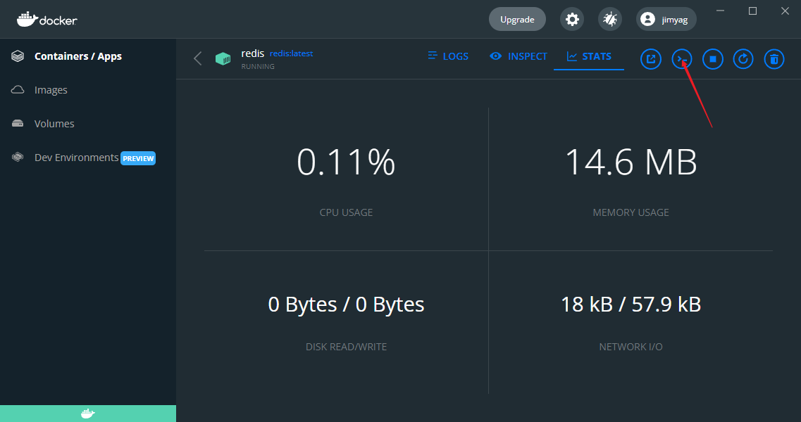
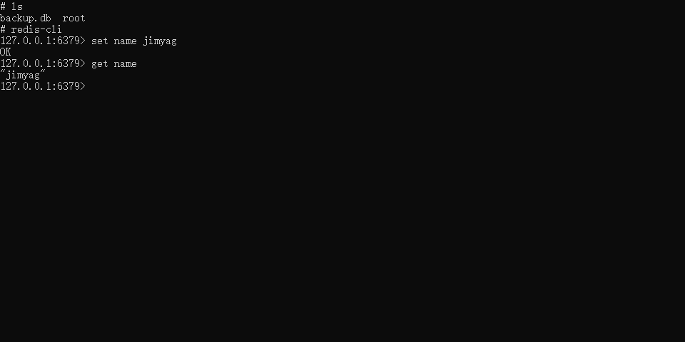

Docker 是一个应用打包、分发、部署的工具
你也可以把它理解为一个轻量的虚拟机，它只虚拟你软件需要的运行环境，多余的一点都不要，
而普通虚拟机则是一个完整而庞大的系统，包含各种不管你要不要的软件。

<!--more-->

## Docker的简介

### 与虚拟机对比

| 特性   | 普通虚拟机                                                   | Docker                                               |
| ------ | ------------------------------------------------------------ | ---------------------------------------------------- |
| 跨平台 | 通常只能在桌面级系统运行，例如 Windows/Mac，无法在不带图形界面的服务器上运行 | 支持的系统非常多，各类 windows 和 Linux 都支持       |
| 性能   | 性能损耗大，内存占用高，因为是把整个完整系统都虚拟出来了     | 性能好，只虚拟软件所需运行环境，最大化减少没用的配置 |
| 自动化 | 需要手动安装所有东西                                         | 一个命令就可以自动部署好所需环境                     |
| 稳定性 | 稳定性不高，不同系统差异大                                   | 稳定性好，不同系统都一样部署方式                     |

### 打包、分发、部署

1. **打包**：就是把你软件运行所需的依赖、第三方库、软件打包到一起，变成一个安装包
2. **分发**：你可以把你打包好的“安装包”上传到一个镜像仓库，其他人可以非常方便的获取和安装
3. **部署**：拿着“安装包”就可以一个命令运行起来你的应用，自动模拟出一摸一样的运行环境，不管是在 Windows/Mac/Linux。

### Docker 部署的优势

常规应用开发部署方式：自己在 Windows 上开发、测试 --> 到 Linux 服务器配置运行环境部署。

> 问题：我机器上跑都没问题，怎么到服务器就各种问题了

用 Docker 开发部署流程：自己在 Windows 上开发、测试 --> 打包为 Docker 镜像（可以理解为软件安装包） --> 各种服务器上只需要一个命令部署好

> 优点：确保了不同机器上跑都是一致的运行环境，不会出现我机器上跑正常，你机器跑就有问题的情况。

### Docker 通常用来做什么

1. 应用分发、部署，方便传播给他人安装。特别是开源软件和提供私有部署的应用
2. 快速安装测试/学习软件，用完就丢（类似小程序），不把时间浪费在安装软件上。例如 Redis / MongoDB / ElasticSearch / ELK
3. 多个版本软件共存，不污染系统，例如 Python2、Python3，Redis4.0，Redis5.0
4. Windows 上体验/学习各种 Linux 系统

### 镜像、容器

**镜像**：可以理解为软件安装包，可以方便的进行传播和安装。
**容器**：软件安装后的状态，每个软件运行环境都是独立的、隔离的，称之为容器。

### 安装

桌面版：https://www.docker.com/products/docker-desktop
服务器版：https://docs.docker.com/engine/install/#server

根据自己系统选择对应的官网教程进行安装即可。

### Windows设置镜像加速源

| 镜像加速器          | 镜像加速器地址                          |
| ------------------- | --------------------------------------- |
| Docker 中国官方镜像 | https://registry.docker-cn.com          |
| DaoCloud 镜像站     | http://f1361db2.m.daocloud.io           |
| Azure 中国镜像      | https://dockerhub.azk8s.cn              |
| 科大镜像站          | https://docker.mirrors.ustc.edu.cn      |
| 阿里云              | https://<your_code>.mirror.aliyuncs.com |
| 七牛云              | https://reg-mirror.qiniu.com            |
| 网易云              | https://hub-mirror.c.163.com            |
| 腾讯云              | https://mirror.ccs.tencentyun.com       |



添加如下内容

```json
"registry-mirrors":["https://registry.docker-cn.com","https://reg-mirror.qiniu.com"],
```

点击重启即可。

## Docker 快速安装软件

### 直接安装的缺点

1. 安装麻烦，可能有各种依赖，运行报错。例如：WordPress，ElasticSearch，Redis，ELK
2. 可能对 Windows 并不友好，运行有各种兼容问题，软件只支持 Linux 上跑
3. 不方便安装多版本软件，不能共存。
4. 电脑安装了一堆软件，拖慢电脑速度。
5. 不同系统和硬件，安装方式不一样

### Docker 安装的优点

1. 一个命令就可以安装好，快速方便
2. 有大量的镜像，可直接使用
3. 没有系统兼容问题，Linux 专享软件也照样跑
4. 支持软件多版本共存
5. 用完就丢，不拖慢电脑速度
6. 不同系统和硬件，只要安装好 Docker 其他都一样了，一个命令搞定所有

### 演示 Docker 安装 Redis

Redis 官网：https://redis.io/

> 官网下载安装教程只有源码安装方式，没有 Windows 版本。想要自己安装 windows 版本需要去找别人编译好的安装包。

在Redis官网我们没有找到Windows的安装方式，那么我们想要在在Windows下安装只能自己编译，配置起来很麻烦。



所以，我们选择用Docker进行安装。

#### 在Docker官方镜像仓库找到Redis

https://hub.docker.com/



#### 一条命令运行Redis

在终端执行以下命令

```bash
docker run -d -p 6379:6379 --name redis redis:latest
```

Docker命令参数可以查看官网文档[docker run | Docker Documentation](https://docs.docker.com/engine/reference/commandline/run/)

终端中显示如下信息表示成功安装

```bash
C:\Users\jimyag>docker run -d -p 6379:6379 --name redis redis:latest
Unable to find image 'redis:latest' locally
latest: Pulling from library/redis
a2abf6c4d29d: Pull complete
c7a4e4382001: Pull complete
4044b9ba67c9: Pull complete
c8388a79482f: Pull complete
413c8bb60be2: Pull complete
1abfd3011519: Pull complete
Digest: sha256:db485f2e245b5b3329fdc7eff4eb00f913e09d8feb9ca720788059fdc2ed8339
Status: Downloaded newer image for redis:latest
3b5a6af571d0d5117c4c339925e5fc30ce513ee17a06eb9475a2d372888380f2
```

其中里面的hash值不同。

我们可以在桌面版Docker中看到redis的运行情况



我们也可以进行Redis的终端进行测试





## 参考

[Docker 1小时快速上手教程，无废话纯干货_哔哩哔哩_bilibili](https://www.bilibili.com/video/BV11L411g7U1)
