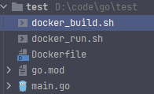
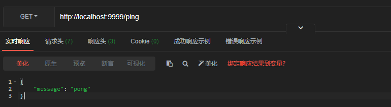

记录自己用dockers部署Go项目

<!--more-->

### Go

项目文件结构如下



首先实现一个测试demo `main.go`

```go
package main

import (
	"fmt"
	"github.com/gin-gonic/gin"
	"net/http"
)

func main() {
	fmt.Println("service start")
	router := gin.Default()
	router.GET("/ping", func(context *gin.Context) {
		context.JSON(http.StatusOK, gin.H{"message": "pong"})
		fmt.Println("service healthy")
	})
	router.Run(":9999")
}
```

### Dockerfile

编写Dockerfile文件`Dockerfile`

```dockerfile
FROM golang:1.17-alpine

WORKDIR /app
ADD * /app

ENV GO111MODULE=on \
        CGO_ENABLED=0 \
        GOOS=linux \
        GOARCH=amd64 \
    	GOPROXY="https://goproxy.io,direct"
RUN go mod download

RUN go build -o test_go .

EXPOSE 9999

CMD ./test_go
```

### 编写启动构建和启动脚本

#### 构建脚本`docker_build.sh`

```sh
docker build -t my_test .
```

#### 运行脚本 `docker_run.sh`

```sh
docker run -p 9999:9999 --name gin_test my_test
```

#### 执行构建脚本

```sh
docker_build.sh
```

#### 执行运行脚本

```sh
docker_run.sh
```

#### 测试

在ApiPost进行测试


