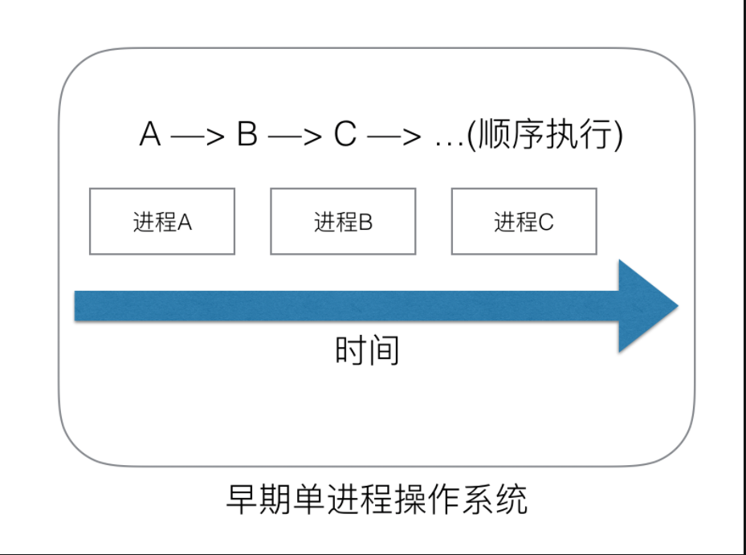
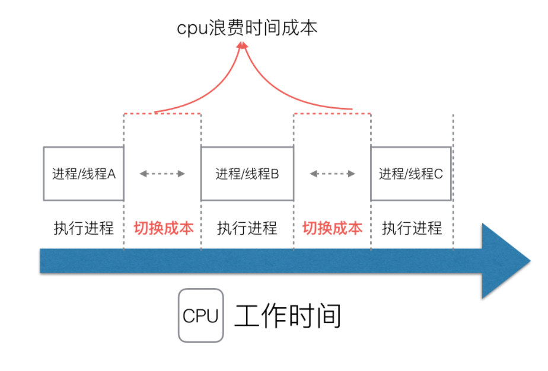
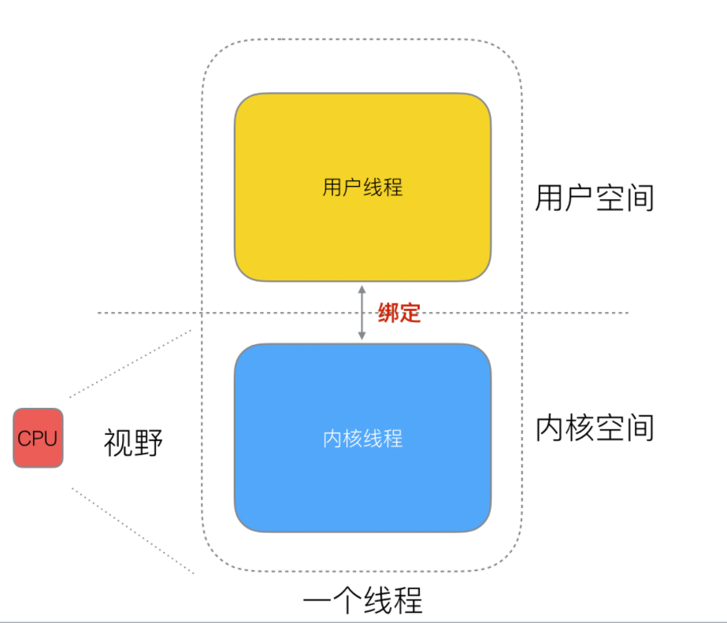
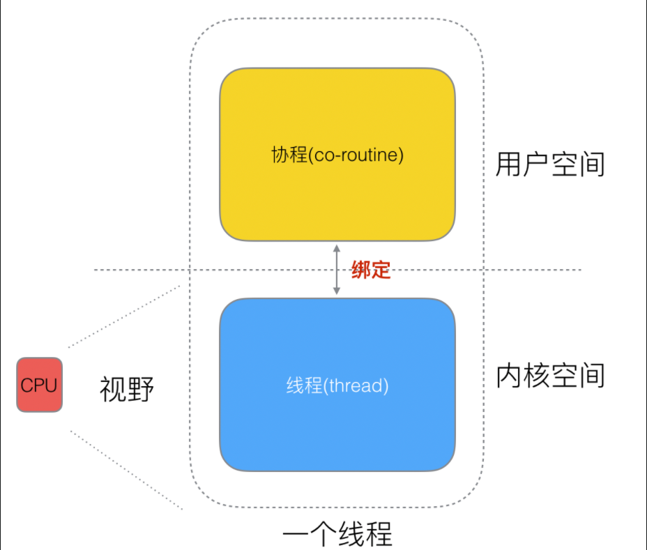
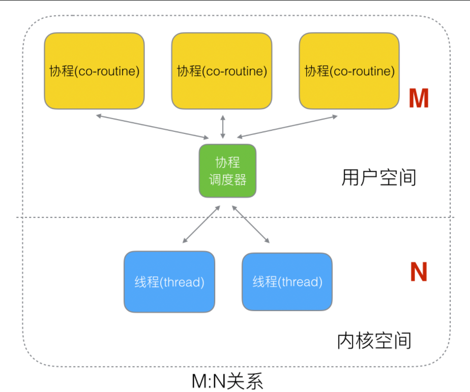
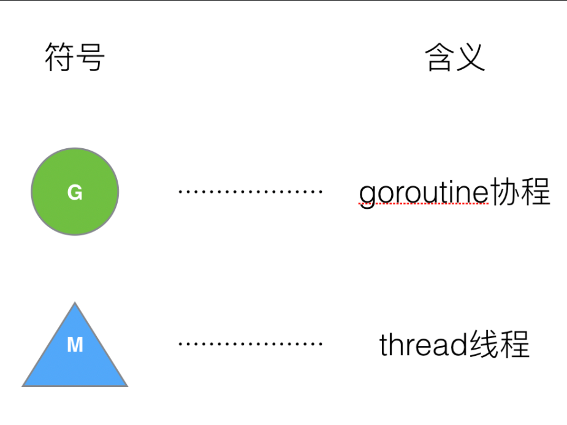
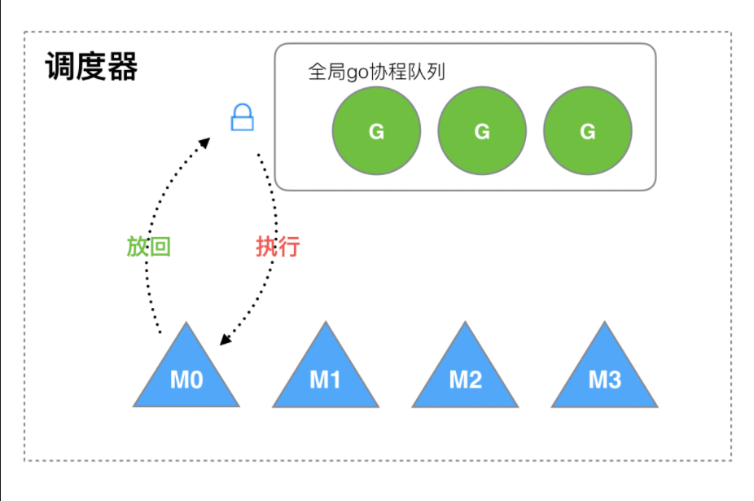

Golang调度器的由来

<!--more-->

## 单进程时代

我们知道，一切的软件都是跑在操作系统上，真正用来干活(计算)的是CPU。早期的操作系统每个程序就是一个进程，知道一个程序运行完，才能进行下一个进程，就是“单进程时代”

一切的程序只能串行发生。

早期的单进程操作系统，面临2个问题：

1.单一的执行流程，计算机只能一个任务一个任务处理。

2.进程阻塞所带来的CPU时间浪费。

那么能不能有多个进程来宏观一起来执行多个任务呢？

后来操作系统就具有了**最早的并发能力：多进程并发**，当一个进程阻塞的时候，切换到另外等待执行的进程，这样就能尽量把CPU利用起来，CPU就不浪费了。

## 多进程/多线程

在多进程/多线程的操作系统中，就解决了阻塞的问题，因为一个进程阻塞cpu可以立刻切换到其他进程中去执行，而且调度cpu的算法可以保证在运行的进程都可以被分配到cpu的运行时间片。这样从宏观来看，似乎多个进程是在同时被运行。

多进程/多线程解决了阻塞的问题，如果一个进程被阻塞时，时间片到了之后就能切换到另一个进程执行。

但新的问题就又出现了，进程拥有太多的资源，进程的**创建、切换、销毁**，都会占用很长的时间，CPU虽然利用起来了，但如果进程过多，CPU有很大的一部分都被用来进行进程调度了。

> 切换主要是把CPU寄存器里当前进程的数据保存到内存中，然后从内存中把另一个进程的数据加载到CPU中

如果进程/线程的数量越多，切换成本越大，也就越浪费。

看起来CPU100%运行，实际上只有60%执行程序，剩余的在切换

**怎么才能提高CPU的利用率呢？**

但是对于Linux操作系统来讲，cpu对进程的态度和线程的态度是一样的。

很明显，CPU调度切换的是进程和线程。尽管线程看起来很美好，但实际上多线程开发设计会变得更加复杂，要考虑很多同步竞争等问题，如锁、竞争冲突等。

## 协程来提高CPU利用率

多进程、多线程已经提高了系统的并发能力，但是在当今互联网高并发场景下，为每个任务都创建一个线程是不现实的，因为会消耗大量的内存(进程**虚拟内存**会占用4GB[32位操作系统], 而线程也要大约4MB)。

大量的进程/线程出现了新的问题

- 高内存占用
- 调度的高消耗CPU

好了，然后工程师们就发现，其实一个线程分为“内核态“线程和”用户态“线程。

一个“用户态线程”必须要绑定一个“内核态线程”，但是**CPU并不知道有“用户态线程”的存在**，它只知道它运行的是一个“内核态线程”(Linux的PCB进程控制块)。

 这样，我们再去细化去分类一下，内核线程依然叫“线程(thread)”，用户线程叫“协程(co-routine)".

看到这里，我们就要开脑洞了，既然一个协程(co-routine)可以绑定一个线程(thread)，那么能不能多个协程(co-routine)绑定一个或者多个线程(thread)上呢。

 之后，我们就看到了有3中协程和线程的映射关系：

#### N:1关系

N个协程绑定1个线程，优点就是**协程在用户态线程即完成切换，不会陷入到内核态，这种切换非常的轻量快速**。但也有很大的缺点，1个进程的所有协程都绑定在1个线程上

缺点：

- 某个程序用不了硬件的多核加速能力
- 一旦某协程阻塞，造成线程阻塞，本进程的其他协程都无法执行了，根本就没有并发的能力了。

#### 1:1 关系

1个协程绑定1个线程，这种最容易实现。协程的调度都由CPU完成了，不存在N:1缺点，

缺点：

- 协程的创建、删除和切换的代价都由CPU完成，有点略显昂贵了。

#### M:N关系

M个协程绑定1个线程，是N:1和1:1类型的结合，克服了以上2种模型的缺点，但实现起来最为复杂。

协程跟线程是有区别的，线程由CPU调度是抢占式的，**协程由用户态调度是协作式的**，一个协程让出CPU后，才执行下一个协程。

调度器主要是协调线程消费协程，还有一些阻塞的协程的切换

在M:N模型中所有的瓶颈都来自于`协程调度器`,如果协程调度器越好，则CPU利用率越来越高。

## Go的协程goroutine

**Go为了提供更容易使用的并发方法，使用了goroutine和channel**。goroutine来自协程的概念，让一组可复用的函数运行在一组线程之上，即使有协程阻塞，该线程的其他协程也可以被`runtime`调度，转移到其他可运行的线程上。最关键的是，程序员看不到这些底层的细节，这就降低了编程的难度，提供了更容易的并发。

Go中，协程被称为goroutine，它非常轻量，一个goroutine只占几KB，并且这几KB就足够goroutine运行完，这就能在有限的内存空间内支持大量goroutine，支持了更多的并发。虽然一个goroutine的栈只占几KB，但实际是可伸缩的，如果需要更多内容，`runtime`会自动为goroutine分配。

Goroutine特点：

- 占用内存更小（几kb）
- 调度更灵活(runtime调度)

## 被废弃的goroutine调度器

 好了，既然我们知道了协程和线程的关系，那么最关键的一点就是调度协程的调度器的实现了。

Go目前使用的调度器是2012年重新设计的，因为之前的调度器性能存在问题，所以使用4年就被废弃了，那么我们先来分析一下被废弃的调度器是如何运作的？

> 大部分文章都是会用G来表示Goroutine，用M来表示线程，那么我们也会用这种表达的对应关系。

 下面我们来看看被废弃的golang调度器是如何实现的？

M想要执行、放回G都必须访问全局G队列，并且M有多个，即多线程访问同一资源需要加锁进行保证互斥/同步，所以全局G队列是有互斥锁进行保护的。

老调度器有几个缺点：

1. 创建、销毁、调度G都需要每个M获取锁，这就形成了**激烈的锁竞争**。
2. M转移G会造成**延迟和额外的系统负载**。比如当G中包含创建新协程的时候，M创建了G’，为了继续执行G，需要把G’交给M’执行，也造成了**很差的局部性**，因为G’和G是相关的，最好放在M上执行，而不是其他M'。
3. 系统调用(CPU在M之间的切换)导致频繁的线程阻塞和取消阻塞操作增加了系统开销。

## 参考

[Golang深入理解GPM模型_哔哩哔哩_bilibili](https://www.bilibili.com/video/BV19r4y1w7Nx?spm_id_from=333.999.0.0)
