Goroutine调度器的GMP模型的设计思想

<!--more-->

## GMP模型

面对之前调度器的问题，Go设计了新的调度器。

在新调度器中，出列M(thread)和G(goroutine)，又引进了P(Processor)。

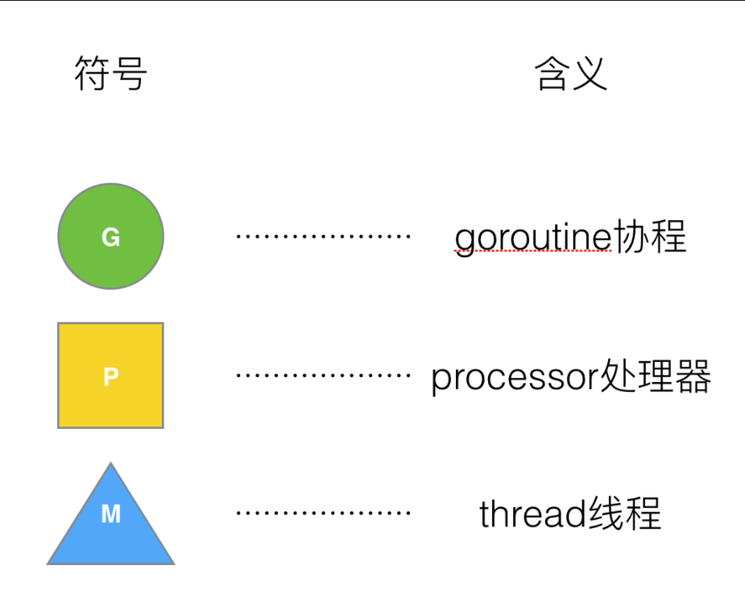

P:processor，处理goroutine协程**它包含了运行goroutine的资源**，如果线程想运行goroutine，必须先获取P，P中还包含了可运行的G队列。

M:go语言层面实现的用户级线程，他们对应着底层OS内核级线程

在Go中，**线程是运行goroutine的实体，调度器的功能是把可运行的goroutine分配到工作线程上**。

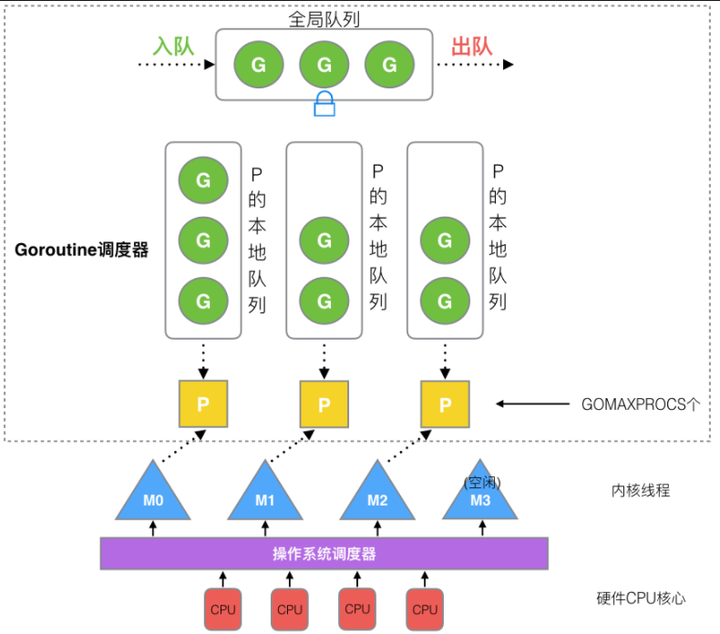

1. **全局队列**（Global Queue）：存放等待运行的G。
2. **P的本地队列**：同全局队列类似，存放的也是等待运行的G，存的数量有限，不超过256个。新建G'时，G'优先加入到P的本地队列，如果队列满了，则会把本地队列中一半的G移动到全局队列。
3. **P列表**：所有的P都在程序启动时创建，并保存在数组中，最多有`GOMAXPROCS`(可配置)个。
4. **M**：当前操作系统分配到当前Go程序的内核线程数。线程想运行任务就得获取P，从P的本地队列获取G，P队列为空时，M也会尝试从**全局**队列**拿**一批G放到P的本地队列，或从**其他P**的本地队列**偷**一半放到自己P的本地队列。M运行G，G执行之后，M会从P获取下一个G，不断重复下去。

**Goroutine调度器和OS调度器是通过M结合起来的，每个M都代表了1个内核线程，OS调度器负责把内核线程分配到CPU的核上执行**。

### 有关P和M的个数问题

1. P的数量：
   - 由启动时环境变量`$GOMAXPROCS`或者是由`runtime`的方法`GOMAXPROCS()`决定。这意味着在程序执行的任意时刻都只有`$GOMAXPROCS`个goroutine在同时运行。
2. M的数量:
   - go语言本身的限制：go程序启动时，会设置M的最大数量，默认10000.但是内核很难支持这么多的线程数，所以这个限制可以忽略。
   - runtime/debug中的SetMaxThreads函数，设置M的最大数量
   - 一个M阻塞了，会创建新的M。
   - 如果有M空闲，那么就会回收或者睡眠

M与P的数量没有绝对关系，一个M阻塞，P就会去创建或者切换另一个M，所以，即使P的默认数量是1，也有可能会创建很多个M出来。

### P和M何时会被创建

1、P何时创建：在确定了P的最大数量n后，运行时系统会根据这个数量创建n个P。

2、M何时创建：没有足够的M来关联P并运行其中的可运行的G。比如所有的M此时都阻塞住了，而P中还有很多就绪任务，就会去寻找空闲的M，而没有空闲的，就会去创建新的M。

## 调度器设计策略

### 复用线程

避免频繁的创建、销毁线程，而是对线程的复用。

1）work stealing机制

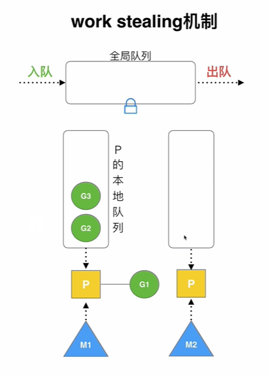

 当本线程无可运行的G时，尝试从其他线程绑定的P偷取G，而不是销毁线程。

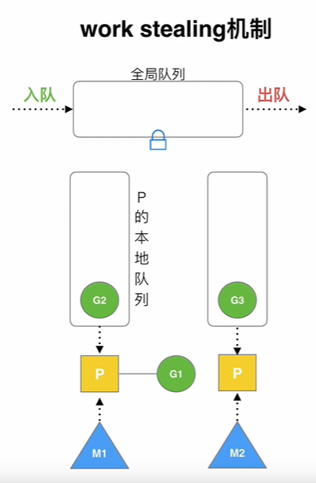

2）hand off机制

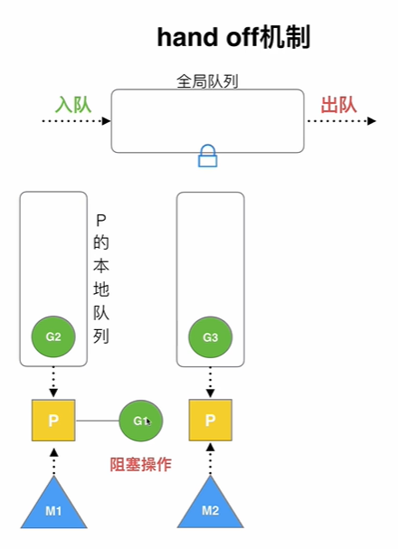

 当本线程因为G进行系统调用阻塞时，线程释放绑定的P，把P转移给其他空闲的线程执行。

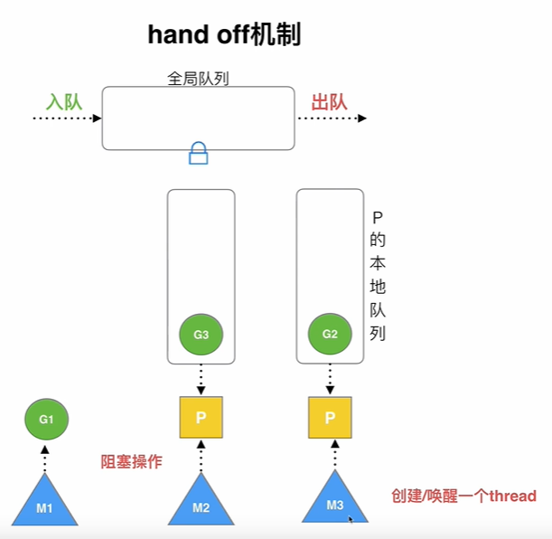

如果G1还想继续执行，则G1还会加入到其他队列，如果G1不执行则M1可能会睡眠或者销毁。

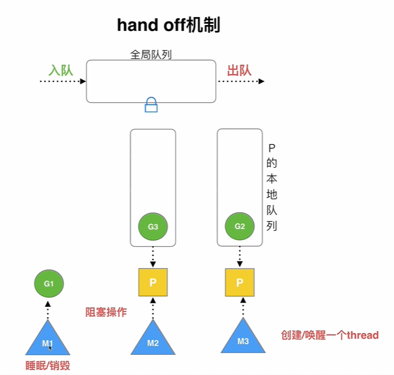

### **利用并行**：

`GOMAXPROCS`设置P的数量，最多有`GOMAXPROCS`个线程分布在多个CPU上同时运行。`GOMAXPROCS`也限制了并发的程度，比如`GOMAXPROCS = 核数/2`，则最多利用了一半的CPU核进行并行。

设置`GOMAXPROCS`的数量小于等于CPU核数，是为了避免进行切换进程，不会创建过多线程。P的和核数没有关系。

### 抢占


在coroutine中要等待一个协程主动让出CPU才执行下一个协程，


在Go中，一个goroutine最多占用CPU 10ms，


防止其他goroutine被饿死，这就是goroutine不同于coroutine的一个地方。


### 全局G队列

在新的调度器中依然有全局G队列，但功能已经被弱化了，

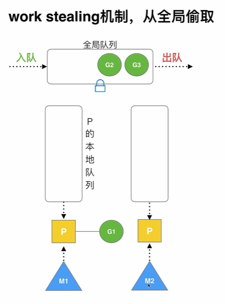

当M执行work stealing从其他P偷不到G时，它可以从全局G队列获取G。

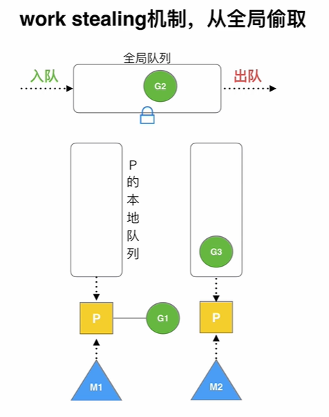

## go func() 调度流程

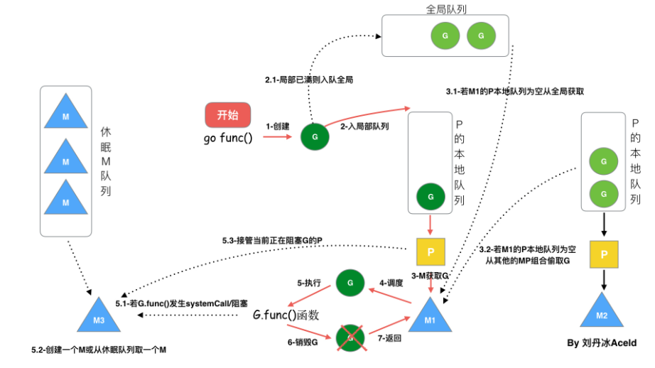

从上图我们可以分析出几个结论：

1.  我们通过 go func()来创建一个goroutine；

2. 有两个存储G的队列，一个是局部调度器P的本地队列、一个是全局G队列。新创建的G会先保存在P的本地队列中，如果P的本地队列已经满了就会保存在全局的队列中；

3. G只能运行在M中，一个M必须持有一个P，M与P是1：1的关系。M会从P的本地队列弹出一个可执行状态的G来执行，如果P的本地队列为空，就会想其他的MP组合偷取一个可执行的G来执行；

4. 一个M调度G执行的过程是一个循环机制；

   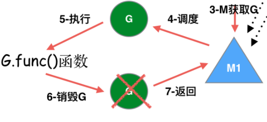

5. 当M执行某一个G时候如果发生了syscall或则其余阻塞操作，M会阻塞，如果当前有一些G在执行，runtime(调度器)会把这个线程M从P中摘除分离(detach)，然后再创建一个新的操作系统的线程(如果有空闲的线程可用就复用空闲线程)来服务于这个P；

6. 当M系统调用结束时候，这个G会尝试获取一个空闲的P执行，并放入到这个P的本地队列。如果获取不到P，那么这个线程M变成休眠状态， 加入到空闲线程中，然后这个G会被放入全局队列中。

## 调度器的⽣命周期

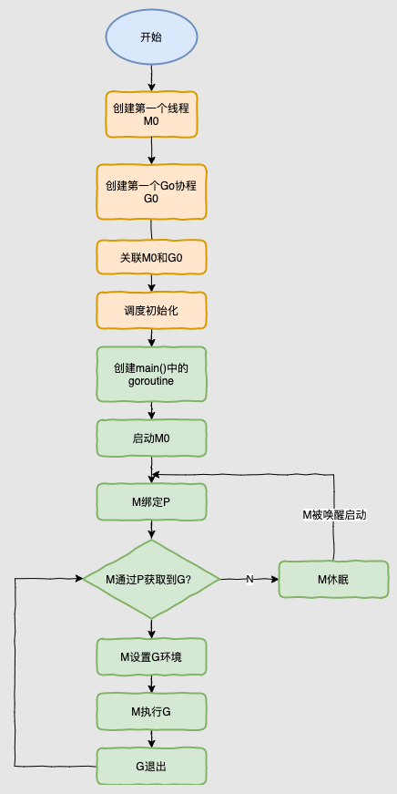

### 特殊的M0和G0

##### M0

`M0`是启动程序后的编号为0的主线程，这个M对应的实例会在全局变量runtime.m0中，不需要在heap上分配，M0负责执行初始化操作和启动第一个G， 在之后M0就和其他的M一样了。

##### G0

`G0`是每次启动一个M都会第一个创建的goroutine，G0仅用于负责调度的G，G0不指向任何可执行的函数, 每个M都会有一个自己的G0。在调度或系统调用时会使用G0的栈空间, 全局变量的G0是M0的G0。

我们来跟踪一段代码

```go
package main

import "fmt"

func main() {
    fmt.Println("Hello world")
}
```

接下来我们来针对上面的代码对调度器里面的结构做一个分析。

也会经历如上图所示的过程：

1. runtime创建最初的线程m0和goroutine g0，并把2者关联。
2. 调度器初始化：初始化m0、栈、垃圾回收，以及创建和初始化由GOMAXPROCS个P构成的P列表。
3. 示例代码中的main函数是`main.main`，`runtime`中也有1个main函数——`runtime.main`，代码经过编译后，`runtime.main`会调用`main.main`，程序启动时会为`runtime.main`创建goroutine，称它为main goroutine吧，然后把main goroutine加入到P的本地队列。
4. 启动m0，m0已经绑定了P，会从P的本地队列获取G，获取到main goroutine。
5. G拥有栈，M根据G中的栈信息和调度信息设置运行环境
6. M运行G
7. G退出，再次回到M获取可运行的G，这样重复下去，直到`main.main`退出，`runtime.main`执行Defer和Panic处理，或调用`runtime.exit`退出程序。

调度器的生命周期几乎占满了一个Go程序的一生，`runtime.main`的goroutine执行之前都是为调度器做准备工作，`runtime.main`的goroutine运行，才是调度器的真正开始，直到`runtime.main`结束而结束。


## 可视化GMP编程

有2种方式可以查看一个程序的GMP的数据。

### go tool trace

trace记录了运行时的信息，能提供可视化的Web页面。

简单测试代码：main函数创建trace，trace会运行在单独的goroutine中，然后main打印"Hello World"退出。

`main.go`

```go
package main

import (
    "os"
    "fmt"
    "runtime/trace"
)

func main() {

    //创建trace文件
    f, err := os.Create("trace.out")
    if err != nil {
        panic(err)
    }

    defer f.Close()

    //启动trace goroutine
    err = trace.Start(f)
    if err != nil {
        panic(err)
    }
    defer trace.Stop()

    //main
    fmt.Println("Hello World")
}
```

运行程序

```bash
$ go run main.go 
Hello World
```

会得到一个`trace.out`文件，然后我们可以用一个工具打开，来分析这个文件。

```bash
D:\Computer\Desktop\gmp>go tool trace trace.out
2022/01/17 14:32:14 Parsing trace...
2022/01/17 14:32:14 Splitting trace...
2022/01/17 14:32:14 Opening browser. Trace viewer is listening on http://127.0.0.1:50359
```

我们可以通过浏览器打开`http://127.0.0.1:50359`网址，点击`view trace` 能够看见可视化的调度流程。

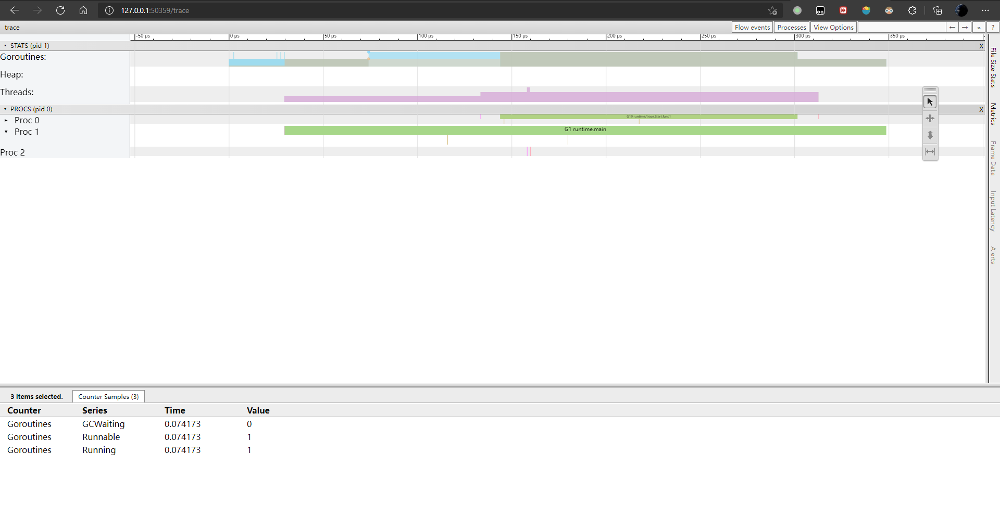

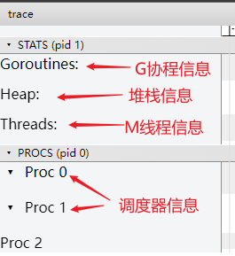

**G信息**

点击Goroutines那一行可视化的数据条，我们会看到一些详细的信息。

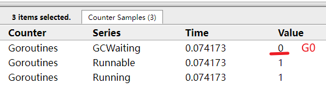

 一共有两个G在程序中，一个是特殊的G0，是每个M必须有的一个初始化的G，这个我们不必讨论。

其中G1应该就是main goroutine(执行main函数的协程)，在一段时间内处于可运行和运行的状态。

**M信息**

点击Threads那一行可视化的数据条，我们会看到一些详细的信息。

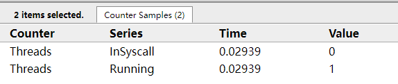

一共有两个M在程序中，一个是特殊的M0，用于初始化使用，这个我们不必讨论。

**P信息**

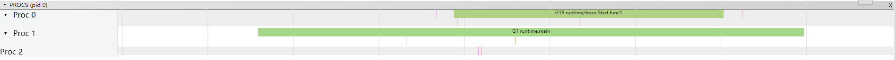

G1中调用了`main.main`，创建了`trace goroutine g19`。G1运行在P1上，G19运行在P0上。

这里有两个P，我们知道，一个P必须绑定一个M才能调度G。

我们在来看看上面的M信息。

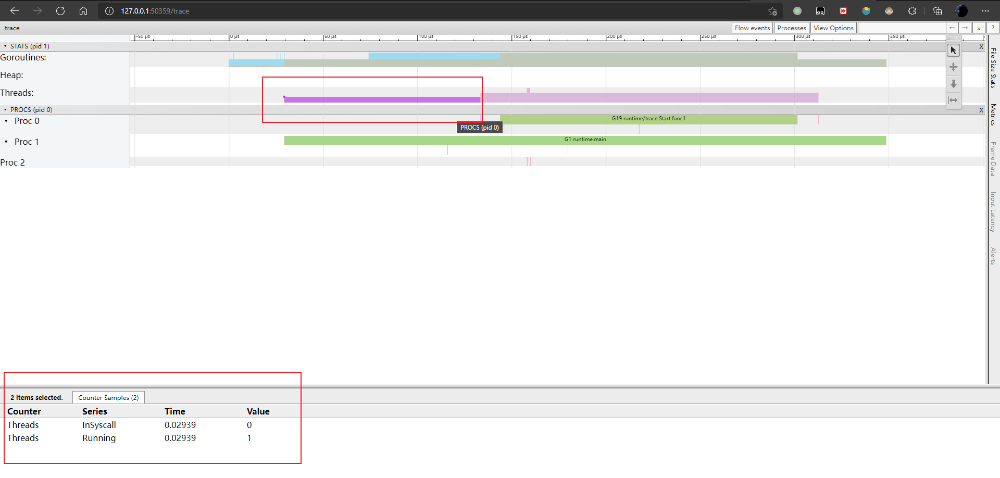

为了调度`G19`,P0又创建了一个M1来执行，我们会发现，确实G19在P0上被运行的时候，确实在Threads行多了一个M的数据，点击查看如下：

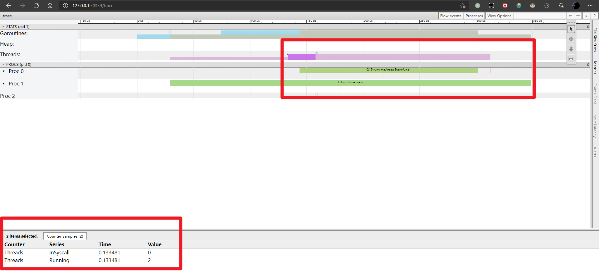

多了一个M2应该就是P0为了执行G19而动态创建的M2.

### Debug trace

`trace.go`

```go
package main

import (
    "fmt"
    "time"
)

func main() {
    for i := 0; i < 5; i++ {
        time.Sleep(time.Second)
        fmt.Println("Hello World")
    }
}
```

编译

```bash
go build trace.go
```

通过Debug方式运行

```bash
root@Jimyag:/mnt/d/Computer/Desktop/gmp# GODEBUG=schedtrace=1000 ./trace
SCHED 0ms: gomaxprocs=12 idleprocs=11 threads=2 spinningthreads=0 idlethreads=0 runqueue=0 [0 0 0 0 0 0 0 0 0 0 0 0]
Hello World
SCHED 1010ms: gomaxprocs=12 idleprocs=12 threads=5 spinningthreads=0 idlethreads=3 runqueue=0 [0 0 0 0 0 0 0 0 0 0 0 0]
Hello World
SCHED 2015ms: gomaxprocs=12 idleprocs=12 threads=5 spinningthreads=0 idlethreads=3 runqueue=0 [0 0 0 0 0 0 0 0 0 0 0 0]
Hello World
SCHED 3022ms: gomaxprocs=12 idleprocs=12 threads=5 spinningthreads=0 idlethreads=3 runqueue=0 [0 0 0 0 0 0 0 0 0 0 0 0]
Hello World
SCHED 4029ms: gomaxprocs=12 idleprocs=12 threads=5 spinningthreads=0 idlethreads=3 runqueue=0 [0 0 0 0 0 0 0 0 0 0 0 0]
Hello World
```

- `SCHED`：调试信息输出标志字符串，代表本行是goroutine调度器的输出；
- `0ms`：即从程序启动到输出这行日志的时间；
- `gomaxprocs`: P的数量，本例有12个P, 因为默认的P的属性是和cpu核心数量默认一致，当然也可以通过GOMAXPROCS来设置；
- `idleprocs`: 处于idle状态的P的数量；通过gomaxprocs和idleprocs的差值，我们就可知道执行go代码的P的数量；
- `threads: os threads/M`的数量，包含scheduler使用的m数量，加上runtime自用的类似sysmon这样的thread的数量。包括M0，包括GODEBUG调试的线程；
- `spinningthreads`: 处于自旋状态的os thread数量；
- `idlethread`: 处于idle（空闲）状态的os thread的数量；
- `runqueue=0`： Scheduler全局队列中G的数量；
- `[0 0 0 0 0 0 0 0 0 0 0 0]`: 分别为12个P的local queue中的G的数量。

## 参考

[Golang深入理解GPM模型_哔哩哔哩_bilibili](https://www.bilibili.com/video/BV19r4y1w7Nx?spm_id_from=333.999.0.0)

