 Go调度器调度11种场景过程全解析

<!--more-->

### 场景1

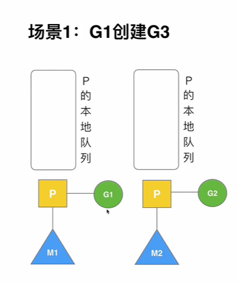

G1在运行中想要创建一个G （G3），GMP调度器会满足局部性，G1创建的G3最好位于同一个M中。

G1和G3可能会共享内存资源和会话是一致的。

G3优先加入到G1所在的本地队列。

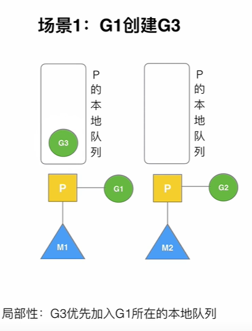

### 场景2

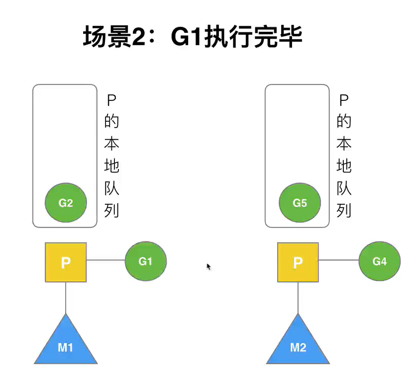

G1运行完成后(函数：`goexit`)，M上运行的goroutine切换为G0（每一个M都有一个G0），G0负责调度时协程的切换（函数：`schedule`）。

> 这里的G0是M在创建时有一个结构体的指针指向G0

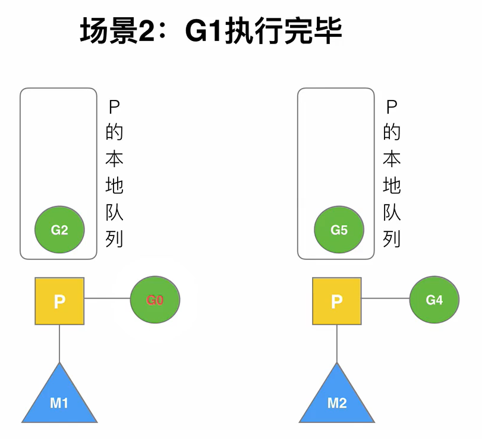

由于本地队列中还有G，所以从P的本地队列取G2，从G0切换到G2，并开始运行G2(函数：`execute`)。实现了线程M1的复用。

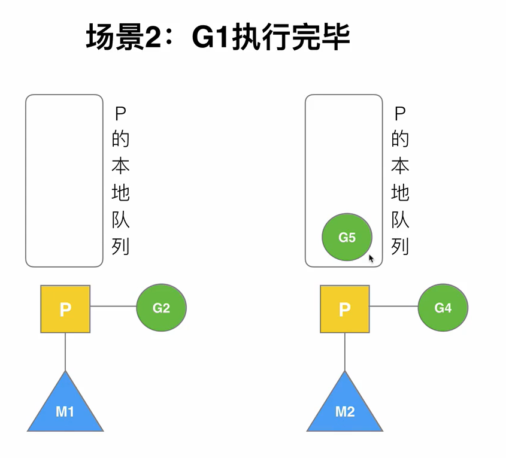

### 场景3

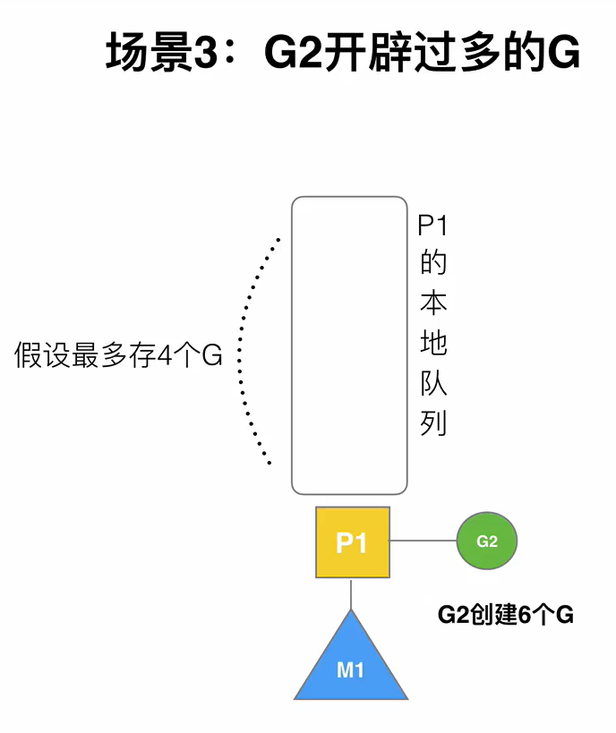

有这么一个场景，假设P1的本地队列最多只存4个G，现在G2创建了6个G，调度器该如何处理。

首先G2会创建4个G将P1的本地队列填满

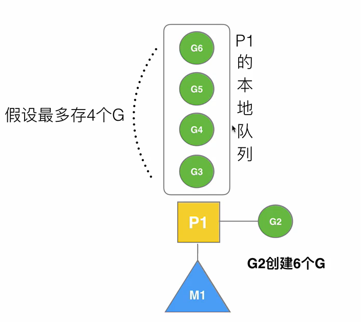

接下来请看场景4

### 场景4

G2在创建G7的时候，发现P1的本地队列已满，需要执行**负载均衡**(把P1中本地队列中前一半的G，还有新创建G**转移**到全局队列)，将G3G4打乱之后放在全局队列中，同时将新创建的G7也加入到全局队列中，这些G被转移到全局队列时，会被打乱顺序。所以G3,G4,G7被转移到全局队列。

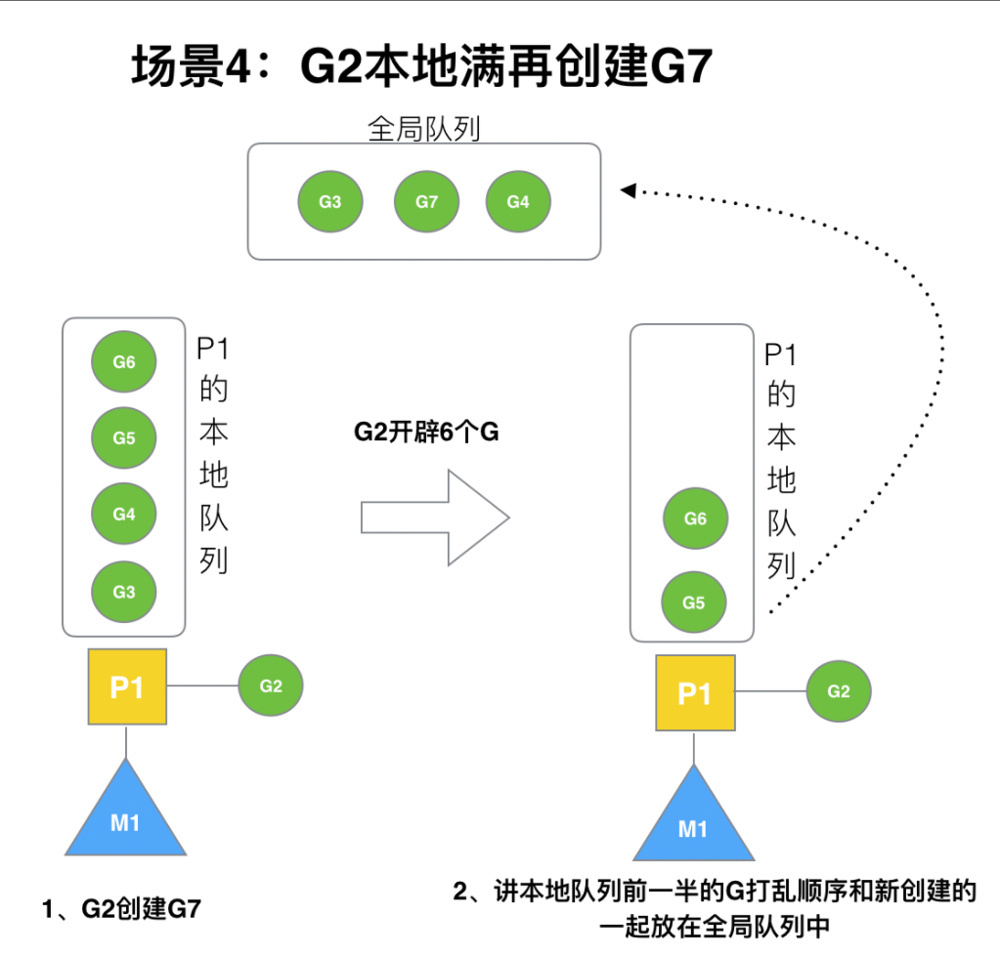

全局队列中的G大概率会被不同核运行，打乱顺序能降低不同核同时修改同一缓存行的概率

### 场景5

G2创建G8时，P1的本地队列未满，所以G8会被加入到P1的本地队列。

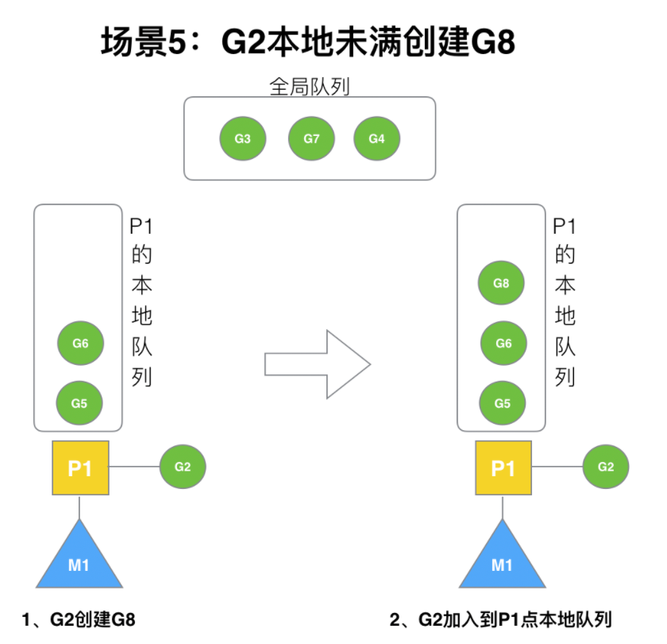

G8加入到P1点本地队列的原因还是因为P1此时在与M1绑定，而G2此时是M1在执行。所以G2创建的新的G会优先放置到自己的M绑定的P上。

### 场景6

规定：**在创建G时，运行的G会尝试唤醒其他空闲的P和M组合去执行**。

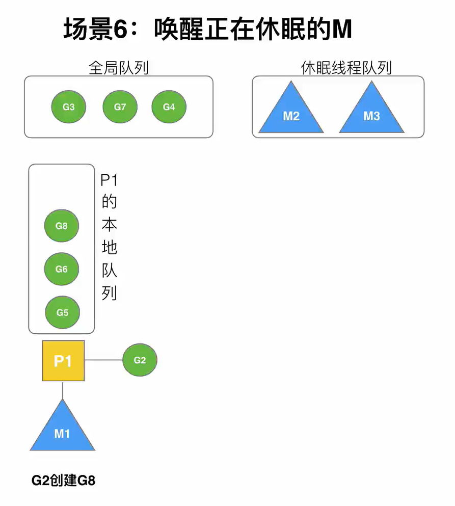

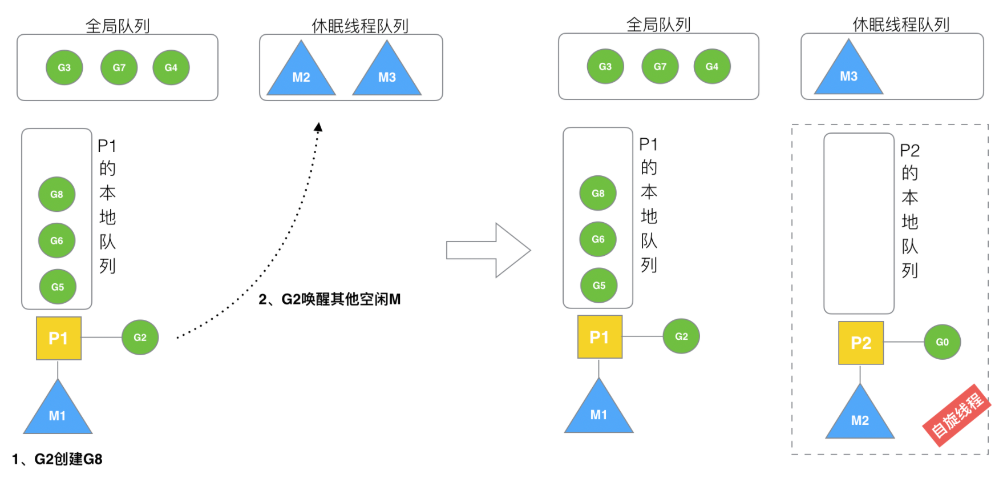

假定G2唤醒了M2，M2绑定了P2，并运行G0，但P2本地队列没有G，M2此时为自旋线程**（没有G但为运行状态的线程，不断寻找G）**。M2就会从先全局拿，如果全局队列中没有就去其他的本地队列去偷。

> 自旋线程：如果线程被销毁会消耗大量的硬件资源，与其让它销毁，不会让它寻找执行。 自旋线程优先从全局队列中拿G

### 场景7

M2尝试从全局队列(简称“GQ”)取一批G放到P2的本地队列（函数：`findrunnable()`）。M2从全局队列取的G数量符合下面的公式：

```go
n =  min(len(GQ) / GOMAXPROCS +  1,  cap(LQ) / 2 )
```

相关源码参考:

```go
// 从全局队列中偷取，调用时必须锁住调度器
func globrunqget(_p_ *p, max int32) *g {
	// 如果全局队列中没有 g 直接返回
	if sched.runqsize == 0 {
		return nil
	}

	// per-P 的部分，如果只有一个 P 的全部取
	n := sched.runqsize/gomaxprocs + 1
	if n > sched.runqsize {
		n = sched.runqsize
	}

	// 不能超过取的最大个数
	if max > 0 && n > max {
		n = max
	}

	// 计算能不能在本地队列中放下 n 个
	if n > int32(len(_p_.runq))/2 {
		n = int32(len(_p_.runq)) / 2
	}

	// 修改本地队列的剩余空间
	sched.runqsize -= n
	// 拿到全局队列队头 g
	gp := sched.runq.pop()
	// 计数
	n--

	// 继续取剩下的 n-1 个全局队列放入本地队列
	for ; n > 0; n-- {
		gp1 := sched.runq.pop()
		runqput(_p_, gp1, false)
	}
	return gp
}
```

至少从全局队列取1个g，但每次不要从全局队列移动太多的g到p本地队列，给其他p留点。这是**从全局队列到P本地队列的负载均衡**。

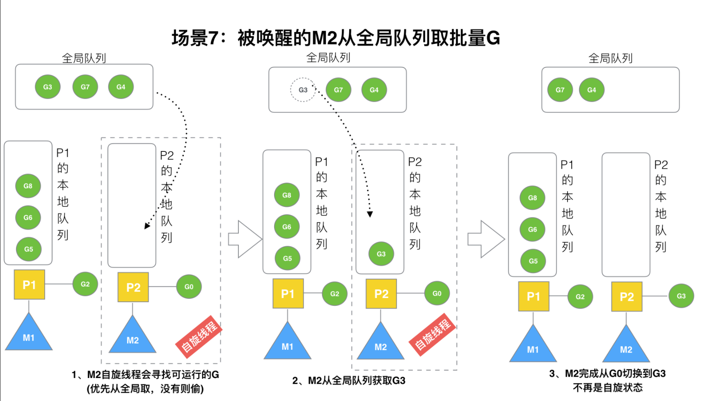

### 场景8

假设G2一直在M1上运行，经过2轮后，M2已经把G7、G4从全局队列获取到了P2的本地队列并完成运行，全局队列和P2的本地队列都空了,如场景8图的左半部分。

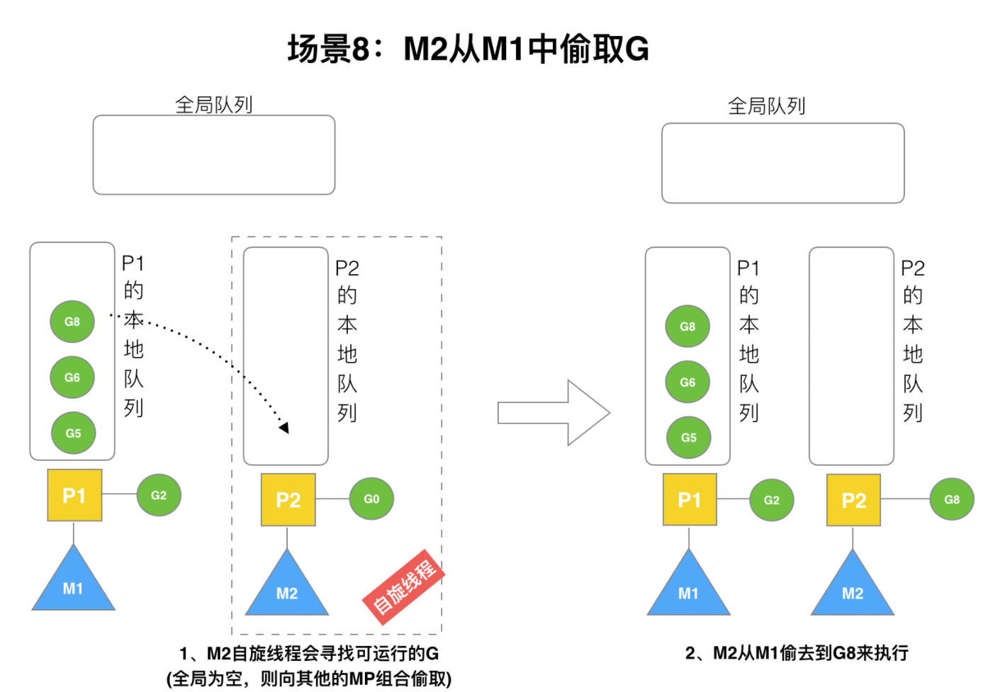

**全局队列已经没有G，那m就要执行work stealing(偷取)：从其他有G的P哪里偷取一半G过来，放到自己的P本地队列**。P2从P1的本地队列尾部取一半的G，本例中一半则只有1个G8，放到P2的本地队列并执行。

### 场景9

G1本地队列G5、G6已经被其他M偷走并运行完成，当前M1和M2分别在运行G2和G8，M3和M4没有goroutine可以运行，M3和M4处于**自旋状态**，它们不断寻找goroutine。

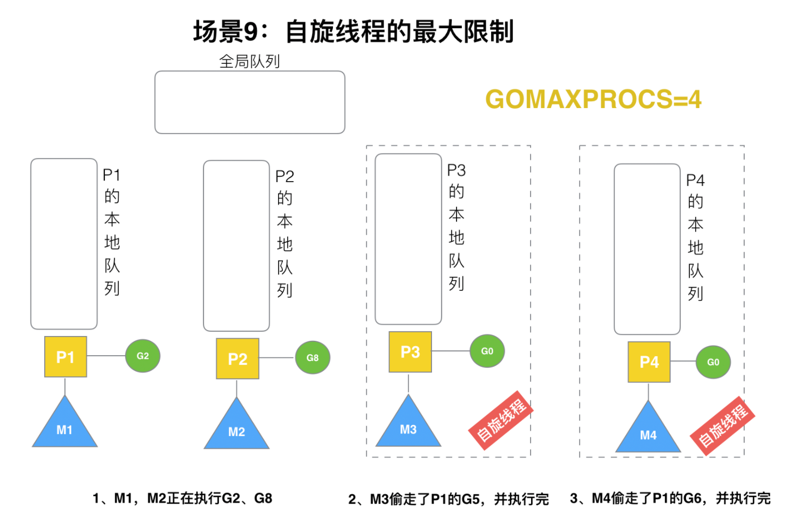

 为什么要让m3和m4自旋，自旋本质是在运行，线程在运行却没有执行G，就变成了浪费CPU. 为什么不销毁现场，来节约CPU资源。因为创建和销毁CPU也会浪费时间，我们**希望当有新goroutine创建时，立刻能有M运行它**，如果销毁再新建就增加了时延，降低了效率。当然也考虑了过多的自旋线程是浪费CPU，所以系统中最多有`GOMAXPROCS`个自旋的线程(当前例子中的`GOMAXPROCS`=4，所以一共4个P)，多余的没事做线程会让他们休眠。

### 场景10

假定当前除了M3和M4为自旋线程，还有M5和M6为空闲的线程(没有得到P的绑定，注意我们这里最多就只能够存在4个P，所以P的数量应该永远是M>=P, 大部分都是M在抢占需要运行的P)，G8创建了G9，G8进行了**阻塞的系统调用**，M2和P2立即解绑，P2会执行以下判断：如果P2本地队列有G、全局队列有G或有空闲的M，P2都会立马唤醒1个M和它绑定，否则P2则会加入到空闲P列表，等待M来获取可用的p。本场景中，P2本地队列有G9，可以和其他空闲的线程M5绑定。

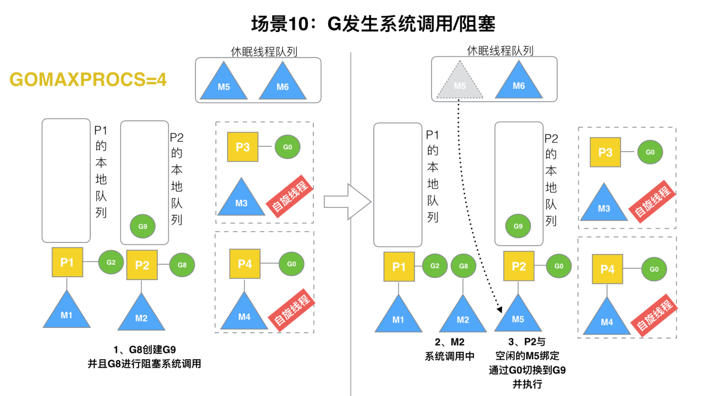

### 场景11

G8创建了G9，假如G8进行了**非阻塞系统调用**。

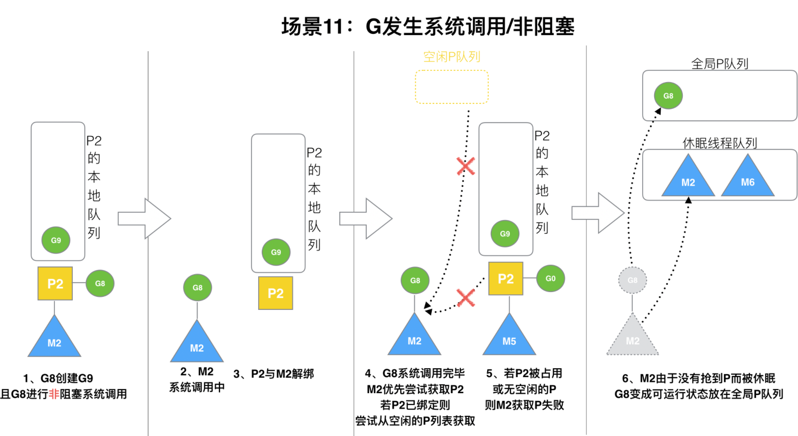

 M2和P2会解绑，但M2会记住P2，然后G8和M2进入**系统调用**状态。当G8和M2退出系统调用时，会尝试获取P2，如果无法获取，则获取空闲的P，如果依然没有，G8会被记为可运行状态，并加入到全局队列,M2因为没有P的绑定而变成休眠状态(长时间休眠等待GC回收销毁)。

### 参考

[Golang深入理解GPM模型_哔哩哔哩_bilibili](https://www.bilibili.com/video/BV19r4y1w7Nx)
