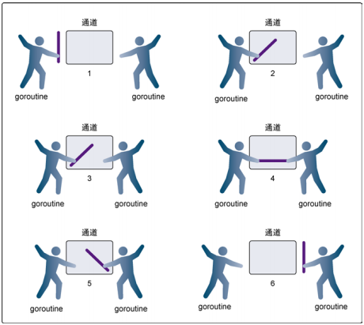
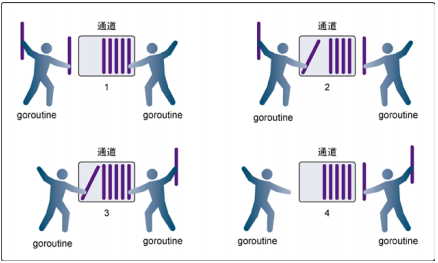
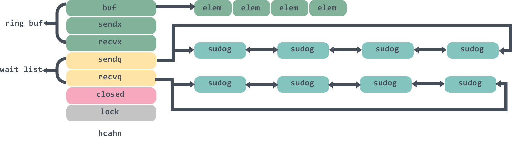
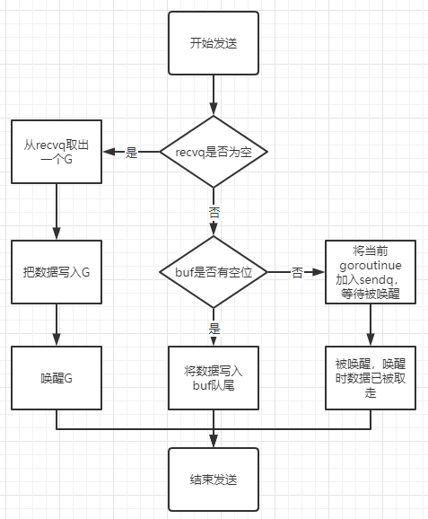
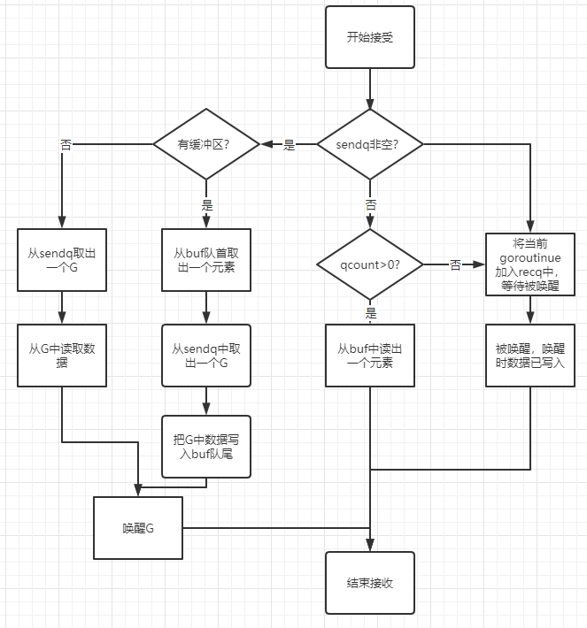

作为 Go 核心的数据结构和 Goroutine 之间的通信方式，Channel 是支撑 Go 语言高性能并发编程模型的重要结构本文会介绍管道 Channel 的设计原理、数据结构和常见操作，例如 Channel 的创建、发送、接收和关闭。

<!--more-->

### 特性

#### 初始化

声明和初始化channel的方式主要有以下两种：

1. 变量声明
2. 使用内置函数`make()`

##### 变量声明

```go
var ch chan int
```

这种方式声明的管道，值为nil，并且每个管道只能存储一种类型数据。

##### 使用内置函数`make()`

使用内置函数`make()`可以创建无缓冲管道和带缓冲的管道

```go
ch1 := make(chan int)     //无缓冲的管道
ch2 := make(chan int, 10) //缓冲区为10的管道
```

#### 管道的操作

##### 操作符

操作符`<-`表示数据的流向，管道在做表示向管道写入数据，管道在右表示从管道读取数据

```go
ch := make(chan int, 10) //缓冲区为10的管道
ch <- 1                  //向管道写入数据
num := <-ch              // 从管道读取数据
fmt.Println(num)
```

默认的管道为双向可读写，管道在函数间传递时可以使用操作符显示管道的读写，如下：

```go
func OnlyRead(read <-chan int) {
   // 只读
   fmt.Println(<-read)
}
func OnlyWrite(write chan<- int) {
   // 只写
   write <- 1
}
func All(all chan int) {
   // 可写
   all <- 1
   // 可读
   fmt.Println(<-all)
}
```

##### 数据读写

管道中没有缓冲区时，从管道读取数据会阻塞，直到有协程向管道中写数据。类似地，向管道中写入数据也会阻塞，直到有协程从管道中读取数据。



管道有缓冲区但是缓冲区没有数据时，从管道读取数据也会阻塞，直到有协程写入数据。类似地，向管道写入数据，如果缓冲区已满，那么也会阻塞，直到有协程从缓冲区中读取数据。



对于值为`nil`的管道，无论读写都会阻塞，而且是永久阻塞。

使用内置函数`cloase()`可以关闭管道，尝试向已经关闭的管道写数据会发生`panic`，但是关闭的管道仍然可以读。

管道读取表达式最多可以给两个变量赋值，

```go
ch := make(chan int, 10) //缓冲区为10的管道
v1 := <-ch
x, ok := <-ch
```

第一个变量表示读取出来的数据，第二个变量(bool)表示是否成功读取了数据，

> 第二个变量不用于指示管道的关闭状态

```go
ch := make(chan int, 10) //缓冲区为10的管道
ch <- 1                  // 写入数据
ch <- 2                  // 写入数据
ch <- 3                  // 写入数据
close(ch)
x, ok := <-ch
fmt.Println(x, "", ok)
// 结果为1  true
```

第二个变量的值与管道的关闭状态有关，更确切地说跟管道缓冲区中是否有数据有关：

一个已经关闭的管道有两种情况：

1. 缓冲区有数据
2. 缓冲区没有数据

对于第一种情况，管道已经关闭而且还有数据，那么管道读取表达式返回的第一个变量读取到的数据，第二个变量的值为`true`

对于第二种情况，管道已经关闭没有数据，那么管道读取表达式返回的第一个变量为相应类型的零值，第二个变量为`false`

可以看到，只有管道已关闭并且缓冲区中没有数据时，管道读取表达式返回第二个变量才与管道关闭状态一致。

可以使用`len() cap()`可以用来查询缓冲区数据个数以及缓冲区的大小

#### 总结

- 给一个 nil channel 发送/接收数据，造成永远阻塞
- 给一个已经关闭的 channel 发送数据，引起 panic
- 从一个已经关闭的 channel 接收数据，如果缓冲区中为空，则返回一个零值
- 无缓冲的channel是同步的，而有缓冲的channel是非同步的

### 实现原理

#### 数据结构

源码包中`src/runtime/chan.go:hchan`定义了管道的数据结构

```go
type hchan struct {
   qcount   uint           // 当前队列中剩余元素的个数
   dataqsiz uint           // 环形队列的长度
   buf      unsafe.Pointer // 环形队列指针
   elemsize uint16         // 每个元素的大小
   closed   uint32		  // 标识关闭的转态
   elemtype *_type // 存放数据的类型
   sendx    uint   // 队列的下标，指示元素写入时存放到循环队列中的位置
   recvx    uint   // 下一个被读取的元素在队列中的位置
   recvq    waitq  // 等待读消息的协程队列
   sendq    waitq  // 等待写消息的协程队列

   // lock protects all fields in hchan, as well as several
   // fields in sudogs blocked on this channel.
   //
   // Do not change another G's status while holding this lock
   // (in particular, do not ready a G), as this can deadlock
   // with stack shrinking.
   lock mutex		// 互斥锁，chan不允许并发
}
```

从数据结构可以看出channel由队列、类型消息、协程等队列组成。

- qcount代表chan 中已经接收但还没被取走的元素的个数，函数 len 可以返回这个字段的值；

- dataqsiz和buf分别代表队列buffer的大小，cap函数可以返回这个字段的值以及队列buffer的指针，是一个定长的环形数组；

- elemtype 和 elemsiz表示chan 中元素的类型和 元素的大小；

- sendx：发送数据的指针在 buffer中的位置；

- recvx：接收请求时的指针在 buffer 中的位置；

- recvq和sendq分别表示等待接收数据的 goroutine 与等待发送数据的 goroutine；

- sendq和recvq的类型是waitq的结构体：

```go
type waitq struct {
	first *sudog
	last  *sudog
}
```

waitq里面连接的是一个sudog双向链表，保存的是等待的goroutine 。整个chan的图例大概是这样：



##### 等待队列

从管道中读取数据时，如果管道缓冲区为空或者没有缓冲区，则当前的协程就会被阻塞，并且加入`recvq`队列中。向管道中写入数据时，如果管道缓冲区已满或者没有缓存区，则当前协程会被则色，并且加入`sendq`队列。

处于等待队列中的协程会在其他协程操作管道时被唤醒：

1. 因读阻塞的协程会被向管道写入的协程唤醒
2. 因写阻塞的协程会被向管道读取的协程唤醒

> 一般情况下`recvq`和`sendq`至少有一个为空。只有一个是例外，那就是同一个协程使用select语句向管道一边写入数据，一边读取读取数据，此时协程会分别位于两个等待队列中。

#### 管道操作

##### 创建管道

创建管道时间上是初始化`hchan`结构，其中类型消息和缓冲区长度是由`make()`进行指定，buf的大小则是由元素大小和缓冲区长度共同决定

创建管道的伪代码如下：

```go
func makechan(t *chantype, size int) *hchan {
   var c *hchan
   c = new(hchan)
   c.buf = malloc(元素类型大小 * size)		// 申请空间
   c.elemsize = 元素类型大小
   c.elemtype = 元素类型
   c.dataqsiz = size
   return c
}
```

##### 向管道中写数据

向一个管道中写入数据的简单过程如下：

1. 如果缓冲区中有空余位置，则将数据写入缓冲区，结束发送过程
2. 如果缓冲区中没有空余位置，则将当前协程加入`sendq`队列，进入睡眠并等待被读协程唤醒

实现时有一个小技巧，当前接受队列`recvq`不为空时，说明缓冲区中没有数据但有协程在等待数据，此时会把数据直接传递给`recvq`队列中第一个协程，而不必再写入缓冲区。

简单流程如下：



##### 从管道读数据

从管道读取数据的简单过程如下：

1. 如果缓冲区中有数据，则从缓冲区取出数据，结束过程
2. 如果缓冲区没有数据，则将当前协程加入`recvq`中，进入睡眠并等待被写协程唤醒

类似地，如果等待发送队列`sendq`不为空，且没有缓冲区，那么此时将直接从`sendq`队列的第一个协程总获取数据。

简答流程如下：



##### 关闭管道

关闭管道时会把`recq`中的协程全部唤醒，这些协程获取的数据都为nil，同时会把`sendq`中的协程全部唤醒，这些协程触发`panic`

除此之外，其他会触发panic的操作还有：

1. 关闭值为nil的管道
2. 关闭已经关闭的管道
3. 向已经关闭的管道写数据

#### 常见用法

##### 单向管道

上述已经介绍过

##### select

使用`select`可以监控多个管道，当其中某一个管道可操作时就触发相应的`case`分支

一个简答是示例程序如下：

```go
package main

import (
   "fmt"
   "time"
)

func main() {
   var ch1 = make(chan int, 10)
   var ch2 = make(chan int, 10)

   go addNumberToChan(ch1)
   go addNumberToChan(ch2)

   for {
      select {
      case e := <-ch1:
         fmt.Printf("Get element form ch1: %d\n", e)
      case e := <-ch2:
         fmt.Printf("Get element form ch2: %d\n", e)
      default:
         fmt.Printf("No element in ch1 and ch2\n")
         time.Sleep(time.Second)
      }

   }
}
```

运行结果如下：

```shell
No element in ch1 and ch2
Get element form ch2: 1
Get element form ch2: 1  
Get element form ch1: 1  
Get element form ch1: 1  
No element in ch1 and ch2
No element in ch1 and ch2
Get element form ch2: 1
Get element form ch1: 1  
Get element form ch1: 1  
Get element form ch2: 1  
No element in ch1 and ch2
No element in ch1 and ch2
Get element form ch1: 1
Get element form ch1: 1
Get element form ch2: 1
Get element form ch2: 1
No element in ch1 and ch2
No element in ch1 and ch2
...
```

由输出可见，从管道中读出数据的顺序是随机的。事实上，select语句的多个case语句的执行顺序是随机的。

通过这个例子可以看出，select的case语句读取管道时不会阻塞，尽管管道中没有数据。这是由于case语句编译后调用读取管道时会明确传入不阻塞的参数，读不到数据时不会将当前协程加入等待队列，而是直接返回。

##### for-range

通过`for-range`可以持续地从管道中出数据，好像在遍历一个数组一样，当管道中没有数据时会阻塞当前协程，与读管道是的阻塞机制一样，即使管道被关闭，for-range也可以优雅结束

```go
package main

import (
	"fmt"
	"time"
)

func main() {
	var ch1 = make(chan int, 10)

	go addNumberToChan(ch1)
	go chanRange(ch1)
	for {

	}

}
func addNumberToChan(ch chan int) {
	// 每隔 1 秒向chan中写入一次数据
	for {
		ch <- 1
		fmt.Printf("Set element to chan: %d\n", 1)
		time.Sleep(time.Second)
	}
}
func chanRange(ch <-chan int) {
	for e := range ch {
		fmt.Printf("Get element form chan: %d\n", e)
	}
}
```

结果如下：

```sh
Set element to chan: 1
Get element form chan: 1
Set element to chan: 1
Get element form chan: 1
Set element to chan: 1
Get element form chan: 1
Set element to chan: 1
Get element form chan: 1
...
```

### 例子

#### 实现互斥锁

```go
package main

import "fmt"

func main() {
	var ch = make(chan int, 1)
	Worker(ch)
}

func Worker(ch chan int) {
	ch <- 1
	//操作
	{
		fmt.Println("操作")
	}
	//
	<-ch
}
```

