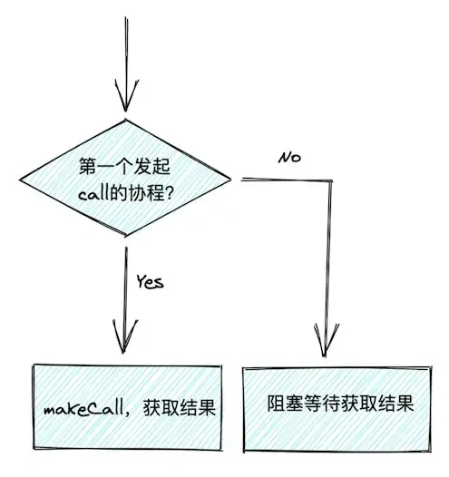

[jimyag/singleflight](https://github.com/jimyag/singleflight) 包主要是用来做并发控制，常见的比如`防止缓存击穿` `合并查询请求`。

<!--more-->

## 特性

1. 实用，可以大幅度提升合并查询请求的效率
2. 简单 所有的代码仅有90行，逻辑简单
3. 支持泛型，基于`go1.18`和`go-zero`实现的泛型`SingleFlight`

### 功能

### 防止缓存击穿

> 缓存击穿：缓存在某个时间点过期的时候，恰好在这个时间点对这个Key有大量的并发请求过来，这些请求发现缓存过期一般都会从后端DB加载数据并回设到缓存，这个时候大并发的请求可能会瞬间把后端DB压垮。 

通过 `SingleFlight` 可以将对同一个 Key 的并发请求进行合并，只让其中一个请求到数据库进行查询，其他请求共享同一个结果，可以很大程度提升并发能力。

### 查询缓存时，合并请求，提升服务性能。

假设有一个 IP 查询的服务，每次用户请求先在缓存中查询一个 IP 的归属地，如果缓存中有结果则直接返回，不存在则进行 IP 解析操作。

n 个用户请求查询同一个 IP（8.8.8.8）就会对应 n 个 Redis 的查询，在高并发场景下，如果能将 n 个 Redis 查询合并成一个 Redis 查询，那么性能肯定会提升很多，而 SingleFlight 就是用来实现请求合并的。

## 快速入手

### Install

```shell
go get github.com/jimyag/singleflight@latest
```

### Usage

启动10个携程同时对`calls`加1，最终的结果只加了**一次**

```go
package main

import (
	"log"
	"sync"
	"sync/atomic"
	"time"

	"github.com/jimyag/singleflight"
)

func main() {
	g := singleflight.NewSingleFlight[string]()
	c := make(chan string)
	var calls int32
	// 给 calls 加1
	fn := func() (string, error) {
		atomic.AddInt32(&calls, 1)
		return <-c, nil
	}

	const n = 10
	var wg sync.WaitGroup
	// 同时加1 最终的结果只能是 1
	for i := 0; i < n; i++ {
		wg.Add(1)
		go func() {
			v, err := g.Do("key", fn)
			if err != nil {
				log.Fatalf("Do error: %v", err)
			}
			if v != "bar" {
				log.Fatalf("got %q; want %q", v, "bar")
			}
			wg.Done()
		}()
	}
	time.Sleep(100 * time.Millisecond) // let goroutines above block
	c <- "bar"
	wg.Wait()
	if got := atomic.LoadInt32(&calls); got != 1 {
		log.Fatalf("number of calls = %d; want 1", got)
	}
	log.Printf("done %v", calls)
}
```

```shell
2022/04/27 13:43:26 done 1
```

##  如何实现

[万老师的文章](https://learnku.com/articles/67401)中写的很详细，这边直接引用万老师的分析。

先看代码结构：

```go
type (

	// SingleFlight
	// 可以将对同一个 Key 的并发请求进行合并，只让其中一个请求到数据库进行查询，其他请求共享同一个结果，可以很大程度提升并发能力
	// 定义 call 的结构
	call[T any] struct {
		wg  sync.WaitGroup // 用于实现通过1个 call，其他 call 阻塞
		val T              // 表示 call 操作的返回结果
		err error          // 表示 call 操作发生的错误
	}

	// 总控结构，实现 SingleFlight 接口
	flightGroup[T any] struct {
		calls map[string]*call[T] // 不同的 call 对应不同的 key
		lock  sync.Mutex          // 利用锁控制请求
	}
)
```

然后看最核心的 `Do方法`做了什么事情：

```go
func (g *flightGroup[T]) Do(key string, fn func() (T, error)) (T, error) {
   // 对 key 发起 call 请求（其实就是做一件事情），
   // 如果此时已经有其他协程已经在发起 call 请求就阻塞住（done 为 true 的情况），
   // 等待拿到结果后直接返回
   c, done := g.createCall(key)
   if done {
      return c.val, c.err
   }
   // 如果 done 是 false，说明当前协程是第一个发起 call 的协程，
   // 那么就执行 g.makeCall(c, key, fn)
   // 真正地发起 call 请求（此后的其他协程就阻塞在了 g.createCall(key))
   g.makeCall(c, key, fn)
   return c.val, c.err
}
```



从上图可知，其实关键就两步：

1. 判断是第一个请求的协程（利用 map）
2. 阻塞住其他所有协程（利用 sync.WaitGroup）

来看下 `g.createCall(key)` 如何实现的：

```go
func (g *flightGroup[T]) createCall(key string) (c *call[T], done bool) {
   g.lock.Lock()
   // 先看第一步：判断是第一个请求的协程（利用 map）此处判断 map 中的 key 是否存在，
   // 如果已经存在，说明已经有其他协程在请求了，
   // 当前这个协程只需要等待，等待是利用了 sync.WaitGroup 的 Wait() 方法实现的，此处还是很巧妙的
   if c, ok := g.calls[key]; ok {
      g.lock.Unlock()
      c.wg.Wait()
      return c, true
   }

   // 如果是第一个发起 call 的协程，所以需要 new 这个 call，然后将 wg.Add(1)，
   // 这样就对应了上面的 wg.Wait()，阻塞剩下的协程。
   // 随后将 new 的 call 放入 map 中。
   // 注意此时只是完成了初始化，并没有真正去执行 call 请求，
   // 真正的处理逻辑在 g.makeCall(c, key, fn) 中。
   c = new(call[T])
   c.wg.Add(1)
   g.calls[key] = c
   g.lock.Unlock()

   return c, false
}
```

```go
func (g *flightGroup[T]) makeCall(c *call[T], key string, fn func() (T, error)) {
   // 这个方法中做的事情很简单，就是执行了传递的匿名函数 fn()（也就是真正 call 请求要做的事情）。最后处理收尾的事情（通过 defer），也是分成两步：
   //
   //删除 map 中的 key，使得下次发起请求可以获取新的值。
   //调用 wg.Done()，让之前阻塞的协程全部获得结果并返回。
   defer func() {
      g.lock.Lock()
      delete(g.calls, key)
      g.lock.Unlock()
      c.wg.Done()
   }()

   c.val, c.err = fn()
}
```

## 参考

[singleflight包原理解析 | silenceper](https://silenceper.com/blog/202003/singleflight/)

[通过 SingleFlight 模式学习 Go 并发编程 | Go 技术论坛 (learnku.com)](https://learnku.com/articles/67401)
