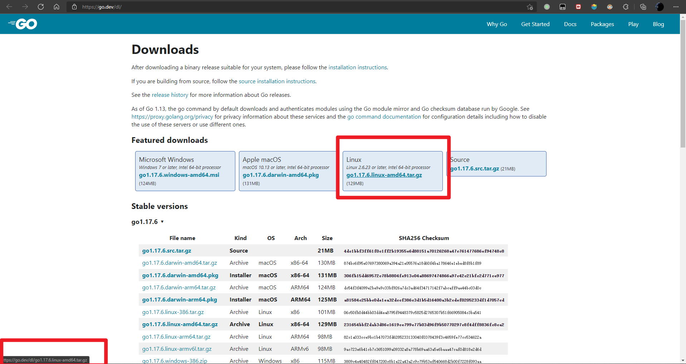
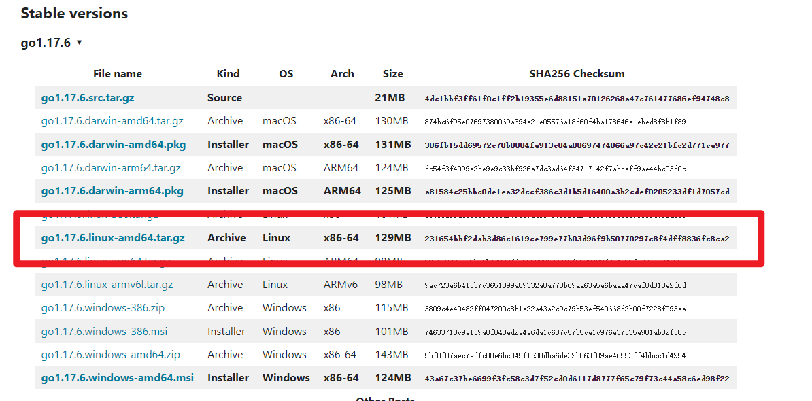

本文介绍如何在Linux中配置Go语言的环境

<!--more-->

### 下载所需文件

在[Downloads - The Go Programming Language](https://go.dev/dl/)中复制下载url



然后用于curl检索 tarball，确保将突出显示的 URL 替换为您刚刚复制的 URL。该-O标志确保将其输出到文件，并且该L标志指示 HTTPS 重定向，因为此链接取自 Go 网站并将在文件下载之前重定向到此处：

```bash
root@Jimyag:~# curl -OL https://golang.google.cn/dl/go1.17.6.linux-amd64.tar.gz
  % Total    % Received % Xferd  Average Speed   Time    Time     Time  Current
                                 Dload  Upload   Total   Spent    Left  Speed
100    75  100    75    0     0    136      0 --:--:-- --:--:-- --:--:--   135
100  128M  100  128M    0     0  3042k      0  0:00:43  0:00:43 --:--:-- 3244k
```

要验证您下载的文件的完整性，请运行 `sha256sum`命令并将其作为参数传递给文件名：

```bash
root@Jimyag:~# sha256sum go1.17.6.linux-amd64.tar.gz
231654bbf2dab3d86c1619ce799e77b03d96f9b50770297c8f4dff8836fc8ca2  go1.17.6.linux-amd64.tar.gz
```



如果校验和与下载页面上列出的校验和匹配，则您已正确完成此步骤。

接下来，用于tar提取 tarball。此命令包括-C指示 tar 在执行任何其他操作之前更改到给定目录的标志。这意味着提取的文件将被写入/usr/local/目录，即安装 Go 的推荐位置..x标志告诉tar提取，v告诉它我们想要详细输出（被提取的文件的列表），并f告诉它我们将指定一个文件名：

```bash
root@Jimyag:~# sudo tar -C /usr/local -xvf go1.17.6.linux-amd64.tar.gz
```

虽然/usr/local/go是安装 Go 的推荐位置，但一些用户可能更喜欢或需要不同的路径。

### 设置 Go 路径

在此步骤中，您将在您的环境中设置路径。

首先，设置 Go 的 root 值，它告诉 Go 去哪里寻找它的文件。

```bash
root@Jimyag:~# vim ~/.profile
```

然后，将以下信息添加到文件末尾：

```bash
export PATH=$PATH:/usr/local/go/bin
```

接下来，通过运行以下命令刷新您的配置文件：

```bash
source ~/.profile
```

之后，检查是否可以go通过运行go version以下命令执行命令：

```bash
root@Jimyag:~# go version
go version go1.17.6 linux/amd64
```

