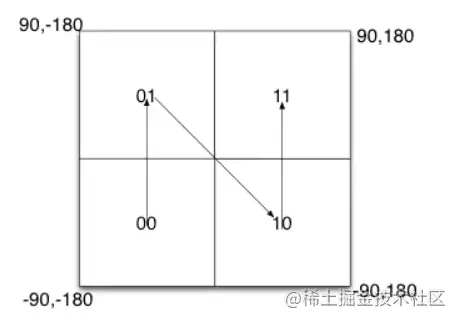
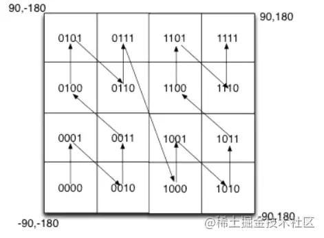
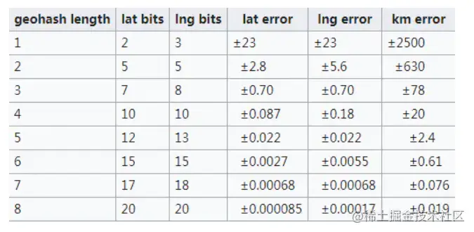
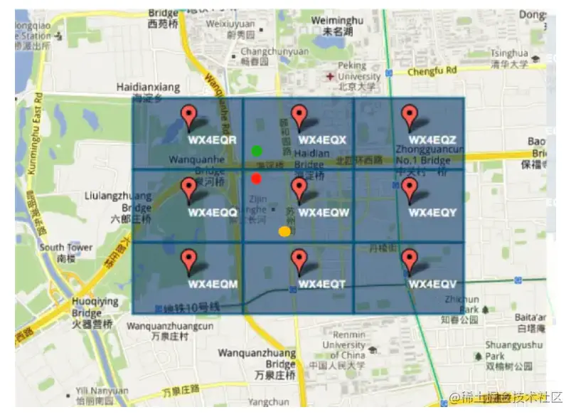

【第三届字节跳动青训营｜刷题打卡】DAY1

<!--more-->

### 【多选】Golang 通过`plugin.(*Plugin).Lookup`函数可以查找到插件里面定义的哪些东西？

A. 变量				B. 函数
C. 类型				D. 包

#### 自己答案

答案: ab 来源`src/plugin/plugin.go:35`

```go
 // A symbol is any exported variable or function.
 func (p *Plugin) Lookup(symName string) (Symbol, error) {
    return lookup(p, symName)
 }
```

#### 官方解析

`a`和`b`都是能被赋值给`interface{}`类型的变量，但是`c`和`d`不能。因此`Lookup`方法返回的结果是一个`interface{}`类型（`Symbol`类型）的变量，因此`c`和`d`不能通过`Lookup`返回。

[Go进阶25:Go插件plugin教程 | 🐶❤️🦀 (mojotv.cn)](https://link.juejin.cn/?target=https%3A%2F%2Fmojotv.cn%2Fgo%2Fgolang-plugin-tutorial)这篇文章介绍了plugin。

### 假如在抖音中发布视频时，可以选择带上位置信息，请设计一种数据结构或方案，用于存储检索位置信息（简化为平面坐标 x, y），以实现搜索附近视频的功能（如附近 3km）

#### 自己答案

使用了Geohash原理。顺便了解一下Geohash的原理。

大家可以看一下后面的参考文章，以下内容都是从参考文章中摘录出来，方便理解用的。

#### 介绍

首先，GeoHash用一个字符串表示X和Y两个坐标。某些情况下无法在两列上同时应用索引，利用GeoHash。只需要在一列上应用索引即可。

GeoHash本质上是空间索引的一种方式，其基本原理是将地球理解为一个二维平面，将平面递归分解成更小的子块，每个子块在一定经纬度范围内拥有相同的编码。以GeoHash方式建立空间索引，可以提高对空间poi([POI数据介绍 - 知乎 (zhihu.com)](https://link.juejin.cn?target=https%3A%2F%2Fzhuanlan.zhihu.com%2Fp%2F364102315))数据进行经纬度检索的效率。

经度范围是东经180到西经180，纬度范围是南纬90到北纬90，我们设定西经为负，南纬为负，所以地球上的经度范围就是[-180， 180]，纬度范围就是[-90，90]。如果以本初子午线、赤道为界，地球可以分成4个部分。

如果纬度范围[-90°, 0°)用二进制0代表，（0°, 90°]用二进制1代表，经度范围[-180°, 0°)用二进制0代表，（0°, 180°]用二进制1代表，那么地球可以分成如下4个部分



如果在小块范围内递归对半划分呢？



可以看到，划分的区域更多了，也更精确了。geohash算法就是基于这种思想，划分的次数更多，区域更多，区域面积更小了。通过将经纬度编码，给地理位置分区。

#### 实现

Geohash算法一共有三步。

##### 首先将坐标变成二进制

这里为了简化文章中的经纬度的描述，改为平面直角坐标系的坐标为描述。此时x的范围是（-90，90），y的范围是（-180，180）

比如这样一个点 **（39.923201, 116.390705**）。x的范围（-90，90），其中间值为0。对于纬度39.923201，在区间（0，90）中，因此得到一个1；（0，90）区间的中间值为45度，纬度39.923201小于45，因此得到一个0，依次计算下去，即可得到坐标x的二进制表示，如下表：

| x         | 0区间         | 1区间      | 39.923201 |
| --------- | ------------- | ---------- | --------- |
| -90，90   | -90，0        | 0，90      | 1         |
| 0，90     | 0，45         | 45，90     | 0         |
| 0，45     | 0，22.5       | 22.5，45   | 1         |
| 22.5，45  | 22.5，33.75   | 33.75，45  | 1         |
| 33.75，45 | 33.75，39.375 | 39.375，45 | 1         |
| ...       | ...           | ...        | ...       |

如果我们想要更精确的坐标可以一直分下去，直到满足自己的要求为止。`10111000110001111001`

同理我们可以对y坐标也进行处理。

| y          | 0区间         | 1区间       | 116.390705 |
| ---------- | ------------- | ----------- | ---------- |
| -180，180  | 180，0        | 0，180      | 1          |
| 0，180     | 0，90         | 90，180     | 1          |
| 90，180    | 90，135       | 135，180    | 0          |
| 90，135    | 90，112.5     | 112.5，135  | 1          |
| 112.5，135 | 112.5，123.75 | 123.75，135 | 0          |
| ...        | ...           | ...         | ...        |

得到`11010010110001000100`

##### 将二进制合并

X坐标占偶数位，Y占奇数位，注意，0也是偶数位。

```
 11100 11101 00100 01111 00000 01101 01011 00001
复制代码
```

##### 按照Base32进行编码

Base32编码表的其中一种如下，是用0-9、b-z（去掉a, i, l, o）这32个字母进行编码。具体操作是先将上一步得到的合并后二进制转换为10进制数据，然后对应生成Base32码。需要注意的是，将5个二进制位转换成一个base32码。上例最终得到的值为：`wx4g0ec1`

| 十进制 | 0    | 1    | 2    | 3    | 4    | 5    | 6    | 7    | 8    | 9    | 10   | 11   | 12   | 13   | 14   | 15   |
| ------ | ---- | ---- | ---- | ---- | ---- | ---- | ---- | ---- | ---- | ---- | ---- | ---- | ---- | ---- | ---- | ---- |
| base32 | 0    | 1    | 2    | 3    | 4    | 5    | 6    | 7    | 8    | 9    | b    | c    | d    | e    | f    | g    |
| 十进制 | 16   | 17   | 18   | 19   | 20   | 21   | 22   | 23   | 24   | 25   | 26   | 27   | 28   | 29   | 30   | 31   |
| base32 | h    | j    | k    | m    | n    | p    | q    | r    | s    | t    | u    | v    | w    | x    | y    | z    |

- Geohash比直接用经纬度的高效很多，而且使用者可以发布地址编码，既能表明自己位于北海公园附近，又不至于暴露自己的精确坐标，有助于隐私保护。
- GeoHash用一个字符串表示经度和纬度两个坐标。在数据库中可以实现在一列上应用索引（某些情况下无法在两列上同时应用索引）
- GeoHash表示的并不是一个点，而是一个矩形区域
- GeoHash编码的前缀可以表示更大的区域。例如wx4g0ec1，它的前缀wx4g0e表示包含编码wx4g0ec1在内的更大范围。 这个特性可以用于附近地点搜索

编码越长，表示的范围越小，位置也越精确。因此我们就可以通过比较GeoHash匹配的位数来判断两个点之间的大概距离。



#### 问题

geohash算法有两个问题。

##### 边缘问题

 如图，如果车在红点位置，区域内还有一个黄点。相邻区域内的绿点明显离红点更近。但因为黄点的编码和红点一样，最终找到的将是黄点。这就有问题了。

要解决这个问题，很简单，只要再查找周边8个区域内的点，看哪个离自己更近即可。

###### 曲线突变

本文第2张图片比较好地解释了这个问题。其中0111和1000两个编码非常相近，但它们的实际距离确很远。所以编码相近的两个单位，并不一定真实距离很近，这需要实际计算两个点的距离才行。

#### 官方解析

坐标范围检索，有四叉树、geohash 等几种标准解法。这道题本质**并不是**考察对高阶算法的掌握，而是想发掘在学习教材 btree 等基础二分思想后，能否进一步思考解出更复杂的问题；
 另外考察思维灵活程度，看是否能变通的解决问题，如距离并没有限定必须是**欧式距离**；位置可以不精确，可以容忍有误差等。

- **方法 1，四叉树（QTree）**：在二叉树左、右节点的思想下，加入上、下、前、后等更多的方向，演进为四叉树和八叉树。高阶树比较超纲，相关实现省略。四叉树找到周围的环绕的点应该是最快的。
- **方法 2，geohash**：把二维问题降为一维
   如坐标（示例非标准 geohash，只是演示了思想）：
   (12, 345) -> (**0**12, 345) -> "031425"
   (13, 348) -> (**0**13, 348) -> "031438"
   (2, 789) -> (**00**2, 789) -> "070829"
   最终做字符串前缀匹配，可得 "031425" 和 "031438" 匹配到的位数最多，二者距离最近。求 3km 内的坐标，只需提前算出需匹配前几位即可，如匹配前 4 位，按 sql 表达是 LIKE '0314%'
- **方法 3，变通距离为 方圆 3km（曼哈顿距离）**，即 deltaX = 1500, deltaY = 1500，通过数据库解决 Create table tb_name ( x int, y int ) 并添加索引。
   假如原点是 (x0, y0)，sql 如下：
   WHERE (x > x0 - 1500) AND (x < x0 + 1500) AND (y > y0 - 1500) AND (y < y0 + 1500)

### 参考

[【第三届字节跳动青训营｜刷题打卡】DAY1 - 掘金 (juejin.cn)](https://juejin.cn/post/7083792721265033229)
