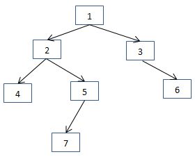

【第三届字节跳动青训营｜刷题打卡】DAY3

<!--more-->

### 【多选】绝大多数硬盘可以提供哪些写入保证？

a. 单个sector原子写入
b. 单个page原子写入
c. 硬盘顺序执行文件系统发送的操作
d. 以上都不可以

 在随时可能断电的情况下，大多数硬件能提供单个sector的原子性写入；

但是也有少数硬件连单个sector的写入都无法保证；

如果一个page对应多个sector，则单个page的完整写入总是无法得到保障。更加详细的情况可以查看这个讨论：[crash - Are disk sector writes atomic?](https://link.juejin.cn?target=https%3A%2F%2Flink.zhihu.com%2F%3Ftarget%3Dhttps%3A%2F%2Fstackoverflow.com%2Fquestions%2F2009063%2Fare-disk-sector-writes-atomic)。

对于同时发给硬盘的多个操作（比如写多个不连续的sector），硬盘并不保证操作的顺序。结合其弱原子性，所以硬盘可能处在任何一个中间状态。这主要是由于机械硬盘的寻址优化策略和固态/机械硬盘的缓存策略导致的。

### 判断一棵二叉树是否是平衡二叉树。（平衡二叉树要求：树中节点左右子树树高差不超过1。）

二叉树的定义

> 1.左右子树的高度差不能超过1
> 2.左右子树也是平衡二叉树

#### 解法一

这样的话，如果是空树则是平衡二叉树，如果不是空树，我们就去判断左子树是不是平衡二叉树，判断的依据就是左右子树高度差不超过1，代码如下：

```c++
#include<iostream>
#include<vector>

using namespace std;

struct Node {
    int val;
    Node *left;
    Node *right;

    Node(int x) : val(x), left(nullptr), right(nullptr) {}

    Node(int x, Node *left, Node *right) : val(x), left(left), right(right) {}
};
// 获得树的高度
int getTreeHeight(Node *tree) {
    if (tree == nullptr) {
        return 0;
    }
    int left = getTreeHeight(tree->left);
    int right = getTreeHeight(tree->right);
    return left > right ? left + 1 : right + 1;
}

bool isBalance(Node *tree) {
    if (tree == nullptr) {
        return true;
    }
    // 拿到左子树的高度
    int leftHeight = getTreeHeight(tree->left);
    // 拿到右子树的高度
    int rightHeight = getTreeHeight(tree->right);
    // 是否满足要求
    if (abs(leftHeight - rightHeight) > 1) {
        return false;
    }
    // 判断左子树和右子树是否是二叉平衡树
    return isBalance(tree->right) && isBalance(tree->left);
}

int main() {
    Node *node = new Node(1,
                          new Node(1,
                                   new Node(3,
                                            new Node(4),
                                            nullptr),
                                   new Node(1)),
                          new Node(1));
    cout << isBalance(node) << endl;
    Node *node1 = new Node(1,
                           new Node(1),
                           new Node(1));
    cout << isBalance(node1) << endl;
    return 0;
}

```

这样做是有一个坏处就是结点的高度会被重复计算。



我们首先判断根`节点1`是不是平衡的，此时我们需要调用`getTreeHeight`函数求根节点左子树的高度，需要遍历节点`4、5、7`。接下来需要判断以`节点2`为根节点的子树是不是平衡树的时候，分别求以节点2为根节点的左子树的高度和右子树的高度，这时又遍历了节点`4、5、7`。

#### 解法二

这时提出一个新的方法：

 采用后序遍历的方式遍历二叉树的每一个节点，在遍历到一个节点之前我们就已经遍历了它的左右子树。此时，记录每个节点为根节点的树的高度，就可以一边遍历一边判断每个节点是不是平衡的。

```c++
bool IsBalanced(Node *node, int *depth) {
    // 为空高度为0
    if (node == nullptr) {
        *depth = 0;
        return true;
    }

    int nLeftDepth, nRightDepth;
    // 左子树
    bool bLeft = IsBalanced(node->left, &nLeftDepth);
    // 右子树
    bool bRight = IsBalanced(node->right, &nRightDepth);

    if (bLeft && bRight) {
        int diff = nRightDepth - nLeftDepth;
        if (abs(diff) < 2) //左右字树高度差绝对值不超过1
        {
            *depth = 1 + (nLeftDepth > nRightDepth ? nLeftDepth : nRightDepth);
            return true;
        }
    }
    return false;
}

bool IsBalanced(Node *pRoot) {
    int depth = 0;

    return IsBalanced(pRoot, &depth);
}
```

这里的bool值也可以优化掉。用`-1`来代替

```c++
int IsBalanced(Node *node) {
    // 为空高度为0
    if (node == nullptr) {
        return 0;
    }

    // 左子树
    int left = IsBalanced(node->left);
    if (left == -1) return -1;
    int right = IsBalanced(node->right);
    if (right == -1) return -1;
    // -1 表示不满足高度要求
    return abs(left - right) < 2 ? max(left, right) + 1 : -1;

}

bool isBalanced(Node *pRoot) {
    return IsBalanced(pRoot) != -1;
}
```

