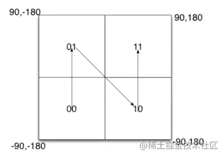
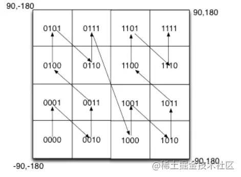
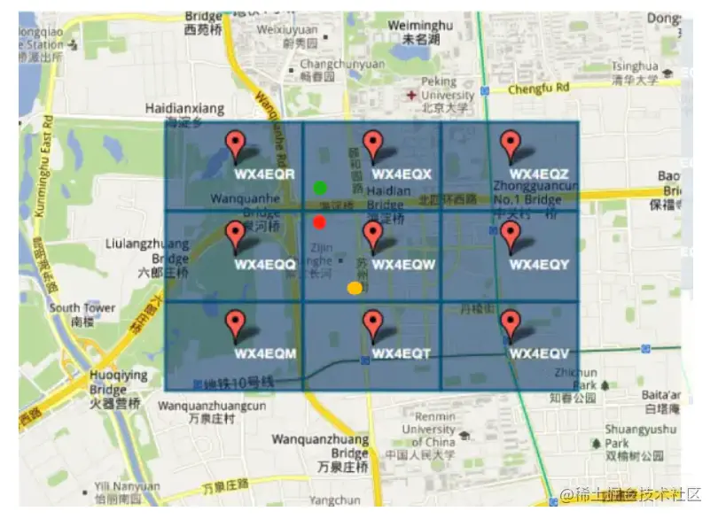

【第三届字节跳动青训营｜刷题打卡】记录

<!--more-->

## day-one

### 【多选】Golang 通过`plugin.(*Plugin).Lookup`函数可以查找到插件里面定义的哪些东西？

A. 变量				B. 函数
C. 类型				D. 包

#### 自己答案

答案: ab 来源`src/plugin/plugin.go:35`

```go
 // A symbol is any exported variable or function.
 func (p *Plugin) Lookup(symName string) (Symbol, error) {
    return lookup(p, symName)
 }
```

#### 官方解析

`a`和`b`都是能被赋值给`interface{}`类型的变量，但是`c`和`d`不能。因此`Lookup`方法返回的结果是一个`interface{}`类型（`Symbol`类型）的变量，因此`c`和`d`不能通过`Lookup`返回。

[Go进阶25:Go插件plugin教程 | 🐶❤️🦀 (mojotv.cn)](https://link.juejin.cn/?target=https%3A%2F%2Fmojotv.cn%2Fgo%2Fgolang-plugin-tutorial)这篇文章介绍了plugin。

### 假如在抖音中发布视频时，可以选择带上位置信息，请设计一种数据结构或方案，用于存储检索位置信息（简化为平面坐标 x, y），以实现搜索附近视频的功能（如附近 3km）

#### 自己答案

使用了Geohash原理。顺便了解一下Geohash的原理。

大家可以看一下后面的参考文章，以下内容都是从参考文章中摘录出来，方便理解用的。

#### 介绍

首先，GeoHash用一个字符串表示X和Y两个坐标。某些情况下无法在两列上同时应用索引，利用GeoHash。只需要在一列上应用索引即可。

GeoHash本质上是空间索引的一种方式，其基本原理是将地球理解为一个二维平面，将平面递归分解成更小的子块，每个子块在一定经纬度范围内拥有相同的编码。以GeoHash方式建立空间索引，可以提高对空间poi([POI数据介绍 - 知乎 (zhihu.com)](https://link.juejin.cn?target=https%3A%2F%2Fzhuanlan.zhihu.com%2Fp%2F364102315))数据进行经纬度检索的效率。

经度范围是东经180到西经180，纬度范围是南纬90到北纬90，我们设定西经为负，南纬为负，所以地球上的经度范围就是[-180， 180]，纬度范围就是[-90，90]。如果以本初子午线、赤道为界，地球可以分成4个部分。

如果纬度范围[-90°, 0°)用二进制0代表，（0°, 90°]用二进制1代表，经度范围[-180°, 0°)用二进制0代表，（0°, 180°]用二进制1代表，那么地球可以分成如下4个部分



如果在小块范围内递归对半划分呢？



可以看到，划分的区域更多了，也更精确了。geohash算法就是基于这种思想，划分的次数更多，区域更多，区域面积更小了。通过将经纬度编码，给地理位置分区。

#### 实现

Geohash算法一共有三步。

##### 首先将坐标变成二进制

这里为了简化文章中的经纬度的描述，改为平面直角坐标系的坐标为描述。此时x的范围是（-90，90），y的范围是（-180，180）

比如这样一个点 **（39.923201, 116.390705**）。x的范围（-90，90），其中间值为0。对于纬度39.923201，在区间（0，90）中，因此得到一个1；（0，90）区间的中间值为45度，纬度39.923201小于45，因此得到一个0，依次计算下去，即可得到坐标x的二进制表示，如下表：

| x         | 0区间         | 1区间      | 39.923201 |
| --------- | ------------- | ---------- | --------- |
| -90，90   | -90，0        | 0，90      | 1         |
| 0，90     | 0，45         | 45，90     | 0         |
| 0，45     | 0，22.5       | 22.5，45   | 1         |
| 22.5，45  | 22.5，33.75   | 33.75，45  | 1         |
| 33.75，45 | 33.75，39.375 | 39.375，45 | 1         |
| ...       | ...           | ...        | ...       |

如果我们想要更精确的坐标可以一直分下去，直到满足自己的要求为止。`10111000110001111001`

同理我们可以对y坐标也进行处理。

| y          | 0区间         | 1区间       | 116.390705 |
| ---------- | ------------- | ----------- | ---------- |
| -180，180  | 180，0        | 0，180      | 1          |
| 0，180     | 0，90         | 90，180     | 1          |
| 90，180    | 90，135       | 135，180    | 0          |
| 90，135    | 90，112.5     | 112.5，135  | 1          |
| 112.5，135 | 112.5，123.75 | 123.75，135 | 0          |
| ...        | ...           | ...         | ...        |

得到`11010010110001000100`

##### 将二进制合并

X坐标占偶数位，Y占奇数位，注意，0也是偶数位。

```
 11100 11101 00100 01111 00000 01101 01011 00001
复制代码
```

##### 按照Base32进行编码

Base32编码表的其中一种如下，是用0-9、b-z（去掉a, i, l, o）这32个字母进行编码。具体操作是先将上一步得到的合并后二进制转换为10进制数据，然后对应生成Base32码。需要注意的是，将5个二进制位转换成一个base32码。上例最终得到的值为：`wx4g0ec1`

| 十进制 | 0    | 1    | 2    | 3    | 4    | 5    | 6    | 7    | 8    | 9    | 10   | 11   | 12   | 13   | 14   | 15   |
| ------ | ---- | ---- | ---- | ---- | ---- | ---- | ---- | ---- | ---- | ---- | ---- | ---- | ---- | ---- | ---- | ---- |
| base32 | 0    | 1    | 2    | 3    | 4    | 5    | 6    | 7    | 8    | 9    | b    | c    | d    | e    | f    | g    |
| 十进制 | 16   | 17   | 18   | 19   | 20   | 21   | 22   | 23   | 24   | 25   | 26   | 27   | 28   | 29   | 30   | 31   |
| base32 | h    | j    | k    | m    | n    | p    | q    | r    | s    | t    | u    | v    | w    | x    | y    | z    |

- Geohash比直接用经纬度的高效很多，而且使用者可以发布地址编码，既能表明自己位于北海公园附近，又不至于暴露自己的精确坐标，有助于隐私保护。
- GeoHash用一个字符串表示经度和纬度两个坐标。在数据库中可以实现在一列上应用索引（某些情况下无法在两列上同时应用索引）
- GeoHash表示的并不是一个点，而是一个矩形区域
- GeoHash编码的前缀可以表示更大的区域。例如wx4g0ec1，它的前缀wx4g0e表示包含编码wx4g0ec1在内的更大范围。 这个特性可以用于附近地点搜索

编码越长，表示的范围越小，位置也越精确。因此我们就可以通过比较GeoHash匹配的位数来判断两个点之间的大概距离。


#### 问题

geohash算法有两个问题。

##### 边缘问题

 如图，如果车在红点位置，区域内还有一个黄点。相邻区域内的绿点明显离红点更近。但因为黄点的编码和红点一样，最终找到的将是黄点。这就有问题了。

要解决这个问题，很简单，只要再查找周边8个区域内的点，看哪个离自己更近即可。

###### 曲线突变

本文第2张图片比较好地解释了这个问题。其中0111和1000两个编码非常相近，但它们的实际距离确很远。所以编码相近的两个单位，并不一定真实距离很近，这需要实际计算两个点的距离才行。

#### 官方解析

坐标范围检索，有四叉树、geohash 等几种标准解法。这道题本质**并不是**考察对高阶算法的掌握，而是想发掘在学习教材 btree 等基础二分思想后，能否进一步思考解出更复杂的问题；
 另外考察思维灵活程度，看是否能变通的解决问题，如距离并没有限定必须是**欧式距离**；位置可以不精确，可以容忍有误差等。

- **方法 1，四叉树（QTree）**：在二叉树左、右节点的思想下，加入上、下、前、后等更多的方向，演进为四叉树和八叉树。高阶树比较超纲，相关实现省略。四叉树找到周围的环绕的点应该是最快的。
- **方法 2，geohash**：把二维问题降为一维
  如坐标（示例非标准 geohash，只是演示了思想）：
  (12, 345) -> (**0**12, 345) -> "031425"
  (13, 348) -> (**0**13, 348) -> "031438"
  (2, 789) -> (**00**2, 789) -> "070829"
  最终做字符串前缀匹配，可得 "031425" 和 "031438" 匹配到的位数最多，二者距离最近。求 3km 内的坐标，只需提前算出需匹配前几位即可，如匹配前 4 位，按 sql 表达是 LIKE '0314%'
- **方法 3，变通距离为 方圆 3km（曼哈顿距离）**，即 deltaX = 1500, deltaY = 1500，通过数据库解决 Create table tb_name ( x int, y int ) 并添加索引。
  假如原点是 (x0, y0)，sql 如下：
  WHERE (x > x0 - 1500) AND (x < x0 + 1500) AND (y > y0 - 1500) AND (y < y0 + 1500)

## day-two

### 【多选】下列关于Join 运算不正确的是：

a. Nested Loop Join 不能使用索引做优化。
 b. 如果左表太大，不能放入内存中，则不能使用 Hash Join。
 c. 如果 Join 的一个输入表在 Join Key 上有序，则一定会使用 Sort Merge Join。
 d. Broadcast Join 适用于一张表很小，另一张表很大的场景。

#### 自己解析

A:可以做 [Nested Loop Join - 知乎 (zhihu.com)](https://zhuanlan.zhihu.com/p/81398139)

B: 可以使用，[数据库多表连接方式介绍－HASH-JOIN - _雨 - 博客园 (cnblogs.com)](https://www.cnblogs.com/shangyu/p/6055181.html)

C：不是的[(21条消息) Merge join、Hash join、Nested loop join对比分析_KPLives的博客-CSDN博客](https://blog.csdn.net/horace20/article/details/16360109)

D: 正确的


### 给定一个正整数数组 arrs 和整数 K ，请找出该数组内乘积小于等于 k 的连续的子数组的个数，算法时间复杂度o(n)

#### 解析

对于连续的子数组的问题想到了双指针的方法。第一版的代码如下。但是这个代码其实还是暴力搜索，每遇到一个`arr[i]`就从i开始枚举，满足要求的加入到`res`中，不满足就下一个。相当于时间复杂度为On^2

```c++
int subArr(vector<int> &arr, int target) {
    int slow = 0, fast = 0;
    int res = 0;
    for (; slow < arr.size(); slow++) {
        int temp = 1;
        for (fast = slow; fast < arr.size(); fast++) {
            temp *= arr[fast];
            if (temp <= target) {
                res++;
            } else {
                break;
            }
        }
    }
    return res;
}
```

我们知道，每次都是乘以`正整数`，每次相乘只会越来越大。我们要想办法用到`越乘越大`这个特性。

定义一个慢指针`slow`，所求的个数`res`，当前的乘积`mul`。

快指针`fast`快速向前计算连续数组的乘积，如果计算的乘积`大于`目标值`target`了，就移动`slow`指针，直到`mul`小于`target`。

剩下一个最棘手的问题`如何求res`

首先我们看下代码

```c++
int subArr(vector<int> &arr, int target) {
    int slow = 0;
    int res = 0;
    int mul = 1;
    for (int fast = 0; fast < arr.size(); fast++) {
        // 计算当前的乘积
        mul *= arr[fast];
        // 如果乘积超过了慢指针就要开始移动。
        while (mul > target) {
            // mul = mul/arr[slow];
            // slow ++; 的简写
            mul /= arr[slow++];
        }
        // 快指针每向有移动一次增加的符合条件的个数。
        res += (fast - slow + 1);

    }
    return res;
}
```

1. 我们要维护一个滑窗。窗口不断向右滑动，窗口右边界(fast)为固定轴，左边界(slow)则是一个变动轴。

2. 此窗口代表的意义为：以窗口右边界为结束点的区间，其满足乘积小于target所能维持的最大窗口。
   **因此，本题最重要的是求窗口在每个位置时，窗口的最大长度。(最大长度是重点)**

3. 最终的答案便是窗口在每个位置的最大长度的累计和。
   为什么呢？这个就需要我们找规律了。因为针对上一位置的窗口，移动一次后相对增加出来的个数便是`(fast - slow + 1)`。

> 举个例子:
>
> 窗口左边界：l,窗口右边界：r
>
> k=100
>
> 位置i：    		0, 1, 2, 3
>
> 数组nums： 10, 5, 2, 6
>
> 窗口1(l=1,r=2)：   l, r   
>
> 窗口2(l=1,r=3):    l,    r
>
> 窗口1中符合的有[5],[2],[5,2]
>
> 窗口2中符合的有[5],[2],[5,2],[6],[2,6],[5,2,6]


​	可以看出，`窗口2`对比`窗口1`多出来的数组都是由于窗口`右滑一次`所带来的，即**多出来的那几个必然是包含新窗口的边界fast**

​	因此可以得出，最终答案可以是每次窗口最大长度的累加。

4. 为了求出每次窗口的最大长度(或理解为宽度也许)，我们可能需要对变动轴左边界(l)进行调整。
   即调整左边界，使之能达到求出窗口的最大长度

## day-three

### 【多选】绝大多数硬盘可以提供哪些写入保证？

a. 单个sector原子写入
b. 单个page原子写入
c. 硬盘顺序执行文件系统发送的操作
d. 以上都不可以

 在随时可能断电的情况下，大多数硬件能提供单个sector的原子性写入；

但是也有少数硬件连单个sector的写入都无法保证；

如果一个page对应多个sector，则单个page的完整写入总是无法得到保障。更加详细的情况可以查看这个讨论：[crash - Are disk sector writes atomic?](https://link.juejin.cn?target=https%3A%2F%2Flink.zhihu.com%2F%3Ftarget%3Dhttps%3A%2F%2Fstackoverflow.com%2Fquestions%2F2009063%2Fare-disk-sector-writes-atomic)。

对于同时发给硬盘的多个操作（比如写多个不连续的sector），硬盘并不保证操作的顺序。结合其弱原子性，所以硬盘可能处在任何一个中间状态。这主要是由于机械硬盘的寻址优化策略和固态/机械硬盘的缓存策略导致的。

### 判断一棵二叉树是否是平衡二叉树。（平衡二叉树要求：树中节点左右子树树高差不超过1。）

二叉树的定义

> 1.左右子树的高度差不能超过1
> 2.左右子树也是平衡二叉树

#### 解法一

这样的话，如果是空树则是平衡二叉树，如果不是空树，我们就去判断左子树是不是平衡二叉树，判断的依据就是左右子树高度差不超过1，代码如下：

```c++
#include<iostream>
#include<vector>

using namespace std;

struct Node {
    int val;
    Node *left;
    Node *right;

    Node(int x) : val(x), left(nullptr), right(nullptr) {}

    Node(int x, Node *left, Node *right) : val(x), left(left), right(right) {}
};
// 获得树的高度
int getTreeHeight(Node *tree) {
    if (tree == nullptr) {
        return 0;
    }
    int left = getTreeHeight(tree->left);
    int right = getTreeHeight(tree->right);
    return left > right ? left + 1 : right + 1;
}

bool isBalance(Node *tree) {
    if (tree == nullptr) {
        return true;
    }
    // 拿到左子树的高度
    int leftHeight = getTreeHeight(tree->left);
    // 拿到右子树的高度
    int rightHeight = getTreeHeight(tree->right);
    // 是否满足要求
    if (abs(leftHeight - rightHeight) > 1) {
        return false;
    }
    // 判断左子树和右子树是否是二叉平衡树
    return isBalance(tree->right) && isBalance(tree->left);
}

int main() {
    Node *node = new Node(1,
                          new Node(1,
                                   new Node(3,
                                            new Node(4),
                                            nullptr),
                                   new Node(1)),
                          new Node(1));
    cout << isBalance(node) << endl;
    Node *node1 = new Node(1,
                           new Node(1),
                           new Node(1));
    cout << isBalance(node1) << endl;
    return 0;
}

```

这样做是有一个坏处就是结点的高度会被重复计算。


我们首先判断根`节点1`是不是平衡的，此时我们需要调用`getTreeHeight`函数求根节点左子树的高度，需要遍历节点`4、5、7`。接下来需要判断以`节点2`为根节点的子树是不是平衡树的时候，分别求以节点2为根节点的左子树的高度和右子树的高度，这时又遍历了节点`4、5、7`。

#### 解法二

这时提出一个新的方法：

 采用后序遍历的方式遍历二叉树的每一个节点，在遍历到一个节点之前我们就已经遍历了它的左右子树。此时，记录每个节点为根节点的树的高度，就可以一边遍历一边判断每个节点是不是平衡的。

```c++
bool IsBalanced(Node *node, int *depth) {
    // 为空高度为0
    if (node == nullptr) {
        *depth = 0;
        return true;
    }

    int nLeftDepth, nRightDepth;
    // 左子树
    bool bLeft = IsBalanced(node->left, &nLeftDepth);
    // 右子树
    bool bRight = IsBalanced(node->right, &nRightDepth);

    if (bLeft && bRight) {
        int diff = nRightDepth - nLeftDepth;
        if (abs(diff) < 2) //左右字树高度差绝对值不超过1
        {
            *depth = 1 + (nLeftDepth > nRightDepth ? nLeftDepth : nRightDepth);
            return true;
        }
    }
    return false;
}

bool IsBalanced(Node *pRoot) {
    int depth = 0;

    return IsBalanced(pRoot, &depth);
}
```

这里的bool值也可以优化掉。用`-1`来代替

```c++
int IsBalanced(Node *node) {
    // 为空高度为0
    if (node == nullptr) {
        return 0;
    }

    // 左子树
    int left = IsBalanced(node->left);
    if (left == -1) return -1;
    int right = IsBalanced(node->right);
    if (right == -1) return -1;
    // -1 表示不满足高度要求
    return abs(left - right) < 2 ? max(left, right) + 1 : -1;

}

bool isBalanced(Node *pRoot) {
    return IsBalanced(pRoot) != -1;
}
```


## day-four

### 【单选】go test 默认是以什么顺序执行测试的？

a. 多个 module 并发执行，单 module 下多个测试并发执行
 b. 多个 module 并发执行，单 module 下多个测试串行执行
 c. 多个 module 串行执行，单 module 下多个测试并发执行
 d. 多个 module 串行执行，单 module 下多个测试串行执行

#### 解析

b；
 多个 modules 会并发编译，然后并发执行测试，除非添加了额外的参数`-p=1`。单个 modules 下多个测试会串行执行，除非在测试函数内执行`t.Parallel()`。

只有测试源码文件的名称对了，测试函数的名称和签名也对了，当我们运行go test命令的时候，其中的测试代码才有可能被运行

go test命令在开始运行时，会先做一些准备工作，比如，确定内部需要用到的命令，检查我们指定的代码包或源码文件的有效性，以及判断我们给予的标记是否合法，等等

在准备工作顺利完成之后，go test命令就会针对每个被测代码包，依次地进行构建、执行包中符合要求的测试函数，清理临时文件，打印测试结果
对于每个被测代码包，go test命令会串行地执行测试流程中的每个步骤

但是，为了加快测试速度，它通常会并发地对多个被测代码包进行功能测试，只不过，在最后打印测试结果的时候，它会依照我们给定的顺序逐个进行，这会让我们感觉到它是在完全串行地执行测试流程。

另一方面，由于并发的测试会让性能测试的结果存在偏差，所以性能测试一般都是串行进行的。更具体地说，只有在所有构建步骤都做完之后，go test命令才会真正地开始进行性能测试。并且，下一个代码包性能测试的进行，总会等到上一个代码包性能测试的结果打印完成才会开始，而且性能测试函数的执行也都会是串行的。

### 【分布式文件处理，获取最多的 URL】如果有一个 20g 的日志文件，日志文件记录着用户访问过的 url，每一行为一个 url，给你一台 512M 的主机，找出出现次数最多的 10 个 url。

#### 解析

**Top K算法：使用堆排序算法。**

- 可以考虑采用“分而治之”的思想，按照 Hash(url)%100 进行分流，把海量 url 日志分别存储到 100 个小文件中。
- 对于每一个小文件，可以构建一个 url 为 key，出现次数为 value 的 Hash map，同时记录当前文件出现次数排名前10的url
- 可以得到 100个小文件中的出现次前1000的 url，再依据常规的排序算法得到总体上出现次数最多的 url；


## day-five

### 【单选】使用 SQL 语句进行分组检索时，为了去掉不满足条件的分组，应当:

a. 使用 WHERE 子句
 b. 在 GROUPBY 后面使用 HAVING 子句
 c. 先使用 WHERE 子句，再使用 HAVING 子句
 d. 先使用 HAVING 子句，再使用 WHERE 子句

#### 解析

先使用`where`筛选出基础数据，再使用`group by`进行分组，最后使用`having`挑选除分组中满足要求的数据。

下面的是挑选在`1650434852`之后上架的，平均价格大于2500的商品。

```sql
SELECT product_type, AVG(sale_price)
FROM Product
where product_create_at >1650434852 
GROUP BY product_type
HAVING AVG(sale_price) >= 2500;	
```

优先使用`where`能降低`group by`中的数据量。

### 实现一个 key 为字符串，value 也是字符串的，而且并发安全的 map，拥有方法 set(key string, value string)、get(key string) string、del(key string)。

**扩展要求1：** 字典初始有64个桶，当有一半以上的队列有多个元素时，进行自动扩容，将桶的数量翻倍。
 **扩展要求2：** 当一半以上的队列都为空或只有一个元素，并且这种情况持续1分钟，则自动缩容，最小缩容到64队列。

#### 满足基本要求

```go
package exp5

import "sync"

// 自己的map的数据结构
type MyMap struct {
	data map[string]string
    // 加读写锁
	lock sync.RWMutex
}

func NewMyMap() *MyMap {
	return &MyMap{
		data: make(map[string]string),
	}
}

func (myMap *MyMap) Set(key, value string) {
	if myMap.data == nil {
		myMap.data = make(map[string]string)
	}
    // 加锁
	myMap.lock.Lock()
	defer myMap.lock.Unlock()
	myMap.data[key] = value

}

func (myMap *MyMap) Get(key string) string {
	if myMap.data == nil {
		return ""
	}
    // 加 读锁
	myMap.lock.RLock()
	defer myMap.lock.RUnlock()
	return myMap.data[key]
}

func (myMap *MyMap) Del(key string) {
	if myMap.data == nil {
		return
	}
	myMap.lock.Lock()
	delete(myMap.data, key)
	myMap.lock.Unlock()
}

```

##### 测试

```go
func createMap(t *testing.T) *MyMap {
	m := NewMyMap()
	require.NotNil(t, m)
	return m
}

func TestMyMap(t *testing.T) {
	m := createMap(t)
	n := 10000
	for i := 0; i < n; i++ {
		j := i
		// 开启 1000 个协程，每个协程都会调用 Get 方法
		for k := 0; k < 1000; k++ {
			k := k
			go func() {
				m.Set(strconv.Itoa(j), strconv.Itoa(j+k))
			}()
		}
	}

	for i := 0; i < n; i++ {
		j := i
		// 开启 1000 个协程，每个协程都会调用 Get 方法
		for k := 0; k < 1000; k++ {
			go func() {
				_ = m.Get(strconv.Itoa(j))
			}()
		}

	}

	for i := 0; i < n; i++ {
		j := i
		// 开启 1000 个协程，每个协程都会调用 Del 方法
		for k := 0; k < 1000; k++ {
			go func() {
				m.Del(strconv.Itoa(j))
			}()
		}

	}
}

```

如果是普通的map，开多个`goroutinue`会报`fatal error: concurrent map read and map write`的致命错误。加锁之后的`MyMap`是没有线程安全问题的。

对于扩展要求，map的源码还没有看完先`todo`

## day-six

### 【单选】下列关于 Python 的说法错误的是?

a. Python 是强类型语言
b. Python 中所有变量本质上都是指针
c. Python 运行时会根据类型提示(type hints)检查变量类型
d. CPython 不支持尾递归优化

#### 解析

 **A：正确** Python 如何与其它编程语言的比较的解释：

- 静态类型语言

  一种在编译期间就确定数据类型的语言。大多数静态类型语言是通过要求在使用任一变量之前声明其数据类型来保证这一点的。Java 和 C 是静态类型语言。

- 动态类型语言

  一种在运行期间才去确定数据类型的语言，与静态类型相反。VBScript 和 Python 是动态类型的，因为它们确定一个变量的类型是在您第一次给它赋值的时候。

- 强类型语言

  一种总是强制类型定义的语言。Java 和 Python 是强制类型定义的。您有一个整数，如果不明确地进行转换 ，不能将把它当成一个字符串。

- 弱类型语言

  一种类型可以被忽略的语言，与强类型相反。VBScript 是弱类型的。在 VBScript 中，您可以将字符串 `'12'` 和整数 `3` 进行连接得到字符串`'123'`，然后可以把它看成整数 `123` ，所有这些都不需要任何的显示转换。

所以说 Python 既是*动态类型语言* (因为它不使用显示数据类型声明)，又是*强类型语言* (因为只要一个变量获得了一个数据类型，它实际上就一直是这个类型了)。

**B：正确**

```powershell
>>> a = 5
>>> id(5)
1844502817200
>>> id(a)
1844502817200
>>> a = '444'
>>> id(a)
1844504907376
>>> id('444')
1844504907376
```

声明一个变量，发现`a`和`5`的地址竟然一样，如果给a赋值为`444`发现，a的地址又变了，这说明在a = `444`的时候原来的a的地址被回收，这里的a有重新指向新的字符串的地址了。python把一切数据，一切的一切都看作对象，在python中，没有变量，只有指针，要说变量，也是指针变量。

**C: 错误**，python是一个动态类型语言，在运行期间才会确定数据类型。运行时解释器（CPython）不会尝试在运行时推断类型信息，或者验证基于此传递的参数。

**D: 正确**

有很多时候，使用递归的方式写代码要比迭代更直观一些，以下面的阶乘为例：

```python
def factorial(n):
    if n == 0:
        return 1
    return factorial(n - 1) * n 
```

但是这个函数调用，如果展开，会变成如下的形式：

```python
factorial(4)
factorial(3) * 4
factorial(2) * 3 * 4
factorial(1) * 2 * 3 * 4
factorial(0) * 1 * 2 * 3 * 4
1 * 1 * 2 * 3 * 4
1 * 2 * 3 * 4
2 * 3 * 4
6 * 4
24
```

可以看出，在每次递归调用的时候，都会产生一个临时变量，导致进程内存占用量增大一些。这样执行一些递归层数比较深的代码时，除了无谓的内存浪费，还有可能导致著名的*堆栈溢出*错误。

但是如果把上面的函数写成如下形式：

```python
def factorial(n, acc=1):
    if n == 0:
        return acc
    return factorial(n - 1, n * acc)
```

我们再脑内展开一下：

```python
factorial(4, 1)
factorial(3, 4)
factorial(2, 12)
factorial(1, 24)
factorial(0, 24)
24
```

很直观的就可以看出，这次的 `factorial` 函数在递归调用的时候不会产生一系列逐渐增多的中间变量了，而是将状态保存在 `acc` 这个变量中。

而这种形式的递归，就叫做**尾递归**。

尾递归的定义顾名思义，**函数调用中最后返回的结果是单纯的递归函数调用（或返回结果）就是尾递归**。

比如代码：

```python
def foo():
    return foo()
```

就是尾递归。但是 return 的结果除了递归的函数调用，还包含另外的计算，就不能算作尾递归了，比如：

```python
def foo():
    return foo() + 1  # return 1 + foo() 也一样
```

[Python 与尾递归优化 (aisk.me)](https://aisk.me/python-and-tail-call-optimization/)

### 给定包含 N 个任务 task 的数组 tasks 和整数 K，和一个可并发调用的执行函数 execute，要求实现以下逻辑：

1. execute并发调用次数不超过10
2. 以最快速度执行完所有task
3. 使用golang

```go
package main

import "sync"

//二、给定包含 N 个任务 task 的数组 tasks 和整数 K，和一个可并发调用的执行函数 execute，要求实现以下逻辑：
//execute并发调用次数不超过10
//以最快速度执行完所有task
//使用golang的channel实现

func foo(tasks []int, execute func(task int)) {
   wg := &sync.WaitGroup{}
   ch := make(chan struct{}, 10)
   for _, task := range tasks {
      ch <- struct{}{}
      wg.Add(1)
      task := task
      go func() {
         execute(task)
         wg.Done()
         <-ch
      }()

   }
   wg.Wait()
}

func execute(task int) {
   println(task)
}
func main() {
   foo([]int{1, 2, 3, 4, 5, 6, 7, 8, 9, 10, 11, 12, 13, 14}, execute)
}
```

空结构体的宽度是0，占用了0字节的内存空间。

```go
var s struct{}
fmt.Println(unsafe.Sizeof(s)) // prints 0
```

由于空结构体占用0字节，那么空结构体也不需要填充字节。所以空结构体组成的组合数据类型也不会占用内存空间。

```go
type S struct {   
    A struct{}
    B struct{}
}
var s S
fmt.Println(unsafe.Sizeof(s)) // prints 0
```


chan struct{}通过消息来共享数据是gol的一种设计哲学，channel则是这种哲理的体现。

golang中的空结构体 **channel := make(chan struct{},10)**

特点

1. 省内存，尤其在事件通信的时候。
2. struct零值就是本身，读取close的channel返回零值

通常struct{}类型channel的用法是使用同步，一般不需要往channel里面写数据，只有读等待，而读等待会在channel被关闭的时候返回。

## day-seven


## day-eight

### 一、【单选】以下描述正确的是：

a. 表达式和运算符都是执行计划的组成部分。
 b. 在火山模型中，执行计划子节点对应的运算符执行完成后，父节点对应的运算符才能开始执行。
 c. 排序算法仅仅在 Sort 运算符中使用。
 d. 当使用 Index Scan 的时候，任何情况下都需要再回表读取数据。


### 二、某应用需要一个可靠的审核管道，为大量用户提供文章的审核入口，并对接了专业的文章审核团队，请为该管道设计一个数据结构。【实现一个并发安全的环形队列】

**要求：**

- 因为审核团队的人力有限，管道要起到流量控制作用，满了之后文章无法提交审核
- 高峰期时，多篇文章同时送审的事情常有发生，审核团队的多位同学也可能同时审核文章
- 先提交送审的文章应先被审核
- 进入审核管道的文章不能遗失、重复
- 每天有大量的文章送审，要尽可能节省审核管道的开销

简单使用chan就可以完成，chan本来就是并发安全的，但是可能性能不是很好。
同时送审就像同时往里面push，
同时审核就是同时pop
chan就是一个先进先出的队列，如果通道中的缓存已满，之后送来的都会被阻塞。

但是目前的进入审核管道的内容不能重复，这个问题没有解决。

```go
type Content struct {
	foo string
}

type Queue struct {
	ch chan Content
}

func NewQueue(bufSize int) *Queue {
	return &Queue{
		ch: make(chan Content, bufSize),
	}
}

func (q *Queue) Push(c Content) {
	q.ch <- c
}

func (q *Queue) Pop() Content {
	return <-q.ch
}
```

```go
import (
	"strconv"
	"testing"
)

func BenchmarkNewQueue(b *testing.B) {
	bufSize := 10
	q := NewQueue(bufSize)
	for i := 0; i < b.N; i++ {
		i := i
		go func() {
			q.Push(Content{foo: strconv.Itoa(i)})
		}()
	}
	for i := 0; i < b.N; i++ {
		go func() {
			q.Pop()
		}()
	}
}

```

手写实现一个线程安全的队列

```go
package exp8

import (
	"fmt"
	"log"
	"sync"
)

type Content struct {
	foo string
}

type Queue struct {
	ch       []Content           // 处理的内容
	index    int                 // 下一个要放的的位置
	tail     int                 // 当前队列的尾部
	mutex    sync.Mutex          // 互斥锁
	auditing map[string]struct{} // 已经处理过的内容
	size     int                 // 队列的大小
}

func NewQueue(bufSize int) *Queue {
	return &Queue{
		ch:       make([]Content, bufSize),
		auditing: make(map[string]struct{}, bufSize),
		size:     bufSize,
		index:    0,
		tail:     0,
	}
}

func (q *Queue) Push(c Content) error {
	q.mutex.Lock()
	defer q.mutex.Unlock()
	// 如果已经在队列中了，忽略
	if _, ok := q.auditing[c.foo]; ok {
		return fmt.Errorf("error: %s already in queue", c.foo)
	}
	// 如果队列已满，忽略
	if (q.index+1)%q.size == q.tail {
		return fmt.Errorf("error: queue is full")
	}
	q.ch[q.index] = c
	q.auditing[c.foo] = struct{}{}
	q.index = (q.index + 1) % q.size
	log.Print("push: ", c.foo, " index:", q.index, " tail:", q.tail, " content:", q.ch)
	return nil
}

func (q *Queue) Pop() (Content, error) {
	q.mutex.Lock()
	defer q.mutex.Unlock()
	// 如果队列为空，忽略
	if q.tail == q.index {
		return Content{}, fmt.Errorf("error: queue is empty")
	}
	c := q.ch[q.tail]
	q.ch[q.tail] = Content{}
	delete(q.auditing, c.foo)

	q.tail = (q.tail + 1) % q.size
	log.Print("pop: ", c.foo, " index:", q.index, " tail:", q.tail)
	return c, nil
}

```

测试

```go
package exp8

import (
	"strconv"
	"sync"
	"testing"
)

func BenchmarkNewQueue(b *testing.B) {
	bufSize := 10
	q := NewQueue(bufSize)
	b.Log(b.N)
	for i := 0; i < b.N; i++ {
		i := i
		go func() {
			q.Push(Content{foo: strconv.Itoa(i)})
		}()
	}
	for i := 0; i < b.N; i++ {
		go func() {
			b.Log(q.Pop())
		}()
	}
}

func TestNewQueue(t *testing.T) {
	q := NewQueue(10)
	n := 100
	wg := &sync.WaitGroup{}
	for i := 0; i < n; i++ {
		i := i
		wg.Add(1)
		go func() {
			c, err := q.Pop()
			if err != nil {
				t.Log(err)
			} else {
				t.Logf("get %v", c)
			}
			wg.Done()
		}()
		// 消费者多于生产者，队列会为空等待
		if i%2 == 0 {
			wg.Add(1)
			go func() {
				err := q.Push(Content{foo: strconv.Itoa(i % 10)})
				if err != nil {
					t.Log(err)
				} else {
					t.Logf("push %d", i%10)
				}
				wg.Done()
			}()
		}

	}
	wg.Wait()
}

```

测试结果

```powershell
=== RUN   TestNewQueue
    chan_test.go:36: error: queue is empty
    chan_test.go:36: error: queue is empty
    chan_test.go:36: error: queue is empty
    chan_test.go:36: error: queue is empty
2022/04/21 14:19:51 push: 0 index:1 tail:0 content:[{0} {} {} {} {} {} {} {} {} {}]
    chan_test.go:49: push 0
2022/04/21 14:19:51 pop: 0 index:1 tail:1
    chan_test.go:38: get {0}
    chan_test.go:36: error: queue is empty
2022/04/21 14:19:51 push: 4 index:2 tail:1 content:[{} {4} {} {} {} {} {} {} {} {}]
    chan_test.go:49: push 4
2022/04/21 14:19:51 pop: 4 index:2 tail:2
    chan_test.go:38: get {4}
    chan_test.go:36: error: queue is empty
...
```


## 参考

[(21条消息) go test 基本知识理解_红鲤鱼与绿鲤鱼与驴__的博客-CSDN博客](https://blog.csdn.net/zy13270867781/article/details/90770856)

[2.2. 函数声明 (woodpecker.org.cn)](https://www.woodpecker.org.cn/diveintopython/getting_to_know_python/declaring_functions.html)

[全面理解Python中的类型提示（Type Hints） - 交流_QQ_2240410488 - 博客园 (cnblogs.com)](https://www.cnblogs.com/jfdwd/p/11208998.html)