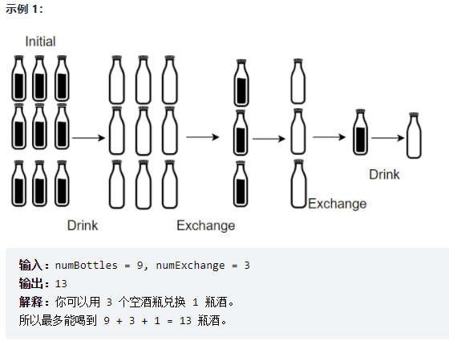
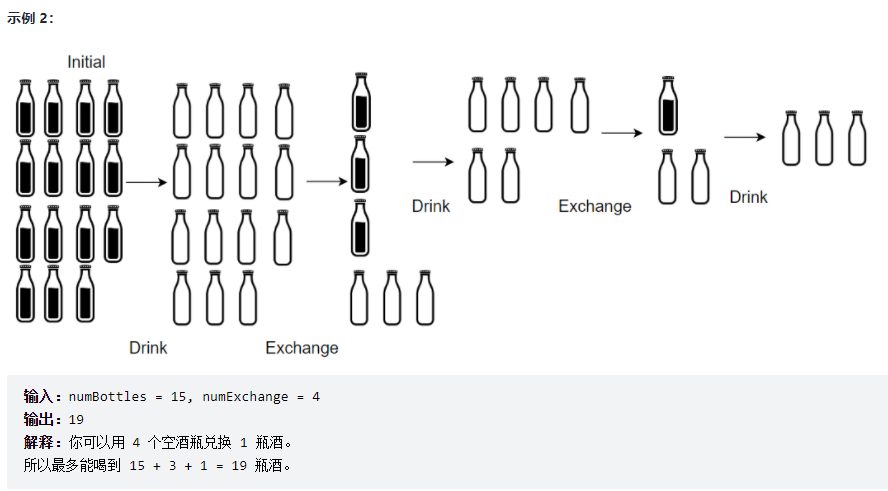

### 题目

小区便利店正在促销，用 numExchange 个空酒瓶可以兑换一瓶新酒。你购入了 numBottles 瓶酒。

如果喝掉了酒瓶中的酒，那么酒瓶就会变成空的。

请你计算 最多 能喝到多少瓶酒。

<!--more-->

### 示例





### 解答

根据题目进行模拟，要注意的是，已经换来的酒还可以继续换酒

```c++
int numWaterBottles(int numBottles, int numExchange) {
    //numExchange 多少个瓶子可以换一瓶酒
    // numBottles 买了多少瓶酒
    // 最终能喝多少酒
    int ans = numBottles;
    // 如果剩下的酒瓶还可以兑换
    while (numBottles >= numExchange) {
        // 计算可以换几瓶酒
        int change = numBottles / numExchange;
        // 喝酒
        ans += change;
        // 计算换完酒之后还有多少瓶子
        numBottles -= change * numExchange;
        // 把喝完酒的瓶子也算上
        numBottles += change;
    }
    return ans;
}
```

