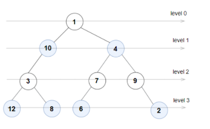
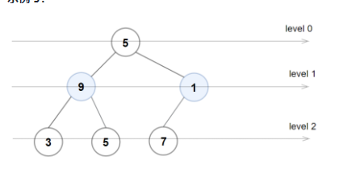

### 题目

如果一棵二叉树满足下述几个条件，则可以称为 奇偶树 ：

二叉树根节点所在层下标为 0 ，根的子节点所在层下标为 1 ，根的孙节点所在层下标为 2 ，依此类推。
偶数下标 层上的所有节点的值都是 奇 整数，从左到右按顺序 严格递增
奇数下标 层上的所有节点的值都是 偶 整数，从左到右按顺序 严格递减
给你二叉树的根节点，如果二叉树为 奇偶树 ，则返回 true ，否则返回 false 。

<!--more-->

### 示例



```tex
输入：root = [1,10,4,3,null,7,9,12,8,6,null,null,2]
输出：true
解释：每一层的节点值分别是：
0 层：[1]
1 层：[10,4]
2 层：[3,7,9]
3 层：[12,8,6,2]
由于 0 层和 2 层上的节点值都是奇数且严格递增，而 1 层和 3 层上的节点值都是偶数且严格递减，因此这是一棵奇偶树。
```


```tex
输入：root = [5,4,2,3,3,7]
输出：false
解释：每一层的节点值分别是：
0 层：[5]
1 层：[4,2]
2 层：[3,3,7]
2 层上的节点值不满足严格递增的条件，所以这不是一棵奇偶树。
```



```
输入：root = [5,9,1,3,5,7]
输出：false
解释：1 层上的节点值应为偶数。
```

```tex
示例 4：

输入：root = [1]
输出：true
示例 5：

输入：root = [11,8,6,1,3,9,11,30,20,18,16,12,10,4,2,17]
输出：true
```

### 解答

刚开始想法是用广度优先遍历每一层，把每一层的值存起来，每一层遍历完成之后，根据数的深度判断降序或者升序。

题目中的条件比较多，既要判断层深度的值是否是奇偶、还要判断这一层是否是降序、升序。

官方给的判断方式非常巧妙，`value % 2 == level % 2`就可以判断层数与对应值奇偶类型相同

### 代码

```C++
bool isEvenOddTree(TreeNode *root) {
    queue<TreeNode *> q;
    q.push(root);
    int level = 0;
    while (!q.empty()) {
        // 层数是偶数，就要升序，用最小值比
        // 层数是奇数、降序，用最大值来比
        int prev = level % 2 == 0 ? INT_MIN : INT_MAX;
        int q_len = q.size();
        for (int i = 0; i < q_len; i++) {
            TreeNode *temp = q.front();
            q.pop();
            int value = temp->val;
            //判断层数和对应的值的类型是否不同
            if (value % 2 == level % 2) {
                return false;
            }
            // 偶数层升序，奇数层降序
            if (level % 2 == 0 && value <= prev || level % 2 == 1 && value >= prev) {
                return false;
            }
            prev = value;
            if (temp->left != nullptr) {
                q.push(temp->left);
            }
            if (temp->right != nullptr) {
                q.push(temp->right);
            }
        }
        level++;
    }
    return true;
}
```
