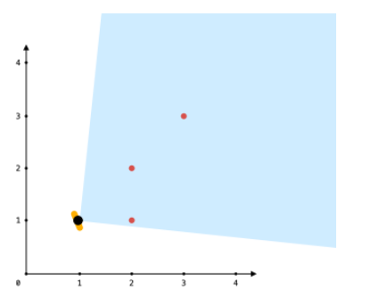
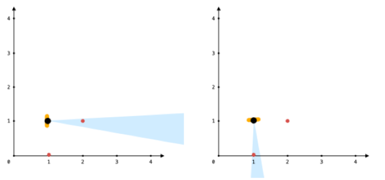
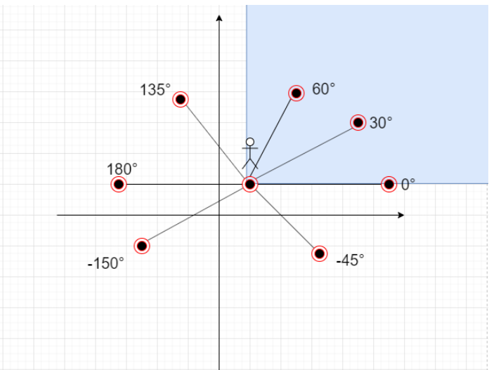
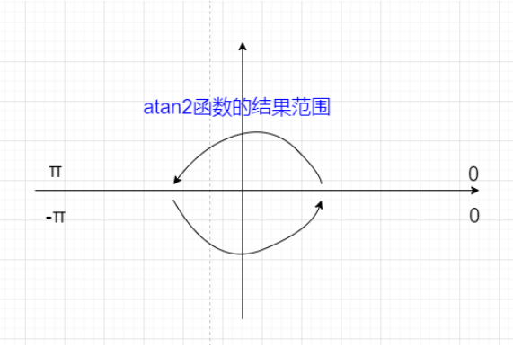

### 题目

给你一个点数组 points 和一个表示角度的整数 angle ，你的位置是 location ，其中 location = [posx, posy] 且 points[i] = [xi, yi] 都表示 X-Y 平面上的整数坐标。

最开始，你面向东方进行观测。你 不能 进行移动改变位置，但可以通过 自转 调整观测角度。换句话说，posx 和 posy 不能改变。你的视野范围的角度用 angle 表示， 这决定了你观测任意方向时可以多宽。设 d 为你逆时针自转旋转的度数，那么你的视野就是角度范围 [d - angle/2, d + angle/2] 所指示的那片区域。

对于每个点，如果由该点、你的位置以及从你的位置直接向东的方向形成的角度 位于你的视野中 ，那么你就可以看到它。

同一个坐标上可以有多个点。你所在的位置也可能存在一些点，但不管你的怎么旋转，总是可以看到这些点。同时，点不会阻碍你看到其他点。

返回你能看到的点的最大数目。

<!--more-->

### 示例



```tex
输入：points = [[2,1],[2,2],[3,3]], angle = 90, location = [1,1]
输出：3
解释：阴影区域代表你的视野。在你的视野中，所有的点都清晰可见，尽管 [2,2] 和 [3,3]在同一条直线上，你仍然可以看到 [3,3] 。
```

```tex
输入：points = [[2,1],[2,2],[3,4],[1,1]], angle = 90, location = [1,1]
输出：4
解释：在你的视野中，所有的点都清晰可见，包括你所在位置的那个点。
```



```tex
输入：points = [[1,0],[2,1]], angle = 13, location = [1,1]
输出：1
解释：如图所示，你只能看到两点之一。
```

### 解答

好难嗷

update：2021.12.18

你的视野范围是有限的只能看到angle范围内的东西，给你一个位置和许多东西，你可以通过旋转来看这些东西，但是你必须站在这个位置不能移动。

将所给的点全部转换为以`location`为原点的坐标，这样一来就很方便可以知道可以看到的点的位置了。



但是有一个很坑的地方就是`location`和points中的`point`可能会重合，所以我们要对与`location`重合的点进行重新判断，这些点肯定是能看到的。

剩下计算两个points中`point`的点位于`location`的极角，在这里又有一个很坑的地方，我们使用的方法`atan2`方法返回的极角范围如下



当我们旋转到超过PI时，就不行了。这里可以将所有的极角同时+360°，这样可以保证极角是单调的。

最后用窗口为`angle`来找到最终的结果

### 代码

```c++
int test(vector<vector<int>> &points, int angle, vector<int> &location){
    // 与location重合的点个数
    int sameCnt = 0;
    vector<double> polarDegrees;
    for (auto & point : points) {
        if (point[0] == location[0] && point[1] == location[1]) {
            sameCnt++;
            continue;
        }
        double degree = atan2(point[1] - location[1], point[0] - location[0]);
        polarDegrees.emplace_back(degree);
    }
    // 将计算的极角排序
    sort(polarDegrees.begin(), polarDegrees.end());

    int m = polarDegrees.size();
    for (int i = 0; i < m; ++i) {
        polarDegrees.emplace_back(polarDegrees[i] + 2 * M_PI);
    }

    int maxCnt = 0;
    int right = 0;
    double degree = angle * M_PI / 180;
    for (int i = 0; i < m; ++i) {
        while (right < polarDegrees.size() && polarDegrees[right] <= polarDegrees[i] + degree) {
            right++;
        }
        maxCnt = max(maxCnt, right - i);
    }
    return maxCnt + sameCnt;

}
```
