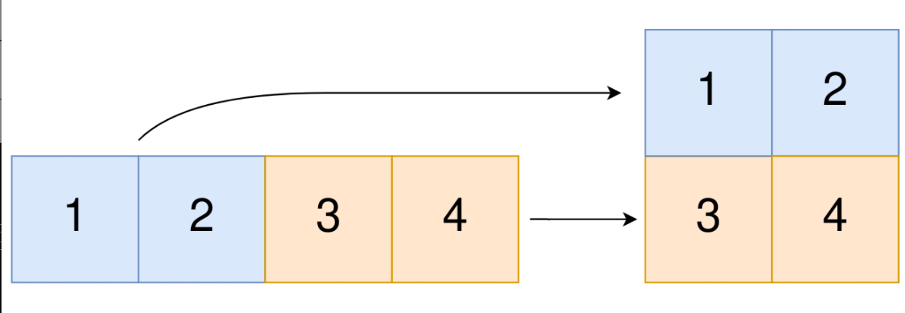

### 题目

给你一个下标从 0 开始的一维整数数组 original 和两个整数 m 和  n 。你需要使用 original 中 所有 元素创建一个 m 行 n 列的二维数组。

original 中下标从 0 到 n - 1 （都 包含 ）的元素构成二维数组的第一行，下标从 n 到 2 * n - 1 （都 包含 ）的元素构成二维数组的第二行，依此类推。

请你根据上述过程返回一个 m x n 的二维数组。如果无法构成这样的二维数组，请你返回一个空的二维数组。

<!--more-->

### 示例

#### 示例1



```tex
输入：original = [1,2,3,4], m = 2, n = 2
输出：[[1,2],[3,4]]
解释：
构造出的二维数组应该包含 2 行 2 列。
original 中第一个 n=2 的部分为 [1,2] ，构成二维数组的第一行。
original 中第二个 n=2 的部分为 [3,4] ，构成二维数组的第二行。
```

#### 示例2

```tex
输入：original = [1,2,3], m = 1, n = 3
输出：[[1,2,3]]
解释：
构造出的二维数组应该包含 1 行 3 列。
将 original 中所有三个元素放入第一行中，构成要求的二维数组。
```

#### 示例3

```tex
输入：original = [1,2], m = 1, n = 1
输出：[]
解释：
original 中有 2 个元素。
无法将 2 个元素放入到一个 1x1 的二维数组中，所以返回一个空的二维数组。
```

#### 示例4

```tex
输入：original = [3], m = 1, n = 2
输出：[]
解释：
original 中只有 1 个元素。
无法将 1 个元素放满一个 1x2 的二维数组，所以返回一个空的二维数组。
```

### 解答

根据题意进行模拟即可

### 代码

```c++
vector<vector<int>> construct2DArray(vector<int> &original, int m, int n) {
        if (original.size() != m * n) {
            return vector<vector<int>>{};
        }
        vector<vector<int>> ans;
        for (int i = 0; i < m; i++) {
            vector<int> temp;
            for (int j = 0; j < n; j++) {
                temp.emplace_back(original[i * n + j]);
            }
            ans.emplace_back(temp);
        }
        return ans;
    }
```

