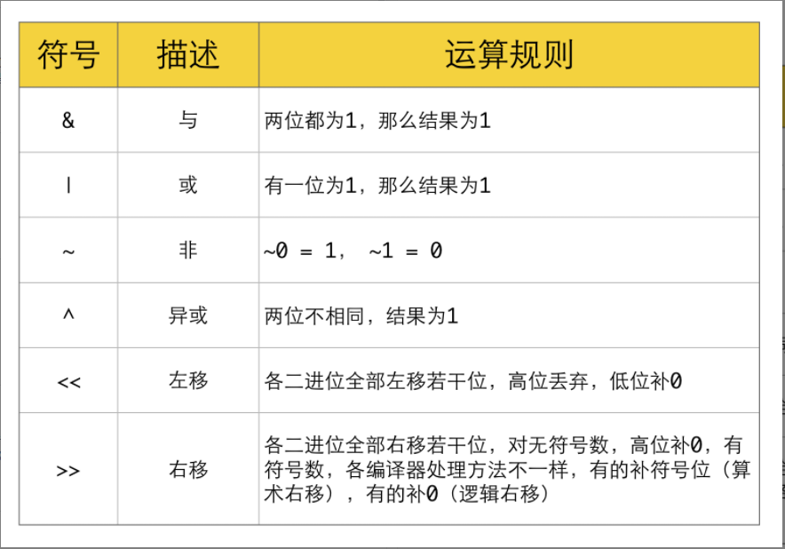
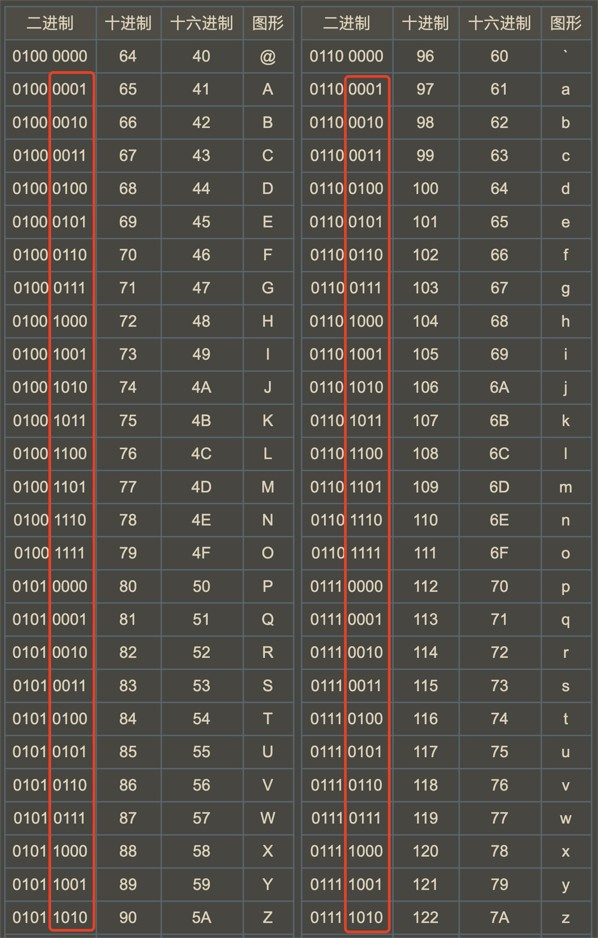

### 题目：

给你一个字符串 `s` ，将该字符串中的大写字母转换成相同的小写字母，返回新的字符串。

<!--more-->

### 示例

#### 示例 1：

```tex
输出："hello"
输入：s = "Hello" 
```

#### 示例 2：

```tex
输入：s = "here"
输出："here"
```

#### 示例 3：

``` tex
输入：s = "LOVELY"
输出："lovely"
```

### 解答

#### 位运算的由来

在计算机里面，任何数据最终都是用数字来表示的（不管是我们平时用的软件，看的图片，视频，还是文字）。
并且计算机运算单元只认识高低电位，转化成我们认识的逻辑，也就是 0 1 。

这就是导致计算机里面任何数据最终都是用二进制（0 1）来保存的数字。只是我们平时看到的图片、文字、软件都只从二进行数字转化而来的。

#### 位运算符号



#### 常用位操作

1. 判断奇偶

   - (x & 1) == 1 ---等价---> (x % 2 == 1)

   - (x & 1) == 0 ---等价---> (x % 2 == 0)
   - x / 2 ---等价---> x >> 1
2. x &= (x - 1) ------> 把x最低位的二进制1给去掉
3. x & -x -----> 得到最低位的1
4. x & ~x -----> 0

#### 指定位置的位运算

1. 将X最右边的n位清零：x & (~0 << n)
2. 获取x的第n位值：(x >> n) & 1
3. 获取x的第n位的幂值：x & (1 << n)
4. 仅将第n位置为1：x | (1 << n)
5. 仅将第n位置为0：x & (~(1 << n))
6. 将x最高位至第n位（含）清零：x & ((1 << n) - 1)
7. 将第n位至第0位（含）清零：x & (~((1 << (n + 1)) - 1))


#### 异或结合律

1. x ^ 0 = x, x ^ x = 0

2. x ^ (~0) = ~x, x ^ (~x) = ~0
3. a ^ b = c, a ^ c = b, b ^ c = a

> 注：(有没有点乘法结合律的意思)
> 字母表示：(a ^ b) ^ c = a ^ (b ^ c)
> 图形表示：(☆ ^ ◇) ^ △ = ☆ ^ (◇ ^ △)

#### 字母位运算技巧

- 大写变小写、小写变大写：字符 ^= 32 （大写 ^= 32 相当于 +32，小写 ^= 32 相当于 -32）
- 大写变小写、小写变小写：字符 |= 32 （大写 |= 32 就相当于+32，小写 |= 32 不变）
- 大写变大写、小写变大写：字符 &= -33 （大写 &= -33 不变，小写 &= -33 相当于 -32）

##### 原因



>  把字母当成 8 个bit 位来看，我把大小字母对应的后 4 位圈出来了。大家有没有发现 A-a B-b ... Z-z 26个字母之间的大小写的后 4 位是完全一样的！！！
>
> （重要知识点1：对应大小字母的 后4位二进制是一样的，后4位二进制是一样的，后4位二进制是一样的）再来看一下头 4位。对应大小字母之间就第 3位 的 bit 值不一样！！！
>
> （重要知识点2：对应大小字母的前4位中，只有第3位bit值不一样，只有第3位bit值不一样，只有第3位bit值不一样）
> 把不一样的bit位单独取出来，其它位补 0，也就是 0b0010 0000，对应的十进制数就是 32 ！！！

通过观察，我们发现对应的大小写字母之间，只有第3个bit位的值不一样，已此来做的区分。
那么上面提到的技巧的应用：

**字母 ^= 32 其是：字母 ^= 0b10 0000**
**字母 |= 32 其是：字母 |= 0b10 0000**
**字母 &= -33 其是：字母 ^= 0b1101 1111**
都是针对第3位bit值做的操作，从而可以不用提前知道原字母大小，通过位操作来达到大小写切换。

##### 只有26字母，为什么大小之间的ASCII差值是32，而不是26？

（其实有了上面的了解，再来看这件事就更容易理解了。）

因为字母大小之间的切换是一个很高频的行为，在设计ASCII表时，出于效率的考量，把大小之间的转换需要的 算力 压缩到最小。（关健词：算力）
也就是只需要对一个bit位操作就可以实现大小写之间的切换。

##### 如何压缩算力

如：

```c++
int n = 0b100;
n ^= 0b011;
```

n 最终等于 0b111。虽然只进行了一次 异或 操作，但是对于最底层的 异或 逻辑，是需要对各个bit分别进行一次 异或运算 最终把 3次 的异或累加返回。

同样的逻辑，对应到字母大小之间的切换，每次只需要 1次位操作 就可以得做到大小写切换。（关键词：1次）
从而把大小之间转换的代价压缩到最小。

### 代码

```c++
 string toLowerCase(string s) {
        int dis = 'a' - 'A';
        for (int i = 0; i < s.size(); i++) {
            if (s[i] >= 'A' && s[i] <= 'Z') {
                s[i] = s[i] +dis;
            }
        }
        return s;
 }


string toLowerCase(string s) {
        for (char& ch: s) {
            ch = tolower(ch);
        }
        return s;
}

```


[5种解法，你应该背下的位操作知识 - 2 的幂 - 力扣（LeetCode） (leetcode-cn.com)](https://leetcode-cn.com/problems/power-of-two/solution/5chong-jie-fa-ni-ying-gai-bei-xia-de-wei-6x9m/)

