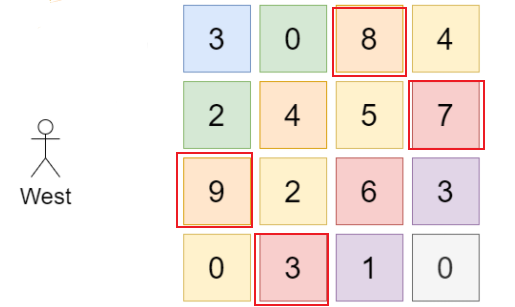

### 题目

给你一座由 n x n 个街区组成的城市，每个街区都包含一座立方体建筑。给你一个下标从 0 开始的 n x n 整数矩阵 grid ，其中 grid[r][c] 表示坐落于 r 行 c 列的建筑物的 高度 。

城市的 天际线 是从远处观察城市时，所有建筑物形成的外部轮廓。从东、南、西、北四个主要方向观测到的 天际线 可能不同。

我们被允许为 任意数量的建筑物 的高度增加 任意增量（不同建筑物的增量可能不同） 。 高度为 0 的建筑物的高度也可以增加。然而，增加的建筑物高度 不能影响 从任何主要方向观察城市得到的 天际线 。

在 不改变 从任何主要方向观测到的城市 天际线 的前提下，返回建筑物可以增加的 最大高度增量总和 。

<!--more-->

#### 示例


```tex
输入：grid = [[3,0,8,4],[2,4,5,7],[9,2,6,3],[0,3,1,0]]
输出：35
解释：建筑物的高度如上图中心所示。
用红色绘制从不同方向观看得到的天际线。
在不影响天际线的情况下，增加建筑物的高度：
gridNew = [ [8, 4, 8, 7],
            [7, 4, 7, 7],
            [9, 4, 8, 7],
            [3, 3, 3, 3] ]
```

```tex
输入：grid = [[0,0,0],[0,0,0],[0,0,0]]
输出：0
解释：增加任何建筑物的高度都会导致天际线的变化。
```

### 解答

根据官方给的例子我们可以发现，从某个方位看过去的样子和这一个方位最低的没有关系，如示例1：我们从西边看过去是【8，7，9，3】



题目的意思是：在不改变每一个方位看到的样子的前提下，尽可能多的给“楼层”增加高度，从东西看到的形状是“相同”的，从南北看到的形状是“相同”的。所以我们在添加楼层的时候受限制的就是每一行和每一列的最大值中的最小的一个。

比如在`grid[0][0]`这个位置，这一行最高的是`8`，这一列最高的是`9`，那么他最高只能为`8`,如果为`9`，就会影响从东西看到的形状。

我们只要找到每一行和每一列对应的最大值，之后对应位置的值为，这一行、这一列的最大值中的最小的一个。

#### 代码

```c++
int maxIncreaseKeepingSkyline(vector<vector<int>> &grid) {
        int n = grid.size();
        vector<int> maxColumn;
        vector<int> maxRow;
        for (int i = 0; i < n; i++) {
            int max = -1;
            for (int j = 0; j < n; j++) {
                if (grid[i][j] > max) {
                    max = grid[i][j];
                }
            }
            maxRow.emplace_back(max);
        }

        for (int i = 0; i < n; i++) {
            int max = -1;
            for (int j = 0; j < n; j++) {
                if (grid[j][i] > max) {
                    max = grid[j][i];
                }
            }
            maxColumn.emplace_back(max);
        }
        int res = 0;
        for (int i = 0; i < n; i++) {
            for (int j = 0; j < n; j++) {
                if (maxRow[i] < maxColumn[j]) {
                    res += (maxRow[i] - grid[i][j]);
                } else {
                    res += (maxColumn[j] - grid[i][j]);
                }
            }
        }
        return res;
 }
```

上面代码和下面代码的时间复杂度是一样的，但是能用一个循环解决。

```C++
int maxIncreaseKeepingSkyline(vector<vector<int>> &grid) {
        int n = grid.size();
        vector<int> maxColumn;
        vector<int> maxRow;
        for (int i = 0; i < n; i++) {
            int maxRowTemp = -1;
            int maxColumnTemp = -1;
            for (int j = 0; j < n; j++) {
                if (grid[i][j] > maxRowTemp) {
                    maxRowTemp = grid[i][j];
                }
                if (grid[j][i] > maxColumnTemp) {
                    maxColumnTemp = grid[j][i];
                }
            }
            maxColumn.emplace_back(maxColumnTemp);
            maxRow.emplace_back(maxRowTemp);
        }
        int res = 0;
        for (int i = 0; i < n; i++) {
            for (int j = 0; j < n; j++) {
                if (maxRow[i] < maxColumn[j]) {
                    res += (maxRow[i] - grid[i][j]);
                } else {
                    res += (maxColumn[j] - grid[i][j]);
                }
            }
        }
        return res;
    }
```


