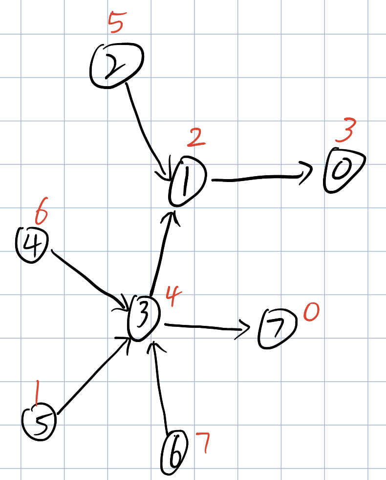

### 题目

有一组 n 个人作为实验对象，从 0 到 n - 1 编号，其中每个人都有不同数目的钱，以及不同程度的安静值（quietness）。为了方便起见，我们将编号为 x 的人简称为 "person x "。

给你一个数组 richer ，其中 richer[i] = [ai, bi] 表示 person ai 比 person bi 更有钱。另给你一个整数数组 quiet ，其中 quiet[i] 是 person i 的安静值。richer 中所给出的数据 逻辑自洽（也就是说，在 person x 比 person y 更有钱的同时，不会出现 person y 比 person x 更有钱的情况 ）。

现在，返回一个整数数组 answer 作为答案，其中 answer[x] = y 的前提是，在所有拥有的钱肯定不少于 person x 的人中，person y 是最安静的人（也就是安静值 quiet[y] 最小的人）。

<!--more-->

### 示例

```tex
输入：richer = [[1,0],[2,1],[3,1],[3,7],[4,3],[5,3],[6,3]], quiet = [3,2,5,4,6,1,7,0]
输出：[5,5,2,5,4,5,6,7]
解释： 
answer[0] = 5，
person 5 比 person 3 有更多的钱，person 3 比 person 1 有更多的钱，person 1 比 person 0 有更多的钱。
唯一较为安静（有较低的安静值 quiet[x]）的人是 person 7，
但是目前还不清楚他是否比 person 0 更有钱。
answer[7] = 7，
在所有拥有的钱肯定不少于 person 7 的人中（这可能包括 person 3，4，5，6 以及 7），
最安静（有较低安静值 quiet[x]）的人是 person 7。
其他的答案也可以用类似的推理来解释。
```

```tex
输入：richer = [], quiet = [0]
输出：[0]
```

### 解答

在题目中，两个人之间有一个金钱高低的比较，并且每个人都有一定的安静值，我们可以这样来理解有人比你穷有人比你穷，无论他们穷还是富，都有一种特征`低调`（安静值）,题目给出两个人之间的贫富关系，你让找出一个人，他比`x`人富或一样富，但是他最低调（安静值最低）。

根据题目给出的示例我们可以换出一张有向图，节点表示人的编号，节点的值表示这个人的低调程度，箭头指向的是比这个人穷的人。以示例1为例。



比0富有的有0,1,2,3,4,5,6，其中最低调的是5

比2富有的只有2，最低调也是2

有了上述的模拟思路，我们只要将题目中给的信息转换为上图，然后对于每一个人，找到比他富的人中最低调就行。

我们用邻接矩阵来保存上述信息moreRicher[i]表示比i富的人，用一个数组保存结果。只需要对每一个人进行深度遍历就行。

```C++
vector<int> loudAndRich(vector<vector<int> > richer, vector<int> quiet) {
    // 构造一个领接矩阵来存比某个人更富有
    // moreRicher[0] = {1,2}
    // 就是1,2比0号更富有
    vector<vector<int>> moreRicer(quiet.size());
    //初始化 把所有比他富有的人构造出来
    for (int i = 0; i < richer.size(); i++) {
        // richer[i][1]是穷的一个
        moreRicer[richer[i][1]].emplace_back(richer[i][0]);
    }
    vector<int> ans(quiet.size(), -1);

    function<int(int)> dfs = [&](int x) {
        // 如果这个人的符合题意要求已经找到
        if (ans[x] != -1) {
            return ans[x];
        }
        // 起始和自己相比较
        ans[x] = x;
        for (int i = 0; i < moreRicer[x].size(); i++) {
            int id = dfs(moreRicer[x][i]);
            if (quiet[id] < quiet[ans[x]]) {
                ans[x] = id;
            }
        }
        return ans[x];
    };
    // 先处理没有人比他更富的人

    for (int i = 0; i < quiet.size(); i++) {
        // 如果没有比他更富的，结果就是他自己
        if (moreRicer[i].empty()) {
            ans[i] = i;
            continue;
        }
        dfs(i);
    }
    return ans;
}
```

