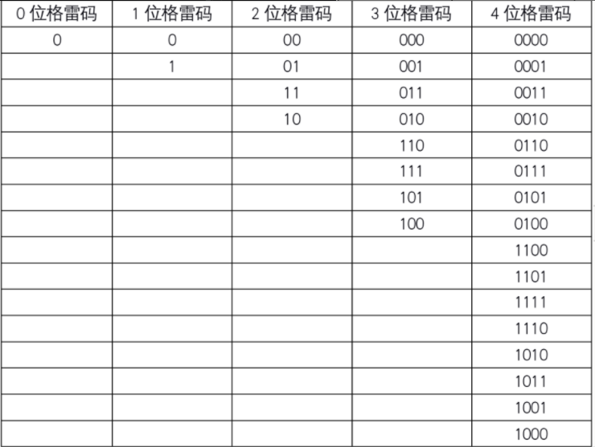

### 题目

n 位格雷码序列 是一个由 2^n 个整数组成的序列，其中：
每个整数都在范围 [0, 2^n - 1] 内（含 0 和 2^n - 1）
第一个整数是 0
一个整数在序列中出现 不超过一次
每对 相邻 整数的二进制表示 恰好一位不同 ，且第一个 和 最后一个 整数的二进制表示 恰好一位不同
给你一个整数 n ，返回任一有效的 n 位格雷码序列 。

<!--more-->

### 示例

#### 示例 1
```tex
输入：n = 2
输出：[0,1,3,2]
解释：
[0,1,3,2] 的二进制表示是 [00,01,11,10] 。
- 00 和 01 有一位不同

- 01 和 11 有一位不同

- 11 和 10 有一位不同

- 10 和 00 有一位不同
  [0,2,3,1] 也是一个有效的格雷码序列，其二进制表示是 [00,10,11,01] 。

- 00 和 10 有一位不同

- 10 和 11 有一位不同

- 11 和 01 有一位不同

- 01 和 00 有一位不同
```
#### 示例 2：
```tex
输入：n = 1
输出：[0,1]
```

### 解答

给一个整数n，返回任一有效的n位格雷码序列。

n 位格雷码序列是一个由 2^n 个整数组成的序列，其中：
每个整数都在范围 [0, 2^n - 1] 内（含 0 和 2^n - 1）

1. 第一个整数是 0

2. 一个整数在序列中出现 不超过一次
3. 每对 相邻 整数的二进制表示 恰好一位不同 ，且
4. 第一个 和 最后一个 整数的二进制表示 恰好一位不同

下表为0为、1位、2位、3位、4位格雷码的实例，我们可以发现这样一个规律。



总结规律：

1. 1位格雷码有两个码字
2. (n+1)位格雷码中的前2^n个码字等于n位格雷码的码字，按顺序书写，加前缀0
3. (n+1)位格雷码中的后2^n个码字等于n位格雷码的码字，按逆序书写，加前缀1
4. n+1位格雷码的集合 = n位格雷码集合(顺序)加前缀0 + n位格雷码集合(逆序)加前缀1

### 代码

```c++
vector<int> grayCode(int n) {
        vector<int> result;
        result.push_back(0);
        if(n == 0) {
            return result;
        }
        int first = 1;
        for(int i = 0; i < n; i++){
            for(int j = result.size() - 1; j >= 0; j--){
                result.push_back(first + result[j]);
            }
            first = first << 1;
        }
        return result;
    }
```


