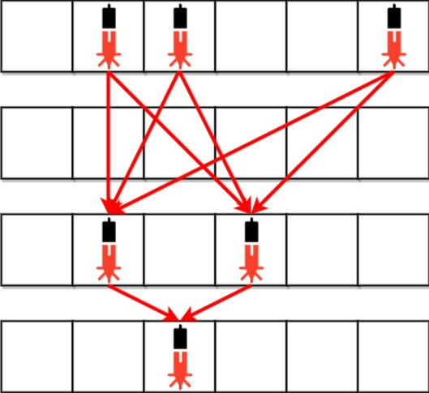
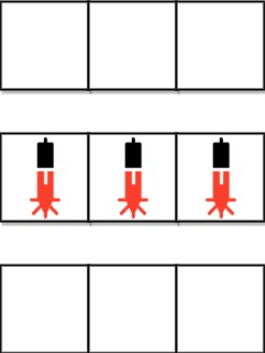

第一次参加LeetCode的周赛，记录一下自己AC的三道简单题。

<!--more-->

### [5967. 检查是否所有 A 都在 B 之前](https://leetcode-cn.com/problems/check-if-all-as-appears-before-all-bs/)

#### 题目

给你一个 仅 由字符 'a' 和 'b' 组成的字符串  s 。如果字符串中 每个 'a' 都出现在 每个 'b' 之前，返回 true ；否则，返回 false 。

#### 示例

##### 示例1

```tex
输入：s = "aaabbb"
输出：true
解释：
'a' 位于下标 0、1 和 2 ；而 'b' 位于下标 3、4 和 5 。
因此，每个 'a' 都出现在每个 'b' 之前，所以返回 true 。
```
##### 示例2

```tex
输入：s = "abab"
输出：false
解释：
存在一个 'a' 位于下标 2 ，而一个 'b' 位于下标 1 。
因此，不能满足每个 'a' 都出现在每个 'b' 之前，所以返回 false 。
```
##### 示例3

```tex
输入：s = "bbb"
输出：true
解释：
不存在 'a' ，因此可以视作每个 'a' 都出现在每个 'b' 之前，所以返回 true 。
```
#### 解答

找到第一个出现的b，如果出现的a的下标比b大，返回false即可。

#### 代码

```c++
bool checkString(string s) {
        int index_b = -1;
        for (int i = 0; i < s.size(); i++) {
            // 找到第一个出现的b
            if (index_b == -1 && s[i] == 'b') {
                index_b = i;
            }
            // 如果出现的a的下标比b大 返回false
            if (s[i] == 'a' && index_b != -1 && index_b < i) {
                return false;
            }
        }
        return true;
    }
```

### [5968. 银行中的激光束数量](https://leetcode-cn.com/problems/number-of-laser-beams-in-a-bank/)

#### 题目

银行内部的防盗安全装置已经激活。给你一个下标从 0 开始的二进制字符串数组 bank ，表示银行的平面图，这是一个大小为 m x n 的二维矩阵。 bank[i] 表示第 i 行的设备分布，由若干 '0' 和若干 '1' 组成。'0' 表示单元格是空的，而 '1' 表示单元格有一个安全设备。

对任意两个安全设备而言，如果同时 满足下面两个条件，则二者之间存在 一个 激光束：

两个设备位于两个 不同行 ：r1 和 r2 ，其中 r1 < r2 。
满足 r1 < i < r2 的 所有 行 i ，都 没有安全设备 。
激光束是独立的，也就是说，一个激光束既不会干扰另一个激光束，也不会与另一个激光束合并成一束。

返回银行中激光束的总数量。

#### 示例

##### 示例1



```tex
输入：bank = ["011001","000000","010100","001000"]
输出：8
解释：在下面每组设备对之间，存在一条激光束。总共是 8 条激光束：
 * bank[0][1] -- bank[2][1]
 * bank[0][1] -- bank[2][3]
 * bank[0][2] -- bank[2][1]
 * bank[0][2] -- bank[2][3]
 * bank[0][5] -- bank[2][1]
 * bank[0][5] -- bank[2][3]
 * bank[2][1] -- bank[3][2]
 * bank[2][3] -- bank[3][2]
注意，第 0 行和第 3 行上的设备之间不存在激光束。
这是因为第 2 行存在安全设备，这不满足第 2 个条件。
```

##### 示例2



```tex
输入：bank = ["000","111","000"]
输出：0
解释：不存在两个位于不同行的设备
```

#### 解答

统计每一行的设备的个数，根据相隔两行的设备个数求出总共的激光束。

如果出现类似示例1的情况，要进行特殊处理。前一行的设备不为0，这一行的为0，那么这样行的设备书就是上一行的设备数。

#### 代码

```c++
int numberOfBeams(vector<string>& bank) {
        vector<int> counts;
        for (const string& s: bank) {
            int c = 0;
            for (char i: s) {
                if (i == '1') {
                    c += 1;
                }
            }
            counts.emplace_back(c);
        }
        int ans = 0;
        for (int i = 0; i < counts.size() - 1; i++) {
            // 示例1的情况特殊处理
            if(i>0&&counts[i]==0&&counts[i-1]!=0){
                counts[i] = counts[i-1];
            }
            ans += counts[i] * counts[i + 1];
        }
        return ans;
    }
```

### [5969. 摧毁小行星](https://leetcode-cn.com/problems/destroying-asteroids/)

#### 题目

给你一个整数 mass ，它表示一颗行星的初始质量。再给你一个整数数组 asteroids ，其中 asteroids[i] 是第 i 颗小行星的质量。

你可以按 任意顺序 重新安排小行星的顺序，然后让行星跟它们发生碰撞。如果行星碰撞时的质量 大于等于 小行星的质量，那么小行星被 摧毁 ，并且行星会 获得 这颗小行星的质量。否则，行星将被摧毁。

如果所有小行星 都 能被摧毁，请返回 true ，否则返回 false 。

#### 示例

##### 示例 1

```tex
输入：mass = 10, asteroids = [3,9,19,5,21]
输出：true
解释：一种安排小行星的方式为 [9,19,5,3,21] ：

- 行星与质量为 9 的小行星碰撞。新的行星质量为：10 + 9 = 19
- 行星与质量为 19 的小行星碰撞。新的行星质量为：19 + 19 = 38
- 行星与质量为 5 的小行星碰撞。新的行星质量为：38 + 5 = 43
- 行星与质量为 3 的小行星碰撞。新的行星质量为：43 + 3 = 46
- 行星与质量为 21 的小行星碰撞。新的行星质量为：46 + 21 = 67
  所有小行星都被摧毁。
```

##### 示例2

```tex
输入：mass = 5, asteroids = [4,9,23,4]
输出：false
解释：
行星无论如何没法获得足够质量去摧毁质量为 23 的小行星。
行星把别的小行星摧毁后，质量为 5 + 4 + 9 + 4 = 22 。
它比 23 小，所以无法摧毁最后一颗小行星。
```

#### 解答

题目中说了可以自由安排小行星的顺序，我们对小行星重新排序即可。

注意是否越界。

#### 代码

```c++
bool asteroidsDestroyed(int mass, vector<int>& asteroids) {
        sort(asteroids.begin(), asteroids.end());
        long long res = mass;
        for(int i:asteroids){
            if(res>=i){
                res+=i;
            }else{
                return false;
            }
        }
        return true;
    }
```

### 总结

第一次参加周赛还行，前三题都有思路，因为做题开始的时间比较晚，三十分钟做了三道题还行。第三题提交的时候已经十二点了，超过时间了，没有提交上去。

下周继续吧！
