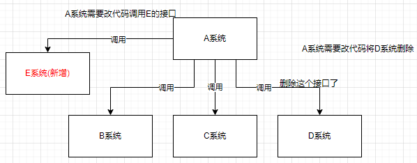
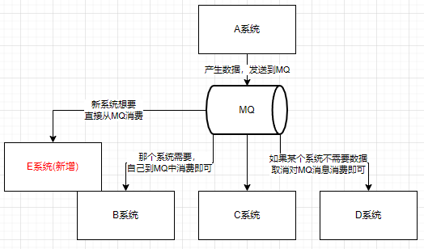
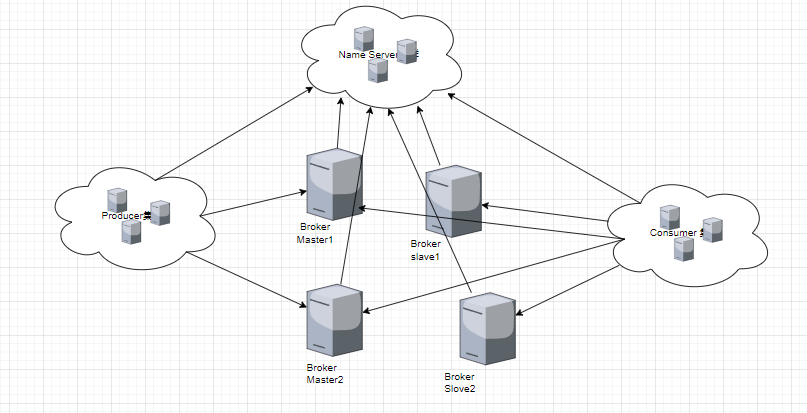
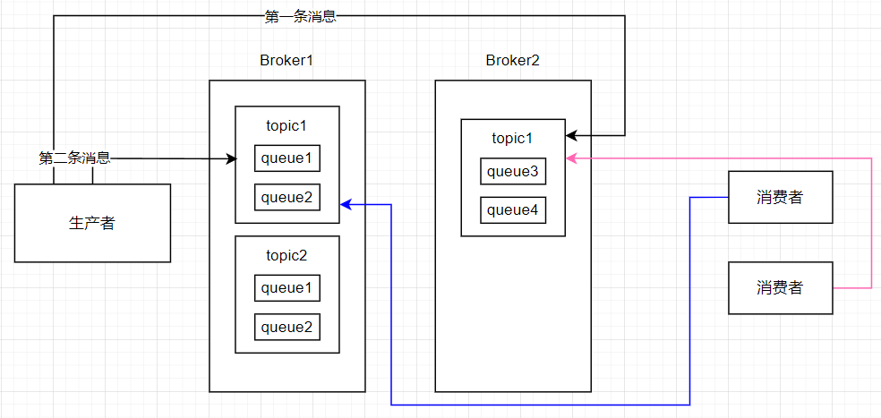

在介绍分布式事务的时候我们介绍过MQ(消息队列),只是简单的提了一下，这篇文章会从mQ的基本概念、RocketMQ的概念，使用RocketMQ等几个方面介绍RocketMQ。

<!--more-->

## MQ使用场景

### 什么是MQ

消息队列是一种`先进先出`的数据结构

### 应用场景

其应用场景主要包含以下三个方面

#### 应用解耦

**系统的耦合性越高，容错性就越低。**

以电商应用为例，用户创建订单后,如果耦合调用库存系统、物流系统、支付系统，任何一个子系统出了故障或者因为升级等原因暂时不可用，都会造成下单操作异常，影响用户使用体验。

使用消息队列解耦合，系统的耦合性就会提高了。比如物流系统发生故障，需要几分钟才能来修复,在这段时间内,物流系统要处理的数据被缓存到消息队列中，用户的下单操作正常完成。当物流系统回复后，补充处理存在消息队列中的订单消息即可，终端系统感知不到物流系统发生过几分钟故障。

### 流量削峰

应用系统如果遇到系统请求流量的瞬间猛增，有可能会将系统压垮。有了消息队列可以将大量请求缓存起来，分散到很长一段时间处理，这样可以大大提到系统的稳定性和用户体验。

一般情况，为了保证系统的稳定性，如果系统负载超过阈值，就会阻止用户请求，这会影响用户体验,而如果使用消息队列将请求缓存起来，等待系统处理完毕后通知用户下单完毕，这样总不能下单体验要好。

出于经济考量目的:业务系统正常时段的QPS如果是1000,流量最高峰是10000，为了应对流量高峰配置高性能的服务器显然不划算,这时可以使用消息队列对峰值流量削峰。

### 数据分发

对与A系统，其他系统都要A系统的服务，在不使用MQ时，如果要新增一个系统来拿到A系统的信息，这时候就要改A系统的代码，让他能和E系统通信。如果其中的一个系统不想要A系统了，这时候还要删除与它相关的代码。



而引入MQ之后，A系统将自己的产生的数据发送到MQ中，新系统想要数据就直接从MQ中消费，原来的系统如果不需要这些数据了，就可以不接受。




### 缺点

缺点包含以下几点:

- 系统可用性降低
  - 系统引入的外部依赖越多，系统稳定性越差。一旦MQ宕机，就会对业务造成影响。
  - 如何保证MQ的高可用?
- 系统复杂度提高
  - MQ的加入大大增加了系统的复杂度，以前系统间是同步的远程调用，现在是通过MQ进行异步调用。
  - 如何保证消息没有被**重复消费**?怎么处理**消息丢失情况**?那么保证消息传递的顺序性?
- 一致性问题
  - A系统处理完业务，通过MQ给B、C、 D三个系统发消息数据，如果B系统、C系统处理成功，D系统处理失败。
  - 如何保证消息数据处理的一致性?

## RocketMQ的安装

### 新建配置文件

`./data/brokerconf/broker.conf`写入以下内容

```go
# 所属集群名字
brokerClusterName=DefaultCluster

# broker 名字，注意此处不同的配置文件填写的不一样，如果在 broker-a.properties 使用: broker-a,
# 在 broker-b.properties 使用: broker-b
brokerName=broker-a

# 0 表示 Master，> 0 表示 Slave
brokerId=0

# nameServer地址，分号分割
# namesrvAddr=rocketmq-nameserver1:9876;rocketmq-nameserver2:9876

# 启动IP,如果 docker 报 com.alibaba.rocketmq.remoting.exception.RemotingConnectException: connect to <192.168.0.120:10909> failed
# 解决方式1 加上一句 producer.setVipChannelEnabled(false);，解决方式2 brokerIP1 设置宿主机IP，不要使用docker 内部IP
brokerIP1=192.168.0.2 #如果没有报错就不用管

# 在发送消息时，自动创建服务器不存在的topic，默认创建的队列数
defaultTopicQueueNums=4

# 是否允许 Broker 自动创建 Topic，建议线下开启，线上关闭 ！！！这里仔细看是 false，false，false
autoCreateTopicEnable=true

# 是否允许 Broker 自动创建订阅组，建议线下开启，线上关闭
autoCreateSubscriptionGroup=true

# Broker 对外服务的监听端口
listenPort=10911

# 删除文件时间点，默认凌晨4点
deleteWhen=04

# 文件保留时间，默认48小时
fileReservedTime=120

# commitLog 每个文件的大小默认1G
mapedFileSizeCommitLog=1073741824

# ConsumeQueue 每个文件默认存 30W 条，根据业务情况调整
mapedFileSizeConsumeQueue=300000

# destroyMapedFileIntervalForcibly=120000
# redeleteHangedFileInterval=120000
# 检测物理文件磁盘空间
diskMaxUsedSpaceRatio=88
# 存储路径
# storePathRootDir=/home/ztztdata/rocketmq-all-4.1.0-incubating/store
# commitLog 存储路径
# storePathCommitLog=/home/ztztdata/rocketmq-all-4.1.0-incubating/store/commitlog
# 消费队列存储
# storePathConsumeQueue=/home/ztztdata/rocketmq-all-4.1.0-incubating/store/consumequeue
# 消息索引存储路径
# storePathIndex=/home/ztztdata/rocketmq-all-4.1.0-incubating/store/index
# checkpoint 文件存储路径
# storeCheckpoint=/home/ztztdata/rocketmq-all-4.1.0-incubating/store/checkpoint
# abort 文件存储路径
# abortFile=/home/ztztdata/rocketmq-all-4.1.0-incubating/store/abort
# 限制的消息大小
maxMessageSize=65536

# flushCommitLogLeastPages=4
# flushConsumeQueueLeastPages=2
# flushCommitLogThoroughInterval=10000
# flushConsumeQueueThoroughInterval=60000

# Broker 的角色
# - ASYNC_MASTER 异步复制Master
# - SYNC_MASTER 同步双写Master
# - SLAVE
brokerRole=ASYNC_MASTER

# 刷盘方式
# - ASYNC_FLUSH 异步刷盘
# - SYNC_FLUSH 同步刷盘
flushDiskType=ASYNC_FLUSH

# 发消息线程池数量
# sendMessageThreadPoolNums=128
# 拉消息线程池数量
# pullMessageThreadPoolNums=128
```

`brokerIP1`是本机ip

### 新建`docker-compost.yml`

```yaml
version: '3.5'
services:
  rmqnamesrv:
    image: foxiswho/rocketmq:server
    container_name: rmqnamesrv
    ports:
      - 9876:9876
    volumes:
      - ./data/logs:/opt/logs
      - ./data/store:/opt/store
    networks:
        rmq:
          aliases:
            - rmqnamesrv

  rmqbroker:
    image: foxiswho/rocketmq:broker
    container_name: rmqbroker
    ports:
      - 10909:10909
      - 10911:10911
    volumes:
      - ./data/logs:/opt/logs
      - ./data/store:/opt/store
      - ./data/brokerconf/broker.conf:/etc/rocketmq/broker.conf
    environment:
        NAMESRV_ADDR: "rmqnamesrv:9876"
        JAVA_OPTS: " -Duser.home=/opt"
        JAVA_OPT_EXT: "-server -Xms128m -Xmx128m -Xmn128m"
    command: mqbroker -c /etc/rocketmq/broker.conf
    depends_on:
      - rmqnamesrv
    networks:
      rmq:
        aliases:
          - rmqbroker

  rmqconsole:
    image: styletang/rocketmq-console-ng
    container_name: rmqconsole
    ports:
      - 8080:8080
    environment:
        JAVA_OPTS: "-Drocketmq.namesrv.addr=rmqnamesrv:9876 -Dcom.rocketmq.sendMessageWithVIPChannel=false"
    depends_on:
      - rmqnamesrv
    networks:
      rmq:
        aliases:
          - rmqconsole

networks:
  rmq:
    name: rmq
    driver: bridge
```

### 启动`rocketmq`

```shell
docker-compose up
```

### 测试

在rocket-consle中发送消息。

浏览器中输入`http://localhost:8080`

选择`Topic`->`ADD/UPDATE`->选择默认的Cluster和BrokerName，输入自己的topic name--test->commit。右上角出现Success就是topic已经建立成功。

找到自己新建的topic名称，->SEND MAGGAGE->设置tag、key和内容->commit

在Message中通过topic筛选消息，可以看到已经发布的消息了。

## RocketMQ的基本概念




Producer：消息的发送者，消息的生产者。举例发信人
Consumer: 消息接收者，消息的消费者。举例:收信者
Broker: 暂存和传输消息。如果要拿具体的信息首先要从nameserver中拿具体的broker信息，再到具体的broker中获取信息;举例:邮局
NameServer: 管理Broker，类似于注册中心，同步存数据的各个结点，但是这个集群不用做数据同步。原因：？？; 举例:各个邮局的管理机构
Topic: 区分消息的种类;一个发送者可以发送消息给一 个或者多个Topic;一-个消息的接收者可以订阅一个或者多个Topic消息。类似你可以把你写的文章放到不同的平台，看文章的人可以从多个平台看文章
Message Queue:相当于是Topic的分区;用于并行发送和接收消息

## RocketMQ的消息类型

### 按照发送的特点分

#### 同步发送

a.同步发送，线程阻塞，投递completes阻塞结束I
b.如果发送失败，会在默认的超时时间3秒内进行重试，最多重试2次
c.投递completes不代表投递成功，要check SendResult.sendStatus来判断是否投递成功
d. SendResult里面有发送状态的枚举: SendStatus, 同步的消息投递有一个状态返回值的

```java
public enum SendStatus {
	SEND_ OK; // 成功
	FLUSH_ DISK_ TIMEOUT;
    FLUSH_ SLAVE TIMEOUT;
	SLAVE_ NOT_ AVAILABLE;
}
```

e. retry的实现原理:只有ack的SendStatus=SEND_ OK才会停止retry
注意事项:发送同步消息且Ack为SEND. OK,只代表该消息成功的写入了MQ当中，并不代表该消息成功的被Consumer消费了。

#### 异步发送

a.异步调用的话，当前线程一定要等待异步线程回调结束再关闭producer啊，因为是异步的，不会阻塞提前关闭producer会导致未回调链接就断开了。
b.异步消息不retry,投递失败回调onException()方法，只有同步消息才会retry。
C.异步发送一般用于链路耗时较长，对RT响应时间较为敏感的业务场景,例如用户视频上传后通知启动转码服务，转码完成后通知推送转码结果等。

#### 单向发送

a.消息不可靠，性能高，只负责往服务器发送一条消息， 不会重试也不关心是否发送成功
b.此方式发送消息的过程耗时非常短, 一般在微秒级别

下表概括了三者的特点和主要区别

| 发送方式 | 发送TPS(性能测试指标) | 发送结果反馈 | 可靠性     |
| -------- | --------------------- | ------------ | ---------- |
| 同步发送 | 快                    | 有           | 不丢失     |
| 异步发送 | 快                    | 有           | 不丢失     |
| 单向发送 | 最快                  | 没有         | 可能会丢失 |

### 按照使用功能特点分

#### 普通消息(订阅)

普通消息是我们在业务开发中用到的最多的消息类型，生产者需要关注消息发送成功即可，消费者消费到消息即可，不需要保证消息的顺序，所以消息可以大规模并发地发送和消费,吞吐量很高，适合大部分场景。不能够保证顺序。



#### 顺序消息

顺序消息分为分区顺序消息和全局顺序消息。

全局顺序消息比较容易理解，也就是哪条消息先进入，哪条消息就会先被消费,符合我们的FIFO。

很多时候全局消息的实现代价很大，所以就出现了分区顺序消息。

我们通过对消息的key,进行hash,相同hash的消息会被分配到同一个分区里面，当然如果要做全局顺序消息，我们的分区只需要-一个即可，所以全局顺序消息的代价是比较大的。

#### 延时消息

主要用来订单超时库存归还。

延迟的机制是在服务端实现的，也就是Broker收到了消息，但是经过一段时间以后才发送服务器按照1-N定义了如下级别:“1s 5s 10s 30s 1m 2m 3m 4m 5m 6m 7m 8m 9m 10m 20m 30m 1h 2h”。

若要发送定时消息，在应用层初始化Message消息对象之后，调用Message.setDelayTimeLevel(int level)方法来设置延迟级别，按照序列取相应的延迟级别，例如level=2,则延迟为5s。

```text
msg.setDelayLevel(2);
SendResult sendResult = producer.send(msg)
```

实现原理:
a.发送消息的时候如果消息设置了`DelayTimeLevel`,那么该消息会被丢到`ScheduleMessageService.SCHEDULE_ TOPIC`这个Topic里面
b.根据`DelayTimeLevel`选择对应的queue
C.再把真实的topic和queue信息封装起来, set到msg里面
d.然后每个`SCHEDULE TOPIC_ XXX`的每个`DelayTimeLevelQueue`,有定时任务去刷新，是否有待投递的消息
e.每10s定时持久化发送进度

#### 事务消息

消息队列RocketMQ版提供的分布式事务消息适用于所有对数据最终一致性有 强需求的场景。

##### 概念介绍

事务消息:消息队列RocketMQ版提供类似X或Open XA的分布式事务功能，通过消息队列RocketMQ版事务消息能达到分布式事务的最终一致。

半事务消息:暂不能投递的消息，发送方已经成功地将消息发送到了消息队列RocketMQ版服务端，但是服务端未收到生产者对该消息的二次确认，此时该消息被标记成“暂不能投递”状态，处于该种状态下的消息即半事务消息。

消息回查:由于网络闪断、生产者应用重启等原因，导致某条事务消息的二次确认丢失,消息队列RocketMQ版服务端通过扫描发现某条消息长期处于“半事务消息”时，需要主动向消息生产者询问该消息的最终状态(Commit或是Rollback)，该询问过程即消息回查。

##### 分布式事务消息的优势

消息队列RocketMQ版分布式事务消息不仅可以实现应用之间的解耦，又能保证数据的最终一致性。 同时，传统的大事务可以被拆分为小事务,不仅能提升效率，还不会因为某一个关联应用的不可用导致整体回滚,从而最大限度保证核心系统的可用性。在极端情况下，如果关联的某一个应用始终无法处理成功，也只需对当前应用进行补偿或数据订正处理，而无需对整体业务进行回滚。

## Go操作RocketMQ

### RocketMQ发送普通消息

```go
package main

import (
	"context"
	"fmt"
	"os"
	"strconv"

	"github.com/apache/rocketmq-client-go/v2"
	"github.com/apache/rocketmq-client-go/v2/primitive"
	"github.com/apache/rocketmq-client-go/v2/producer"
)

// Package main implements a simple producer to send message.
func main() {
	p, err := rocketmq.NewProducer(
		producer.WithNsResolver(primitive.NewPassthroughResolver([]string{"192.168.0.2:9876"})),
		producer.WithRetry(2),
	)

	if err != nil {
		fmt.Printf("new producer error: %s", err.Error())
		os.Exit(1)
	}
	err = p.Start()
	if err != nil {
		fmt.Printf("start producer error: %s", err.Error())
		os.Exit(1)
	}
	topic := "hellomq"

	for i := 0; i < 10; i++ {
		msg := &primitive.Message{
			Topic: topic,
			Body:  []byte("Hello RocketMQ Go Client! " + strconv.Itoa(i)),
		}
		res, err := p.SendSync(context.Background(), msg)

		if err != nil {
			fmt.Printf("send message error: %s\n", err)
		} else {
			fmt.Printf("send message success: result=%s\n", res.String())
		}
	}
	err = p.Shutdown()
	if err != nil {
		fmt.Printf("shutdown producer error: %s", err.Error())
	}
}
```

### RocketMQ消费消息

```go
package main

import (
	"context"
	"fmt"
	"os"
	"time"

	"github.com/apache/rocketmq-client-go/v2"
	"github.com/apache/rocketmq-client-go/v2/consumer"
	"github.com/apache/rocketmq-client-go/v2/primitive"
)

func main() {
	// 服务器有数据会推给回调
	c, _ := rocketmq.NewPushConsumer(
		// GroupName 多个实例负载均衡
		consumer.WithGroupName("testGroup"),
		consumer.WithNsResolver(primitive.NewPassthroughResolver([]string{"192.168.0.2:9876"})),
	)
	err := c.Subscribe("hellomq", consumer.MessageSelector{}, func(ctx context.Context,
		msgs ...*primitive.MessageExt) (consumer.ConsumeResult, error) {
		for i := range msgs {
			fmt.Printf("subscribe callback: %v \n", msgs[i])
		}

		return consumer.ConsumeSuccess, nil
	})
	if err != nil {
		fmt.Println(err.Error())
	}
	// Note: start after subscribe
	err = c.Start()
	if err != nil {
		fmt.Println(err.Error())
		os.Exit(-1)
	}
	time.Sleep(time.Hour)
	err = c.Shutdown()
	if err != nil {
		fmt.Printf("shutdown Consumer error: %s", err.Error())
	}
}
```

### RocketMQ发送延迟消息

```go
package main

import (
	"context"
	"fmt"
	"os"

	"github.com/apache/rocketmq-client-go/v2"
	"github.com/apache/rocketmq-client-go/v2/primitive"
	"github.com/apache/rocketmq-client-go/v2/producer"
)

func main() {
	p, _ := rocketmq.NewProducer(
		producer.WithNsResolver(primitive.NewPassthroughResolver([]string{"127.0.0.1:9876"})),
		producer.WithRetry(2),
	)
	err := p.Start()
	if err != nil {
		fmt.Printf("start producer error: %s", err.Error())
		os.Exit(1)
	}
	for i := 0; i < 10; i++ {
		msg := primitive.NewMessage("hellomq", []byte("Hello RocketMQ Go Client!"))
		msg.WithDelayTimeLevel(2) // 设置延迟的级别
		res, err := p.SendSync(context.Background(), msg)

		if err != nil {
			fmt.Printf("send message error: %s\n", err)
		} else {
			fmt.Printf("send message success: result=%s\n", res.String())
		}
	}
	err = p.Shutdown()
	if err != nil {
		fmt.Printf("shutdown producer error: %s", err.Error())
	}

}

```

我们在下单之后，超时就要取消库存 定时执行逻辑 轮询的问题是多久执行一次，这里我们假设超时的时间是半个小时。
程序在12:00执行了一次，我在12.01下单了，12:30又执行，下次执行就是13：00,本来12：31就超时了，该回收了，但却等到了13：00才超时，在这29分钟内这是库存就不能被别人买。
如果一分钟轮询一次，无用功太多了。
我们使用延迟消息时间一到就执行，消息中包含了订单编号，只用查询这种编号就行了，不用轮询也减少数据库的压力。

### RocketMQ事务消息

```go
package main

import (
   "context"
   "fmt"
   "os"
   "strconv"
   "time"

   "github.com/apache/rocketmq-client-go/v2"
   "github.com/apache/rocketmq-client-go/v2/primitive"
   "github.com/apache/rocketmq-client-go/v2/producer"
)

type DemoListener struct {
}

func NewDemoListener() *DemoListener {
   return &DemoListener{}
}

func (dl *DemoListener) ExecuteLocalTransaction(msg *primitive.Message) primitive.LocalTransactionState {
   fmt.Println("开始执行本地逻辑")
   time.Sleep(time.Second * 3)
   fmt.Println("执行本地逻辑成功")
   //return primitive.CommitMessageState
   //return primitive.RollbackMessageState
   // 本地执行逻辑无缘无故失败 代码异常、宕机
   return primitive.UnknowState
}

func (dl *DemoListener) CheckLocalTransaction(msg *primitive.MessageExt) primitive.LocalTransactionState {
   fmt.Println("rocketMQ 的消息回查")
   time.Sleep(time.Second * 4)
   return primitive.CommitMessageState
}

func main() {
   p, _ := rocketmq.NewTransactionProducer(
      NewDemoListener(),
      producer.WithNsResolver(primitive.NewPassthroughResolver([]string{"192.168.0.2:9876"})),
      producer.WithRetry(1),
   )
   err := p.Start()
   if err != nil {
      fmt.Printf("start producer error: %s\n", err.Error())
      os.Exit(1)
   }

   for i := 0; i < 1; i++ {
      res, err := p.SendMessageInTransaction(context.Background(),
         primitive.NewMessage("transaction", []byte("Hello RocketMQ again "+strconv.Itoa(i))))

      if err != nil {
         fmt.Printf("send message error: %s\n", err)
      } else {
         fmt.Printf("send message success: result=%s\n", res.String())
      }
   }
   // 回查
   time.Sleep(5 * time.Minute)
   err = p.Shutdown()
   if err != nil {
      fmt.Printf("shutdown producer error: %s", err.Error())
   }
}
```


## 参考

[docker-compose安装RocketMQ](https://blog.csdn.net/qq_41967899/article/details/104051955)

[rocketmq-client-go/examples at master · apache/rocketmq-client-go (github.com)](https://github.com/apache/rocketmq-client-go/tree/master/examples)
