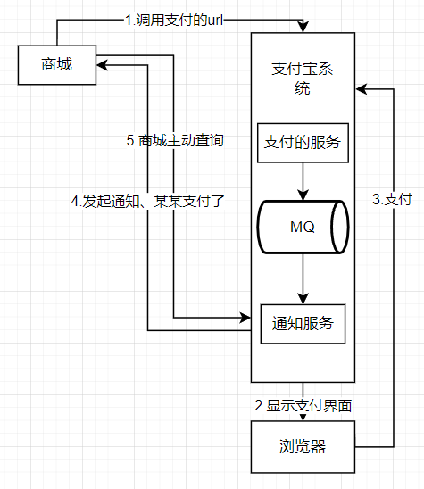

 在微服务的开发中，新建订单的接口是需要跨微服务调用，在此过程中由于是处于不同的系统之间，想要保证出错之后全部回滚，这在本地事务中是无法做到的，下面介绍数据不一致产生的原因和分布式事务的相关理论。这个好枯燥。。

<!--more-->

## 数据不一致

### 事务性问题(代码问题)

#### 先扣库存还是后扣库存

##### 先扣库存

扣完库存之后，新建订单出错了，而库存的事务以及提交了。库存就拜拜扣了

##### 后扣库存

先建订单成功了，之后调用库存服务失败了

1. 库存服务挂了：直接回滚就行
2. 网络出现问题了：已经扣减了，但是扣减库存的响应的时候挂了。这时候订单服务那边收到超时了，自己回滚了，但是库存已经扣除了。

### 业务问题-用户下单之后没有支付

库存已经被扣减了，但是用户一直没有支付。

### 解决

对于事务性问题，采用分布式的事务解决。

对于业务下单不支付，采用超时机制进行，超时之后将库存归还。

### 事务和分布式事务

#### 事务概念:

一组sq|语句操作单元，组内所有SQL语句完成一个业务, 如果整组成功:意味着全部SQL都实现;如
果其中任何一个失败,意味着整个操作都失败。失败,意味着整个过程都是没有意义的。应该是数据库回
到操作前的初始状态。这种特性，就叫“事务”。

#### 为什么要存在事务?

1)失败后，可以回到开始位置
2)没都成功之前，别的用户(进程，会话)是不能看到操作内的数据修改的

#### 事务4大特征ACID:

1. 原子性[atomicity]

   功能不可再分，要么全部成功，要么全部失败

2. 一致性[consistency]
   一致性是指数据处于一种语义上的有意义且正确的状态。一致性是对数据可见性的约束，保证在一个事务中的多次操作的数据**中间状态**对其他事务**不可见**的。因为这些中间状态，是一个过渡状态，与事务的开始状态和事务的结束状态是不一致的。
   举个例子，张三给李四转账100元。事务要做的是从张三账户上减掉100元，李四账户上加上100元。一致性的含义是其他事务要么看到张三还没有给李四转账的状态，要么张三已经成功转账给李四的状态，而对于张三少了100元，李四还没加上100元这个中间状态是不可见的。
   我们来看一下转账过程中可能存在的状态:

   1. 张三未扣减、李四未收到
   2. 张三已扣减、李四未收到
   3. 张三已扣减，李四已收到

    上述过程中: 1. 是初始状态、2是中间状态、3是最终状态，1和3是我们期待的状态，但是2这种状态却不是我们期待出现的状态。

   那么反驳的声音来了:

   要么转账操作全部成功，要么全部失败,这是原子性。从例子上看全部成功，那么**一致性就是原子性**的一部分咯,为什么还要单独说一致性和原子性?
   你说的不对。在未提交读的隔离级别下是事务内部操作是可见的，明显违背了一致性,怎么解释?
   好吧，需要注意的是:
   原子性和一致性的的侧重点不同:**原子性关注状态**，要么全部成功，要么全部失败，不存在部分成功的状态。而**一致性关注数据的可见性**,中间状态的数据对外部不可见，只有最初状态和最终状态的数据对外可见。

3. 隔离性[isolation]
   事务的隔离性是指多个事务并发访问数据库时，一个用户的事务不能被其它用户的事务所干扰,多个并发事务之间数据要相互隔离。
   隔离性是多个事务的时候,相互不能干扰，

   一致性是要保证操作前和操作后数据或者数据结构的一致性，而我提到的事务的一致性是关注数据的中间状态,也就是一致性需要监视中间状态的数据， 如果有变化，即刻回滚。

   如果不考虑隔离性，事务存在3种并发访问数据问题,也就是事务里面的脏读、不可重复读、虚
   度/幻读

4. 持久性[durability]
      是事务的保证，事务终结的标志(内存的数据持久到硬盘文件中)

### 分布式事务

分布式事务顾名思义就是要在分布式系统中实现事务,它其实是由多个本地事务组合而成。

对于分布式事务而言几乎满足不了ACID,其实对于单机事务而言大部分情况下也没有满足ACID,不然怎么会有mysql四种隔离级别呢?所以更别说分布在不同数据库或者不同应用上的分布式事务了。

## 造成数据不一致的原因

### 网络问题

1. 硬件故障
   1. 网卡
   2. 路由器
   3. 网线
2. 网络抖动
   1. 跨服务调用，
3. 网络拥塞
   1. 收不到回复的消息。

没有发送出去？

发送了，没有收到，导致以为出错了

### 程序出错

1. 代码异常
2. 宕机
   1. 断电
   2. 系统问题
      1. 磁盘满了
      2. 电脑坏了

## 分布式事务的理论

### CAP理论

cap理论是分布式系统的理论基石

#### Consistency (一致性):

“all nodes see the same data at the same time ”,即更新操作成功并返回客户端后，所有节点在同一时间的数据
完全一致，这就是分布式的一致性。

一致性的问题在并发系统中不可避免， 对于客户端来说，一致性指的是并发访问时更新过的数据如何获取的问题。从服务端来看,则是更新如何复制分布到整个系统，以保证数据最终一致。

##### 主从复制

一个是`写数据库`一个是`读数据库`

一个服务将记录写入到`写数据库`,另一个服务从`读数据库`来读取刚刚的记录，这要保证，我只要写入进去了就一定可以读到。这里可以采用我写到数据库中，之后同步完成了，再响应给写的服务，这样可以保证我的`读数据库`中已经包含了之前写的数据了。

#### Availability (可用性):

可用性指“Reads and writes always succeed"，即服务一直可用， 而且是正常响应时间。

好的可用性主要是指系统能够很好的为用户服务，不出现用户操作失败或者访问超时等用户体验不好的情况。

在前面的一致性中，我们要等到同步完成之后才响应，但是如果响应的时间很长(几秒),这时候，我要求必须要我写入了就可以从读数据库中获得。

这时候会出现一个问题就是，我在同步的过程中肯定要对这条数据枷锁，但是如果加锁了，就不能保证数据的一致性，你就访问不到了，这就与**一致性**相违背了。

**一致性和可用性是互斥的。**

#### Partition Tolerance (分区容错性)

即分布式系统在遇到某节点或网络分区故障的时候，仍然能够对外提供满足一致性和可用性的服务。 

分区容错性要求能够使应用虽然是一个分布式系统， 而看上去却好像是在一个可以运转正常的整体。

比如现在的分布式系统中有某一个或者几个机器宕掉了,其他剩下的机器还能够正常运转满足系统需求,对于用户而言并没有什么体验上的影响。

如果是一个分布式系统，一定要满足：分区容错性。

##### 取舍策略

CAP三个特性只能满足其中两个，那么取舍的策略就共有三种:

CA：单机的数据库

CP：要保证一致性和分区容错性，这要等同步完成之后才能使用，在网络等有问题的时候不对外提供服务就行。NoSQL数据库，MongoDB、HBase、Redis

AP：保证可用性。CoachDB、Cassandra、DynamoDB

### BASE理论

BASE是Basically Available (基本可用)、Soft state (软状态)和Eventually consistent (最终一致性) 三个短语的缩写。

BASE理论是对CAP中一致性和可用性权衡的结果，其来源于对大规模互联网系统分布式实践的总结，是基于CAP定理逐步演化而来的。

BASE理论的核心思想是：即使无法做到强一致性, 但每个应用都可以根据自身业务特点，采用适当的方式来使系统达到最终一致性。 

接下来看一下BASE中的三要素:

#### 基本可用

基本可用是指分布式系统在出现不可预知故障的时候，允许损失部分可用性一注意， 这绝不等价于系统不可用。比如:

1. 响应时间上的损失。正常情况下，一个在线搜索引擎需要在0.5秒之内返回给用户相应的查询结果，但由于出现故障，查询结果的响应时间增加了1~2秒，这是可以接受的
2. 系统功能上的损失:正常情况下，在一个电子商务网站上进行购物的时候,消费者几乎能够顺利完成每一笔订单，但是在一些节日大促购物高峰的时候,由于消费者的购物行为激增，为了保护购物系统的稳定性,部分消费者可能会被引导到一个降级页面

#### 软状态

软状态指允许系统中的数据存在中间状态，并认为该中间状态的存在不会影响系统的整体可用性。即允许系统在不同节点的数据副本之间进行数据同步的过程存在延时。

#### 最终一致性

最终一致性强调的是所有的数据副本，在经过一段时间的同步之后,最终都能够达到一个一致的状态。因此，最终一致性的本质是需要系统保证最终数据能够达到一致,而不需要实时保证系统数据的强一致性。 

#### 总结

总的来说，BASE理论面向的是大型高可用可扩展的分布式系统和传统的事物ACID特性是相反的，它完全不同于ACID的强一致性模型。而是通过牺牲强一致性来获得可用性，并允许数据在一段时间内是不一致的,但最终达到一致状态。但同时，在实际的分布式场景中，不同业务单元和组件对数据一致性的要求是不同的，因此在具体的分布式系统架构设计过程中,ACID特性和BASE理论往往又会结合在一起。

**一句话: CAP就是告诉你:想要满足C、A、P就是做梦, BASE才是你最终的归宿**

## 两/三阶段提交

### 常见分布式事务解决方案

- 两阶段提交(2PC, Two-phase Commit)
- TCC补偿模式
- 基于本地消息表实现最终一致性
- 最大努力通知
- **基于可靠消息最终一致性方案**

### 两阶段提交(2PC)

两阶段提交又称2PC,2PC是一个非常经典的中心化的原子提交协议。

这里所说的中心化是指协议中有两类节点: 一个是中心化协调者节点(coordinator) 和N个参与者节点(partcipant)。

两个阶段:第一阶段:投票阶段和第二阶段:提交/执行阶段。

举例订单服务A,需要调用支付服务B去支付，支付成功则处理购物订单为待发货状态，否则就需要将购物订单处
理为失败状态。


对于订单服务来说，首先是要调用库存服务、开始执行扣减库存的事务，调用通知服务、通知服务将信息写入数据库、之后在订单服务本地执行新建订单、插入商品等一系列操作。如果在此之前包括现在没有出问题，那么久确认扣减库存commit、确认发送消息，业务结束。如果在此之前出现了问题，那么就要通知之前的服务进行rollback。业务结束。

这里通知服务只是一个通知卖家或买家的服务，通知货物是否买/卖了。 

#### 2pc的缺陷

##### 性能问题γ

无论是在第一阶段的过程中，还是在第二阶段,所有的参与者(通知服务、库存服务)资源和协调者(订单服务)资源都是被锁住的,只有当所有节点准备完
毕，事务协调者才会通知进行全局提交。
**参与者**进行本地事务提交后才会释放资源。这样的过程会比较漫长，对**性能影响比较大**。

如果是通知服务挂了或者超时了，那么就会导致库存服务的资源库存被锁住，只有在通知服务rollback之后库存服务才能释放资源。

##### 单节点故障

由于协调者的重要性，一旦协调者发生故障。参与者会一直阻塞下去。 尤其在第二阶段,协调者发生故障，那么所有的参与者还都处于锁定事务资源的状态中，而无法继续完成事务操作。(虽然协调者挂掉, 可以重新选举一个协调者,但是无法解决因为协调者宕机导致的参与者处于阻塞状态的问题)。

## TCC(try confirm/cancel)

一个订单支付之后，我们需要一下的步骤：

1. 更改订单的状态为已支付
2. 扣减商品库存（这里只是一个假设，在支付之前和在支付之后扣减库存都有许多问题）
3. 给会员增加积分
4. 创建销售出库单通知仓库发货。


好，业务场景有了，现在我们要更进一步，实现一个TCC分布式事务的效果。上述这几个步骤，要么一起成功， 要么一起失败,必须是一个整体性的事务。

举个例子，现在订单的状态都修改为“已支付”了,结果库存服务扣减库存失败。那个商品的库存原来是100件，现在卖掉了2件，本来应该是98件了。结果呢? 由于库存服务操作数据库异常,导致库存数量还是100。这不是在坑人么，当然不能允许这种情况发生了!


对于所有的我们都应该加一个中间状态，判断是否确认还是取消。

### 代码演示

```go
type orderService struct{
	CreditSrvClient proto.CreditClient // 用户积分
	WmsSrvClient proto.WmsClient // 记录仓库的变动
	InventorySrvClient proto.InventoryClient //库存确认扣减
}

func NewOrderService() *OrderService {
 	return &OrderService{
		CreditSrvClient: proto. CreditClient{},
		WmsSrvClient: proto. WmsClient{},
		InventorySrvClient: proto . InventoryClient{},
	}
}

func(o OrderService) UpdateOrderStatus() error {
	return nil
}

func (o OrderService) Notify() error{
	o.UpdateOrderStatus() // 更新订单的状态
	o.CreditSrvClient.AddCredit() // 增加积分
	o.InventorySrvClient.ReduceStock() // 库存确认扣减
	o.WmsClient.SaleDelivery() //记录仓库变更记录
	return nil
}
```

以出售接口为例：在model中加一个freeze冻结字段，表示有多少库存的东西被冻结了，那么在获取库存详细的时候就应该是获得的数量-冻结的数量。

在出售时应该就变为了try sell，不在是直接减库存了，给冻结库存加上出售的数量。

另外还需要confirm sell,给他确认扣减，这时候吧冻结的减掉，然后把真正的库存数量减冻结数量。

还有一个cancel sell ，出现问题之后我要取消冻结的库存，那么回滚冻结的数量`freeze-=sellNum`.

跨服务调用库存微服务进行库存扣减

1. 调用库存服务的trysell
2. 调用仓库服务的trysell
3. 调用积分 服务的tryAdd
4. 任何一个服务出现了异常,那么你得调用对应的所有的微服务的cancel接口
5. 如果所有的微服务都正常,那么你得调用所有的微服务的confirm

TCC 底层的实各个服务实现比较简单，在业务逻辑中的confirm和cancel是很复杂的。在什么情况下进行confirm，cancel都是问题。

### TCC可能出现的问题

总结一下， 你要玩TCC分布式事务的话: .

1. 首先需要选择某种TCC分布式事务框架，各个服务里就会有这个TCC分布式事务框架在运行。

2. 然后你原本的一个接口，要改造为3个逻辑，Try-Confirm-Cancel。

   - 先是服务调用链路依次执行Try逻辑

   - 如果都正常的话，TCC分布式事务框架推进执行Confirm逻辑，完成整个事务

   - 如果某个服务的Try逻辑有问题，TCC分布式事务框架感知到之后就会推进执行各个服务的Cancel逻辑， 撤销之前执行的各种操作。

   - 这就是所谓的TCC分布式事务。

   - TCC分布式事务的核心思想，说白了，就是当遇到下面这些情况时,

     1. 某个服务的数据库宕机了
     2. 某个服务自己挂了
     3. 那个服务的redis、elasticsearch、 MQ等基础设施故障了
     4. 某些资源不足了，比如说库存不够这些

     - 先来Try一下,不要把业务逻辑完成，先试试看，看各个服务能不能基本正常运转，能不能先冻结我需要的资源。
     - 如果Try都ok，也就是说，底层的数据库、redis、 elasticsearch、 MQ都是可以写入数据的，并且你保留好了需要使用的一些资源(比如冻结了-部分库存)。
     - 接着,再执行各个服务的Confirm逻辑，基本上Confirm就可以很大概率保证一个分布式事务的完成了。
     - 那如果Try阶段某个服务就失败了，比如说底层的数据库挂了，或者redis挂了，等等。
     - 此时就自动执行各个服务的Cancel逻辑，把之前的Try逻辑都回滚，所有服务都不要执行任何设计的业务逻辑。保证大家要么一起成功，要么一起失败。

### 终极大招

- 如果有一些意外的情况发生了，比如说订单服务突然挂了，然后再次重启，TCC分布式事务框架是如何保证之前没执行完的分布式事务继续执行的呢? .
- TCC事务框架都是要记录一些分布式事务的活动日志的，可以在磁盘上的日志文件里记录,也可以在数据库里记录。保存下来分布式事务运行的各个阶段和状态。
- 万一某个服务的Cancel或者Confirm逻辑执行一直失败怎么办呢?那也很简单，TCC事务框架会通过活动日志记录各个服务的状态。举个例子，比如发现某个服务的Cancel或者Confirm-直没成功，会不停的重试调用他的Cancel或者Confirm逻辑，务必要他成功!
- 当然了，如果你的代码没有写什么bug，有充足的测试，而且Try阶段都基本尝试了一下，那么其实一般Confirm、Cancel都是可以成功的!
- 如果实在解决不了，那么这个一定是很小概率的事件，这个时候发邮件通知人工处理

### TCC优缺点

#### 优点

1. 解决了跨服务的业务操作原子性问题，例如组合支付，订单减库存等场景非常实用
2. TCC的本质原理是把数据库的二阶段提交上升到微服务来实现，从而避免了数据库2阶段中锁冲突的长事务低性能风险。
3. TCC异步高性能，它采用了try先检查,然后异步实现confirm,真正提交的是在confirm方法中。（依旧要用锁）

#### 缺点

1. 对微服务的侵入性强，微服务的每个事务都必须实现try, confirm, cance等3个方法，开发成本高，今后维护改造的成本也高。
2. 为了达到事务的一致性要求，try, confirm、cance接口必须实现等幂性操作。(定时器+重试)
3. 由于事务管理器要记录事务日志，必定会损耗一定的性能，并使得整个TCC事务时间拉长，建议采用redis的方式来记录事务日志。

4. tcc需要通过锁来确保数据的一致性，会加锁导致性能不高


## 基于本地消息的最终一致性方案

本地消息表这个方案最初是eBay提出的，此方案的核心是通过本地事务保证数据业务操作和消息的一致性,然后通过定时任务将消息发送至消息中间件，待确认消息发送给消费方成功再将消息删除。


订单服务将自己的业务完成之后，将信息发送到消息队列中去，库存服务和通知服务从队列中拿任务完成，如果消息消费完成了就确认删除，如果没有就重试。只要不确认都会在消息队列中。

虽然当前数据没有一致，但最终一定会一致。

隐患：

先记录再发送消息，发送失败了

1. 发送了但是消息队列宕机了，我们可以等待恢复重新发送。
2. 发送消息了，消息队列在发送`已经接收到订单消息`时网络出问题超时了，这时候订单服务就会收到超时，订单就会回滚，但是库存和通知服务已经开始执行了。

这时候要增加一个本地消息表来记录消息的生产和消费，这样才能保证消息不会丢失。

这种情况下，本地数据库操作与存储消息日志处于同一事务中，本地数据库操作与记录消息日志操作具备原子性。

### 定时任务扫描日志

如何保证将消息发送给消息队列呢?
经过第一步消息已经写到消息日志表中，可以启动独立的线程，定时对消息日志表中的消息进行扫描并发送至消息中间件，在消息中间件反馈发送成功后删除该消息日志，否则等待定时任务下一周期重试。

### 消费消息

如何保证消费者一-定能消费 到消息呢?
这里可以使用MQ的ack (即消息确认)机制，消费者监听MQ,如果消费者接收到消息并且业务处理完成后向MQ发送ack (即消息确认)，此时说明消费者正常消费消息完成，MQ将不再向消费者推送消息，否则消费者会不断重试向消费者来发送消息。
通知服务接收到“通知给用户”消息,开始通知用户，通知用户成功后消息中间件回应ack,否则消息中间件将重复投递此消息。

由于消息会重复投递，积分服务的“增加积分”功能需要实现幂等性。


## 基于可靠消息的最终一致性方案-常用

通过使用基于RocketMQ的可靠消息实现最终一致性的分布式方案。

调用的过程如下图所示：


备注

> half消息不能被消费。
>
> 这里使用MQ来保证订阅方收到的消息一定是可靠的。
>
> MQ的回查是在一段时间后没有进行这个事务没有进行commit/rollback就会查询事务的消息状态。

## 最大努力通知

最大努力通知型( Best-effort delivery)是最简单的一种柔性事务，适用于一些最终一致性时间敏感度低的业务，且被动方处理结果不影响主动方的处理结果。典型的使用场景：如银行通知、商户通知等。最大努力通知型的实现方案，一般符合以下特点：

不可靠消息：业务活动主动方，在完成业务处理之后，向业务活动的被动方发送消息，直到通知N次后不再通知，允许消息丢失(不可靠消息)。
定期校对：业务活动的被动方，根据定时策略，向业务活动主动方查询(主动方提供查询接口)，恢复丢失的业务消息。

以下这个例子，用户在支付之后，支付宝要尽自己最大的努力来通知到商家某某人已经支付成功了，但是对方的服务可能会挂掉或者这个对方这个接口不存在，这个时候，就要努力尝试通知`商城`。对于通知的时间也是有讲究的，不能每一次都是1秒中通知一次，可以刚开始1秒钟尝试通知一次，之后2秒、5秒...但是也不能一直尝试通知，要有一定的上限。


商城不能直接从支付宝系统MQ中直接拿消息，而是要通过支付宝提供的服务来拿到消息。


