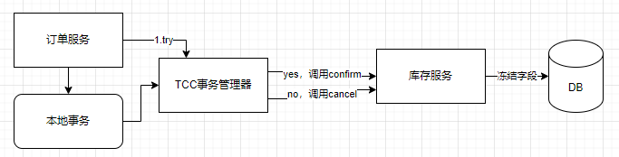

新建订单的接口对数据的一致性要求很高，尤其是涉及到支付、金钱相关的事情。

<!--more-->

## 新建订单中的问题

对于新建订单失败之后，库存应该被归还回去，我们不应该出现以下情况。

1. 本地订单新建失败，库存扣减成功
2. 本地订单新建成功，库存扣减失败

以下两种情况我们都能接受

1. 本地订单新建成功，库存扣减成功
2. 本地订单失败，库存扣减失败


由于订单服务是通过网络调用库存服务的，在此过程中，有各种因素的影响。

#### 库存扣减成功

1. 本地执行失败，调用库存归还接口，但是此时归还接口出问题了（磁盘满了），网络问题可以通过**重试**来避免。
   1. 重试 -网络抖动或者拥塞，之前调用的过一段时间才能被接收到，会不会导致**重复归还**--幂等性问题
2. 本地代码异常，不知道本地执行情况，无法调用库存归还接口。

#### 库存扣减失败

本地事务不执行就行。

#### 先扣库存还是后扣库存

上面我们介绍的是先扣减库存再新建订单，这次我们后扣库存。

我们将扣减库存的加入本地调用中，先执行新建订单、新建订单商品、删除购物车记录、**扣减库存**。只有扣减库存成功才会commit。

1. 扣减库存发送出去了，但是网络拥塞了，就会重试N次，重试结束后还没收到扣减的响应，这时候本地事务认为扣减失败了，就rollback了，但其实扣减成功了。
2. 调用扣减库存没有问题，当把网络请求发送出去之后，宕机了。这时候库存还是被扣减了，订单就会被rollback。

## TCC解决库存扣减问题



TCC事务管理器中内部事务开始之前都会写日志，下次启动的时候可以读取日志，继续没有执行的逻辑。

## 基于可靠消息最终一致性方案


订单服务发送一个half消息，开始执行本地事务，如果成功就commit，失败就rollback。库存服务一直在监听是否又库存扣减的消息，进行扣减库存。

本质上解决了可靠消息，消费者应该保证消息一定会被消费。这就要求我们的库存服务一定要可靠，一定要执行成功。这个服务一般可以保证可靠。

**但是由于是库存服务，如果没有库存了，扣减失败怎么办？**


1. 在本地消息执行之前发送归还的half消息
2. 调用库存服务，如果失败就不往下执行。如果成功。
3. 开始执行本地事务，
   1. 成功之后rollback归还
   2. 失败就commit归还
4. 发送订单超时的延时消息，库存服务一直监听延迟消息。
5. 回查订单本地有没有订单信息，如果有就rollback，没有就commit


## 实现

### 生产者

```go
type OrderListener struct{
    Code codes.Code
    Detail string
    ID int32
    OrderAmount float32
}

func NewOrderListener() *OrderListener {
   return &OrderListener{}
}

func (dl *OrderListener) ExecuteLocalTransaction(msg *primitive.Message) primitive.LocalTransactionState {
    var orderInfo model.OrderInfo
    err:=json.Unmarshal(msg.Body,&orderInfo)
    if err!=nil{
        // 由于还没有执行，所以应该将之前的回宫
        return primitive.RollbackMessageState
    }
   // 没有选中商品
    if xxxx{
        dl.Code = code.InvalidArgument
        dl.Detail = "没有选中的商品"
        // 没有执行sell之前都要回滚
        return primitive.RollbackMessageState
    }
    
    // 跨服务调用商品微服务
    if xxx{
        dl.Code = code.Internal
        dl.Detail = "批量查询商品信息是啊比"
        // 没有执行sell之前都要回滚
        return primitive.RollbackMessageState
    }
    
    //跨微服务调用库存微服务，
    if xxx{
        // 如果因为网络问题，如何避免误判
        // sell 返回的状态码 是不是sell中列举出来的状态码就是网络的问题
        // todo 
        dl.Code = code.Internal
        dl.Detail = "库存扣减失败"
        // 没有执行sell之前都要回滚
        return primitive.RollbackMessageState
    }
    // 生成订单表
    if xxx{
        dl.Code = code.Internal
        dl.Detail = "库存扣减失败"
        // 订单创建失败就要归还库存
        return primitive.CommitMessageState
    }
    // 批量插入订单物品的信息
    if xxx{
        dl.Code = code.Internal
        dl.Detail = "插入订单信息失败"
        // 就要归还了、
        // 订单创建失败就要归还库存
        return primitive.CommitMessageState
    }
    // 发送延时消息
    p, _ := rocketmq.NewProducer(
		producer.WithNsResolver(primitive.NewPassthroughResolver([]string{"127.0.0.1:9876"})),
		producer.WithRetry(2),
	)
	err := p.Start()
	if err != nil {
		fmt.Printf("start producer error: %s", err.Error())
		os.Exit(1)
	}
	msg := primitive.NewMessage("order_timeout", msg.Body)
	msg.WithDelayTimeLevel(5) // 设置延迟的级别
	res, err := p.SendSync(context.Background(), msg)

	if err != nil {
		fmt.Printf("send message error: %s\n", err)
        // rollback
         dl.Code = code.Internal
        dl.Detail = "发送延时消息失败"
        return primitive.RollbackMessageState
	}
	
	err = p.Shutdown()
	if err != nil {
		fmt.Printf("shutdown producer error: %s", err.Error())
	}
    
    
    // 本地事务提交 commit
    dl.Code = code.OK
   return primitive.RollbackMessageState
}

func (dl *OrderListener) CheckLocalTransaction(msg *primitive.MessageExt) primitive.LocalTransactionState {
	fmt.Println("rocketMQ 的消息回查")
    var orderInfo model.OrderInfo
    err:=json.Unmarshal(msg.Body,&orderInfo)
    if err!=nil{
        // 由于还没有执行，所以应该将之前的回宫
        return primitive.RollbackMessageState
    }
    // 查询订单是否存在
    if xxx{
        // 如果订单找不到
        // 本地事务执行失败了，就要归还库存
        return primitive.CommitMessageState
    }
   time.Sleep(time.Second * 4)
   return primitive.RollbackMessageState
}
....

func (o *OrderServer)CreateOrder(ctx context.context req *proto.OrderRequest)(*proto.OrderInfoResponse ,error){
    orderListener：=NewOrderListener()
    // 运行完就能拿到orderListener中的信息
    p, err := rocketmq.NewTransactionProducer(
		orderListener,
        // 先写死
		producer.WithNsResolver(primitive.NewPassthroughResolver([]string{"192.168.0.2:9876"})),
		producer.WithRetry(1),
	)
    if err != nil {
		global.Logger.Errorf("生成producer失败: %s\n", err.Error())
        return nil,err
	}
	err = p.Start()
	if err != nil {
		global.Logger.Errorf("启动 producer 失败: %s\n", err.Error())
        return nil,err
	}
    order:=model.OrderInfo{
        OrderID:GenerateOrderID(req,UserID)
        Address:...
        ....
    }
    
    jsonString,err:= json.Marshal(order)
    if err != nil {
		global.Logger.Errorf("序列化失败: %s\n", err.Error())
        return nil,err
	}
	res, err := p.SendMessageInTransaction(
        context.Background(),
		primitive.NewMessage("order_reback", jsonString)
	)

	if err != nil {
		global.Logger.Errorf("序列化失败: %s\n", err.Error())
        return nil,status.Error(codes.Internal,"消息发送失败")
	} 
    if orderListener.Code!=codes.OK{
        return nil,status.Error(orderListener.Code,"新建订单失败")
    }
    return &proto.OrderInfoResponse{...},ni;
	// 回查
	time.Sleep(5 * time.Minute)
	err = p.Shutdown()
	if err != nil {
		fmt.Printf("shutdown producer error: %s", err.Error())
	}
}
```

`order_srv/main.go`

```go
func main(){
    ...
    // 监听订单超时的topic
    c, _ := rocketmq.NewPushConsumer(
		// GroupName 多个实例负载均衡
		consumer.WithGroupName("testGroup"),
		consumer.WithNsResolver(primitive.NewPassthroughResolver([]string{"192.168.0.2:9876"})),
	)
	err := c.Subscribe("order_timeout", consumer.MessageSelector{},OrderTimeout )
	if err != nil {
		fmt.Println(err.Error())
	}
	// Note: start after subscribe
	err = c.Start()
	if err != nil {
		fmt.Println(err.Error())
		os.Exit(-1)
	}
    ...
}


func OrderTimeout(ctx context.Context,
	msgs ...*primitive.MessageExt,
) (consumer.ConsumeResult, error) {
		for i := range msgs {
			//  查询支付状态，如果是未支付，就要归还换库存
            // 归还库存我们不能直接又调用库存服务，但是我们可以模仿order发送一个消息到order_reback中去
            // 发送失败 return RetryLater
		}

		return consumer.ConsumeSuccess, nil
	}
```


### 消费者

在库存服务中，启动本地服务之后 监听**归还topic**

`order_srv/main.go`

```go

func main(){
.....
// 服务器有数据会推给回调
	c, _ := rocketmq.NewPushConsumer(
		// GroupName 多个实例负载均衡
		consumer.WithGroupName("inventory"),
		consumer.WithNsResolver(primitive.NewPassthroughResolver([]string{"192.168.0.2:9876"})),
	)
	err := c.Subscribe("order_reback", consumer.MessageSelector{}, AutoReback())
	if err != nil {
		fmt.Println(err.Error())
	}
	// Note: start after subscribe
	err = c.Start()
	if err != nil {
		fmt.Println(err.Error())
		os.Exit(-1)
	}
	time.Sleep(time.Hour)
	err = c.Shutdown()
	if err != nil {
		fmt.Printf("shutdown Consumer error: %s", err.Error())
	}
    ....
}


func AutoReback(
    ctx context.Context,
	msgs ...*primitive.MessageExt,
) (consumer.ConsumeResult, error) {
    for msg:=rang msgs{
        //既然要归还库存，就应该知道每件商品归还多少,但是有一个问题？重复归还
        // 这个接口应该保证幂等性，不能因为消息的重复发送倒是一个订单的库存归还多次，没有扣减的库存你别归还
        // 如何确保这些都没有问题，新建一张表，记录详细的订单扣减的细节，以及归还细节
        var orderInfo OrderInfo
        err:=json.Unmarshal(msgs[msg].Body,&orderInfo)
        if err!=nil{
            global.Logger.Errof("解析json失败")
            return consumer.ConsumeSuccess,nil
        }
        // 去将inv的库存加回去，将selldetail的状态设为2，在事务中执行
        if xxx{
             return consumer.ConsumeSuccess,nil
        }
        // 逐个归还
        ...
        其中要是有问题
        return consumer.ConsumeRetryLater,nil
        //
    }
		return consumer.ConsumeSuccess, nil
	}
```

