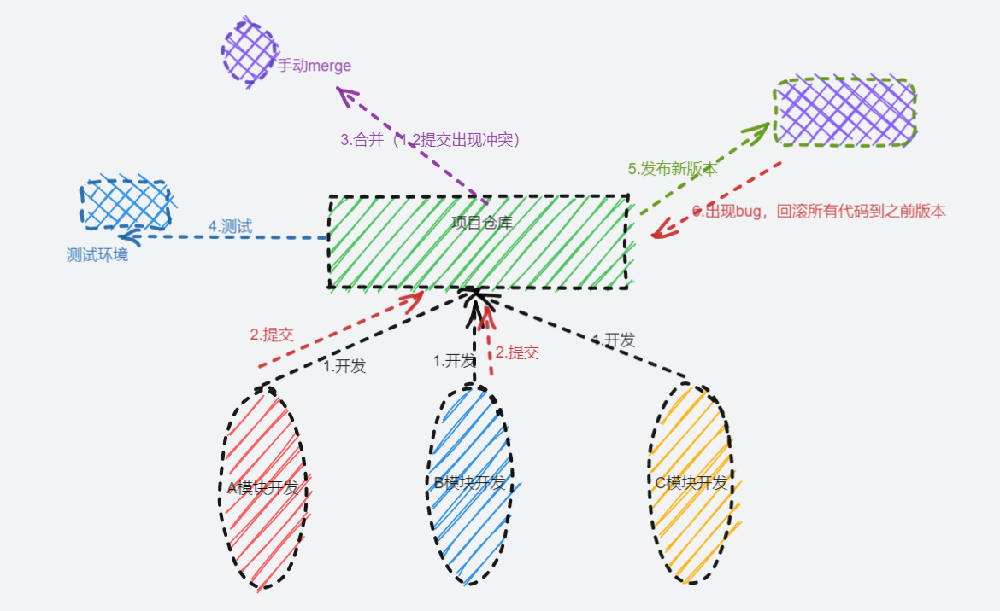

从单体应用的痛点到微服务之间的过渡的说明。

<!--more-->

## 单体应用

一个典型的单体应用就是将所有业务场景的表示层、业务逻辑层和数据访问层放在一个工程中，最终经过编译、打包，部署在一台服务器上。

### 单体应用的痛点

1. 每个小团队对于都负责一个小的模块，这些人在开发过程中，可能会在内部代码进行冲突、或者修改了功能的方法，在merge的时候会有大量的冲突，以及执行回归测试（回归测试是指修改了旧代码后，重新进行测试以确认修改没有引入新的错误或导致其他 代码 产生错误。），一旦出错就要回炉重造。
2. 如果发布某个部分出现了bug，不能进行单独回滚，必须要将整个发布种的所有功能回滚。

### 单体的演变

一个项目，之前是由有网站和后台管理系统，现在要添加小程序端，这时候，如果复制之前的代码过来会有大量的重复代码，并且这几个系统之间还有相互调用，比如秒杀模块还要依赖于商品模块。不仅要对主页、小程序、后台管理提供http接口，还要对系统内部提供相应的服务。这几个系统共用了同一个数据库，如果有某个接口出现性能问题，会影响整个系统的性能。这时候如果一个系统要改表结构了，就要通知其他系统。

### 服务的拆分

将所有的服务全部分开，如果某个系统想要相关信息，他们就自己使用即可。

浅蓝的是一个整体的系统。

目前我开发的所有单体应用都是以这种方式开发，有一个后端服务，网站小程序等他们需要什么就调用什么接口就行了。

这里，代码复用没有了。

## 微服务

微服务是满足“单一职责原则”的，每个微服务仅负责自己归属于自己业务领域的功能。一个微服务就是一个独立的实体，它可以独立部署、升级，服务与服务之间通过REST等形式的标准接口进行通信，并且一个微服务实例可以被替换成另一种实现，而对其它的微服务不产生影响。

对于`服务拆分`中的架构，我们可以继续进行拆分。

### 微服务的基本拆分

将服务和数据库单独抽出来，没有数据影响，每一个服务都可以单独存在，每一个服务都有自己的数据库。只要保证被调用的接口不变，服务内部怎么变都不影响。

这里还有一个问题，对下单这个操作而言，肯定要依赖用户信息。各个模块之间又有了依赖关系。

### 微服务进行分层

分层的微服务将service层再进行分层，一个对内提供服务，一个对外提供http接口。

这个满足了单一职责原则，最底层的grpc的服务之间没有交集，他们只需要向上层的http层提供服务就行。

### 微服务存在的问题

在之前都是通过ip:端口的形式来访问相应的服务，如果某个服务的ip和端口变了怎么办，如果有一个服务的集群，如何挑选一个服务。对于服务的配置文件，如果配置文件修改了如何？

这时候就要引入服务注册、服务发现和注册中心。

#### 注册中心

服务在启动的时候将自己注册到注册中心，以便上层寻找。

#### 服务发现

上层想要调用某个服务时，就要寻找可用的服务。

#### 配置中心

每个服务都从配置中心拉取自己对应的配置，以后修改配置文件只要在配置中心中统一修改即可。

### 参考

[微服务的定义和优缺点 - 知乎 (zhihu.com)](https://zhuanlan.zhihu.com/p/31613331)

[什么是单体应用？如何理解？ (itheima.com)](http://www.itheima.com/news/20201023/173736.html)
