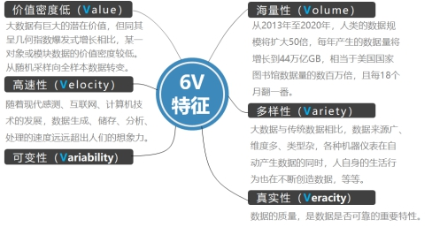
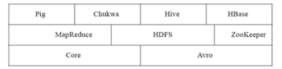
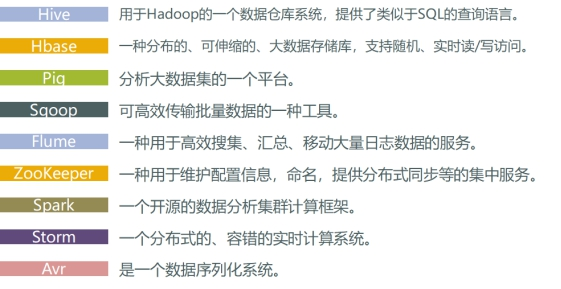
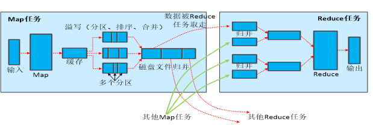

大数据技术及应用的复习资料。

<!--more-->

## 大数据概述

### 大数据概念

指无法在一定时间范围内用常规软件工具进行捕捉、管理和处理的数据集合，是需要新处理模式才能具有更强的决策力、洞察发现力和流程优化能力来适应海量、高增长率和多样化的信息资产。

### 大数据特性

1. 海量性
2. 多样性
3. 真实性
4. 价值密度低
5. 高速性
6. 可变性

### 大数据的影响

1. 数据的运行、计算速度越来越快 

2. 数据存储成本下降 

3. 实现信息对等解放脑力，机器拥有人的智慧

### 大数据的关键技术

1. 分布式系统基础架构Hadoop的出现，为大数据带来了新的曙光；

2. HDFS为海量的数据提供了存储；

3. MapReduce则为海量的数据提供了并行计算，从而大大提高了计算效率；

4. Spark、Storm、Impala、Flink等各种各样的技术进入人们的视野。

### 大数据与云计算物联网的关系

物联网、云计算和大数据三者互为基础。

物联网产生大数据，大数据需要云计算。

物联网在将物品和互联网连接起来，进行信息交换和通信，以实现智能化识别、定位、跟踪、监控和管理的过程中，产生的大量数据，云计算解决万物互联带来的巨大数据量，所以三者互为基础，又相互促进。如果不那么严格的说，它们三者可以看做一个整体，相互发展、相互促进。

以下关于云计算、大数据和物联网之间的关系，论述错误的是： B

A、物联网可以借助于大数据实现海量数据的分析

B、云计算侧重于数据分析

C、物联网可以借助于云计算实现海量数据的存储

D、云计算、大数据和物联网三者紧密相关，相辅相成

## hadoop简介

### Hadoop简介

hadoop是一个分布式系统基础架构，hadoop的框架最核心的设计是HDFS和MapReduce，HDFS为海量的数据提供了存储能力，MapReduce为海量数据提供了计算能力

### Hadoop特性

1.高可靠性 2.高扩展性 3.高效性 4.高容错性 5.经济性

###  Hadoop项目结构

 

### Hadoop生态系统

1.Hive 2.Hbase 3.Pig 4.Sqoop 5.Flume 6.Zookeeper 7.Spark 8.Storm 9.Avr

 

###  补充

Block是HDFS最小存储单元，大小固定，默认为128MB，可自定义。默认情况下每个Block有三个副本

## Hdfs

HDFS( Hadoop Distributed File System)是一个易于扩展的分布式文件系统

### Hdfs体系结构

HDFS 采用的是master/slaves主从结构模型来管理数据，这种结构模型主要由四个部分组成：Client(客户端)、Namenode(名称节点)、Datanode(数据节点)和SecondaryNamenode(第二名称节点，辅助Namenode)。一个真正的HDFS集群包括一个Namenode和若干数目的Datanode。Namenode是一个中心服务器，负责管理文件系统的命名空间 (Namespace )及客户端对文件的访问。集群中的Datanode一般是一个节点运行一个Datanode进程，负责管理客户端的读写请求，在Namenode的统一调度下进行数据块的创建、删除和复制等操作。

###  Hdfs存储原理

HDFS采用master/slave架构。一个HDFS集群是由一个Namenode和一定数目的Datanodes组成。NameNode作为master服务，它负责管理文件系统的命名空间和客户端对文件的访问。DataNode作为slave服务，在集群中可以存在多个。通常每一个DataNode都对应于一个物理节点。DataNode负责管理节点上它们拥有的存储，它将存储划分为多个block块，管理block块信息，同时周期性的将其所有的block块信息发送给NameNode。

##  MapReduce

### MapReduce体系结

主要由四个部分组成，分别是Client、JobTracker、TaskTracker以及Task。

 

### MapReduce原理

空 

### MapReduce工作流程：

1.第一步对输入的数据进行切片，每个切片分配一个map()任务，map()对其中的数据进行计算，对每个数据用键值对的形式记录，然后输出到环形缓冲区（图中sort的位置）。

2.map（）中输出的数据在环形缓冲区内进行快排，每个环形缓冲区默认大小100M，当数据达到80M时（默认），把数据输出到磁盘上。形成很多个内部有序整体无序的小文件。

3.框架把磁盘中的小文件传到Reduce()中来，然后进行归并排序，最终输出。

 

### MapReduce shuffle过程

 

## Hbase

### Hbase概念

HBase是一个高可靠、高性能、面向列、可伸缩的分布式数据库，主要用来存储非结构化和半结构化的松散数据。

###  Hbase与传统数据库的对比：

数据类型：传统数据库数据类型较丰富，Hbase数据类型更加简单。

数据操作：传统数据库涉及多表连接，Hbase不存在。

存储模式：关系数据库是基于行模式存储的。HBase是基于列存储的。

数据索引：关系数据库可以针对不同列构建多个索引，HBase只有行键索引。

数据维护：传统数据库更新会丢失版本旧的数据，Hbase更新会保留版本旧的数据。

可伸缩性：关系数据库很难实现横向扩展，纵向扩展的空间也比较有限。Hbase相反。

 

### Hbase数据模型

#### 数据模型概述

HBase是一个稀疏、多维度、排序的映射表，这张表的索引是行键、列族、列限定符和时间戳

#### 数据模型相关概念

**1.** 表：Hbase采用表组织数据，由行和列构成 

**2.** 行：由行键来标识 

**3.** 列族：基本的访问控制单元 

**4.** 列限定符：数据通过列限定符定位 

**5.** 单元格：通过行、列、列限定符确定一个单元格 

**6.** 时间戳：每个单元格都保存着同一份数据的不同版本，这些版本采用时间戳进行索引。

 

### Hbase实现原理

#### 功能组件

1.库函数 

2.一个Master主服务器 

3.许多个Region服务器

#### Hbase三层结构

一、Zookeeper文件：记录了-ROOT-表的位置信息

二、ROOT-表：记录了.META.表的Region位置信息

三、META.表：-记录了数据表的Region位置信息

##  Hive

### Hive概念

Hive是一个数据仓库基础工具在Hadoop中用来处理结构化数据。

### Hive特点

1.采用批处理方式处理海量数据 2.提供适合数据仓库操作的工具

### Hive缺点

1.延迟较高 2.不支持物化视图 3.不适用OLTP 4.暂不支持存储过程

### Hive应用场景

1.数据挖掘 2.非实时分析 3.数据汇总 4.数据仓库

### Hive系统架构

由用户接口模块、驱动模块和元数据存储模块构成

###  相关概念

1. Metastore，存储元数据的角色。Hive将元数据存储在传统的关系型数据库（mysql、derby）中。

2. Hive中的元数据包括：表的名字、表的数据所在的HDFS目录、数据在目录中的分布规则、以及其他表属性。

3. Hive计算引擎可以是Apache MapReduce或者Apache Spark。

4. 内部表和外部表

   表是数据管理和存储的基本对象，由元数据和表数据组成

   |                      | 内部表                   | ***\*外部表\**** |
   | -------------------- | ------------------------ | ---------------- |
   | 创建加载可以独立完成 | 数据移到仓库目录         | 数据位置不移动   |
   | 创建加载同时完成     | 元数据和数据会被一起删除 | 只删除元数据     |

5. 分区：通过特定条件将表的数据分发到分区目录中，或者将分区中的数据分发到子分区目录中。

   1. 分区的作用：减少不必要的全表扫描，提升查询效率。

6. 分桶：通过分桶键哈希取模的方式，将表或分区中的数据随机、均匀地分发到N个桶中，桶数N一般为质数，桶编号为0, 1, …, N-1

   1. 分桶的作用：提高取样效率，提高Join查询效率

7. 分区分桶的区别：

   1. 分区：
      1. 数据表可以按照某个字段的值划分分区。
      2. 每个分区是一个目录。
      3. 分区数量不固定。
      4. 分区下可再有分区或者桶。

   2. 分桶
      1. 数据可以根据桶的方式将不同数据放入不同的桶中。
      2. 每个桶是一个文件。
      3. 建表时指定桶个数，桶内可排序。
      4. 数据按照某个字段的值Hash后放入某个桶中。

### 用户向Hive输入一段命令或查询时，Hive需要与Hadoop交互工作来完成该操作

1. 驱动模块接收该命令或查询编译器

2. 对该命令或查询进行解析编译

3. 由优化器对该命令或查询进行优化计算

4. 该命令或查询通过执行器进行执行

## Spark

### Spark特点

1.运行速度快 

2.容易使用 

3.通用性 

4.运行模式多样

### 与Hadoop的关系

Spark在借鉴Hadoop MapReduce优点的同时，Spark编辑模型比Hadoop更灵活，spark提高了内存计算，对于迭代运算效率更高。Spark基于DAG的任务调度执行机制优于Hadoop的迭代执行机制。

### Spark生态系统

主要包含了Spark Core、Spark SQL、Spark Streaming、MLLib和GraphX 等组件。

### Spark生态系统组件应用场景

1. 复杂的批量数据处理

2. 基于历史数据的交互式查询

3. 基于实时数据流的数据处理

4. 基于历史数据的数据挖掘

5. 图结构数据的处理

### Spark运行架构

集群资源管理器（Cluster Manager）

运行作业任务的工作节点（Worker Node）

每个应用的任务控制节点（Driver）

每个工作节点上负责具体任务的执行进程（Executor）

### RDD工作原理

#### RDD概念

一个只读的分区记录集合。

#### RDD特性

1. 高效的容错性 

2. 中间结果持久化到内存 

3. 存放的数据可以是未序列化的Java 对象

### 宽依赖与窄依赖

#### 窄依赖

一个父RDD的分区对应于一个子RDD的分区或多个父RDD的分区对应于一个子RDD的分区。

#### 宽依赖

存在一个父RDD的一个分区对应一个子RDD的多个分区。

### Spark SQL工作原理

1. 将SQL转换成抽象语法树

2. 将抽象语法树转换成查询块

3. 将查询块转换成逻辑查询计划

4. 重写逻辑查询计划

5. 讲逻辑计划转成物理计划

6. 选择最佳优化查询策略

### Spark Mllib基本原理

MLlib是Spark的机器学习库，旨在简化机器学习的工程实践工作。Mllib常见机器学习问题：分类、回归、聚类、协同过滤。
