大数据技术及应用的复习资料。

<!--more-->

## 大数据概述

### 大数据概念

指无法在一定时间范围内用常规软件工具进行捕捉、管理和处理的数据集合，是需要新处理模式才能具有更强的决策力、洞察发现力和流程优化能力来适应海量、高增长率和多样化的信息资产。

### 大数据特性

1. 海量性
2. 多样性
3. 真实性
4. 价值密度低
5. 高速性
6. 可变性


### 大数据的影响

1. 数据的运行、计算速度越来越快 

2. 数据存储成本下降 

3. 实现信息对等解放脑力，机器拥有人的智慧

### 大数据的关键技术

1. 分布式系统基础架构Hadoop的出现，为大数据带来了新的曙光；

2. HDFS为海量的数据提供了存储；

3. MapReduce则为海量的数据提供了并行计算，从而大大提高了计算效率；

4. Spark、Storm、Impala、Flink等各种各样的技术进入人们的视野。

### 大数据与云计算物联网的关系

物联网、云计算和大数据三者互为基础。

物联网产生大数据，大数据需要云计算。

物联网在将物品和互联网连接起来，进行信息交换和通信，以实现智能化识别、定位、跟踪、监控和管理的过程中，产生的大量数据，云计算解决万物互联带来的巨大数据量，所以三者互为基础，又相互促进。如果不那么严格的说，它们三者可以看做一个整体，相互发展、相互促进。

以下关于云计算、大数据和物联网之间的关系，论述错误的是： B

A、物联网可以借助于大数据实现海量数据的分析

B、云计算侧重于数据分析

C、物联网可以借助于云计算实现海量数据的存储

D、云计算、大数据和物联网三者紧密相关，相辅相成

## hadoop简介

### Hadoop简介

hadoop是一个分布式系统基础架构，hadoop的框架最核心的设计是HDFS和MapReduce，HDFS为海量的数据提供了存储能力，MapReduce为海量数据提供了计算能力

### Hadoop特性/优点

1. 高可靠性 ：采用冗余数据存贮方式，即使一个副本发生故障，其他副本也可以保证对外工作的正常进行

2. 高扩展性 ：采用冗余数据存贮方式，即使一个副本发生故障，其他副本也可以保证对外工作的正常进行。

3. 高效性 ：作为并行分布式计算平台，hadoop采用分布式存贮和分布式处理两大核心技术，能够高效的处理PB级别的数据

4. 高容错性 ：采用冗余数据存贮方式，自动保存数据的多个副本，并且能够自动将失败的任务重新分配。

5. 经济性：hadoop采用廉价的计算机集群，普通的用户也可以pc机搭建环境
6. 运行在linux平台上，hadoop是基于java语言开发的，可以较好的运行在linux的平台上
7. 支持多种编程语言，如：C++等/

### Hadoop缺点

在当前Hadoop的设计中，所有的metadata操作都要通过集中式的NameNode来进行，NameNode有可能是性能的瓶颈。

当前Hadoop单一NameNode、单一Jobtracker的设计严重制约了整个Hadoop可扩展性和可靠性。

首先，NameNode和JobTracker是整个系统中明显的单点故障源。再次，单一NameNode的内存容量有限，使得Hadoop集群的节点数量被限制到2000个左右，能支持的文件系统大小被限制在10-50PB，最多能支持的文件数量大约为1.5亿左右。实际上，有用户抱怨其集群的NameNode重启需要数小时，这大大降低了系统的可用性。

###  Hadoop项目结构

详细介绍


#### 1，core/common

Hadoop Common原名为Hadoop Core,0.20版本之后改为common。自0.21版本之后，HDFS和MapReduce被分离出来作为单独的子项目，其余部分构成Hadoop Common。

Common是为Hadoop及其他子项目提供支持的常用工具，主要包括文件系统，RPC和串行化库，他们为在廉价的硬件上搭建云计算环境提供基本的服务，同时也为运行在该平台上的软件开发提供所需要的API。

#### 2，Avro

Avro是Hadoop的一个子项目，也是Apache中的一个独立项目。

Avro是一个用于**数据序列化的系统**，提供了丰富的数据结构类型，快速可压缩的二进制数据格式，存储持久性数据的文件集，远程调用的功能和简单的动态语言集成功能。

Avro可以将数据结构或对象转化成便于存储和传输的格式，节约数据存储空间和网络传输带宽，Hadoop的其它子项目的客户端与服务端之间的数据传输都采用Avro。

#### 3，HDFS

HDFS是Hadoop项目的两大核心之一，它是针对谷歌文件系统（GFS）的开源实现。

HDFS具有处理超大数据，流式处理，可以运行在廉价商用服务器上等优点。

HDFS在设计之初就是要运行在廉价的大型服务器集群上，因此，在设计上就把硬件故障作为一种常态来考虑，可以保证在部分硬件发生故障的情况下，仍能保证文件系统的整体的可用性和可靠性。

HDFS放宽了一部分POSIX约束，从而实现以流的形式访问文件系统中的数据。

HDFS在访问应用程序数据时候，可以具有很高的吞吐量，因此，对于超大数据集的应用程序而言，选择HDFS作为底层数据存储是较好的选择。

#### 4，HBase

HBase是一个提供高可靠性，高性能，可伸缩，实时读写，分布式的列式数据库，一般采用HDFS作为其底层数据存储。

**HBase是针对谷歌的BigTable的开源实现**，二者都采用了相同的数据模型，具有强大的**非结构化数据存储能力**。HBase与传统关系数据库的一个重要区别就是，前者是基于**列的存储**，而后者采用基于行的存储。HBase具有良好的**横向扩展**能力，可以通过不断增加廉价的商用服务器来增加存储能力。

####  5，MapReduce

Hadoop MapReduce是这对google 的MapReduce的实现。

MapReduce是一种编程模型，用于大规模数据集的**并行计算**，它将复杂，运行于大规模集群上的并行计算过程高度的抽象到了两个函数——**Map和Reduce**，并允许用户在不了解分分布式系统底层细节的情况下开发并行应用程序，并将其运行于廉价计算机集群上，完成海量数据的处理。

#### 6，Zookeeper

 Zookeeper是针对谷歌Chubby的一个开源实现，是高效和可靠的协同工作系统，提供**分布式锁之类**的基本服务，用于构建分布式应用，减轻分布式应用程序锁承担的协调任务。

Zookeeper使用Java编写，很容易编程接入，它使用了一个和文件树结构相似的数据模型，可以使用Java或者C来进行编程接入。

#### 7，Hive

Hive是一个基于Hadoop的数据仓库工具，可以用于对Hadoop文件中的数据集进行数据整理，特殊查询和分析存储。

Hive的学习门槛较低，因为，它提供了类似于关系数据SQL语言的特殊查询语言——Hive QL,可以通过Hive QL语句快速实现简单的MapReduce统计，Hive自身可以将**Hive QL语句转换为MapReduce任务**进行运行，而不必开发专门的MapReduce应用，因而十分适合数据仓库的统计分析。

#### 8，Pig

Pig是一种数据流语言和运行环境，适合于使用Hadoop和MapReduce平台来查询大型半结构化数据集。

Pig的出现大大简化了Hadoop常见的工作任务，它在MapReduce的基础上创建了更简单的过程语言抽象，为Hadoop应用程序提供了一种更加接近结构化查询语言的接口。

Pig是一个相对简单的语言，它可以执行SQL语句，因此，当我们需要从大型数据集中搜索满足某个给定搜索条件的记录时，采用Pig要比MapReduce具有明显的优势，前者只需要编写一个简单的脚本在集群中自动并行处理与分发，而后者则需要编写一个单独的MapReduce应用程序。

#### 9，Sqoop

Sqoop可以改进数据的互操作性，主要用来在Hadoop和**关系数据库**直接交换数据。

通过Sqoop,我们可以方便的将关系数据库之中的数据导入Hadoop，或者将Hadoop中的数据导入关系数据库。**Sqoop主要通过JDBC**和关系数据库进行交互，理论上，支持JDBC的关系数据库都可以使Sqoop和Hadoop进行数据交互。

Sqoop是专门为大数据集设计的，支持增量更新，可以将新纪录添加到最近一次到处的数据源上，或者指定上次修改的时间戳。

#### 10，Chukwa

Chukwa是一个开源的，用于监控大型分布式系统的数据收集系统，可以将各种类型的数据收集成合适的Hadoop处理的文件，并保存在HDFS中供Hadoop进行各种MapReduce操作。

Chukwa构建在Hadoop的HDFS和MapReduce框架之上，继承了Hadoop的可伸缩性和可扩展性。

Chukwa内置了一个强大而灵活的工具集，可用于展示，监控和分析已收集的数据。 

### Hadoop生态系统

详细介绍

1.Hive 2.Hbase 3.Pig 4.Sqoop 5.Flume 6.Zookeeper 7.Spark 8.Storm 9.Avr

 


## Hdfs

HDFS( Hadoop Distributed File System)是一个易于扩展的分布式文件系统

### Hdfs体系结构

HDFS 采用的是master/slaves主从结构模型来管理数据.

这种结构模型主要由四个部分组成：

Client(客户端)、Namenode(名称节点)、Datanode(数据节点)和SecondaryNamenode(第二名称节点，辅助Namenode)。

一个真正的HDFS集群包括一个Namenode和若干数目的Datanode。

Namenode是一个中心服务器，负责管理文件系统的命名空间 (Namespace )及客户端对文件的访问。

集群中的Datanode一般是一个节点运行一个Datanode进程，负责管理客户端的读写请求，在Namenode的统一调度下进行数据块的创建、删除和复制等操作。

#### Client的主要功能

1. 在上传文件时将文件切分为Block，在文件下载时将文件合并；
2. 上传与下载数据文件时，与NameNode交互，获取文件元数据；
3. 上传与下载数据文件时，与DataNode交互，读取或写入数据。

### NameNode介绍

1. 主要功能提供名称查询服务，用来保存metadata信息
2. 管理文件系统的命名空间；（它维护着文件系统树及整棵树内所有的文件和目录。这些信息以两个文件形式永久保存在本地磁盘上
3. 管理元数据：文件的位置、所有者、权限、数据块block信息
4. 管理Block副本策略：多少个副本，默认3个副本；
5. 处理客户端读写请求，为DataNode分配任务。

### DataNode介绍

1. 主要功能保存Block。
2. Slave工作节点（可大规模扩展）；
3. 存储Block和数据校验和执行客户端发送的读写操作；
4. 通过心跳机制定期（默认3秒）向NameNode汇报运行状态和Block列表信息，如果NN10分钟没有收到DN的心跳，则认为其已经lost，并复制其上的block到其它DN；
5. 集群启动时，DataNode向NameNode提供Block列表信息。（数据块的位置并不是由namenode维护的，而是以块列表的形式，存储在datanode中，在安全模式中，datanode会向namenode发送最新的块列表信息。）

### Bloack数据块

1. HDFS是HDFS的最小存储单元；
2. 文件写入HDFS会被切分成若干个Block；
3. Block大小固定，默认为128MB，可自定义；
4. 若一个Block的大小小于设定值，物理上不会占用整个块空间；
5. 默认情况下每个Block有3个副本。
6. Block和元数据分开存储：Block存储于DataNode，元数据存储于NameNode；
7. 如何设置Block大小：
   1. 目标：最小化寻址开销，降到1%以下
   2. 默认大小：128M
   3. 块太小：寻址时间占比过高
   4. 块太大：Map任务数太少，作业执行速度变慢
8. Block多副本：
   1. 以DataNode节点为备份对象
   2. 机架感知：将副本存储到不同的机架上，实现数据的高容错
   3. 副本均匀分布：提高访问带宽和读取性能，实现负载均衡

### 元数据存储

1. 元数据的两种存储形式：
   1. 内存元数据（NameNode）
   2. 文件元数据（edits + fsimage）

### Block副本放置机制

1. 第一个副本：放置在上传文件的DN上，如果是集群外提交，则随机挑选一台磁盘不太满、CPU不太忙的节点上；
2. 第二个副本：与第一个不同机架的节点上；
3. 第三个副本：与第一个机架相同的其他节点上

节点选择：同等条件下优先选择空闲节点

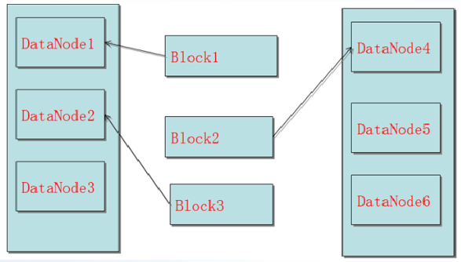

Block大小和副本数由Client端上传文件到HDFS时设置，其中副本数可以变更，Block是不可以在上传后变更的。

不一次性写三份，而是由一个dn写入另一个dn，目的是防止阻塞，防止并发量过大。

### 安全模式

#### 什么是安全模式

1. 安全模式是HDFS的一种特殊状态，在这种状态下，**HDFS只接收读数据请求**，而**不接收写入、删除、修改**等变更请求；
2. 安全模式是HDFS确保Block数据安全的一种保护机制；
3. Active NameNode启动时，HDFS会进入安全模式，DataNode主动向NameNode汇报可用Block列表等信息，在系统达到安全标准前，HDFS一直处于“只读”状态。

#### 何时正常离开安全模式

1. Block上报率：DataNode上报的可用Block个数 / NameNode元数据记录的Block个数；
2. 当Block上报率 >= 阈值时，HDFS才能离开安全模式，默认阈值为0.999；
3. 不建议手动强制退出安全模式。

#### 触发安全模式的原因

1. NameNode重启
2. NameNode磁盘空间不足
3. Block上报率低于阈值
4. DataNode无法正常启动
5. 日志中出现严重异常
6. 用户操作不当，如：强制关机（特别注意！）


### HDFS文件的读取-重点

1. 客户端向NameNode请求读取文件
2. NameNode查找目录树，查询块和NameNode的关系
3. 按照NameNode与客户端的距离由近到远的顺序列表返回给客户端
4. 客户端与最近的DataNode连接
5. DataNode返回相应Block的数据
6. 客户端组装block成一个文件

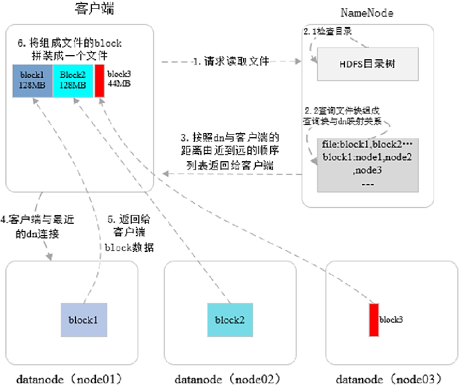

### HDFS文件的写入

1. 客户端请求上传文件
2. NameNode检查目录中是否存在这个文件，并返回是否可以上传
3. 客户端将文件切块
4. 客户端向NamNode提出上传的各个block的列表
5. NameNode检查DataNode信息
6. NameNode返回可以上传的DataNode列表
7. 客户端请求与DataNode建立传输Block的通道
   1. 上传到一个结点A之后，通过这个结点A复制到另一个结点B
   2. 再通过复制的结点B复制到新的结点C
8. 客户端以Packet为单位发送数据
9. 客户端通知NameNode成功写入Block

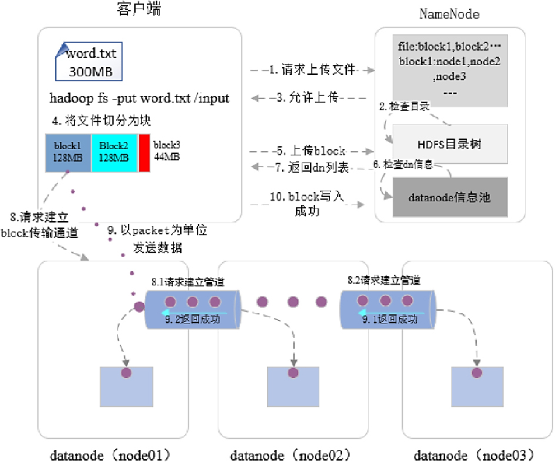

###  Hdfs存储原理

HDFS采用master/slave架构。一个HDFS集群是由一个Namenode和一定数目的Datanodes组成。NameNode作为master服务，它负责管理文件系统的命名空间和客户端对文件的访问。DataNode作为slave服务，在集群中可以存在多个。通常每一个DataNode都对应于一个物理节点。DataNode负责管理节点上它们拥有的存储，它将存储划分为多个block块，管理block块信息，同时周期性的将其所有的block块信息发送给NameNode。

### Hadoop1.0与2.0的区别

1. 提出HDFS Federation，它让多个NameNode分管不同的目录进而实现访问隔离和横向扩展，同时彻底解决了**NameNode单点故障**问题
2. 针对Hadoop1.0中的MapReduce在扩展性和多框架支持等方面的不足，它将JobTracker中的资源管理和作业控制分开，分别由ResourceManager（负责所有应用程序的资源分配）和ApplicationMaster（负责管理一个应用程序）实现，即引入了资源管理框架Yarn。通用的资源管理模块，可为各类应用程序进行资源管理和调度

### HDFS的主要组件及功能

Block是HDFS最小存储单元，大小固定，1.X默认是64MB2.X默认为128MB，可自定义。默认情况下每个Block有（至少）三个副本，通过水平复制，达到数据冗余度的要求。

单一master（NameNode）来协调存储元数据。

| nameNode                                | DataNode                                    |
| --------------------------------------- | ------------------------------------------- |
| 存储元数据                              | 存储我呢见数据                              |
| 元数据保存在内存中                      | 文件保存在磁盘上                            |
| 保存文件，Block，DataNode之间的映射关系 | 维护了block id 到datanode本地文件的映射关系 |

### HDFS适用场景

1. 超大文件
2. 流式数据访问
   1. 一次写入、多次读取
   2. 传输时间和寻址时间

### 不适用

1. 低延时
2. 大量小文件
3. 多用户写入、任意修改文件

### Shell语法

`ls：查看文件`

```shell
hadoop fs -ls / 查看HDFS文件系统上的文件
hadoop fs -ls -R / 查看HDFS文件系统多层文件夹
```

`mkdir：创建文件夹`

```shell
hadoop fs -mkdir /test/ 创建test文件夹
hadoop fs -mkdir -p /a/b 创建多层文件夹
```

`put：上传文件`

```shell
hadoop fs -put 1.tar /test 把当前目录的1.tar上传到hdfs的test目录
```

`cat/text ：查看文件内容`

```shell
hadoop fs -cat 1.txt
hadoop fs -text 1.txt
```

`get：下载文件`

```shell
hadoop fs -get /test/1.tar test.tar 把hdfs的test目录下的1.tar下载到本地，命名为test.tar
```

`rm：删除文件`

```shell
hadoop fs -rm /test/1.tar 删除HDFS系统上test目录下的1.tar文件
hadoop fs rm -r /test/ 删除HDFS系统上test目录
或者
hadoop fs -rmr /test/ 删除HDFS系统上test目录
```


##  MapReduce


### 特点

1. 无需管理master、slave和分布式，程序员只需关注业务本身。
2. 计算跟着数据走
3. 良好的扩展性：计算能力随着节点数增加，近似线性递增
4. 高容错
5. 状态监控
6. 适合海量数据的离线批处理
7. 降低了分布式编程的门槛
8. MapReduce框架采用了Master/Slave架构，包括一个Master和若干个Slave。
9. Master上运行JobTracker，负责作业管理、状态监控和任务调度等，Slave上运行TaskTracker，负责任务的执行和任务状态的汇报；

### 适用场景

1. 数据统计，如：网站的PV（page view）、UV（user visit）统计，搜索引擎构建索引
2. 海量数据查询、复杂数据分析算法实现

### 不适用场景

1. OLAP（On-Line Analytical Processing）联机分析处理

2. 要求毫秒或秒级返回结果

3. 流计算

   流计算的输入数据集是动态的，而MapReduce是静态的

4. 多步骤的复杂计算任务

### MapReduce体系结构

主要由四个部分组成，分别是Client、JobTracker、TaskTracker以及Task。

 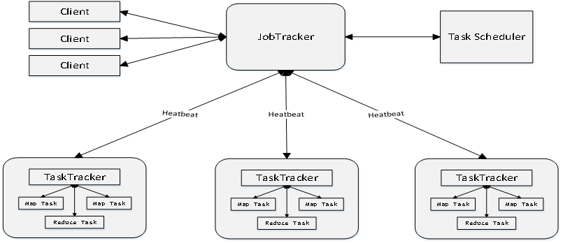

#### Client

1. 用户编写的MapReduce程序通过Client提交到JobTracker端；
2. 用户可通过Client提供的一些接口查看作业运行状态。

#### JobTracker

1. JobTracker负责资源监控和作业调度；
2. JobTracker 监控所有TaskTracker与Job的健康状况，一旦发现失败，就将相应的任务转移到其他节点；
3. JobTracker 会跟踪任务的执行进度、资源使用量等信息，并将这些信息告诉任务调度器（TaskScheduler），而调度器会在资源出现空闲时，选择合适的任务去使用这些资源。

#### TaskTracker

1. TaskTracker 会周期性地通过“心跳”将本节点上资源的使用情况和任务的运行进度汇报给JobTracker，同时接收JobTracker 发送过来的命令并执行相应的操作（如启动新任务、杀死任务等）；
2. TaskTracker 使用“slot”等量划分本节点上的资源量（CPU、内存等）。一个Task 获取到一个slot 后才有机会运行，而Hadoop调度器的作用就是将各个TaskTracker上的空闲slot分配给Task使用。slot 分为Map slot 和Reduce slot 两种，分别供MapTask 和Reduce Task 使用。

#### Task

1. Task 分为Map Task 和Reduce Task 两种，均由TaskTracker 启动。

### MapReduce工作流程

MapReduce 就是将输入进行分片，交给不同的 Map 任务进行处理，然后由 Reduce 任务合并成最终的解。

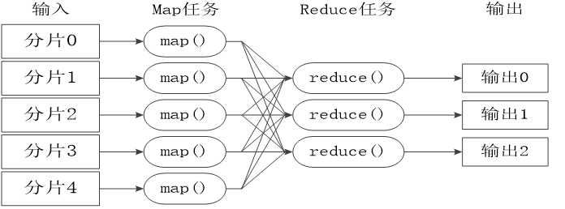

1. 对输入的数据进行分片格式化。
2. 执行MapTask。每个切片分配一个map()任务，map()对其中的数据进行计算，对每个数据用键值对的形式记录。
3. 对MapTask进行Shuffle，形成内部有序，整体无序的小文件
4. 将小文件传到Reduce()中执行，，然后进行归并排序，最终输出

#### 注意

1. 不同的Map任务之间不会进行通信
2. 不同的Reduce任务之间也不会发生任何信息交换
3. 用户不能显式地从一台机器向另一台机器发送消息
4. 所有的数据交换都是通过MapReduce框架自身去实现的

#### WordCount流程

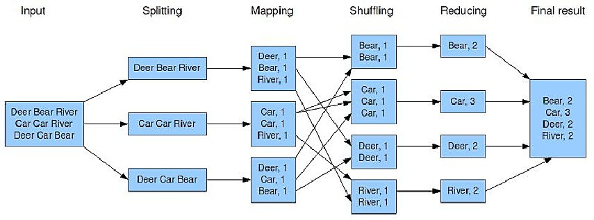

1. 我们将任务切为三份，所以启动三个map任务。
2. 我们会启动四个reduce任务，所以数据被重构，重新分布成四份，每份对应一个reduce。
3. map将数据转换为键值对，reduce将键值对合并。

其中：spliting和Mapping是用户实现的，Shuffling是框架实现的，Reducing是用户实现

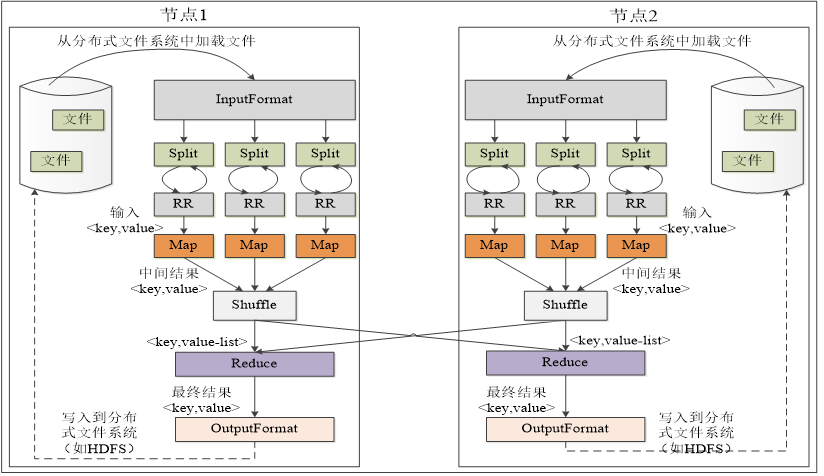

#### Job & Task（作业与任务）

1. 作业是客户端请求执行的一个工作单元，如整个wordcount计算作业；
2. 包括输入数据、MapReduce程序、配置信息
3. 任务是将作业分解后得到的细分工作单元，如其中的一个map任务。
4. 分为Map任务和Reduce任务两类

#### Split（切片）

1. 输入数据被划分成等长的小数据块，称为输入切片（Input Split），简称切片；
2. 每个Split交给一个Map任务处理，Split的数量决定Map任务的数量；
3. Split的划分方式由程序设定，按照HDFS block是其中的一种；
4. Split越小，负载越均衡，但集群的开销越大；

#### Shuffle阶段（洗牌）

1. Map、Reduce阶段的中间环节，负责执行Partition（分区）、Sort（排序）、Spill（溢写）、Merge（合并）、抓取（Fetch）等工作；
2. Partition决定了Map任务输出的每条数据放入哪个分区，交给哪个Reduce任务处理；
3. Reduce任务的数量决定了Partition数量；（ reduce任务的数量并非由输入数据的大小决定，而是特别指定的。 ）
4. Partition编号 = Reduce任务编号 =“hash（key） % reduce task number”；
5. 避免和减少Shuffle是MapReduce程序调优的重点。 

#### Mapper、Partition、Reducer数目的确定与关系？

1. Mapper：由客户端分片情况决定，客户端获取到输入路径的所有文件，依次对每个文件执行分片，分片大小通过最大分片大小、最小分片大小、hdfs的blocksize综合确定，分片结果写入job.split提交给yarn，对每个分片分配一个Mapper，即确定了数目。
2. Partition：由PartitionerClass中的逻辑确定，默认情况下使用的HashPartitioner中使用了hash值与reducerNum的余数，即由reducerNum决定，等于Reducer数目。如果自定义的PartitionerClass中有其他逻辑比如固定了，也可以与Reducer数目无关，但注意这种情况下，如果reducerNum小于分区数则会报错，如果大于则会产生无任务的reduecer但不会影响结果。但是如果reducerNum只有1个，则不会报错而是所有分区都交给唯一的reducer。
3. Reducer：通过job.setNumReduceTasks手动设置决定。

### MapReduce shuffle过程


#### Map端的shuffle过程

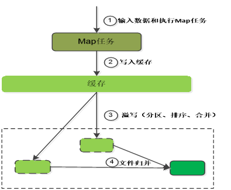

1. 每个Map任务分配一个缓存

   MapReduce默认100MB缓存

   

2. 设置溢写比例0.8

3. 分区默认采用哈希函数

4. 排序是默认的操作

5. 排序后可以合并（Combine）（自定义）

6. 合并不能改变最终结果

   

7. 在Map任务全部结束之前进行归并

8. 归并得到一个大的文件，放在本地磁盘

9. 文件归并时，如果溢写文件数量大于预定值（默认是3）则可以再次启动Combiner，少于3不需要

10. JobTracker会一直监测Map任务的执行，并通知Reduce任务来领取数据

**合并（Combine）和归并（Merge）的区别：**

> 两个键值对<“a”,1>和<“a”,1>，如果合并，会得到<“a”,2>，如果归并，会得到<“a”,<1,1>>

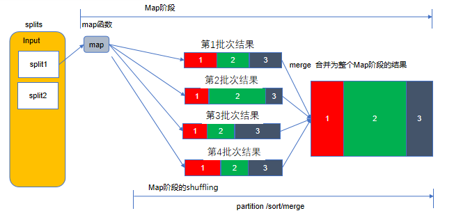

#### Reduce端的Shuffle过程

1. Reduce任务通过RPC（远程过程调用）向JobTracker询问Map任务是否已经完成，若完成，则领取数据；
2. Reduce领取数据先放入缓存，来自不同Map机器，先归并，再合并，写入磁盘；
3. 多个溢写文件归并成一个或多个大文件，文件中的键值对是排序的；
4. 当数据很少时，不需要溢写到磁盘，直接在缓存中归并，然后输出给Reduce。

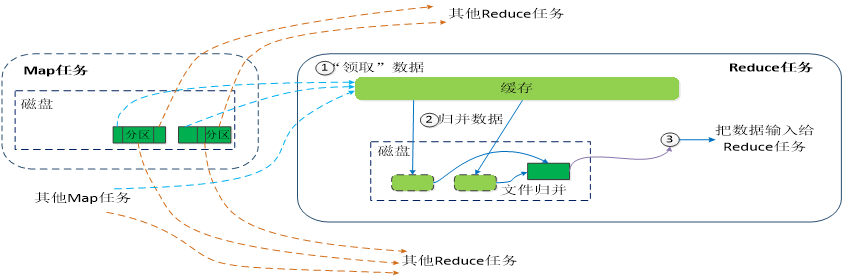

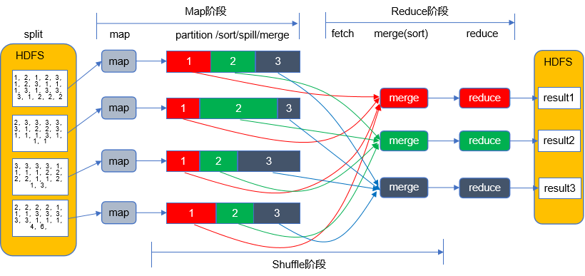

#### Shuffle详解-及这个就行

##### Map端

1. Map任务将中间结果写入专用内存缓冲区Buffer（默认100M），同时进行Partition和Sort（先按“key hashcode % reduce task number”对数据进行分区，分区内再按key排序）
2. 当Buffer的数据量达到阈值（默认80%）时，将数据溢写（Spill）到磁盘的一个临时文件中，文件内数据先分区后排序
3. Map任务结束前，将多个临时文件合并（Merge）为一个Map输出文件，文件内数据先分区后排序
4. 所有Map任务完成后，Map阶段结束，一般每个Map任务都有输出

##### Reduce端

1. Reduce任务从多个Map输出文件中主动抓取（Fetch）属于自己的分区数据，先写入Buffer，数据量达到阈值后，溢写到磁盘的一个临时文件中
2. 数据抓取完成后，将多个临时文件合并为一个Reduce输入文件，文件内数据按key排序

#### YARN模式（ Hadoop 2.X ）

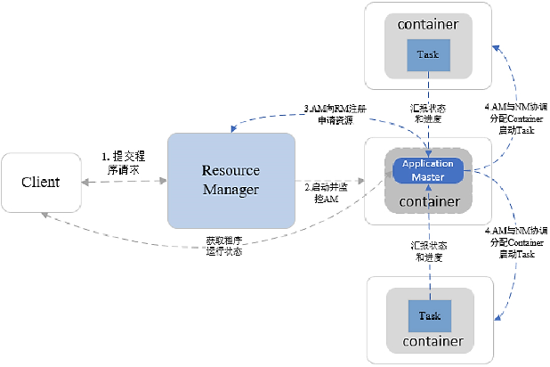

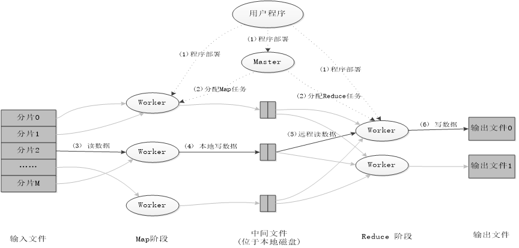


## HBase

### HBase概念

HBase是一个高可靠、高性能、面向列、可伸缩的分布式数据库，主要用来存储非结构化和半结构化的松散数据。

###  HBase与传统数据库的对比：

数据类型：传统数据库数据类型较丰富，Hbase数据类型更加简单。

数据操作：传统数据库涉及多表连接，Hbase不存在。

存储模式：关系数据库是基于行模式存储的。HBase是基于列存储的。

数据索引：关系数据库可以针对不同列构建多个索引，HBase只有行键索引。

数据维护：传统数据库更新会丢失版本旧的数据，Hbase更新会保留版本旧的数据。

可伸缩性：关系数据库很难实现横向扩展，纵向扩展的空间也比较有限。Hbase相反。

###  HBase适用场景

1. 并发查询

   1. 海量数据
   2. 高并发
   3. 简单条件查询

2. 半结构化和非结构化数据存储

   1. 10K~10M的结构化和非结构化数据

   

### HBase数据模型

#### 数据模型概述

HBase是一个稀疏、多维度、排序的映射表，这张表的索引是行键、列族、列限定符和时间戳

#### 数据模型相关概念

**1.** 表：HBase采用表组织数据，由行和列构成 

**2.** 行：由行键来标识 

**3.** 列族：基本的访问控制单元 

**4.** 列限定符：数据通过列限定符定位 

**5.** 单元格：通过行、列、列限定符确定一个单元格 

**6.** 时间戳：每个单元格都保存着同一份数据的不同版本，这些版本采用时间戳进行索引。

#### 四维模型

 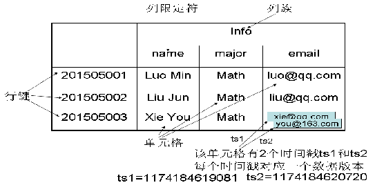

HBase中需要根据行键、列族、列限定符和时间戳来确定一个单元格，因此，可以视为一个“四维坐标”，即`[行键, 列族, 列限定符, 时间戳]`

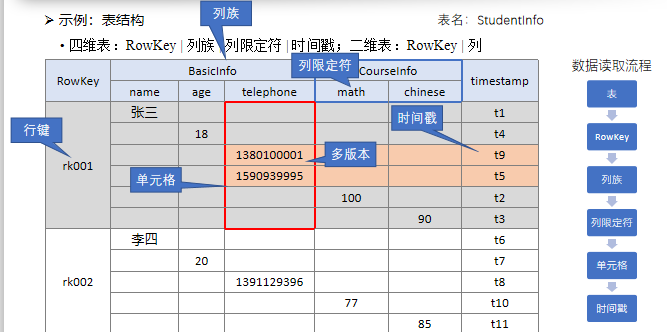

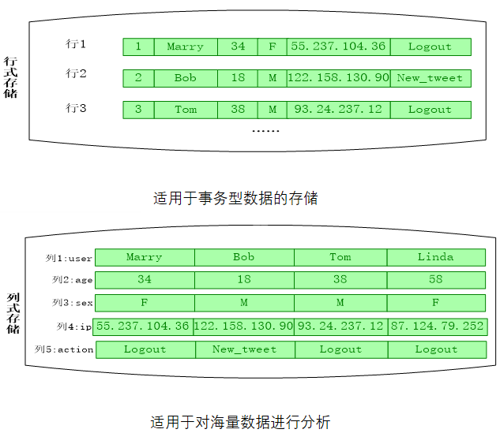

### Hbase实现原理

#### 功能组件

1. 库函数 

2. 一个Master主服务器 : 负责管理和维护HBase表的分区信息，维护Region服务器列表，分配Region，负载均衡

3. 许多个Region服务器: 负责存储和维护分配给自己的Region，处理来自客户端的读写请求；客户端并不是直接从Master主服务器上读取数据，而是在获得Region的存储位置信息后，直接从Region服务器上读取数据

##### Region

1. 分布式存储和负载的最小单元；
2. 系统将表水平划分（按行）为多个Region，每个Region保存表的一段连续数据；
3. 默认每张表开始只有一个Region，随着数据不断写入，Region不断增大，当Region大小超过阀值时，当前Region会分裂成两个子Region。
4. 每个Region默认大小是100MB到200MB（2006年以前的硬件配置）
   1. 每个Region的最佳大小取决于单台服务器的有效处理能力
   2. 目前每个Region最佳大小建议1GB-2GB（2013年以后的硬件配置）
5. 同一个Region不会被分拆到多个Region服务器
6. 每个Region服务器存储10-1000个Region
7. 表被切分成多个Regions,分布到多个RegionServers上

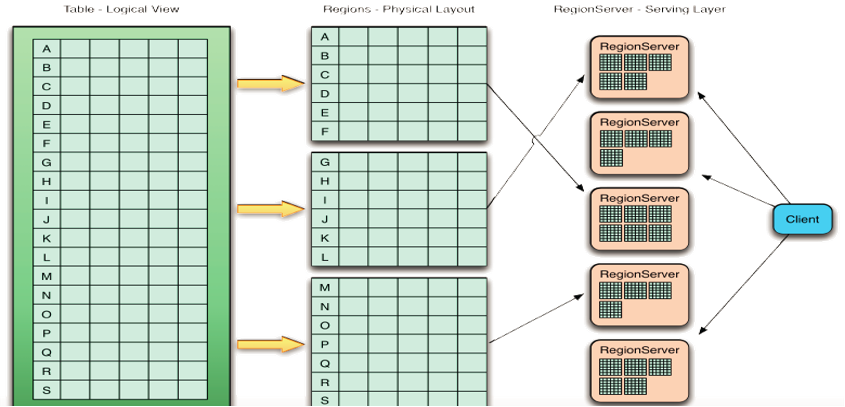

#### Hbase三层结构

一、Zookeeper文件：记录了-ROOT-表的位置信息

二、ROOT-表：记录了.META.表的Region位置信息

三、META.表：-记录了数据表的Region位置信息

为了加快访问速度，.META.表的全部Region都会被保存在内存中


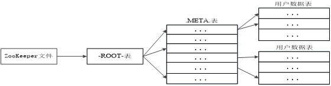

#### 客户端访问数据时的“三级寻址”

1. 为了加速寻址，客户端会缓存位置信息，同时，需要解决缓存失效问题；
2. 寻址过程客户端只需要询问Zookeeper服务器，不需要连接Master服务器。

### HBase系统架构

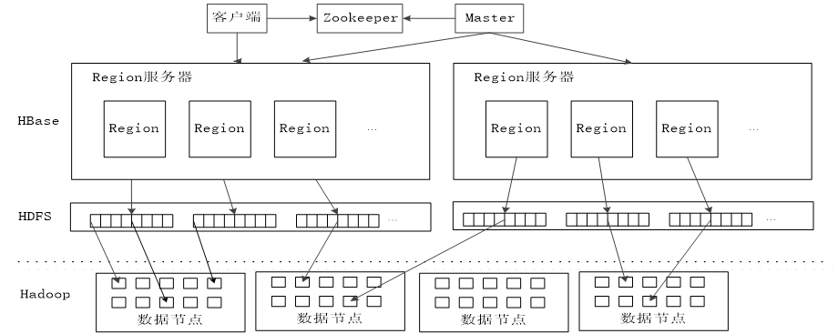

####  客户端

客户端包含访问HBase的接口，同时在缓存中维护着已经访问过的Region位置信息，用来加快后续数据访问过程。

#### Zookeeper服务器

1. Zookeeper可以帮助选举出一个Master作为集群的总管，并保证在任何时刻总有唯一一个Master在运行，这就避免了Master的“单点失效”问题；

   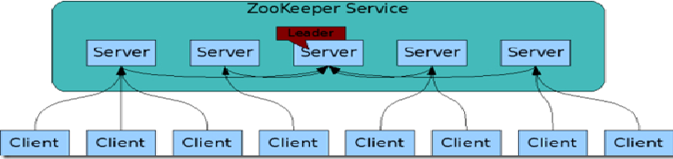

2. 监控RegionServer的上下线信息，并通知Master；存储元数据的寻址入口；存储所有Region的寻址入口。

3. Zookeeper是一个很好的集群管理工具，被大量用于分布式计算，提供配置维护、域名服务、分布式同步、组服务等。

#### Master

- 主服务器Master主要负责表和Region的管理工作：
  - 管理用户对表的增加、删除、修改、查询等操作
  - 实现不同Region服务器之间的负载均衡
  - 在Region分裂或合并后，负责重新调整Region的分布
  - 对发生故障失效的Region服务器上的Region进行迁移
  - 不处理Client的数据读写请求

#### Region服务器（Slave）

- Region服务器是HBase中最核心的模块，负责维护分配给自己的Region，并响应用户的读写请求。
- 管理Region Split（分裂）
- 管理StoreFile Compaction（合并）

#### Region服务器工作原理

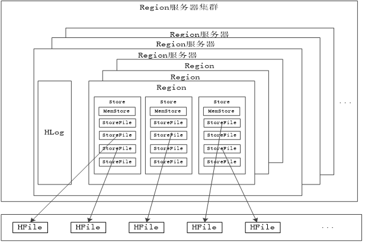

##### Region按照列族，分为多个Store。（下图）

1. 一个Region由多个Store组成，每个Store存储一个列族。Region是分布式存储的最小单元，而Store是存储落盘的最小单元。
2. Store由一个MemStore和若干StoreFile组成。

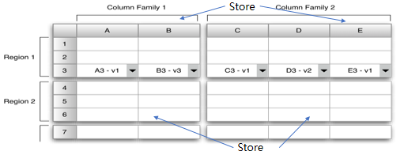

##### MemStore与StoreFile

1. MemStore是Store的**内存缓冲区**，StoreFile是MemStore的**磁盘溢写文件**，在HDFS中被称为HFile。
2. 数据读写都先访问MemStore。Client读取数据时，先找MemStore，再找StoreFile。写数据时，先写MemStore，当数据量超过阈值时，RegionServer会将MemStore中的数据溢写磁盘，每次溢写都生成一个独立的StoreFile（HFile）；
   1. 读数据时
      1. client先找MemStore，再找StoreFile
   2. 写数据时
      1. 先再MemStore中写入，
      2. 数据量超过阈值时，RegionServer将MemStore中的数据溢写磁盘。每次溢写独立生成一个StoreFile

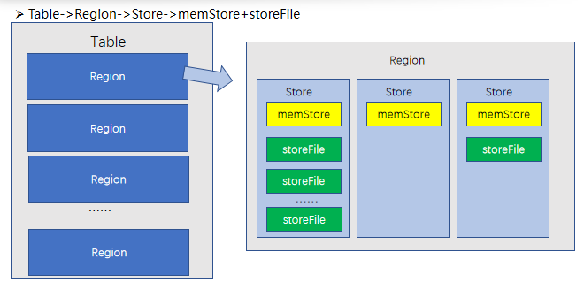

#### 用户写入数据

1. 用户写入数据时，被分配到相应Region服务器去执行
2. 用户数据首先被写入到MemStore和Hlog中
3. 只有当操作写入Hlog之后，commit()调用才会将其返回给客户端

##### 向Hbase写入数据

1. 访问ZK，获取meta表所在RegionServer和Region
2. 读取meta表，获取所有Region在所有RegionServer上的分布，和每个Region中维护的表数据的范围。
3. 根据主键和meta表，得出待写数据归属的Region和RegionServer，**向特定RegionServer发送数据**。

##### RegionServer接受数据

1. RegionServer收到数据。先将操作写入HLog，再将数据写入MemStore。当MemStore的数据量超过阈值时，将数据溢写磁盘，生成一个StoreFile文件。
2. 当Store中StoreFile的数量超过阈值时，将若干小StoreFile合并。
3. 当Region中最大Store的大小超过阈值时，Region分裂成两个子Region

##### HLog

1. 含义：以WAL（Write Ahead Log，预写日志）方式写数据时产生的日志文件
2. 目的：RegionServer意外宕机时的数据恢复
3. 先写HLog，再写MemStore，最后写StoreFile，每个RegionServer维护一个HLog
4. 定期删除HLog过期数据
5. 用户更新数据必须首先写入日志后，才能写入MemStore缓存，并且，直到MemStore缓存内容对应的日志已经写入磁盘，该缓存内容才能被刷写到磁盘。
6. Zookeeper会实时监测每个Region服务器的状态，当某个Region服务器发生故障时，Zookeeper会通知Master；
7. Master首先会处理该故障Region服务器上面遗留的HLog文件，这个遗留的HLog文件中包含了来自多个Region对象的日志记录；
8. 系统会根据每条日志记录所属的Region对象对HLog数据进行拆分，分别放到相应Region对象的目录下，然后，再将失效的Region重新分配到可用的Region服务器中，并把与该Region对象相关的HLog日志记录也发送给相应的Region服务器；
9. Region服务器领取到分配给自己的Region对象以及与之相关的HLog日志记录以后，会重新做一遍日志记录中的各种操作，把日志记录中的数据写入到MemStore缓存中，然后，刷新到磁盘的StoreFile文件中，完成数据恢复；
10. 共用日志优点：提高对表的写操作性能；缺点：恢复时需要分拆日志。

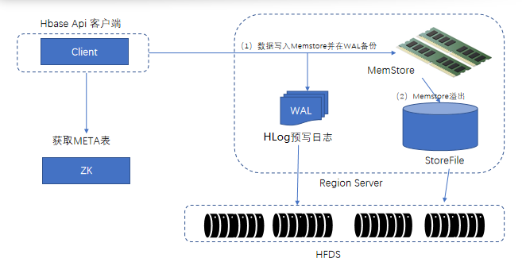

#### 用户读数据

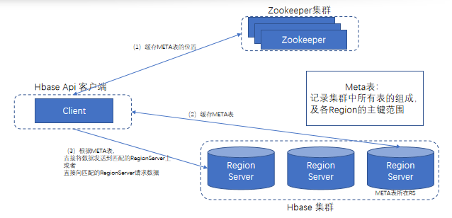

Client从Hbase读取数据

1.  访问ZK，获取meta表所在RegionServer和Region
2. 读取meta表，获取所有Region在所有RegionServer上的分布，和每个Region中维护的表数据的范围。
3. 缓存meta表位置和内容。根据表空间、表名、主键和meta表内容，得出待读数据归属的Region和RegionServer，从特定RegionServer读数据。
4. RegionServer先从MemStore读取数据，如未找到，再从StoreFile中读取。

#### Shell

查看当前namespace，

```shell
list_namespace
```

创建一个新的namespace “test”，

```shell
create_namespace 'test'
```

并设置最大建表数为10

```shell
alter_namespace 'test', {METHOD => 'set', 'hbase.namespace.quota.maxtables' => '10'}
```

创建一个表test01，有两个列族f1,f2，设置f1的最大版本数为5，设置表的预分区为3个

```shell
create 'test:test01', {NAME=>'f1', VERSIONS=>5}, 'f2', SPLITS => ['10','20','30']
```

创建另一个表test02，有两个列族g1，g2

```shell
create 'test:test02','g1','g2'
```

查看namespace test 中的表

```shell
list
```

删除表test02中的g2列

```shell
alter 'test:test02, 'delete'=>'g2'
```

修改表test02的的属性MAX_FILESIZE为256128256

```shell
alter 'test:test02', MAX_FILESIZE='256128256'
```

为表test02增加一列s1，设置s1的最大版本数为5

```shell
alter 'test:test02', {NAME=>'s1', VERSIONS=>'5'}
```

删除表test02

```shell
drop 'test:test02'
```

为表test01添加数据

```shell
put 'test:test01', 'r01', 'f1:name', 'zhang'
put 'test:test01', 'r01', 'f1:num', '10'
put 'test:test01', 'r01', 'f1:addr', 'shanghai'
put 'test:test01', 'r02', 'f1:name', 'wang'
put 'test:test01', 'r02', 'f2:addr', 'hangzhou'
```

全表扫描数据

```shell
scan 'test:test01'
```

查看r02行的name列数据

```shell
get 'test:test01', 'r02', 'f1:name'
```

删除r02行f2列的数据

```shell
delete 'test:test01', 'r02', 'f2'
```

清空表test01的数据

```shell
truncate_preserve 'test:test01'
```

现有以下关系型数据库中的表和数据，要求将其转换为适合于HBase存储的表，绘出表格，然后插入数据，并查看数据。建议用列族的方式来创建。

| 学号（S_No） | 姓名（S_Name） | 年龄（S_Age） |
| ------------ | -------------- | ------------- |
| 2018001      | Lily           | 21            |
| 2018002      | Jacky          | 22            |
| 2018003      | Mouse          | 21            |

| 课程号（C_No） | 课程名（C_Name） |
| -------------- | ---------------- |
| 123001         | English          |
| 123002         | Computer         |

| 学号（SC_Sno） | 课程号（SC_Cno） | 成绩（SC_Score） |
| -------------- | ---------------- | ---------------- |
| 2018001        | 123001           | 89               |
| 2018001        | 123002           | 78               |
| 2018002        | 123001           | 90               |
| 2018002        | 123002           | 69               |
| 2018003        | 123001           | 78               |
| 2018003        | 1230023          | 65               |

构造的HBase表格可以为（仅供参考）

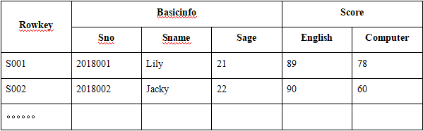

主键的列名是随机分配的，因此无需创建主键列。


创建表：create 表名，字段名1 / 列族1，字段名2 / 列族2，……

```shell
create 'scs','basic_info','score'
```

插入数据：put 表名，rowkey，字段名1，字段值1

```shell
put 'scs','s001','basic_info:s_no','2018001'
put 'scs','s001','basic_info:s_name','Lily'
put 'scs','s001','basic_info:s_age','21'
put 'scs','s001','score:english','89'
put 'scs','s001','score:computer','78'
```

查看数据：scan 表名

```shell
scan 'scs'
```

如果在学生表中为学生增加一项“联系电话（S_Tel）”，如何完成？插入数据后，查看数据。（提示：使用列族，添加列限定符）

```shell
put 'scs','s001','basic_info:tel','185CCCCCCCC'
```

若查看rowkey为“s001”（值是示例，根据你自己设置的rowkey值进行查询）的所有课程成绩（SC表），如何完成？（提示：get 表名 key值）

```shell
get 'scs','s001','score'
```


##  Hive

### Hive概念

Hive是一个数据仓库基础工具在Hadoop中用来处理结构化数据。

### Hive特点

1.采用批处理方式处理海量数据 2.提供适合数据仓库操作的工具

### Hive缺点

1.延迟较高 2.不支持物化视图 3.不适用OLTP 4.暂不支持存储过程

### Hive应用场景

1.数据挖掘 2.非实时分析 3.数据汇总 4.数据仓库

### Hive系统架构

由用户接口模块、驱动模块和元数据存储模块构成

###  相关概念

1. Metastore，存储元数据的角色。Hive将元数据存储在传统的关系型数据库（mysql、derby）中。

2. Hive中的元数据包括：表的名字、表的数据所在的HDFS目录、数据在目录中的分布规则、以及其他表属性。

3. Hive计算引擎可以是Apache MapReduce或者Apache Spark。

4. 内部表和外部表

   表是数据管理和存储的基本对象，由元数据和表数据组成

   |                      | 内部表                   | ***\*外部表\**** |
   | -------------------- | ------------------------ | ---------------- |
   | 创建加载可以独立完成 | 数据移到仓库目录         | 数据位置不移动   |
   | 创建加载同时完成     | 元数据和数据会被一起删除 | 只删除元数据     |

5. 分区：通过特定条件将表的数据分发到分区目录中，或者将分区中的数据分发到子分区目录中。

   1. 分区的作用：减少不必要的全表扫描，提升查询效率。

6. 分桶：通过分桶键哈希取模的方式，将表或分区中的数据随机、均匀地分发到N个桶中，桶数N一般为质数，桶编号为0, 1, …, N-1

   1. 分桶的作用：提高取样效率，提高Join查询效率

7. 分区分桶的区别：

   1. 分区：
      1. 数据表可以按照某个字段的值划分分区。
      2. 每个分区是一个目录。
      3. 分区数量不固定。
      4. 分区下可再有分区或者桶。

   2. 分桶
      1. 数据可以根据桶的方式将不同数据放入不同的桶中。
      2. 每个桶是一个文件。
      3. 建表时指定桶个数，桶内可排序。
      4. 数据按照某个字段的值Hash后放入某个桶中。


### 用户向Hive输入一段命令或查询时，Hive需要与Hadoop交互工作来完成该操作

1. 驱动模块接收该命令或查询编译器

2. 对该命令或查询进行解析编译

3. 由优化器对该命令或查询进行优化计算

4. 该命令或查询通过执行器进行执行

## Spark

### Spark特点

1.运行速度快 

2.容易使用 

3.通用性 

4.运行模式多样

### 与Hadoop的关系

Spark在借鉴Hadoop MapReduce优点的同时，Spark编辑模型比Hadoop更灵活，spark提高了内存计算，对于迭代运算效率更高。Spark基于DAG的任务调度执行机制优于Hadoop的迭代执行机制。

### Spark生态系统

主要包含了Spark Core、Spark SQL、Spark Streaming、MLLib和GraphX 等组件。

### Spark生态系统组件应用场景

1. 复杂的批量数据处理

2. 基于历史数据的交互式查询

3. 基于实时数据流的数据处理

4. 基于历史数据的数据挖掘

5. 图结构数据的处理

### Spark运行架构

集群资源管理器（Cluster Manager）

运行作业任务的工作节点（Worker Node）

每个应用的任务控制节点（Driver）

每个工作节点上负责具体任务的执行进程（Executor）

### RDD工作原理

#### RDD概念

一个只读的分区记录集合。

#### RDD特性

1. 高效的容错性 

2. 中间结果持久化到内存 

3. 存放的数据可以是未序列化的Java 对象

### 宽依赖与窄依赖

#### 窄依赖

一个父RDD的分区对应于一个子RDD的分区或多个父RDD的分区对应于一个子RDD的分区。

#### 宽依赖

存在一个父RDD的一个分区对应一个子RDD的多个分区。

### Spark SQL工作原理

1. 将SQL转换成抽象语法树

2. 将抽象语法树转换成查询块

3. 将查询块转换成逻辑查询计划

4. 重写逻辑查询计划

5. 讲逻辑计划转成物理计划

6. 选择最佳优化查询策略

### Spark Mllib基本原理

MLlib是Spark的机器学习库，旨在简化机器学习的工程实践工作。Mllib常见机器学习问题：分类、回归、聚类、协同过滤。


## 参考

[Hadoop项目结构_weixin_33727510的博客-CSDN博客](https://blog.csdn.net/weixin_33727510/article/details/90305967)
