软件测试技术的复习资料

<!--more-->

# 填空题

计算机软件是包括程序、数据和文档的完整集合。

软件评估中常见的3个质量模型是McCall、Boehm和ISO9126。

软件测试的过程模型包括V模型、W模型和H模型等。

软件评估的主要方法包括缺陷评估、覆盖评测、质量评测

常用的3种排错方法包括：原始类排错法、回溯法、归纳和演绎法

最常用的覆盖评价是基于需求的测试覆盖、基于代码的测试覆盖。

缺陷分析通常的度量形式包括缺陷发现率、缺陷密度、缺陷潜伏期、整体软件缺陷清除率

根据测试文档的不同作用，通常分为前置作业文档、后置作业文档。

PDCA的循环理念主要包括计划、执行、检查和改进四个阶段。

风险管理的基本内容包括风险评估、风险控制。

软件项目的成本主要包括项目直接成本、管理费用、期间费用。

面向对象的集成测试中，对象交互的测试根据类的类型可以分为原始类测试、汇集类测试、协作类测试、

对OOD的测试可以从三个方面考虑：对认定的类的测试、对构造的类层次结构的测试和对类库的支持的测试。

HTTP协议的作用原理包括四个步骤，分别是：连接请求 、应答、关闭 。 


# 简答题

## 请简述软件危机的主要表现

- 软件生产不能满足日益增长的软件需求。

- 软件生产率随软件规模与复杂性提高而下降，人力成本却不断增加。

- 软件开发的进度与成本失控。

- 软件系统实现的功能与实际需求 。

- 软件难以维护。

- 软件文档配置没有受到足够的重视。

## 软件生存周期包括那几个阶段？其中第一阶段又可以分为哪两个阶段？

- 软件定义

- 软件开发
- 软件测试
- 软件使用与维护

可行性研究和需求分析

## 请列举软件产生错误的主要原因（至少6项）

- 软件的复杂性
- 交流不够、交流上有误解或者根本不进行交流
- 程序设计错误
- 需求变化
- 时间压力
- 代码文档贫乏
- 软件开发工具

## 列举常见的3个质量模型，并说明比较普遍的质量模型包含的两层结构。

McCall模型、Boehm模型和ISO9126。

第一层是按大类划分质量特性，叫做基本质量特性

第二层是每个大类所包含的子类质量特性

最后在各个类别的质量特性中一一列出对应的或相关的标准


## 请列出软件测试的基本原则。

- 所有的测试都应追溯到用户需求

- 应当把“尽早和不断地测试”作为座右铭

- 测试工作应该由独立的专业的软件测试机构来完成

- Pareto原则

- 设计测试用例时，应该考虑各种情况

- 对测试出的错误结果一定要有一个确认的过程

- 制定严格的测试计划

- 完全测试是不可能的，测试需要终止

- 注意回归测试的关联性

- 妥善保存一切测试过程文档。

## 按照过程分类，软件测试包括哪些过程？

- 单元测试

- 集成测试

- 系统测试

- 验收测试

## 请介绍软件测试的一般流程

- 制定测试计划

- 设计测试方案

- 测试准备和测试环境的建立

- 执行测试

- 测试评估

- 测试总结

## 请介绍制定测试计划的原则

- 制定测试计划应尽早开始

- 保持测试计划的灵活性

- 保持测试计划简洁易读

- 尽量争取多方面来评审测试计划

- 计算测试计划的投入

## 请介绍软件测试计划的作用

- 使软件测试工作进行更顺利

- 增进项目参加人员之间的沟通

- 及早发现和修正软件规格说明书的问题

- 使软件测试工作更易于管理

## 白盒测试的方法有哪些（至少说明5种）？

- 静态测试

- 程序插桩

- 逻辑覆盖

- 基本路径测试

- 域测试

- 符号测试

- Z路径测试

- 程序变异

## 黑盒测试主要是为了发现软件中的哪几类错误？

- 是否有不正确或遗漏的功能

- 在接口上，输入是否能正确的接受，能否输出正确的结果

- 是否有数据结构错误或外部信息访问错误

- 性能上是否能够满足要求

- 是否有初始化或终止性错误

## 白盒测试要对程序模块进行什么检查？

- 保证一个模块中的所有独立路径至少被使用一次

- 对所有逻辑值均测试true和false

- 在循环的边界和运行的界限内执行循环体

- 检查内部数据结构以确定其有效性

## 什么是程序插桩法？

程序插桩法是借助向被测程序中插入操作，来实现测试目的的方法，即向源程序中添加一些语句，实现对程序语句的执行、变量的变化等情况进行检查。

## 请列举逻辑覆盖的类型，并按由弱到强的顺序排列。

- 语句覆盖

- 判定覆盖

- 条件覆盖

- 判定/条件覆盖

- 条件组合覆盖

## 请列举功能测试包括的方法（至少6项）

- 等价类划分

- 边界值分析法

- 错误推测法

- 因果图法

- 场景法

- 判定表驱动

- 正交试验法

- 功能图法

## 请列举非功能测试包括的方法（至少6项）

- 强度测试

- 性能测试

- 安全测试

- 安装与卸载测试

- 配置测试

- 兼容性测试

- 故障修复测试

- 使用性能测试

- 帮助菜单及用户说明测试

## 请介绍单元测试的原则

- 单元测试越早进行越好

- 单元测试应该依据《软件详细设计规格说明》进行

- 对于修改过的代码应该重做单元测试

- 当测试用例的测试结果与设计规格说明上的预期结果不一致时，测试人员应如实记录实际的测试结果

- 单元测试应注意选择好被测软件单元的大小

- 一个完整的单元测试说明应该包含正面测试和负面测试

- 注意使用单元测试工具

## 请说明单元测试的主要任务

- 模块接口测试

- 模块局部数据结构测试

- 模块中所有独立路径执行路径测试

- 各种错误处理测试

- 模块边界条件测试

## 请介绍集成测试的主要任务

- 将各模块连接起来，检查模块相互调用时，数据经过接口是否丢失

- 将各子功能组合起来，检查能否达到预期要求的各项功能

- 一个模块的功能是否会对另一个模块的功能产生不利的影响

- 全局数据结构是否有问题，会不会被异常修改

- 单个模块的误差积累起来，是否被放大，从而达到不可接受的程度

## 请介绍系统测试需要完成的测试。

- 功能测试

- 性能测试

- 可靠性、稳定性测试

- 兼容性测试

- 恢复测试

- 安全测试

- 强度测试

- 面向用户支持方面的测试

## 请介绍验收测试的主要内容。

- 配置复审

- 合法性检查

- 文档检查

- 软件一致性检查

- 软件功能和性能测试

- 软件结果评审

## 什么是α和β测试？

α测试是在软件开发公司内模拟软件系统的运行环境下的一种验收测试，即软件开发公司组织内部人员、模拟各类用户行为对即将面市的软件产品进行测试。经过α测试调整的软件产品称为β版本，β测试是指软件开发公司组织各方面的典型用户在日常工作中实际使用β版本。

## 请介绍测试用例的作用

- 有效性
- 避免测试的盲目性

- 可维护性

- 可复用性

- 可评估性

- 可管理性

## 测试用例设计的基本原则

- 用成熟测试用例设计方法来指导设计

- 测试用例的正确性

- 测试用例的代表性

- 测试结果的可判定性

- 测试结果的可再现性

- 足够详细、准确和清晰的步骤

## 测试用例执行中应该注意哪几个问题？

- 全方位地观察测试用例执行结果

- 加强测试过程记录

- 及时确认发现的问题

- 与开发人员良好的沟通

- 及时更新测试用例

- 提交一份优秀的问题报告单

- 测试结果分析

## 请介绍软件缺陷的有效性描述规则

- 单一准确

- 可以再现

- 完整统一

- 短小简练

- 特定条件

- 补充完善

- 不做评价

## 请列举软件缺陷生命周期的状态

- 打开状态

- 解决状态

- 关闭状态

- 审查状态

- 推迟状态

## 如果找到的软件缺陷要采取繁杂的步骤才能再现，应采取什么方法来分离和再现软件缺陷？

- 确保所有的步骤都被记录

- 注意时间和运行条件上的因素

- 注意软件的边界条件、内存容量和数据溢出的问题

- 注意事件发生次序导致的软件缺陷

- 考虑资源依赖性和内存、网络、硬件共享的相互作用

- 不要忽略硬件

## 如何正确面对软件缺陷

- 并不是测试人员辛苦找出的每个软件缺陷都是必须修复的

- 发现缺陷的数量说明不了软件的质量

- 不要指望找出软件中所有的缺陷

## 软件测试的评测方法主要包括哪两类？每类又包含哪些方法？

包括：覆盖评测和质量评测

覆盖评测包括基于需求的测试覆盖和基于代码的测试覆盖。

质量评测主要通过缺陷分析来实现，具体包括：缺陷发现率、缺陷潜伏期、缺陷密度和整体软件缺陷清除率。

## 软件测试评测的主要目的是什么？

- 量化测试进程，判断软件测试进行的状态，决定什么时候软件测试可以结束

- 为最后的测试或软件质量分析报告生成所需的量化数据。

## 请说明测试项目的基本特性

- 项目的独特性

- 项目的组织性

- 测试项目的生命期

- 测试项目的资源消耗特性

- 测试项目的目标冲突性

- 具有智力密集、劳动密集的特点

- 测试项目结果的不确定性

## 请介绍测试项目管理的基本原则

- 始终能够把质量放在第一位

- 可靠的需求

- 尽量留出足够的时间

- 足够重视测试计划

- 要适当地引入测试自动化或测试工具

- 建立独立的测试环境

- 通用项目管理原则

## 软件测试文档的作用是什么？

- 促进项目组成员之间的交流沟通

- 便于对测试项目的管理

- 决定测试的有效性

- 检验测试资源

- 明确任务的风险

- 评价测试结果

- 方便再测试

- 验证需求的正确性

## 软件测试项目的过程管理主要包括哪些？

- 测试项目启动

- 测试计划阶段

- 测试设计阶段

- 测试执行阶段

- 测试结果的审查和分析

## 软件测试配置管理包括哪几个基本活动

- 配置标识

- 版本控制

- 变更控制

- 配置状态报告

- 配置审计

## 请说明面向对象软件测试的三个层次，并说明第一层测试充分性的三个标准

类测试、类簇测试、系统测试

基于类状态的覆盖率、基于约束的覆盖率、基于代码的覆盖率

## OOA阶段的测试可以划分为哪几个方面？

- 对认定的对象的测试

- 对认定的结构的测试

- 对认定的主题的测试

- 对定义的属性和实例关联的测试

- 对定义的服务和消息关联的测试

## 请介绍自动化测试的好处

- 产生可靠的系统

- 改进测试工作质量

- 提高测试工作效率

## 请说明软件自动化测试的引入条件

- 管理层要充分意识到软件测试自动化的重要性

- 对软件测试自动化有正确的认识

- 有一个很好的计划和稳定的应用行为

- 实施测试自动化必须进行多方面的培训

- 具有一个专注的、有着丰富技能的测试团队，并且被分配了足够的时间和资源

## 请说明软件测试自动化的实施过程

- 熟悉、分析测试用例

- 把已有的测试用例归类，写成比较简单的测试自动化计划书

- 开始自动化测试程序的编写

- 尽量用“数据驱动”来将测试覆盖率提高

- 将测试用例写成自动化测试程序

- 不断地完善自动化测试系统

## Web性能测试具体目标包括哪些？

- 确定Web应用系统的总体性能参数，包括所支持的最大并发用户数、事务处理成功率、请求相应的往返延迟等。

- 确定在各个级别的负载及压力测试下服务器输出的具体性能参数。

## Web应用系统性能测试人员应具有哪些能力？

- 掌握常见自动化测试工具的使用。

- 具备一定的编程能力。

- 掌握常见的数据库知识。

- 掌握常见的操作系统知识。

- 掌握一些Web应用服务器例如IIS，Tomcat等的使用。

- 具有综合分析问题的能力，例如通过综合分析测试结果来确定系统瓶颈。

## Web性能测试包含哪些测试类型？

- 压力测试

- 负载测试

- 强度测试

- 数据库容量测试

- 预期指标的性能测试

- 独立业务性能测试

- 组合业务性能测试

- 疲劳强度性能测试

- 网络性能测试

- 大数据量测试

- 服务器性能测试

## Web全面性能测试模型中，Web性能测试的八个类别包括哪些主要内容？

- 预期指标的性能测试

- 独立业务性能测试

- 组合业务性能测试

- 疲劳强度性能测试

- 大数据量性能测试

- 网络性能测试

- 服务器性能测试

- 特殊测试

## Web应用的功能测试包括哪些内容？

- 链接测试 

- 表单测试 

- 设计语言测试 

- 数据库测试 

- Cookies测试 

- 相关性功能检查与测试 

## Web界面测试的目标包括哪些？

- Web界面的实现与设计需求、设计图保持一致，或者符合可接受标准；

- 使用恰当的控件，各个控件及其属性符合标准；

- 通过浏览测试对象可正确反映业务的功能和需求；

- 如果有不同浏览器兼容性的需求，则需要满足在不同内核浏览器中实现效果相同的目标。

## Web界面测试的主要元素包括哪些？

-  页面元素的容错性列表

-  页面元素清单

-  页面元素的容错性是否存在

-  页面元素基本功能是否实现

-  页面元素的外形、摆放位置

-  页面元素是否显示正确

-  元素是否显示

## Web界面测试内容包括哪些？

- 整体界面测试

- 控件测试

- 多媒体测试

- 内容测试

- 容器测试

- 浏览器兼容性测试

## Web应用级的安全测试主要包括哪些？

-  注册与登录

-  在线超时

-  操作留痕

-  备份与恢复

## Web传输级的安全测试主要包括哪些？

- HTTPS和SSL测试
- 服务器端的脚本漏洞检查
- 防火墙测试
- 数据加密测试

# 计算题

## 按照基本路径测试法的步骤确定出需要测试的独立路径

```c++
int cal(int count, int num) {
    int x = 0;
    while (count > 0) {
        if (num == 0) {
            x = x * 2;
            break;
        } else {
            x = x + 10;
        }
        count--;
        num--;
    }
    return x;
}
```

### 解答

1. 给代码行标号
2. 从判断逻辑开始进行处理
3. 遇到关键字可以跳过
4. 画图
5. 标边
6. 计算环形复杂度-给定流图G的圈复杂度V(G)，定义为V(G)=P+1，P是流图G中圈的数量。
7. 找出路径 -路径一定要包含开始到结束，不能中断
8. 写测试用例

解答

4. 画图

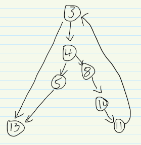

5. 标边

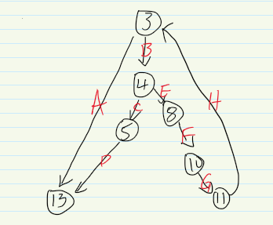

6. 计算环形复杂度


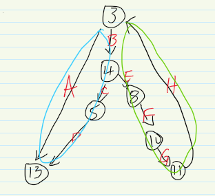

总共有两个环，环形复杂度是，也就是有三条基本路径。V（G）=3

7. 找出路径

第一条：A (3-13)

第二条：B、C、D(3-4-5-13)

第三条：B、E、F、G、H、A(3-4-8-10-11-3-13)

8. 写出测试用例

第一条：输入count =0,num = 0,。输出：x=0；

第二条：输入count = 1，num=0,输出，x = 0

第三条：输入count = 1,num = 2,输出：x=10

## 按照基本路径测试法的步骤确定出需要测试的独立路径

```c++
void sort(int num, int itype) {
    int x = 0;
    int y = 0;
    while (num > 0) {
        if (itype == 0) {
            x = y + 2;
            break;
        } else {
            y = y + 10;
        }
    }
}
```

A-D-E应该变为 ADEABC

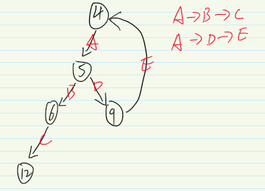

## 以下代码的功能是将a，b，c三个浮点数按从小到大的顺序排列。即代码运行结束后，a中存放的是三个数中最小的，c中存放的是三个数中最大的请画出流程图，并写出路径测试的测试用例。

```c++
void exchange() {
    float a, b, c, t;
    if (a > b) {
        t = a;
        a = b;
        b = t;
    }
    if (a > c) {
        t = a;
        a = c;
        c = t;
    }
    if (b > c) {
        t = b;
        b = c;
        c = t;
    }
}
```

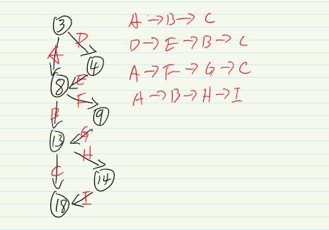


## 请画出流程图，并写出路径测试的测试用例。

```c++
void func(int n ,int flag) {
    int i = 0;
    int j = 0;
    while (n > 0) {
        if (flag == 0) {
            i = j * 2;
            if (i > 30) break;
        } else {
            j = j + 10;
            flag = flag - 1;
        }
        n = n - 1;
    }
}
```

ABFG变为ABFGABC

ADEG变为ADEGABC

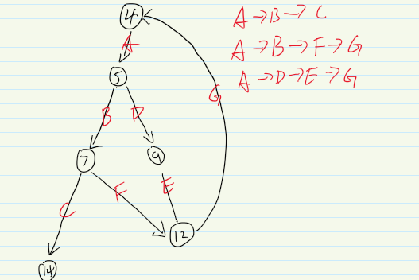

## 请设计测试用例，使得以下程序满足基本路径测试

```c++
int Test(int num, int x) 
{
    int temp = 0;
    while (num > 0) 
    {
        if (x > 0) 
        {
            temp = num + 100;
            break;
        } 
        else 
        {
            if (x == 0) 
            {
                temp = temp + 10;
            } 
            else 
            {
                temp = temp + 20;
            }
        }
        num--;
    }
    return temp;
}
```

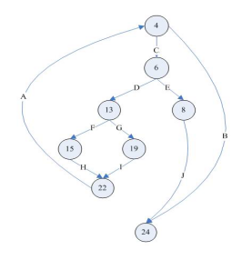

V（G）=3个判定结点+1=4

1 B（4，24）

2 C，E，J（4，6，8，24）

3 C，D，F，H，A，B（4，6，13，15，22，4，24）

4 C，D，G，I，A，B（4，6，13，19，22，4，24）

1 B（4，24）

​      输入数据：num=0，或者是num<0的某一个值。

​      预期结果：temp=0.

2 C，E，J（4，6，8，24）

​      输入数据：x =1;num=1 

​      预期结果：temp=101.

3 C，D，F，H，A，B（4，6，13，15，22，4，24）

​      输入数据：num=1;x=0

​      预期结果：temp=10.

 4 C，D，G，I，A，B（4，6，13，19，22，4，24）

​       输入数据：num =1;x=-1  

​       预期结果：temp=20.

## 功能描述：如果x<=3000，y的值为0；

如果3000<x<=5000，则y的值为x超过3000部分的3%；如果5000<x<8000，则y 的值为：x超过5000部分的5%加上超过3000部分的3%。请用等价类划分和边界值分析相结合来设计测试用例。

有效等价类

x<=3000：

3000<x<=5000

如果5000<x<8000

无效等价类

小于3000

大于等于8000

## 功能描述：密码输入框的字符长度要求为最短4个字符，

最长20个字符。请用等价类划分和边界值分析相结合来设计测试用例。（要考虑字符的类型）

同上


## “……对1.2米以下儿童免票，对1.2-1.5米的儿童半票，对教师、军人或70岁以上的老人，应给予优先的业务处理……”这里假设“优先的业务处理”已在别处有更严格的定义，请建立判定表。（15分）

条件桩：

身高小于1.2m

身高在1.2-1.5m

是儿童

是教师

是军人

年龄大于70岁

动作桩：

免票

半票

优先处理


## 请用等价类划分法设计测试用例

```c++
void triangle(float a, float b, float c) {
    if (a > 0 && b > 0 && c > 0 && a + b > c && a + c > b && b + c > a) {
        if (a == b && b == c) { printf("等边三角形"); }
        else if (a == b || a == c || b == c) { printf("等腰三角形"); }
        else { printf("一般三角形"); }
    } else { printf("输入无效"); }
}
```

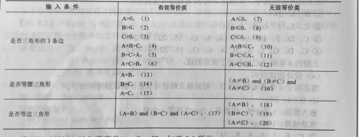

## 请用等价类划分法设计下列代码的单元测试用例

```c++
float jisuan(float a) {
    if (a > 2000) {
        if (a > 5000)
            return 3000 * 0.2 + (a - 5000) * 0.3;
        else
            return (a - 2000) * 0.2;
    } else {
        if (a > 800)
            return (a - 800) * 0.1;
    }
}
```

(2000-5000]：

5000-∞:

(800-2000]:

无效等价类

(∞-800):

## 某单位对其在大学以上学历的职工安排工作（工作岗位用AA-FF表示），方针如下

如果年龄不满18岁，文化程度为大学，若是男性，则任AA。

若是女性，则任BB；

如果年满18但不足50岁，文化程度是研究生，不分男女性，均任CC。

文化程度是大学，则不分男女性均任DD；

如果年满50岁以上，文化程度是研究生，若是男性，则任CC，

文化程度是大学，若是男性，则任EE。

若是女性，则任FF。

请对以上说明绘制判定表。为了便于绘制，条件符号使用以下内容

| 条件名   | 取值                    | 符号    |
| -------- | ----------------------- | ------- |
| 性别     | 男性、女性              | M、F    |
| 年龄     | <18、18<=年龄<50 、>=50 | C、Y、L |
| 文化程度 | 研究生、大学生          | G、U    |

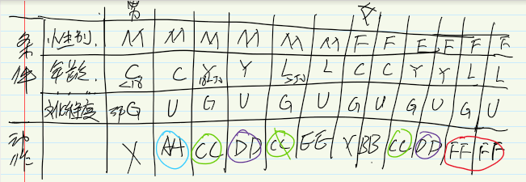

合并

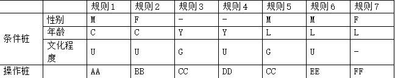


## “……对军人、残疾人或70岁以上的老人，应给予优先的业务处理……”

这里假设“优先的业务处理”已在别处有更严格的定义，请建立判定表。

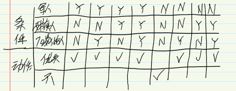

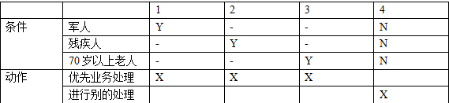

## 功能描述：输入框的输入内容要求为数字或字母，

长度要求为最短6个字符，最长20个字符。请用等价类划分和边界值分析相结合来设计测试用例

有效等价类：

1. 长度6-20：
2. 内容只有数字
3. 内容只有字母
4. 内容只包含数字和字母

无效等价类：

5. 长度小于6：
6. 长度大于20：
7. 内容包含特殊字符

有效等价类的测试：

jimyag  测试了1和3

jimyagjimyagjimyagji 测试了1和3

jimyagjimyagj 测试了1和3

123456 测试了1和 2

1234567891234 测试了1和2

12345678912345678912 测试了1和2

jim123 测试了1和4

jimyagjimyag12345678 测试了 1和4

无效等价类的测试

长度为5只包含数字

长度为5只包含字母

长度为5包含字母和数字

长度为5 包含特殊字符

长度为21也是

## “……对成绩积点在2.5以上，并且参加过竞赛或创新项目的同学，在各类奖励中应给予优先考虑……”请建立判定表

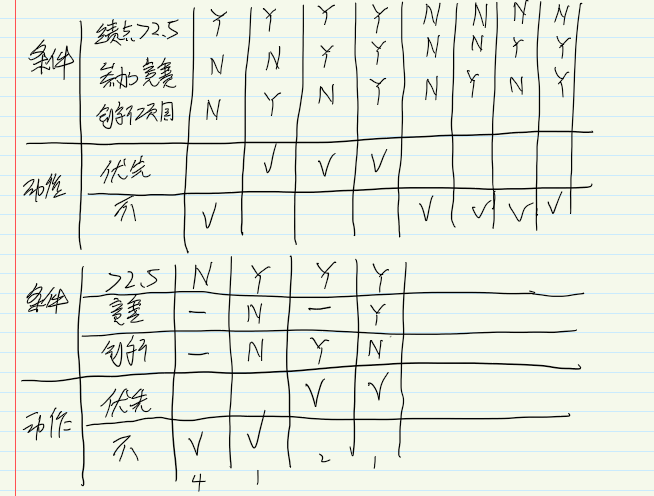

## 某保险公司对客户制定收费标准（标准等级用AA-GG表示），

标准如下：如果年龄不满18岁，不分男女性，标准为AA；如果年满18但不足50岁，大病例史为无，不分男女，标准BB；如果年满18但不足50岁，大病例史为有，若是男性，标准为CC，若是女性，标准为DD；如果年满50岁以上，大病例史为无，若是男性，标准为EE，若是女性，标准为FF；如果年满50岁以上，大病例史为有，不分男女，标准为GG。请对以上说明绘制判定表。为了便于绘制，条件符号使用以下内容

| 条件名     | 取值                   | 符号    |
| ---------- | ---------------------- | ------- |
| 性别       | 男性、女性             | M、F    |
| 年龄       | <18、18<=年龄<50、>=50 | C、Y、L |
| 大病史情况 | 有、无                 | H、N    |


## 程序结构图如下图所示，请画出自顶向下集成的过程


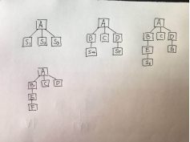

## 程序结构图如下图所示，请画出自底向上集成的过程


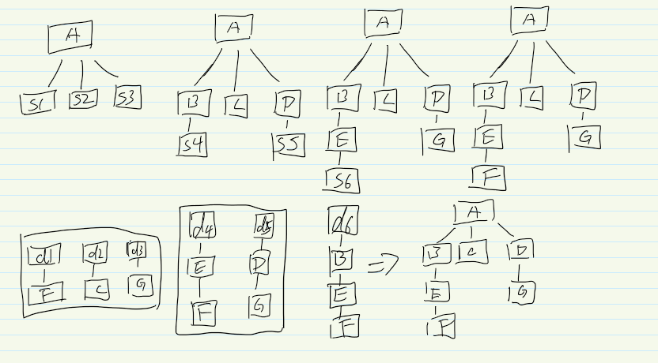


## 需求描述如下：“输入三个整数a、b、c，分别作为三边的边长构成三角形。”

通过程序判定所构成的三角形的类型，当此三角形为一般三角形、等腰三角形及等边三角形时，用等价类划分方法为该程序进行测试用例设计

有效等价类：

三个数

a>0

b>0

c>0

a+b>c

a+c>b

b+c>a

a=b

a=c

b=c

a=b=c

无效等价类，

一个数

两个数

a<=0

b<=0

c<=0

a+b<=c

a+c<=b

b+c<=a

a=b  a!=b &&a!=c&&b!=c

a！=c

b！=c

b！=c 


## 有一个处理单价为1元5角的盒装饮料的自动售货机软件，

若投入1元5角硬币，按下“可乐”、“雪碧”或“红茶”按钮，相应的饮料就送出来。若投入的是2元硬币，在送出饮料的同时退换5角硬币，试用因果图法设计测试用例

- 分析程序的规格说明，列出原因和结果
- 找出原因于结果之间的因果关系，原因与原因之间的约束关系，画出因果图。
- 将因果图转换成决策表
- 根据决策表设计测试用例的输入预期输出

### 解答

原因：

1. 投入1.5元硬币
2. 投入2元
3. 按可乐
4. 按雪碧
5. 按红茶

中间状态：

1. 已投币
2. 按钮

结果：

1. 退还5硬币
2. 送出可乐
3. 送出雪碧
4. 送出红茶

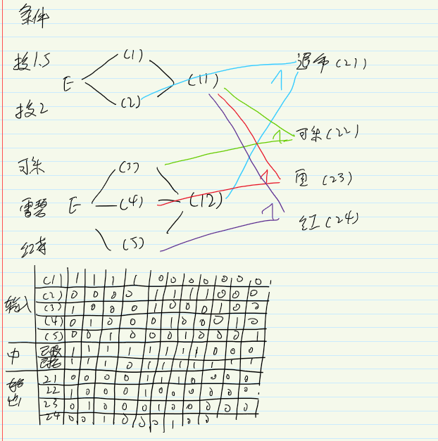

## 手机号码验证的描述如下：

输入的内容必须是数字，并且位数为11位，满足以上情况显示输入正确；如果输入内容有非数字，则显示内容有误；如果输入位数不为11位，则显示位数有误。请用因果图法设计测试用例

条件：

位数为11位

输入全是数字

结果：

输入正确，内容有误，位数有误

