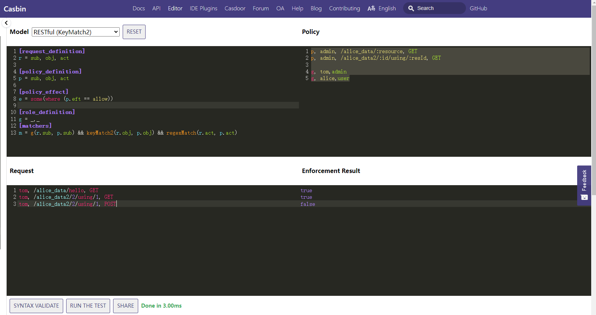
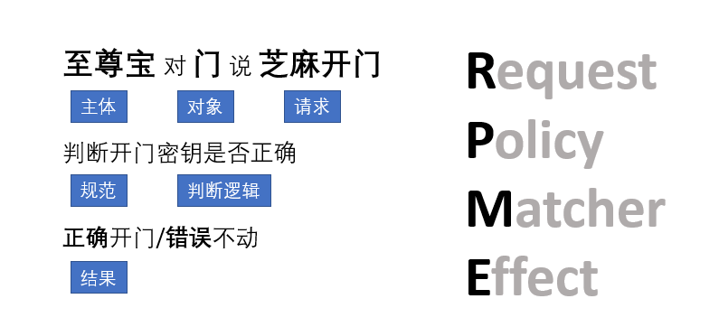
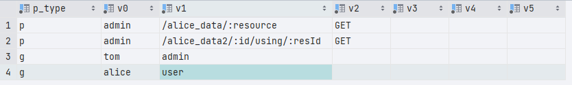

​	Casbin努力成为与编程语言无关的，解耦的权限框架！致力于多种语言一致体验，直白来说，就是一套规则框架，在各种编程语言中稍微改动就可以与业务系统结合使用，使其成为与语言、语言框架无关且通用的权限管理系统。

<!--more-->

我们可以理解为Casbin做的是3A(认证、授权、审计)之中的授权这一步，也是主旨！

## Casbin模型

Casbin有四个元模型

它的思路是这样的，我定义一个策略(policy)、一个匹配规则(matcher)，通过请求(request)过来的参数与策略通过规则进行匹配，匹配可以获得一个影响(effect)，拿到影响的结果，返回一个bool值。

在Casbin官网中有[在线编辑器](https://casbin.org/en/editor)，我们可以试一下。



我们先将这个例子做简单解释，如果刚开始不懂没关系，可以返回来继续看。

`model`中的文件如下

```tex
# 请求的定义
[request_definition]
r = sub, obj, act
# 策略定义
[policy_definition]
p = sub, obj, act
# 策略的影响
[policy_effect]
e = some(where (p.eft == allow))
# 用户组
[role_definition]
g = _,_
# 匹配验证方法
[matchers]
m = g(r.sub, p.sub) && keyMatch2(r.obj, p.obj) && regexMatch(r.act, p.act)
```

`policy`中，请求的策略定义

- `p`代表他是一个策略，`admin`访问的主体，`/alice_data/:resource`访问的对象，`GET`，访问的方式
- `g`代表用户组，后面表示`tom`继承自`admin`，`tom`拥有`admin`角色的所有权限

```tex
p, admin, /alice_data/:resource, GET
p, admin, /alice_data2/:id/using/:resId, GET

g, tom,admin
g, alice,user
```

`request`

- `tom`通过使用`GET`的方式访问`/alice_data/hello`资源（对象）

```tex
tom, /alice_data/hello, GET
tom, /alice_data2/2/using/1, GET
tom, /alice_data2/2/using/1, POST
```

`result`

- tom使用POST方法访问资源的时候，就不会通过

```tex
true
true
false
```

下面我将通过这个例子简要介绍Casbin



subject（sub 访问实体）、object（obj 访问的资源）、action（act 访问的方法）、effect（eft 策略结果，一般为空，默认指定为 `allow`，还可以定义为`deny`，只有这两种情况）

### Request

定义请求参数。基本请求是一个元组对象，至少需要主题(访问实体)、对象(访问资源) 和动作(访问方式)。

`r={sub,obj,act}`它实际上定义了我们应该提供访问控制匹配功能的参数名称和顺序。

这就如同`至尊宝`例子中**至尊宝**对**门**说**芝麻开门**，

这条“规则”指明一次请求至少需要提供三个参数：请求主体、要访问的资源和请求方式，即前端访问API时提供当前请求的用户、要访问的url和请求方式(GET...)

定义至尊宝的访问请求

- `至尊宝`  `/api/v1/door/open`  `POST` 

### Policy

实际上`Policy`和`Request`在很多情况下都是相同的，是由`Policy`来决定`Request`的，从官方给的在线示例代码中，我们也可以看出来。

定义一个至尊宝的Policy

- `至尊宝`  `/api/v1/door/open`  `POST

### Matcher 匹配器

```tex
m = g(r.sub, p.sub) && keyMatch2(r.obj, p.obj) && regexMatch(r.act, p.act)
```

这个简单和常见的匹配规则意味着如果请求的参数(访问实体，访问资源和访问方式)匹配， 如果可以在策略中找到资源和方法，那么策略结果（`p.eft`）便会返回。 策略的结果将保存在 `p.eft` 中。

- `g`使用角色管理
- `keyMatch2()`使用自己写的验证方法，返回bool值，如何编写会在下面的实战中介绍
- `regexMatch()`使用正则表达式进行验证，返回bool值，如何编写会在下面的实战中介绍

定义一个至尊宝匹配器

- m = r.sub == p.sub && r.act == p.act && r.obj == p.obj

### Effect 

它可以被理解为一种模型，在这种模型中，对匹配结果再次作出逻辑组合判断。

例如： `e = some (where (p.eft == allow))`

这句话意味着，如果匹配的策略结果有一些是允许的，那么最终结果为真。

让我们看看另一个示例： `e = some (where (p.eft == allow)) && !some(where (p.eft == deny)` 此示例组合的逻辑含义是：如果有符合允许结果的策略且没有符合拒绝结果的策略， 结果是为真。 换言之，当匹配策略均为允许（没有任何否认）是为真（更简单的是，既允许又同时否认，拒绝就具有优先地位)。

定义至尊宝的eft

- e = some (where (p.eft == allow))

### Role

`[role_definition]` 是RBAC角色继承关系的定义。 Casbin 支持 RBAC 系统的多个实例, 例如, 用户可以具有角色及其继承关系, 资源也可以具有角色及其继承关系。 这两个 RBAC 系统不会互相干扰。

此部分是可选的。 如果在模型中不使用 RBAC 角色, 则省略此部分。

```tex
[role_definition]
g = _, _
g2 = _, _
```

上述角色定义表明, `g` 是一个 RBAC系统, `g2` 是另一个 RBAC 系统。 `_, _`表示角色继承关系的前项和后项，即前项继承后项角色的权限。 一般来讲，如果您需要进行角色和用户的绑定，直接使用`g` 即可。 当您需要表示角色（或者组）与用户和资源的绑定关系时，可以使用`g` 和 `g2` 这样的表现形式。 请参见 [rbac_model](https://github.com/casbin/casbin/blob/master/examples/rbac_model.conf) 和 [rbac_model_with_resource_roles](https://github.com/casbin/casbin/blob/master/examples/rbac_with_resource_roles_model.conf) 的示例。

> - Casbin 只存储用户角色的映射关系。
> - Cabin 没有验证用户是否是有效的用户，或者角色是一个有效的角色。 这应该通过认证来解决。
> - RBAC 系统中的用户名称和角色名称不应相同。因为Casbin将用户名和角色识别为字符串， 所以当前语境下Casbin无法得出这个字面量到底指代用户 `alice` 还是角色 `alice`。 这时，使用明确的 `role_alice` ，问题便可迎刃而解。
> - 假设`A`具有角色 `B`，`B` 具有角色 `C`，并且 `A` 有角色 `C`。 这种传递性在当前版本会造成死循环。

## 实战

在上面介绍了Casbin的基础模型，下面将说明如何在编写测试代码

`main.go`

```go
package main

import (
	"fmt"
	"github.com/casbin/casbin/v2"
	xormadapter "github.com/casbin/xorm-adapter/v2"
	_ "github.com/lib/pq"
	"log"
)

func main() {
	// 初始化 Xorm 适配器并在 Casbin 执行器中使用它：
	// 适配器将使用名为"casbin"的 Postgres 数据库。
	// 如果它不存在，适配器将自动创建它。
	a, err := xormadapter.NewAdapter("postgres", "dbname=casbin user=postgres_name password=postgres_passwd host=127.0.0.1 port=5432 sslmode=disable", true) // Your driver and data source.
	if err != nil {
		log.Fatal(err)
		return
	}
    // 初始化执行者
	e, err := casbin.NewEnforcer("to/model.conf", a)
	if err != nil {
		log.Fatal("err,", err)
		return
	}

	// Load the policy from DB.
	err = e.LoadPolicy()
	if err != nil {
		log.Fatal(e)
		return
	}
	// AddPolicy 将授权规则添加到当前策略。
	// 如果规则已存在，则该函数返回 false，并且不会添加该规则。
	// 否则，该函数通过添加新规则返回 true。
	_, err = e.AddPolicy("admin", "/alice_data/:resource", "GET")
	_, err = e.AddPolicy("admin", "/alice_data2/:id/using/:resId", "GET")
	if err != nil {
		return
	}
	_, err = e.AddGroupingPolicy("tom", "admin")
	_, err = e.AddGroupingPolicy("alice", "user")

	if err != nil {
		log.Fatal(err)
		return
	}
	// Check the permission.
	test("tom", "/alice_data/hello", "GET", e)
	test("tom", "/alice_data2/2/using/1", "GET", e)
	test("tom", "/alice_data2/2/using/1", "POST", e)
	test("alice", "/alice_data2/2/using/1", "POST", e)

	// Save the policy back to DB.
	err = e.SavePolicy()
	if err != nil {
		return
	}
}

func test(sub string, obj string, act string, e *casbin.Enforcer) {
	enforce, err := e.Enforce(sub, obj, act)
	if err != nil {
		return
	}
	if enforce {
		fmt.Printf("sub:%s obj:%s act:%s 通过了\n", sub, obj, act)
	} else {
		fmt.Printf("sub:%s obj:%s act:%s 不通过\n", sub, obj, act)
	}
}
```

`to/model.conf`

```tex
# 请求的定义
[request_definition]
r = sub, obj, act
# 策略定义
[policy_definition]
p = sub, obj, act
# 策略的影响
[policy_effect]
e = some(where (p.eft == allow))
# 用户组
[role_definition]
g = _,_
# 匹配验证方法
[matchers]
m = g(r.sub, p.sub) && keyMatch2(r.obj, p.obj) && regexMatch(r.act, p.act)
```

> keyMatch2() 和regexMatch() 是Casbin的[内置函数](https://casbin.org/docs/zh-CN/function)

运行结果如下

```shell
sub:tom obj:/alice_data/hello act:GET 通过了
sub:tom obj:/alice_data2/2/using/1 act:GET 通过了   
sub:tom obj:/alice_data2/2/using/1 act:POST 不通过  
sub:alice obj:/alice_data2/2/using/1 act:POST 不通过
```

运行完之后就会发现数据库中多了几条数据。



我们已经将添加的策略保存到数据库中。

### Adapter

在Casbin中，策略存储作为adapter(Casbin的中间件) 实现。 Casbin用户可以使用adapter从存储中加载策略规则 (aka `LoadPolicy()`) 或者将策略规则保存到其中 (aka `SavePolicy()`)。

上面的小示例中我们从一个postgres数据库读取policy，使用数据库更方便管理，对于巨量策略条目性能也更高！Casbin官方提供了完整的适配器列表供选择，包含了各种主流编程语言以及各种主流数据库、云及文件如csv等的支持，有官方的也有第三方的具体请参照[官网](https://casbin.org/docs/zh-CN/adapters)。

以上实例我们创建了`xorm`类型`adapter`，它使用`Postgres`作为`policy`存储容器，并使用默认生成的数据库`casbin`中的`casbin_rule`表存储具体的policy，返回*Adapter与err对象，然后调用`NewEnforcer()`方法加载模型文件`model.conf`与适配器a，对tom,alice鉴权。在此，我们需要知道并记住的是，**Casbin默认将policy(策略)加载到内存中，如果改变了存储容器内的策略数据需要执行LoadPolicy()方法重载策略到内存才能生效！**方便的是，我们在官方提供的API中不需要手动去调用，这些方法底层已实现，除非特别说明！由此指出，如果我们自己实现某些会改变策略方法的话需要实现这个方法，否则就要手动调用或重启，常见的问题有程序在运行时，手动往数据表插入一条策略去测试并未生效！查询等不涉及改变数据表数据的操作不需要有此操作！

### 自定义Matcher方法

在小例子中，我们使用了内置的比较方法`keyMatch2() 和regexMatch()`现在我们自己写一个比较的方法。

首先准备您的函数。 它接受一些参数，然后返回一个布尔类型：

```go
func KeyMatch(key1 string, key2 string) bool {
	return key1 == key2
}
```

然后用 `interface{}` 类型的接口包装它：

```go
func KeyMatchFunc(args ...interface{}) (interface{}, error) {
   name1 := args[0].(string)
   name2 := args[1].(string)
   return (bool)(KeyMatch(name1, name2)), nil
}
```

最后，在Casbin的执行者(enforcer)中注册这个函数：

> 注：要在NewEnforcer()之后执行它

```go
e.AddFunction("my_func", KeyMatchFunc)
```

现在，您可以在您的模型CONF中像这样使用这个函数：

```go
m = g(r.sub, p.sub) && keyMatch2(r.obj, p.obj) && my_func(r.act, p.act)
```

通过修改小示例，继续运行,还是一样的结果

```tex
sub:tom obj:/alice_data/hello act:GET 通过了
sub:tom obj:/alice_data2/2/using/1 act:GET 通过了   
sub:tom obj:/alice_data2/2/using/1 act:POST 不通过  
sub:alice obj:/alice_data2/2/using/1 act:POST 不通过
```

### Gin框架结合

项目的结构如下

```tex
├─api
│  └─v1  #存放API目录
├─config # 存放配置文件目录
├─docs # 存放文档
├─global #存放全局变量
├─initiate # 初始化项目
├─log # 存放log文件
├─middleware # 存放中间件
├─model# 存放实体
├─routes # 存放路由
└─utils
    ├─load #加载配置文件
    └─response # 响应封装
```

代码在[jimyag/gin-casbin-demo (github.com)](https://github.com/jimyag/gin-casbin-demo)

程序运行的逻辑为：初始化配置文件，初始化数据库、初始化Casbin、初始化路由，路由分为公共的路由和私有需要认证和授权的。我们使用JWT进行认证，使用Casbin进行授权，同时还用了`logrus`做日志处理。在授权中，我只对获取用户信息的接口进行授权。

casbin的model如下

```tex
# 请求的定义
[request_definition]
r = sub, obj, act
# 策略定义
[policy_definition]
p = sub, obj, act
# 策略的影响
[policy_effect]
e = some(where (p.eft == allow))
# 用户组
[role_definition]
g = _,_
# 匹配验证方法
[matchers]
m = g(r.sub, p.sub) && regexMatch(r.obj, p.obj) && r.act==p.act ||r.sub=="1"
```

其中`r.sub=="1"`表示如果是超级管理员用户的话，就直接放行


