搜索引擎能搜索到网站的前提是它抓取了网站的内容，并对其建立了索引，其实也就是爬虫爬取 + 插入数据库。虽然大部分搜索引擎都是自动抓取网络上的所有链接，并尝试爬取以及入库，但通常会比较缓慢。所以更加推荐由我们站长主动出击，直接告诉它我们的网站地址。

为了让更多人能阅读到网站内容，本文介绍如何配置Hexo被Google、bing、Baidu收录。

<!--more-->

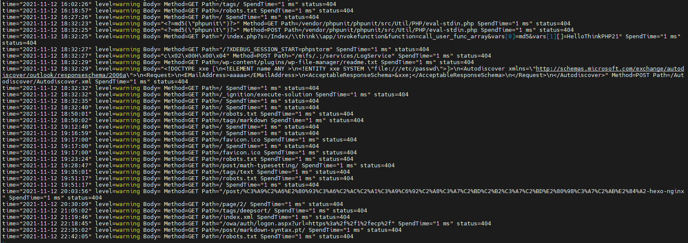

上图就是搜索引擎的爬虫服务爬取我的网站。

### 配置Hexo

#### 安装插件

```bash
npm install hexo-generator-sitemap --save
```

#### 添加设置

在根目录`_config.yml`中添加如下内容

```yaml
sitemap:
  path: sitemap.xml
  # template: ./sitemap_template.xml
  rel: true
  tags: false
  categories: false
```

#### 生成站点地图

执行以下命令

```bash
hexo g -d
```

在浏览器中输入`自己域名/sitemap.xml`可以看到插件替我们生成的站点地图。

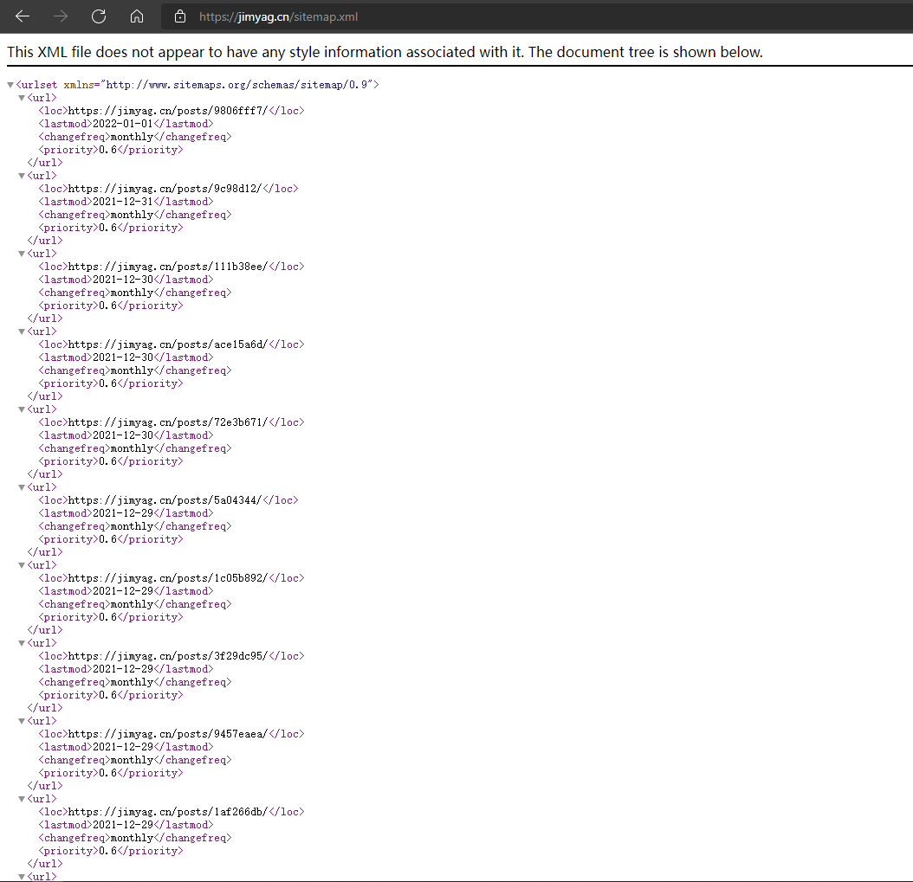

### 配置网站收录

#### Google

Google 官网给了详细的文档，可以看这篇 [新手入门指南](https://developers.google.com/search/docs/beginner/get-started?hl=zh-CN)

而对我们来说，主要分三个步骤：注册 Search Console，验证网站所有权，提交站点地图

##### 注册 Search Console

注册的过程非常简单，进入 [GSC 官网](https://search.google.com/search-console)，用谷歌账号登录即可

##### 验证网站所有权

登录之后，就需要添加我们的网站了

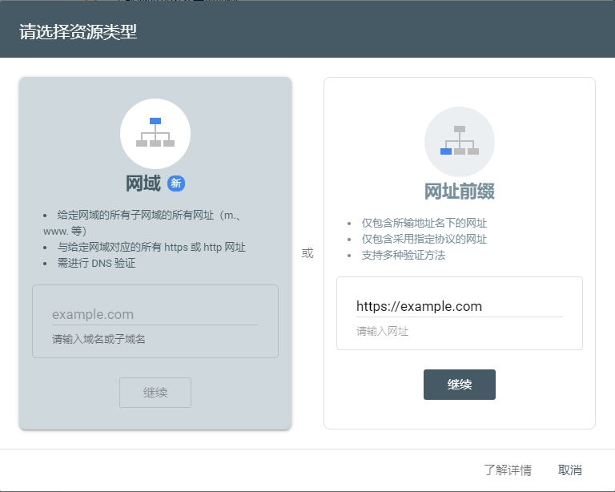

这里共有5种方法，我使用`域名提供商`验证的方式进行

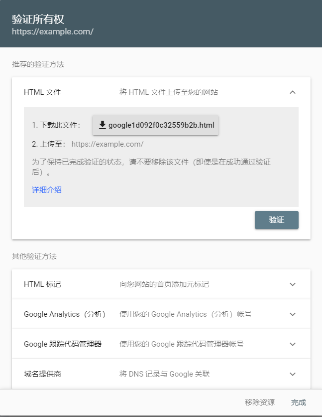

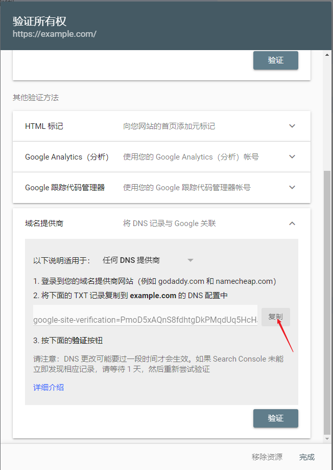

我们将Google提供给我们的解析值添加到DNS的解析中，这里以腾讯云为例，

添加一条`@`记录，记录类型为`txt`，记录值为刚刚生成的记录值，保存即可。

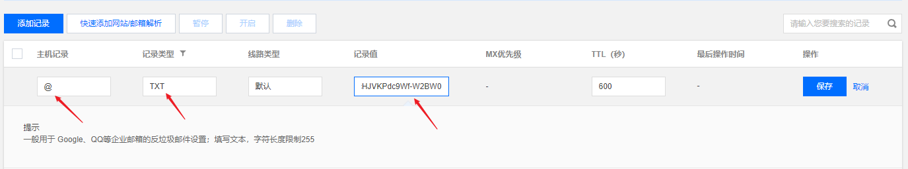

##### 检验Google是否收录

我们进入[GSC 官网](https://search.google.com/search-console)，在添加网站处输入自己的域名看到一下内容，代表Google已经收录我们的网站。

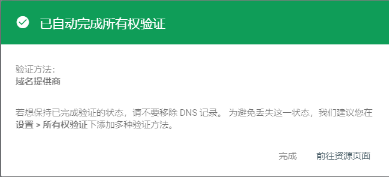

#### Bing

进入[Bing Webmaster Tools - Bing Webmaster Tools](https://www.bing.com/webmasters/homepage)主页，选择使用GSC导入网站

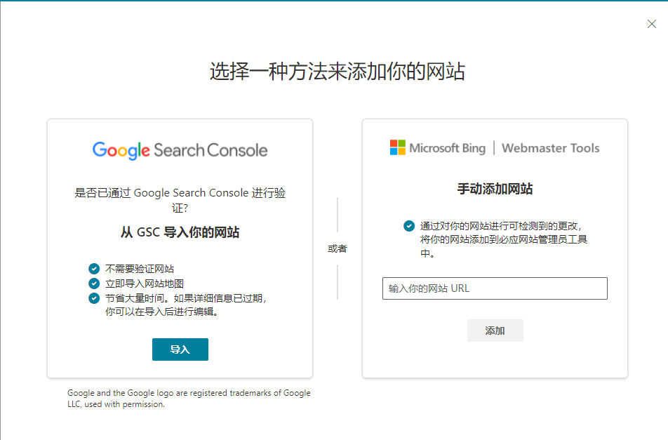

登陆自己的注册GSC的Google账户即可，同意授权即可完成。

##### 提交站点地图

按照如图操作添加自己域名即可

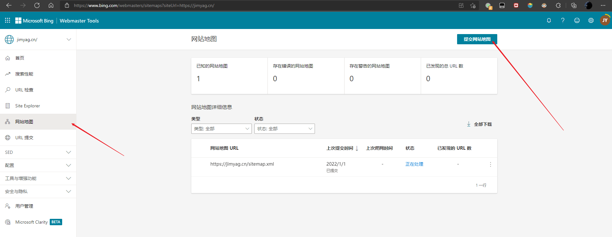

#### Baidu

##### 登陆

用百度账号登录[百度搜索资源平台](https://ziyuan.baidu.com/)，找到`普通收录`

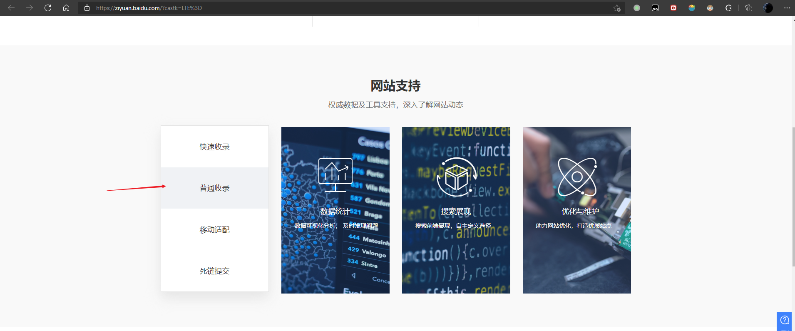

选择`sitemap`

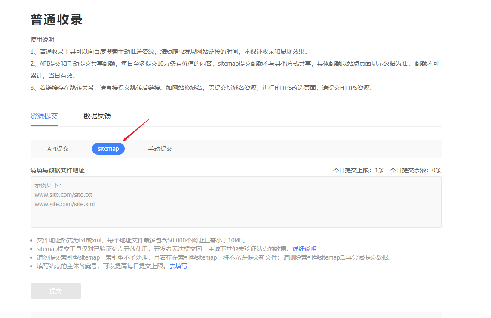

填写`你的域名域名/sitemap.xml`提交信息。

##### 验证

提交以后，Baidu会生成一条CNAME的记录（这里我忘记保存截图了），让你将你的某个二级域名CNAME到Baidu的资源。

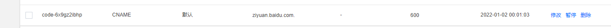

### 参考资料

[Hexo 配置主流搜索引擎收录流程记录 | 乐园 (ywang-wnlo.github.io)](https://ywang-wnlo.github.io/posts/abac0c46.html)
