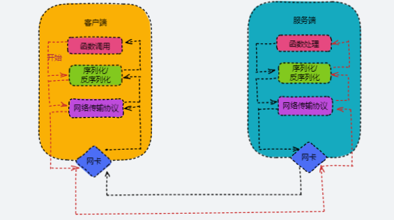

RPC（Remote Procedure Call）远程过程调用协议，一种通过网络从远程计算机上请求服务，而不需要了解底层网络技术的协议。RPC它假定某些协议的存在，例如TPC/UDP等，为通信程序之间携带信息数据。在OSI网络七层模型中，RPC跨越了传输层和应用层，RPC使得开发，包括网络分布式多程序在内的应用程序更加容易。

<!--more-->

### 本地过程调用

一个简单的本地过程调用的例子

```go
package main

func Add(a,b int)int{
	return a+b
}

func main(){
	sum:=Add(1,2)
	fmt.Println(sum)
}
```

此时函数的调用过程是：

1. 将数字1和2压入Add函数的栈
2. 进入Add函数，从栈中取出1和2分别赋值给a和b
3. 执行 a + b将结果压栈
4. 将栈中的值取出来赋值给main中的sum

### 远程过程调用的问题

在远程调用时，我们需要执行的函数体是在远程的机器上的，也就是说，Add是在另一个进程中执行的。这就带来了几个新问题：

#### Call ID映射。

我们怎么告诉远程机器我们要调用Add，而不是Sub或者Foo呢？

在本地调用中，函数体是直接通过函数指针来指定的，我们调用Add，编译器就自动帮我们调用它相应的函数指针。但是在远程调用中，函数指针是不行的，因为两个进程的地址空间是完全不一样的。

所以，在RPC中，**所有的函数都必须有自己的一个ID**。这个ID在所有进程中都是唯一确定的。客户端在做远程过程调用时，必须附上这个ID。然后我们还需要在客户端和服务端分别维护一个 {函数 <--> Call ID} 的对应表。两者的表不一定需要完全相同，但相同的函数对应的Call ID必须相同。当客户端需要进行远程调用时，它就查一下这个表，找出相应的Call ID，然后把它传给服务端，服务端也通过查表，来确定客户端需要调用的函数，然后执行相应函数的代码。

#### 序列化和反序列化

客户端怎么把参数值传给远程的函数呢？

在本地调用中，我们只需要把参数压到栈里，然后让函数自己去栈里读就行。但是在远程过程调用时，客户端跟服务端是不同的进程，不能通过内存来传递参数。甚至有时候客户端和服务端使用的都不是同一种语言（比如服务端用C++，客户端用Go或者Python）。这时候就需要客户端把参数先转成一个字节流，传给服务端后，再把字节流转成自己能读取的格式。这个过程叫序列化和反序列化。同理，从服务端返回的值也需要序列化反序列化的过程。

> **序列化：**把对象转化为可传输的字节序列过程称为序列化。
>
> **反序列化：**把字节序列还原为对象的过程称为反序列化。

#### 网络传输

远程调用往往用在网络上，客户端和服务端是通过网络连接的。所有的数据都需要通过网络传输，因此就需要有一个网络传输层。**网络传输层需要把`Call ID`和序列化后的参数字节流传给服务端，然后再把序列化后的调用结果传回客户端**。只要能完成这两者的，都可以作为传输层使用。

因此，它所使用的协议其实是不限的，能完成传输就行。尽管大部分RPC框架都使用TCP协议，但其实UDP也可以，而gRPC干脆就用了HTTP2。Java的Netty也属于这层的东西。

### 远程过程调用传输的过程

解决了上面三个机制，就能实现RPC了，具体过程如下：



1. 客户端发起函数调用
2. 将请求对象序列化为字节流
3. 通过网络传输
4. 服务端接收到字节流
5. 服务端将请求字节流反序列化为对象
6. 服务端进行函数处理
7. 服务端将响应进行序列化为字节流
8. 服务端通过网络传输
9. 客户端接收到响应字节流
10. 客户端将响应字节流反序列化为响应对象
11. 客户端得到响应

### 实现简单的RPC

#### 客户端

1. 将这个调用映射为Call ID。这里假设用最简单的字符串当Call ID的方法

2. 将Call ID，a和b序列化。可以直接将它们的值以二进制形式打包

3. 把2中得到的数据包发送给ServerAddress，这需要使用网络传输层

4. 等待服务器返回结果

4. 如果服务器调用成功，那么就将结果反序列化，并赋给sum

#### 服务端

1. 在本地维护一个Call ID到函数指针的映射call_id_map，可以用dict完成

2. 等待请求，包括多线程的并发处理能力

3. 得到一个请求后，将其数据包反序列化，得到Call ID

4. 通过在call_id_map中查找，得到相应的函数指针

5. 将a和rb反序列化后，在本地调用add函数，得到结果

6. 将结果序列化后通过网络返回给Client

**要实现一个rpc框架，其实只需要按照以上流程实现就行了****

其中：

- call id 可以使用函数的字符串或者使用其他的，映射便一边就是一个哈希表
- 序列化和反序列化可以自己手动实现
- 网络传输协议可以自己写socket、或者用asio、zeroMQ、Netty之类的
- 除此之外还有网络错误、流量控制、超时和重试等

### 使用http协议实现一个简单的rpc

#### 客户端

```go
package main

import(
	"encoding/json"
	"fmt"
	"github.com/kirinlabs/HttpRequest"
	"log"
)

type ResponseDatastruct{
	Dataint`json:"data"`
}

func Add(a,bint)int{
	req:=HttpRequest.NewRequest()
	res,_:=req.Get(fmt.Sprintf("http://127.0.0.1:8000/%s?a=%d&b=%d","add",a,b))
	body,_:=res.Body()
	rspData:=ResponseData{}
	_=json.Unmarshal(body,&rspData)
	return rspData.Data
}

func main(){
	log.Print(Add(10,15))
}
```

#### 服务端

```go
package main

import(
	"encoding/json"
	"log"
	"net/http"
	"strconv"
)

func main(){
	http.HandleFunc("/add",func(writerhttp.ResponseWriter,request*http.Request){
		_=request.ParseForm()
		log.Printf(request.URL.Path)
		a,_:=strconv.Atoi(request.Form["a"][0])
		b,_:=strconv.Atoi(request.Form["b"][0])
		writer.Header().Set("Content-type","application/json")
		jData,_:=json.Marshal(map[string]int{"data":a+b,})
		_,_=writer.Write(jData)
    })
	_=http.ListenAndServe(":8000",nil)
}
```

其实http请求就是rpc的一种实现，也相当于远程过程调用。

### rpc、http、restful

不同的应用程序之间的通信方式有很多，比如浏览器和服务器之间广泛使用的基于 HTTP 协议的 Restful API。与 RPC 相比，Restful API 有相对统一的标准，因而更通用，兼容性更好，支持不同的语言。HTTP 协议是基于文本的，一般具备更好的可读性。但是缺点也很明显：

- Restful 接口需要额外的定义，无论是客户端还是服务端，都需要额外的代码来处理，而 RPC 调用则更接近于直接调用。
- 基于 HTTP 协议的 Restful 报文冗余，承载了过多的无效信息，而 RPC 通常使用自定义的协议格式，减少冗余报文。
- RPC 可以采用更高效的序列化协议，将文本转为二进制传输，获得更高的性能。
- 因为 RPC 的灵活性，所以更容易扩展和集成诸如注册中心、负载均衡等功能。

### 参考

[序列化理解起来很简单 - 知乎 (zhihu.com)](https://zhuanlan.zhihu.com/p/40462507)

[什么是RESTful？RESTfule风格又是啥？ - 知乎 (zhihu.com)](https://zhuanlan.zhihu.com/p/97507715)
