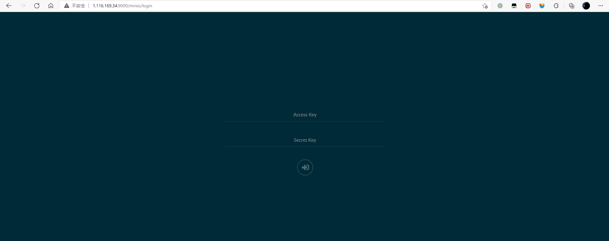

由于自己不会配置如何按照每一篇博客在`hexo`中打包博客中的图片，所以想要自己搭建一个图床，总体效果很满意。

将配置过程记录，方便之后重新配置。

这是搭建好的效果图


<!--more-->

我们可以随时访问自己博客中的图片。

### 安装Nginx

使用下面命令安装nginx

```shell
yum install nginx -y
```

显示以下信息表示安装完成

```shell
Loaded plugins: fastestmirror, langpacks
Determining fastest mirrors
Resolving Dependencies
.........
Installed:
  nginx.x86_64 1:1.20.1-9.el7

Dependency Installed:
  gperftools-libs.x86_64 0:2.6.1-1.el7                               nginx-filesystem.noarch 1:1.20.1-9.el7                               openssl11-libs.x86_64 1:1.1.1k-2.el7

Complete!
```

启动nginx

```shell
nginx
```

在地址栏中输入服务器ip可以看到下面信息表示安装成功。


### 安装Docker

#### 安装一些必要的系统工具：

```shell
sudo yum install -y yum-utils device-mapper-persistent-data lvm2
```

显示以下信息

```shell
Loaded plugins: fastestmirror, langpacks
Loading mirror speeds from cached hostfile
Package yum-utils-1.1.31-54.el7_8.noarch already installed and latest version
Package device-mapper-persistent-data-0.8.5-3.el7_9.2.x86_64 already installed and latest version
Package 7:lvm2-2.02.187-6.el7_9.5.x86_64 already installed and latest version
Nothing to do
```

#### 添加软件源信息：

```shell
sudo yum-config-manager --add-repo http://mirrors.aliyun.com/docker-ce/linux/centos/docker-ce.repo
```

显示以下信息

```shell
[root@VM-0-15-centos ~]# yum-config-manager --add-repo http://mirrors.aliyun.com/docker-ce/linux/centos/docker-ce.repo
Loaded plugins: fastestmirror, langpacks
adding repo from: http://mirrors.aliyun.com/docker-ce/linux/centos/docker-ce.repo
grabbing file http://mirrors.aliyun.com/docker-ce/linux/centos/docker-ce.repo to /etc/yum.repos.d/docker-ce.repo
repo saved to /etc/yum.repos.d/docker-ce.repo
```

#### 更新yum缓存

```shell
sudo yum makecache fast
```

### 安装docker-ce

```shell
sudo yum -y install docker-ce
```

显示以下信息

```shell
Loaded plugins: fastestmirror, langpacks
Loading mirror speeds from cached hostfile
Resolving Dependencies
--> Running transaction check
---> Package docker-ce.x86_64 3:20.10.12-3.el7 will be installed
--> Processing Dependency: container-selinux >= 2:2.74 for package: 3:docker-ce-20.10.12-3.el7.x86_64
--> Processing Dependency: containerd.io >= 1.4.1 for package: 3:docker-ce-20.10.12-3.el7.x86_64
--> Processing Dependency: docker-ce-cli for package: 3:docker-ce-20.10.12-3.el7.x86_64
--> Processing Dependency: docker-ce-rootless-extras for package: 3:docker-ce-20.10.12-3.el7.x86_64
--> Processing Dependency: libcgroup for package: 3:docker-ce-20.10.12-3.el7.x86_64
........
Complete!
```

#### 启动docke后台服务

```shell
sudo systemctl start docker
```

查看docker 版本

```shell
[root@VM-0-15-centos ~]# docker -v
Docker version 20.10.12, build e91ed57
```

### docker配置MinIo

#### 拉取MinIo

我们这里选择拉取旧的版本，新版本在访问文件时有`访问已被取消`的问题


目前这个问题没有解决，所以我选择一个旧版本安装。

```shell
[root@VM-0-15-centos ~]# docker pull minio/minio:RELEASE.2021-06-17T00-10-46Z
```

#### 创建存放minio的文件夹

```shell
mkdir -p /mnt/minio/{data,cofig}
```

#### 关闭防火墙

docker中容器需要用到很多端口，在没有配置nginx之前，可以先将防火墙关闭

```shell
systemctl stop firewalld.service
```

#### 启动MinIO

`-d` 表示在后台挂起

`-p` 指定端口 MinIO的默认端口为9000

`MINIO_ACCESS_KEY=admin` 设置用户名为`admin` 

`MINIO_SECRET_KEY=12345678` 设置密码为`12345678`

```shell
[root@VM-0-15-centos conf.d]# docker run -d -p 9000:9000 --name minio  -e "MINIO_ACCESS_KEY=admin"   
-e "MINIO_SECRET_KEY=12345678"   -v /mnt/minio/data:/data   -v /mnt/minio/config:/root/.minio   minio/minio:RELEASE.2021-06-17T00-10-46Z server /data
```

#### 进入控制台

在浏览器中输入ip:9000 即可进入MinIO的控制台



##### 新建一个bucket叫 test


##### 添加权限

给这个桶添加`public`权限


##### 上传文件


##### 访问上传的图片

在浏览器中输入ip:9000/刚刚创建的bucket名称/上传的图片名称

`http://1.116.169.34:9000/test/image-20211014225210485.png`


##### 配置nginx代理

在`etc/nginx/cof.d`中新建一个配置文件`minio.conf`写入

```shell
server {
 listen 80;

 location / {
        proxy_pass http://172.17.0.15:9000;  //172.17.0.15为内网的本机ip
 }
}
```

查看配置文件是的正确

```she
[root@VM-0-15-centos conf.d]# nginx -t
nginx: the configuration file /etc/nginx/nginx.conf syntax is ok
nginx: configuration file /etc/nginx/nginx.conf test is successful
```

重新加载nginx配置文件

```shell
nginx -s reload
```

再次访问文件


