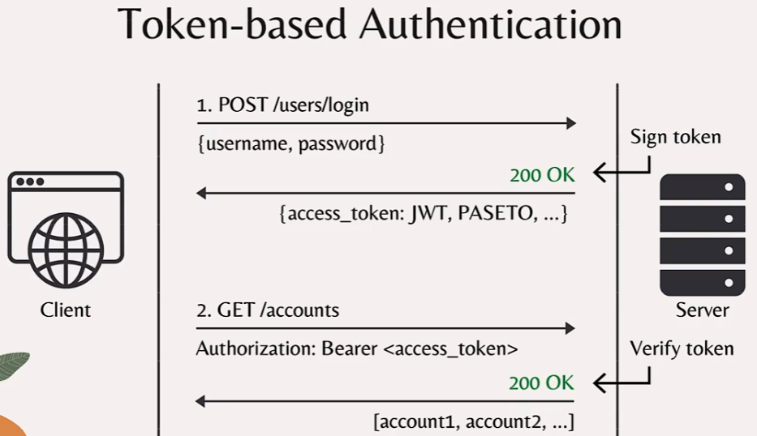
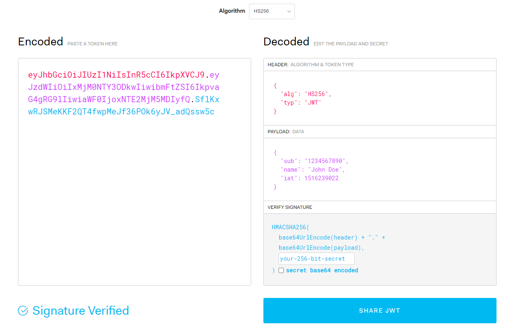

在平常我们做权限控制或者认证的时候，大多数是基于 token 的身份验证。在众多类型中的token中，JSON Web Token（JWT）是最流行的之一。但是人们发现了JWT中一些安全问题，主要是因为它设计了不良的标准。

本文主要介绍JWT的弊端，以及一种新的token验证PASETO

<!--more-->

### 基于 Token 的认证

首先我们介绍基于Token的认证的过程.



1. 客户端使用用户名密码进行登录,服务端接受到请求之后进行校验.
2. 校验通过后,服务端会签发一个access_token给客户端.
3. 在之后客户端请求服务器的资源时都需要带上token,
4. 如果服务器收到客户端请求资源,校验是否有权限访问资源.


我们在[JSON Web Tokens - jwt.io](https://jwt.io/)可以看到jwt的示例



它是一个Base64编码的字符串，由3个主要部分组成，由点分隔。

第一部分（带有颜色红色）是令牌的标题。当我们解码此部分时，我们将获得一个包含令牌类型JWT的JSON对象，以及用于签署令牌的算法：上述的算法是HS256

令牌的第二部分（紫色）是有效载荷数据。此部分是我们存储有关登录用户的信息，例如用户名，以及该令牌将过期的时间戳。你可以自定义此JSON有效载荷以存储所需的任何其他信息。

存储在JWT中的所有数据仅为Base64编码，而不是加密。因此，不需要服务器的秘密/私钥以解码其内容。它还意味着我们可以轻松地编码标题和有效载荷数据而无需键。那么服务器如何验证访问令牌的真实性吗？

这是令牌第三部分的目的：数字签名（蓝色）。这个想法很简单，只有服务器有私钥签署令牌。因此，如果尝试在没有正确密钥的情况下创建虚假令牌，则服务器将在验证过程中轻松检测到它。JWT标准提供了许多不同类型的数字签名算法，但它们可以分为2个主要类别。

#### 对称加密算法

第一个是对称加密算法，其中相同的密钥用于两个标志并验证令牌。由于只有1个key，它应该保密。因此，此算法适用于仅用于本地服务的本地使用，或用于内部服务，可以共享密钥的内部服务。

属于该对称加密类别的一些特定算法是：HS256，HS384和HS512。这里HS256是HMAC和SHA-256的组合。HMAC代表基于哈希的消息认证码，SHA是安全散列算法。而256/384/512是输出位的数量。

对称密钥算法非常有效，适用于大多数应用。但是，如果我们想要验证令牌的外部第三方服务，我们不能使用它，因为它意味着我们必须给他们我们的密钥。在这种情况下，我们必须使用第二类：非对称加密算法。

#### 非对称加密算法

在这种类型的算法中，有一对key而不是仅为1个单个密钥。

私钥用于签署令牌，而公钥仅用于验证它。

因此，我们可以轻松与任何外部第三方服务分享我们的公钥，而无需担心泄露私钥。

在这种不对称关键类别中，存在几组算法，例如RS组，PS组或ES组。这里，RS256基本上是具有PKCSV1.5和SHA256的RSA算法。PS256也是RSA算法，但具有概率签名方案和SHA256。它的设计比pkcsv1.5更为安全,最后一个ES256只是椭圆曲线数字签名算法

#### JWT问题

好的，到目前为止，它听起来像JWT是一个很好的标准，它让我们提供了很多灵活性，可以选择我们想要的任何签名算法。那么它的问题究竟是什么？

##### 弱算法

第一个问题是弱签名算法。JWT为开发人员提供了太多算法来选择，包括已知易受攻击的算法，例如：带有pkcsv1.5的RSA容易收到 padding Oracle攻击。或ECDSA可以面临无效曲线攻击。对于没有安全性经验的开发人员，他们很难知道哪些算法最好使用。因此，JWT为开发人员提供了太多的灵活性来选择算法的事实就像让搬起石头砸自己的脚.

JWT 标准设计看起来很不错，实际上包藏祸心，因为其设计，隐藏诸多安全问题，详细如下：

##### 重置空加密算法缺陷

JWT 支持将算法设定为“None”，如果你使用JWT库时未设置关闭该功能，那么任何Token都是有效的。具体做法是将JWT第一部分 header 中 alg 字段设置为 None ，再将第三部分 signature 设置为空（即不添加signature字段）， 此token 可顺利通过验证。

##### 密钥混淆攻击

JWT 最常用的两种算法是 HMAC 和 RSA。HMAC（对称加密算法）用同一个密钥对 token 进行签名和认证。而RSA（非对称加密算法）需要两个密钥，先用私钥加密生成 JWT ，然后使用其对应的公钥来解密验证。如果公钥泄露（很多人觉得公钥可以分发），那么将算法 RS256 修改为 HS256 ，即非对称加密向下降级为对称加密。再使用这个泄露的公钥对 token 进行签名，后端收到后根据头中指定的算法，将使用公钥对 token 验证，如此便认证通过。

##### 密钥暴力破解

如果 JWT 使用对称加密算法（如 HS256）， 这意味着对令牌进行签名的密钥也用于对其进行验证。由于签名验证是一个自包含的过程，因此可以测试 token 本身的有效密钥，而不必将其发送回应用程序进行验证。如果密钥设置过于简单，如常用词汇、生日年份等，结合已知的泄露密码列表，将很快破解出密钥，如此便可伪造出任意token 。

##### kid 指定攻击

kid 即为 key ID ，存在于 jwt header 中，是一个可选的字段，用来指定加密算法的密钥。如在头部注入新的 kid 字段，并指定 HS256 算法的 key 为 123456，生成新的token,服务端收到将使用指定的密钥123456来验证token。因此，为了防止这攻击，它在您的服务器代码中至关重要，您必须检查令牌的算法标题，**以确保它与您的服务器用于签名和验证令牌的算法匹配。**

好的，所以现在你知道为什么JSON网上令牌不是一个非常精心设计的标准。它打开了许多潜在威胁的门。

因此，很多人试图远离它，并迁移到更强大的东西。

### PASETO - 与平台无关的密钥验证

PASeto或Platform Andnostic Security Token是社区广泛接受的最成功的设计之一，作为JWT的最佳安全替代品。

#### 强算法

它首先解决了JWT的所有问题，提供了开箱即用的强大签名算法。开发人员不必再选择算法了。相反，他们只需要选择他们想要使用的 PASETO 版本。每个Paseto版本已经使用1个强大的密码套件实现。在任何时候，只有2个最新版本的PASETO都会有效。

现在，经常使用的时的Paseto版本是版本1和版本2。(当然也有版本3,4的)

#### PASETO version 1

版本1时间较长，只能用于无法使用现代加密的传统系统。与 JWT 类似，PASETO也有2个算法类别，用于2个主要用例。

对于本地或内部服务，我们使用对称密钥算法。

但与只有Base64-加密的JWT不同，PASETO 实际上使用具有带有关联数据（或AEAD[【转】什么是AEAD加密 - 简书 (jianshu.com)](https://www.jianshu.com/p/7c3ca0ed307b)）算法的强度认证加密，使用密钥加密并验证令牌中的所有数据。.PASETO 版本1中使用的AEAD算法是HMAC SHA384的AES256 CTR。

对于公共情况而言，在有需要验证令牌的外部服务的情况下，我们必须使用非对称密钥算法。在这种情况下，PASETO 使用与JWT相同的方法，这意味着它不会加密令牌数据，而且只使用Base64编码，并使用私钥以数字签名签署内容。PASETO 版本1中所选的不对称关键算法是带SHA384的RSA PSS。

#### PASETO version 2

在版本2的PASETO中，正在使用2个安全和现代算法。对于本地对称关键场景，它使用具有Poly1305算法的Xchacha20。并且对于公众非对称关键场景，使用具有曲线25519的爱德华曲线数字签名算法。

#### Non-trivial forgery

现在随着Paseto的设计，令牌伪造不再是小事。

由于算法标题不再存在，因此攻击者无法将其设置为None，或强制服务器使用它在此标题中选择的算法。令牌中的一切也用**AEAD**认证，因此无法篡改它。

此外，如果使用本地对称密钥算法，则现在加密有效载荷，而不仅仅是编码，因此黑客不可能在不知道服务器的密钥的情况下读取或更改存储在令牌中的数据。

与JWT相比，PASETO 不仅更安全，而且更容易实现更简单，更简单。

#### PASETO结构

现在，让我们来看看Paseto标记的结构。

这是一个用于本地使用目的的Paseto版本2令牌。令牌有4个主要部分，用点分开。

```go
v2.
local.
QAxIpVeECVNI1z4xQbm_qQYomyT3h8FtV8bxkz8pBJWkT8f7HtlOpbroPDEZUKop_vaglyp76CzYy375cHmKCW8e1CCkV0Lflu4GTDyXMqQdpZMM1E6OaoQW27gaRSvWBrR3IgbFIa0AkuUFw.
UGFyYWdvbiBJbml0aWF0aXZlIEVudGVycHJpc2Vz
```

每一段是一个部分

第一部分是PASETO版本，这是版本2。

第二部分是令牌的目的，它用于本地或公共场景吗？在这种情况下，它是本地的，这意味着使用对称密钥认证加密算法。

第三部分是令牌的主要内容或有效载荷数据。请注意，它是加密的，因此如果我们使用key解密它，我们将获得3个较小的部分：

#### PASETO Example 1

```
v2.local.QAxIpVe-ECVNI1z4xQbm_qQYomyT3h8FtV8bxkz8pBJWkT8f7HtlOpbroPDEZUKop_vaglyp76CzYy375cHmKCW8e1CCkV0Lflu4GTDyXMqQdpZMM1E6OaoQW27gaRSvWBrR3IgbFIa0AkuUFw.UGFyYWdvbiBJbml0aWF0aXZlIEVudGVycHJpc2Vz
```

This decodes to:

- Version: `v2`

- Purpose: `local` (shared-key authenticated encryption)

- Payload (hex-encoded):

  ```
  400c48a557be10254d235cf8c506e6fea418a26c93de1f05b55f1bc64cfca412
  56913f1fec7b653a96eba0f0c46542a8a7fbda825ca9efa0b3632dfbe5c1e628
  25bc7b5082915d0b7e5bb81930f25cca9076964c33513a39aa105b6ee06914af
  581ad1dc881b1486b4024b9417
  ```

  - Nonce: `400c48a557be10254d235cf8c506e6fea418a26c93de1f05`
  - Authentication tag: `6914af581ad1dc881b1486b4024b9417`

- Decrypted Payload:

  ```
  {
    "data": "this is a signed message",
    "exp": "2039-01-01T00:00:00+00:00"
  }
  ```

  - Key used in this example (hex-encoded):

    ```
    707172737475767778797a7b7c7d7e7f808182838485868788898a8b8c8d8e8f  
    ```

- Footer:

  ```
  Paragon Initiative Enterprises
  ```


1. 首先，有效载荷体。在这种情况下，我们只需存储一个简单的消息和令牌的到期时间。
2. 其次，在加密和消息身份验证过程中使用的nonce值。
3. 最后，消息身份验证标记要验证加密消息及其关联的未加密数据。

在这种情况下，未加密的数据是令牌的版本，用途和页脚。

您可以存储页脚中的任何公共信息，因为它不会像有效负载体一样加密，但只有Base64编码。所以任何有令牌的人都可以解码它以读取页脚数据。

请注意，页脚是可选的，因此您可以在没有页脚的情况下拥有Paseto令牌。

例如，这是公共使用场景的另一个Paseto标记：它只有3份，没有页脚。第一部分是Paseto版本，这是版本2。

#### PASETO Example 2

```
v2.
public.
eyJleHAiOiIyMDM5LTAxLTAxVDAwOjAwOjAwKzAwOjAwIiwiZGF0YSI6InRoaXMgaXMgYSBzaWduZWQgbWVzc2FnZSJ91gC7-
jCWsN3mv4uJaZxZp0btLJgcyVwL-svJD7f4IHyGteKe3HTLjHYTGHI1MtCqJ-ESDLNoE7otkIzamFskCA
```

This decodes to:

- Version: `v2`

- Purpose: `public` (public-key digital signature)

- Payload:

  ```
  {
    "data": "this is a signed message",
    "exp": "2039-01-01T00:00:00+00:00"
  }
  ```

- Signature (hex-encoded):

  ```
  d600bbfa3096b0dde6bf8b89699c59a746ed2c981cc95c0bfacbc90fb7f8207c
  86b5e29edc74cb8c761318723532d0aa27e1120cb36813ba2d908cda985b2408
  ```

- Public key (hex-encoded):

  ```
  11324397f535562178d53ff538e49d5a162242970556b4edd950c87c7d86648a
  ```

To learn what each version means, please see [this page in the documentation](https://github.com/paragonie/paseto/tree/master/docs/01-Protocol-Versions).

第二部分是其目的：在这种情况下公开，这意味着非对称关键数字签名算法用于签署令牌，其有效载荷数据不会被加密，但只有base64编码。

如您所见，有效载荷的部分实际上是编码的主体，我们可以轻松解码以获得此JSON对象(eyJleHAiOiIyMDM5LTAxLTAxVDAwOjAwOjAwKzAwOjAwIiwiZGF0YSI6InRoaXMgaXMgYSBzaWduZWQgbWVzc2FnZSJ91gC7-)。

而有效载荷的(jCWsN3mv4uJaZxZp0btLJgcyVwL-svJD7f4IHyGteKe3HTLjHYTGHI1MtCqJ-ESDLNoE7otkIzamFskCA)是令牌的签名，由使用私钥的数字签名算法创建。服务器将使用其配对的公钥来验证此签名的真实性。

我们已经了解了JSON Web令牌的设计缺陷，这导致了过去的许多安全问题，以及Paseto如何发明解决所有这些问题，从而使我们的开发人员的生活更容易。

### PASETO与JWT的使用

[jimyag/token (github.com)](https://github.com/jimyag/token)


### 参考

[o1egl/paseto: Platform-Agnostic Security Tokens implementation in GO (Golang) (github.com)](https://github.com/o1egl/paseto)

[Why PASETO is better than JWT for token-based authentication? - DEV Community](https://dev.to/techschoolguru/why-paseto-is-better-than-jwt-for-token-based-authentication-1b0c)
