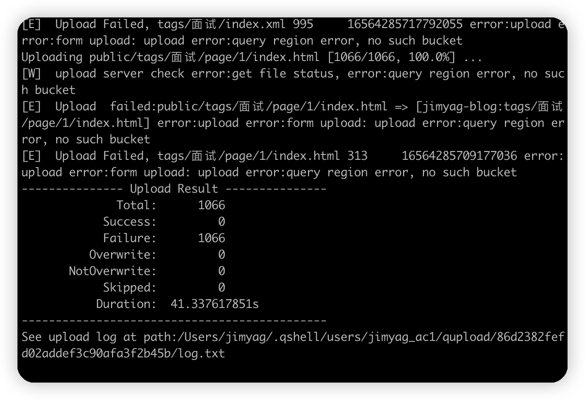
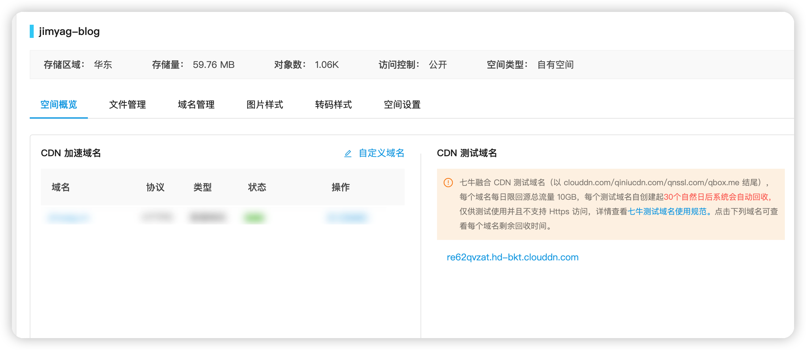
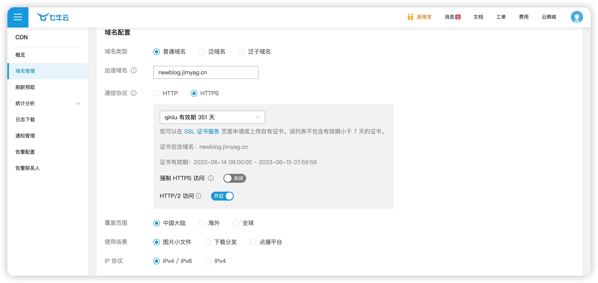
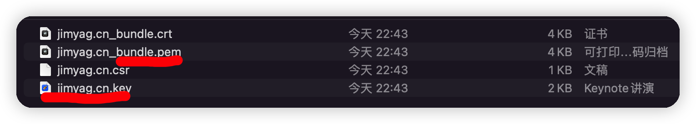
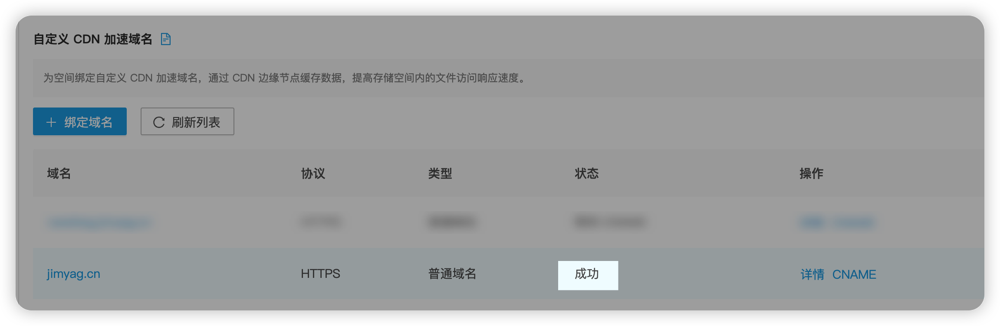
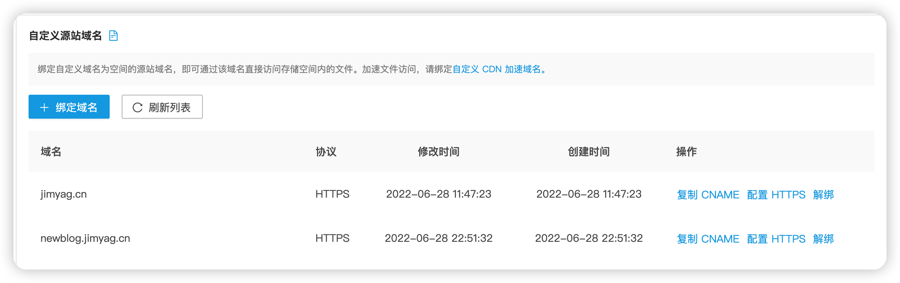
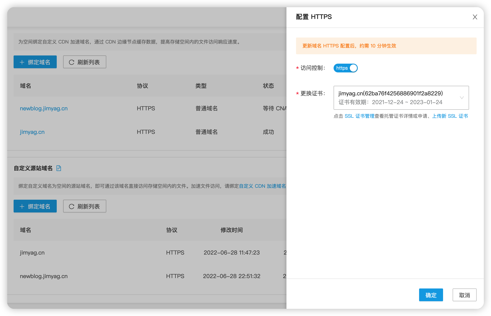

七牛云对注册的用户提供永久免费存储和CDN额度[CDN 优惠专场 (qiniu.com)](https://marketing.qiniu.com/activity/2021618-act-cdn)，所以打算将自己博客迁移过来。

<!--more-->

## 账号以及环境准备

### 账号

-   如果是新用户首先在[门户](https://portal.qiniu.com/)注册账号，注册完成之后要进行实名认证，这一步跟着官网教程走即可。
-   注册完成之后可以在[七牛云 - 对象存储 - 空间管理 (qiniu.com)](https://portal.qiniu.com/kodo/bucket)中可以自己新建bucket玩玩，或者[新建存储空间_快速入门_对象存储 - 七牛开发者中心 (qiniu.com)](https://developer.qiniu.com/kodo/4263/operational-guidelines-for-the-new-bucket)进行操作。
-   新建一个放博客的 bucket ，我这里的 bucket 名称为 `jimyag-blog`

### Hugo 环境准备

根据官方文档和自己的系统进行安装

[Quick Start | Hugo (gohugo.io)](https://gohugo.io/getting-started/quick-start/)

-   Windows 10 hugo [安装](https://jimyag.cn/posts/642ecc47/#安装hugo)

-   Mac 

    -   使用 homebrew 进行安装  

        brew install hugo

### qshell

-   [qshell的安装](https://developer.qiniu.com/kodo/1302/qshell)

-   配置 AccessKey/SecretKey 。在[密钥管理](https://portal.qiniu.com/user/key)中复制自己的 AK 和 SK 

-   在终端执行 

    ```powershell
    qshell account AK Sk name
    ```

    name 是账号的别称，可以随便输入。


## 同步 public 内容

qshell 提供了同步本地文件到 bucket 的参数[使用 qshell 同步目录 - 七牛开发者中心 (qiniu.com)](https://developer.qiniu.com/kodo/kb/1685/using-qshell-synchronize-directories)。

我们先到 hugo 博客的目录，这里是我自己的目录

```powershell
cd hugo-blog
```

### 创建同步目录的配置文件

```powershell
vi upload.conf
```

### 写入

```json
{
    "src_dir" : "./public",
    "bucket" : "jimyag-blog",
    "rescan_local": true,
    "overwrite" : true,
    "check_exists" : true,
    "check_hash" : true
}
```

“src_dir” 是要同步的文件夹

“bucket” 是同步到的 bucket的name，在上面已经创建了

“check_hash” = true 是检查文件的 hash ，如果一样就忽略改文件上传。

详细的参数见：[qshell/qupload.md at master · qiniu/qshell (github.com)](https://github.com/qiniu/qshell/blob/master/docs/qupload.md)

### **生成 public 文件**

```powershell
hugo -D
```

### **同步目录**

```powershell
qshell qupload upload.conf
```



### 开启默认首页设置

在七牛云[七牛云 - 对象存储 - 空间设置](https://portal.qiniu.com/kodo/bucket)空间管理->空间设置-> 打开默认首页设置。

在 空间预览 中会生成一个测试的域名，可以通过qiniu的域名访问我们的博客了



## 配置 CDN 和自定义域名

虽然我们现在能通过 域名 访问我们的博客了，但是这个测试域名是有期限的，并且不是我们自己的，很难记。

### 配置 CDN 加速域名

在[七牛云 - 添加域名 (qiniu.com)](https://portal.qiniu.com/cdn/domain/create?bucket=jimyag-blog&fixBucket)中 根据提示填写自己的域名



如果没有证书的话可以在qiniu中申请，点击上面的 `SSL证书服务`即可申请，其余的默认即可。

在[七牛云 - 证书管理 (qiniu.com)](https://portal.qiniu.com/certificate/ssl#cert)可以上传或者购买证书。

在上传证书中qiniu只支持 pem 格式的



点击完成，按照提示进行配置CNAME。[如何配置域名的 CNAME - 七牛开发者中心 (qiniu.com)](https://developer.qiniu.com/fusion/kb/1322/how-to-configure-cname-domain-name)



这样CDN 加速就配置完成了

(这里的域名和刚刚配置的不一样是，刚刚(newblog.jimyag.cn)的是演示的域名)

### 自定义域名配置



点击 绑定域名 ，输入之前的域名。

配置CANME

配置HTTPS




至此，博客就已经迁移到七牛云 OSS 存储了。

