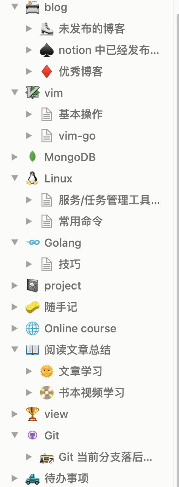
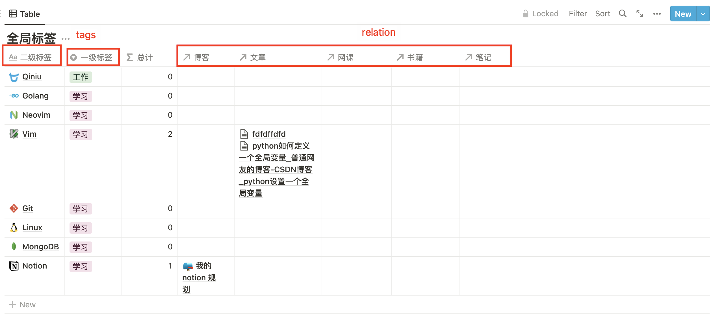
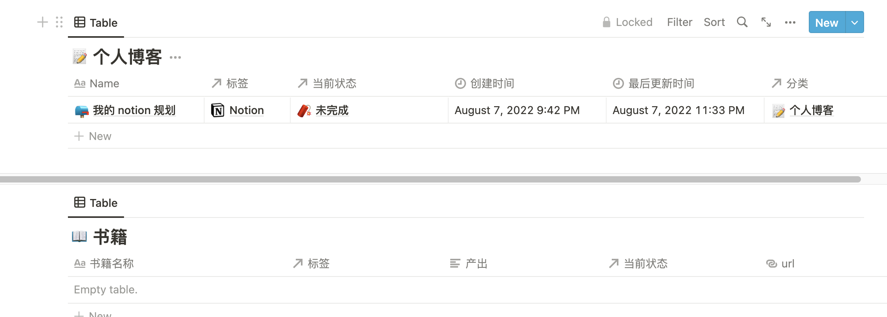
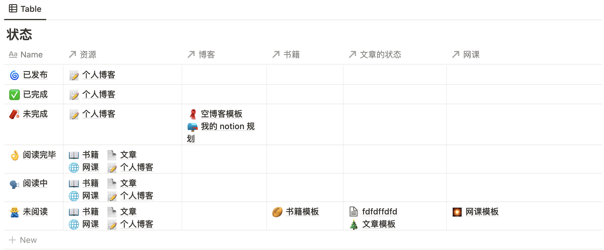
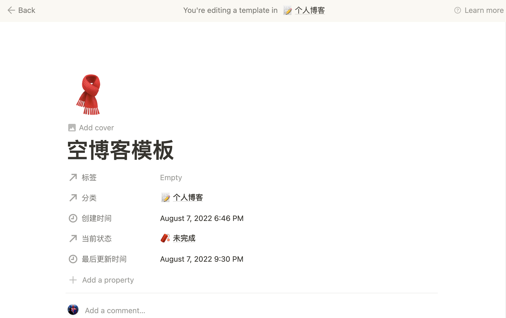
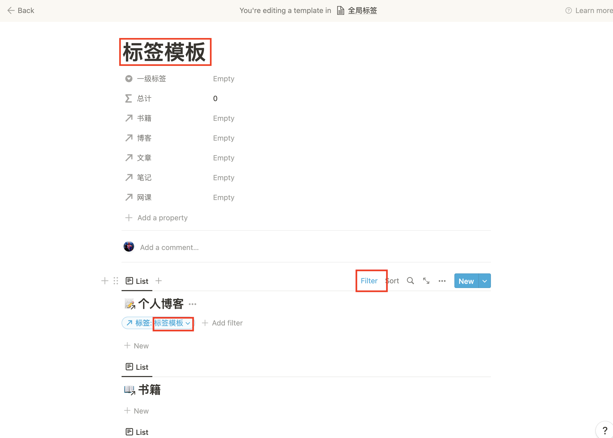

本篇文章主要会介绍我为什么会选择使用 notion，以及我在 notion 中的规划。

<!--more-->

## 为什么选择 notion

起初，我的笔记是本地 markdown+goodnotes ，如果电脑和 ipad在身边还好，可以实时看到自己的笔记。但是如果没有带其中的一样，那么笔记就不全。

之后的一段时间还使用过 OneNote ，它的同步速度很快，无论是在手机、电脑、iPad 随时随地都可以看到自己的笔记，但是OneNote 的逻辑不是很清楚，它就像一大张草稿纸等待我去填充，就像小时候的手抄报一样要自己设置格式，在调整格式上对于我来说要花费很多的时间。

再之后用过两个多月的 飞书，起初用飞书的感觉真的不错，可以多端同步、支持 markdown、免费，这些都很不错，但是这些自从实习后换了电脑就都不是重要的了。飞书在电脑上无论你是否安装了客户端都会在网页中打开飞书文档，当标签页开的多之后，飞书文档的网页就会很卡，这当然和我的配置有关，目前公司配的是丐版的 MacBookPro只有 8GB 内存。

目前使用的 notion 没有了其它三个的缺点，但是有一个致命的缺点——**服务器在国外**，这说不定那天就不能用了。但是我还是选择了它。

## 我的第一版的 notion

 刚开始使用 notion 发现它的嵌套页面非常不错，notion 中万物都是 block，block 中有 block ，就连页面都是 block。我按照之前的逻辑设计了一版的 workspace。

我是按照自己的使用习惯来分类的。

我有个网站需要写一些博客，但是博客不一定每次都是一次性写完的，需要有待写的以及写完的、发布的。

同时自己之前学习过一段时间的 Vim 目前开发用的也是 Neovim，自己也需要记录，这一部分可能是可以公开的(写成博客)，也可能是不想公开的。同理学习 MongoDB、Linux、Go、Git等等都是这样的。

同时看到不错的文章、书籍、教学视频、官方文档在学习之后也要做一些笔记，要不然忘得很快。

这时候就出现了一个问题，有的内容属于多个目录时候该怎么办？

比如我写了篇关于 Vim 使用的文章，我想把它分享出去，这时候应该属于Blog 呢还是 Vim 呢？当然我可以使用 link 的方式链接过去，但是这种分类方式可能就不太适合这种情况了。

## 我的需求是什么？

当我觉得上述分类不太合理的时候，想要换一种方式来管理这些，但是有没有好的思路的时候，我将自己的需求整理了出来。

1.  看别人的博客，进行总结
2.  看视频进行学习，记笔记
3.  看官方文档学习，记笔记
4.  记录工作的情况，记笔记
5.  保存自己的想法，或者是未发布、正在写的博客
6.  记笔记

上面这六点是我书写文档的目的，上面其实可以分为两大类，**一个是工作另一个就是学习**，当然可能会有生活上的事情，但是这些可能不会通过写文档的方式进行保存。

对于看别人的博客、视频、文档等都是自己摄取知识的来源，我把这些称之为资源。

对于要学习的内容，比如说 Go 这个是学习下面的一个模块，而我通过什么样的途径来学习就是资源。

在学习的过程中会有输出，我把笔记和博客称为输出。

我目前已经抽象出来了 `工作` 和 `学习` ，笔记、博客、视频、文档、书籍几种资源，学习的内容：Go、Linux… 这些如何关联起来呢，这就需要使用 notion 的一个特殊的 block ——database。

这里的 database 和计算机中的 database 是类似的，只不过这里的一个 database 就是一张表，有了表之后就可以通过某种方式把他们关联起来——这就是relation，通过 relation 可以把多个 database 关联起来一起管理。

根据不同的资源分类那么就有——笔记 database、博客 database、视频 database、文档 database、书籍 database。

根据大类工作和学习，我重新进行了划分，他们下面又有子分类。

-   工作
    -   公司 1
    -   公司 2
-   学习
    -   go
    -   vim
    -   Git
    -   …

每种资源会和上面的分类进行组合。这样就不会出现有内容不知道放在那个分类的尴尬处境了。

当然每种资源都有各自同的属性，

除此之外，我还添加了阅读或者完成的状态。

将状态和资源进行关联起来就可以看到不同学习内容当前的进度了。

每添加一条数据的时候，有些数据可能是计算出来的，或者是固定的，我们可以使用 template 生成。

我的数据库都使用了模板生成。每次只需要要填上标题和标签即可。

对 database 的视图也可以生成模板

我想看到每个二级标签中都有哪些内容，就可以使用不同的视图+filter 进行展示。如果不用模板，我每一条都要使用手动复制 database link 过来处理，有了模板之后，就可以在添加记录的时候将这些视图都添加好。

## 总结

以上就是我目前 notion 的规划。这是[模板链接](https://www.notion.so/jimyag/13db04b847ae4646959ec47165eed299)

 

## 参考

https://theblock.notion.site/theBlock-fa78e71c91bc4023a9c045520a848846
