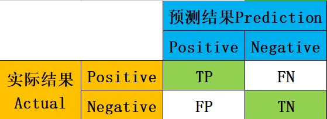
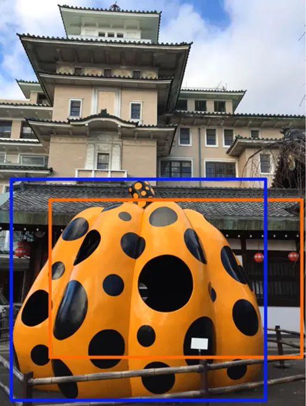
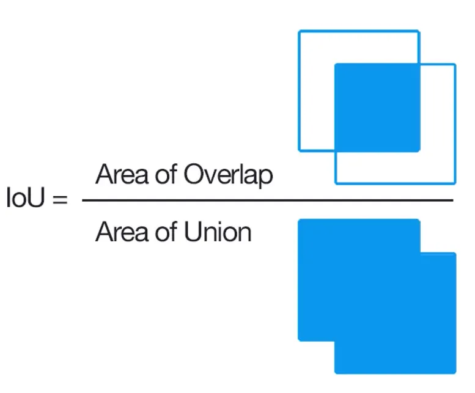
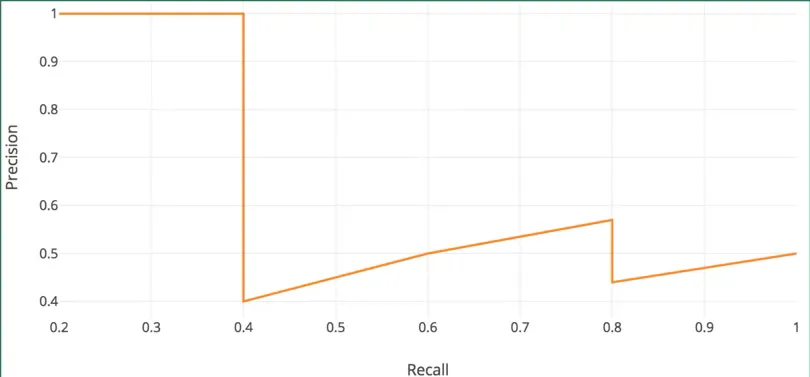
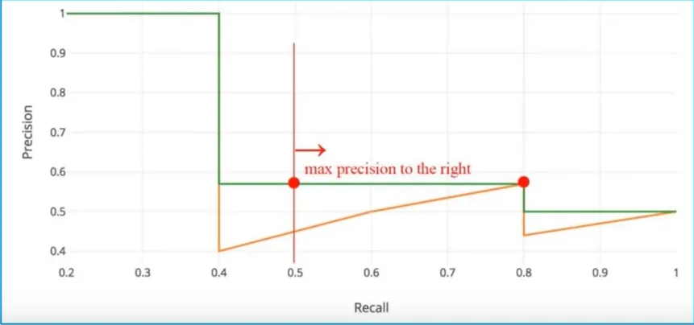
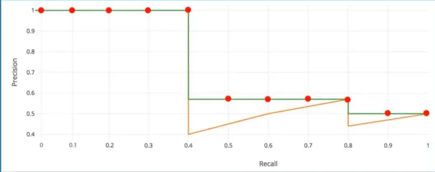
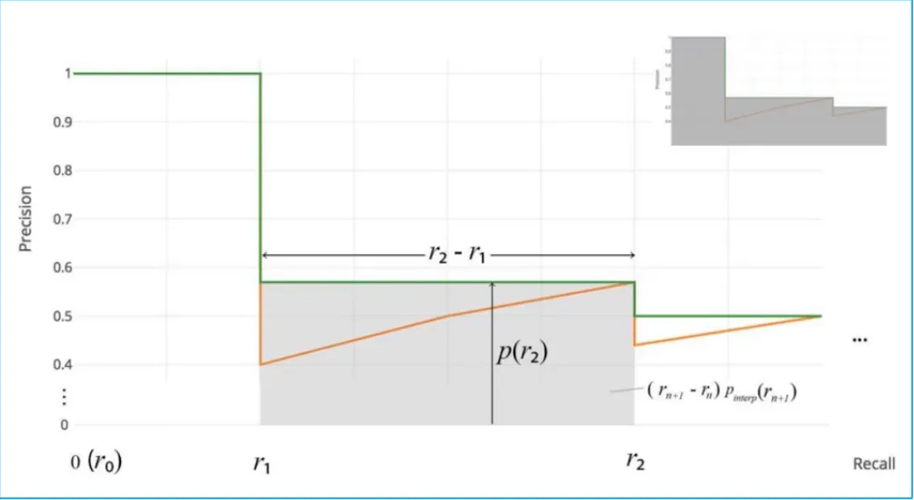

##### 检测精度

<!--more-->

###### 混淆矩阵（confusion matrix）

confusion matrix是用来总结一个分类器（classifier）结果的矩阵。对于k元分类，其实它就是一个k x k的表格，用来记录分类器的预测结果。

对于最常见的二元分类来说，我们的模型最终需要判断样本的结果是0还是1，或者说是positive还是negative。我们通过样本的采集，能够直接知道真实情况下，哪些数据结果是positive，哪些结果是negative。同时，我们通过用样本数据跑出分类型模型的结果，也可以知道模型认为这些数据哪些是positive，哪些是negative。

我们可以得到四个数据：

- 真实值是positive，模型认为是positive的数量（True Positive=TP，第一位True表示预测的结果是正确的，第二位Positive表示结果为positive）
- 真实值是positive，模型认为是negative的数量（False Negative=FN）：这就是统计学上的第二类错误（Type II Error）
- 真实值是negative，模型认为是positive的数量（False Positive=FP）：这就是统计学上的第一类错误（Type I Error）
- 真实值是negative，模型认为是negative的数量（True Negative=TN）

将这四个数据（指标）呈现在表格中，可以得到如下的矩阵

###### Precision精确率

在模型**预测**是positive的所有结果中，预测正确的比重。用你预测出来的正确的数量除以所有实际样本的数量。

​	$$ precision = \frac {TP}{TP+FP}$$

###### Recall召回率（sensitivity 敏感度）

在**真实值**是positive的所有结果中，预测正确的比重。就是用你预测出来的正确的数量除以所有实际正确的数量。评估模型预测的全不全。

$$ recall = \frac {TP}{TP+FN}$$

###### Accuracy正确率

$$Accuracy = \frac {TP+TN}{TP+FN+FP+TN}$$

分类模型中所有判断正确的结果占总观测值的比重。

###### F1-Score

$$F1-Score =  \frac{2}{(\frac{1}{Precision}+\frac{1}{Recall})}= \frac{2*Precision*Recall}{Precision+Recall}$$

F1-Score选择了调和平均数算法进行计算

F1-Score是对精确率与召回率进行平均的一个结果,指标综合了Precision与Recall的产出的结果。F1-Score的取值范围从0到1的，1代表模型的输出最好，0代表模型的输出结果最差。

###### IoU(Intersection over Union)交并比

- 蓝色的框表示Ground True（GT），在目标检测中表示标注的框。
- 橙色的框表示Precision，表示模型预测的框。

Iou为1则表示predicated和GT的bounding boxes完全重合。

在实际检测中我们可以设置一个IoU的阈值（threshold）来判断检测是有效的。

我们设置IoU为0.5

- 如果IoU>=0.5则分类就是TP
- 如果IoU<0.5则分类是FP
- 如果图片中有GT但是网络没有预测出来就是FN
- 对于图片中没有预测的种类，模型也没有预测出来就是TN。这个指标在目标检测中没有用处，我们可以忽略他。

###### AP（Average　Precision）　And　ｍAP

AP衡量学习出来的模型在**每一个类别上**的好坏。

ｍAP衡量的是学习出来的模型在所有类别上的好坏，mAP是取所有类别上AP的平均值。

AP计算，假设我们的数据集中共有五个待检测的物体，我们的模型给出了10个候选框，我们按照模型给出的置信度（confidence）由高到低对候选框进行排序。第二列表示预测是否正确，如果他与GT匹配且IoU>=0.5，则是正确的。FN在是有几个物体没有被检测出来

| Rank | Correct? |  TP  |  FP  |  FN  | Precision | Recall |
| :--: | :------: | :--: | :--: | :--: | :---------------------------------------: | :--------------------------------------: |
|  1   |   True   |  1   |  0   |  4   |  $\frac{TP}{TP+FP} = \frac{1}{1+0} = 1$   | $\frac{TP}{TP+FN} = \frac{1}{1+4} = 0.2$ |
|  2   |   True   |  2   |  0   |  3   |  $\frac{TP}{TP+FP} = \frac{2}{2+0} = 1$   | $\frac{TP}{TP+FN} = \frac{2}{2+3} = 0.4$ |
|  3   |  False   |  2   |  1   |  3   | $\frac{TP}{TP+FP} = \frac{2}{2+1} = 0.67$ | $\frac{TP}{TP+FN} = \frac{2}{2+3} = 0.4$ |
|  4   |  False   |  2   |  2   |  3   | $\frac{TP}{TP+FP} = \frac{2}{2+2} = 0.5$  | $\frac{TP}{TP+FN} = \frac{2}{2+3} = 0.4$ |
|  5   |  False   |  2   |  3   |  3   | $\frac{TP}{TP+FP} = \frac{2}{2+3} = 0.4$  | $\frac{TP}{TP+FN} = \frac{2}{2+3} = 0.4$ |
|  6   |   True   |  3   |  3   |  2   | $\frac{TP}{TP+FP} = \frac{3}{3+3} = 0.5$  | $\frac{TP}{TP+FN} = \frac{3}{3+2} = 0.6$ |
|  7   |   True   |  4   |  3   |  1   | $\frac{TP}{TP+FP} = \frac{4}{4+3} = 0.57$ | $\frac{TP}{TP+FN} = \frac{4}{4+1} = 0.8$ |
|  8   |  False   |  4   |  4   |  1   | $\frac{TP}{TP+FP} = \frac{4}{4+4} = 0.5$  | $\frac{TP}{TP+FN} = \frac{4}{4+1} = 0.8$ |
|  9   |  False   |  4   |  5   |  1   | $\frac{TP}{TP+FP} = \frac{4}{4+5} = 0.44$ | $\frac{TP}{TP+FN} = \frac{4}{4+1} = 0.8$ |
|  10  |   True   |  5   |  5   |  0   | $\frac{TP}{TP+FP} = \frac{5}{5+5} = 0.5$  |  $\frac{TP}{TP+FN} = \frac{5}{5+0} =1$   |

我们可以看到：随着预测的增多Recall越来越大，Percision会上下波动

- P-R（precision-recall）曲线

  我们当然希望检测的结果P越高越好，R也越高越好，但事实上这两者在**某些情况下是矛盾的**。比如极端情况下，我们只检测出了一个结果，且是准确的，那么Precision就是$\frac{1}{1+0} = 100\%$，但是Recall = $\frac{1}{所有真正的结果}$就很低；而如果我们把所有结果都返回，那么必然Recall必然很大，但是Precision很低。

  因此在不同的场合中需要自己判断希望P比较高还是R比较高。如果是做实验研究，可以绘制Precision-Recall曲线来帮助分析。

  通过上述的数据我们可以得到P-R曲线

- AP计算

  AP就是平均精准度，简单来说就是对PR曲线上的Precision值求均值。对于pr曲线来说，我们使用积分来进行计算。Recall从0-1对p(r)进行积分

  $$AP = \int_{0}^{1}p(r)dr$$

  在实际应用中，我们并不直接对该PR曲线进行计算，而是对PR曲线进行平滑处理。即对PR曲线上的每个点，Precision的值取该点右侧最大的Precision的值。经过处理我们可以得到如下图像

)

- Interplolated AP（Pascal Voc 2008 的AP计算方式-“11点法”，2010年之前的计算方式）

  Pascal VOC 2008中设置IoU的threshold为0.5，如果一个目标被重复检测，则confidence最高的为正样本，另一个为负样本。在平滑处理的PR曲线上，取横轴0-1的10等分点（包括断点共11个点）的Precision的值，计算其平均值为最终AP的值

  $$AP  = \frac{1}{11}*\sum_{0,0.1,\cdots,1}^{} P_{smooth}(i)$$

​		在我们的例子里$AP = \frac{1}{11}*(5*0.1+4*0.57+2*0.5) = 0.753$

- Area under curve（AUC）

  上述方法有两个缺陷，

  - 第一个是使用11个采样点在精度方面会有损失。
  - 第二个是，在比较两个AP值较小的模型时，很难体现出两者的差别。

  所以这种方法在2009年的Pascalvoc之后便不再采用了。在Pascal voc 2010之后，便开始采用这种精度更高的方式。绘制出平滑后的PR曲线后，用积分的方式计算平滑曲线下方的面积作为最终的AP值。求出被分割所有阶梯块的面积之和就是AP。

  
