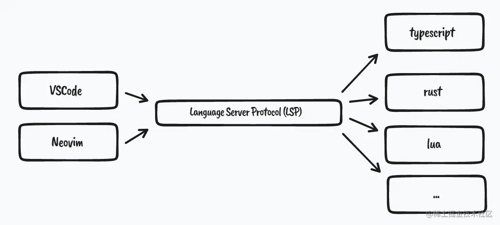
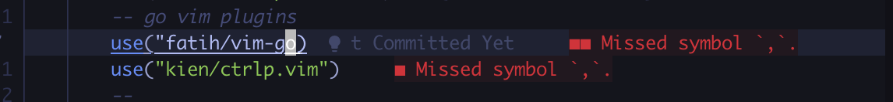

介绍我从 Goland 转到 Neovim的原因以及相关的配置过程。

<!--more-->

# 为什么要转到 Neovim

我目前实习的公司是没有统一购买 Goland 的 license，如果想要使用 Goland 就要自购买或者破解。公司的同学给了我两个选择

-   自己购买 Goland
-   使用 VS code

对于目前的我来说，购买 Goland 是不太可能的。使用了一段时间的 VS code ，用起来也不错，但还是差点。在 VScode 中装了许多插件，可以与 Goland 使用体验基本一致了。但是，既然都是装插件，为啥不再试试其他的编辑器呢？人生苦短，我选 vim [doge].

# 在 Goland 的中用到的功能

1.   代码高亮、补全、错误检查、格式化
2.   跳转到定义
3.   查找引用
4.   全局查找某些内容
5.   项目查找文件
6.   批量重命名
7.   块选取
8.   显示 当前行时被谁更改的
9.   复制当前行的信息 类似 project/xxx/xx/xxx.go:143
10.   括号补全
10.   同一个文件左右分屏
10.   打开的文件是新的窗口


# 我的配置过程

## 安装 Neovim

### Mac 

```bash
brew install neovim
```

## 安装依赖的字体

在终端中，默认的字体是不支持显示图标的，

### Mac

```bash
brew tap homebrew/cask-fonts && brew install --cask font-fira-code-nerd-font
```

**Iterm2 里配置非 acsii 字体** Preferences -> Profiles -> Text -> Non-Ascii-Font 选择 fira-code-nerd-font ，之后重启 Iterm2 生效

## 配置目录

由于会安装很多插件、配置快捷键、UI、高亮等。会涉及到很多内容，如果把所有配置文件写一个文件中， 很乱，不方便管理。我的配置目录如下

```bash
├── init.lua
├── lua
│   ├── basic.lua
│   ├── colorscheme.lua
│   ├── keybindings.lua
│   ├── localconf.lua
│   ├── lsp
│   │   ├── cmp.lua
│   │   ├── config
│   │   │   └── lua.lua
│   │   ├── setup.lua
│   │   └── ui.lua
│   ├── plugin-config
│   │   ...
│   ├── plugins.lua
│   └── utils
└── plugin
    └── packer_compiled.lua
```

**init.lua** 是整个配置的入口文件，负责引用所有其他的模块，基本上想要打开或关闭某个插件只要在这里修改一行代码即可。

-   **basic.lua：** 基础配置，是对默认配置的一个重置。例如显示行号，Tab 的长度等

-   **colorscheme.lua：** 我们安装的主题皮肤配置，在这里切换主题。

-   **keybindings.lua：** 快捷键的设置，所有插件的快捷键也都会放在这里。

-   **plugins.lua：** 插件安装管理，插件安装或卸载全在这里设置。

-   **lsp 文件夹：** 是对 Neovim 内置 LSP 功能的配置，包括常见编程语言与语法提示等。
    -   **config** **：** 文件夹包含各种语言服务器单独的配置文件。上面就有一个 **lua.lua** 的文件，就是 **lua** 的 lsp 配置
    -   **setup.lua** **：** 内置 LSP 的配置。
    -   **cmp.lua** **：** 语法自动补全补全的配置，包括各种补全源，与自定义代码段。
    -   **ui.lua：** 对内置 LSP 功能增强和 UI 美化。
    -   **formatter.lua：** 独立代码格式化功能（TODO）。

-   **plugin-config 文件夹：** 是对第三方插件的配置，未来每添加一个插件，这里就多一个配置文件。

-   **utils 文件夹：** 是对常见问题的修改，包括输入法切换，针对 windows 的特殊配置等。

## 配置入口文件

`Neovim`的配置入口文件并不是像`vim`一样放在用户目录的`.vimrc`中的，而是在`~/.config/nvim/init.lua`或`init.vim`，不过现在推荐使用`lua`进行编写 这个配置文件的说明在[neovim.io](https://neovim.io/doc/user/starting.html#config)中可以看到。

## 基础配置文件

在 `~/.config/nvim/lua/basic.lua`  中配置一些基本的配置，会对 `Neovim` 的默认行为做一些重置。

### 作用域

首先对配置的作用域做一下声明，可以对多个作用域进行单独的配置，比如希望一个配置在全局生效，还是说只在窗口中生效等等

-   `vim.o`：普通作用域（common）

-   `vim.g`:  全局作用域

-   `vim.b`：缓冲区作用域（buffer）

-   `vim.w`：窗口作用域（window）

-   `vim.bo`：`buffer-local`配置项

-   `vim.wo`：`window-local`配置项

只需要在vim.x. 后面跟上要修改的配置名并赋值即可。（x是作用域）

例如 `vim.g.encoding = "UTF-8"`  表示：全局的编码方式为`UTF-8` 

### 配置如下

```lua
-- utf8
vim.g.encoding = "UTF-8"
vim.o.fileencoding = "utf-8"
-- jkhl 移动时光标周围保留8行
vim.o.scrolloff = 8
vim.o.sidescrolloff = 8
-- 使用相对行号
vim.wo.number = true
vim.wo.relativenumber = true
-- 高亮所在行
vim.wo.cursorline = true
-- 显示左侧图标指示列
vim.wo.signcolumn = "yes"
-- 右侧参考线，超过表示代码太长了，考虑换行
vim.wo.colorcolumn = "80"
-- 缩进4个空格等于一个Tab
vim.o.tabstop = 4
vim.o.shiftwidth = 4
-- >> << 时移动长度
vim.o.shiftwidth = 4
vim.bo.shiftwidth = 4
-- 新行对齐当前行
vim.o.autoindent = true
vim.bo.autoindent = true
vim.o.smartindent = true
-- 搜索大小写不敏感，除非包含大写
vim.o.ignorecase = true
vim.o.smartcase = true
-- 搜索不要高亮
vim.o.hlsearch = false
-- 边输入边搜索
vim.o.incsearch = true
-- 命令行高为2，提供足够的显示空间
vim.o.cmdheight = 1
-- 当文件被外部程序修改时，自动加载
vim.o.autoread = true
vim.bo.autoread = true
-- 禁止折行
vim.wo.wrap = false
-- 光标在行首尾时<Left><Right>可以跳到下一行
vim.o.whichwrap = "<,>,[,]"
-- 允许隐藏被修改过的buffer
vim.o.hidden = true
-- 鼠标支持
vim.o.mouse = "a"
-- 禁止创建备份文件
vim.o.backup = false
vim.o.writebackup = false
vim.o.swapfile = false
-- smaller updatetime
vim.o.updatetime = 300
-- 设置 timeoutlen 为等待键盘快捷键连击时间500毫秒，可根据需要设置
-- 遇到问题详见：https://github.com/nshen/learn-neovim-lua/issues/1
vim.o.timeoutlen = 500
-- split window 从下边和右边出现
vim.o.splitbelow = true
vim.o.splitright = true
-- 自动补全不自动选中
vim.g.completeopt = "menu,menuone,noselect,noinsert"
-- 样式
vim.o.termguicolors = true
vim.opt.termguicolors = true
-- 补全增强
vim.o.wildmenu = true
-- Dont' pass messages to |ins-completin menu|
vim.o.shortmess = vim.o.shortmess .. "c"
-- 补全最多显示10行
vim.o.pumheight = 10
-- 永远显示 tabline
vim.o.showtabline = 2
-- 使用增强状态栏插件后不再需要 vim 的模式提示
vim.o.showmode = false
-- 配置剪切板
vim.opt.clipboard = "unnamedplus"
```

怎么知道每个配置项应该放在哪个作用域呢？比如`cursorline`这个配置项为啥是放在`wo`中呢？ 可以在命令模式下输入`:help cursorline`查看相关文档。

`显示相对行号`这个配置我觉得很有必要，比如我希望删除上方的这个`PlaneOptions interface`，那么在开启了相对行号的前提下，我可以很方便的直接输入`d6k`，而不需要思考应该删除几行，花时间去数它。

最后一定要在 `init.lua`  中写入

```lua
require("basic")
```

## 快捷键配置

在 Neovim 中配置快捷键其实是`快捷键的快捷键` ，我们配置快捷键只是嫌默认的快捷键不太方便而已。我们要用自己的方式让 Neovim 适应我们，而不是我们去适应 Neovim。

### 分屏操作

如果不设置快捷键，那么在 vim 中要进行上下分屏需要在 normal 模式中输入`:split` ,进行左右`:vsplit` 。 我把分屏的操作都设置为以`s` 开头，那么

-   上下分屏`sh`

-   左右分屏`sv`

-   关闭当前窗口`sc`

-   关闭其他窗口`so`

切换窗口

-   Alt + h/j/k/l

### 快捷键设置方法

在 Neovim 中使用以下方法设置快捷键：

-   `vim.api.nvim_set_keymap()` 全局快捷键

-   `vim.api.nvim_buf_set_keymap()` Buffer 快捷键

一般情况下，都是定义使用全局快捷键， Buffer 快捷键一般是在某些异步回调函数里指定，例如某插件初始化结束后，会有回调函数提供 Buffer，这个时候我们可以只针对这一个 Buffer 设置快捷键。

```lua
vim.api.nvim_set_keymap('模式', '按键', '映射为', 'options')
```

这里 **模式** 参数用一个字母表示，常见的有：

-   **n** Normal 模式

-   **i** Insert 模式

-   **v** Visual 模式

-   **t** Terminal 模式

-   **c** Command 模式

这里的模式，在之后有介绍。

**按键** 就是你按下的键。

**映射为** 可以是多个按键组合，比如 `5j` 就是连续点击`5`和`j`， 也可以是一条命令比如 `:q<CR>`，表示退出。<CR> 表示按下回车键

**options** 大部分会设置为 `{ noremap = true, silent = true }`。

-   `noremap` 表示不会重新映射，比如你有一个映射 `A` -> `B` , 还有一个 `B` -> `C`，这个时候如果你设置 `noremap = false` 的话，表示会重新映射，那么 `A` 就会被映射为 `C`。

-   `silent` 为 `true`，表示不会输出多余的信息。

#### Leader key

`leader key` 是你常用的前缀。

```lua
vim.g.mapleader = " "
vim.g.maplocalleader = " "
```

后边定义快捷键看到 `<leader>` 就表示 `空格` 。

由于要设置很多快捷键，所以先保存本地变量。

```lua
local map = vim.api.nvim_set_keymap
-- 复用 opt 参数
local opt = {noremap = true, silent = true }
```

之后就可以这样映射按键了 `map('模式', '按键', '映射为', 'options')` 。

原来默认的 s 键是 `删除光标所在处的字符然后插入需要录入的文本` ，由于我们用分屏占用了，需要把默认的 s 键取消设置。

```lua
-- 取消 s 默认功能
map("n", "s", "", opt)
-- windows 分屏快捷键
map("n", "sv", ":vsp<CR>", opt)
map("n", "sh", ":sp<CR>", opt)
-- 关闭当前
map("n", "sc", "<C-w>c", opt)
-- 关闭其他
map("n", "so", "<C-w>o", opt)
-- leader + hjkl  窗口之间跳转
map("n", "<leader>h", "<C-w>h", opt)
map("n", "<leader>j", "<C-w>j", opt)
map("n", "<leader>k", "<C-w>k", opt)
map("n", "<leader>l", "<C-w>l", opt)
```

水平分屏很常用，在开发中会有跳转到定义 `gd` 快捷键(Go Definition )，这个可以和 `sv` 组合起来，形成 `svgd` 命令，相当于打开右侧窗口进入方法的定义。看完可以随手 `sc` 关闭掉，非常方便。

调整窗口比例快捷键。

```lua
-- 左右比例控制
map("n", "<C-Left>", ":vertical resize -2<CR>", opt)
map("n", "<C-Right>", ":vertical resize +2<CR>", opt)
map("n", "s,", ":vertical resize -20<CR>", opt)
map("n", "s.", ":vertical resize +20<CR>", opt)
-- 上下比例
map("n", "sj", ":resize +10<CR>", opt)
map("n", "sk", ":resize -10<CR>", opt)
map("n", "<C-Down>", ":resize +2<CR>", opt)
map("n", "<C-Up>", ":resize -2<CR>", opt)
-- 等比例
map("n", "s=", "<C-w>=", opt)
```

`Neovim` 内置的命令行要用`<C-\><C-N>` 退出，我们把它映射为 `ESC` ，并用 `leader + t` 在下边窗口打开，或 `leader + vt` 侧边窗口打开。在里面 i 进入 insert 模式

```lua
-- Terminal相关
map("n", "<leader>t", ":sp | terminal<CR>", opt)
map("n", "<leader>vt", ":vsp | terminal<CR>", opt)
map("t", "<Esc>", "<C-\\><C-n>", opt)
```

在 visual 模式下可以`J` `K` 上下移动代码，又增加了连续 `>` 或 `<` 缩进代码。

```lua
-- visual模式下缩进代码
map("v", "<", "<gv", opt)
map("v", ">", ">gv", opt)
-- 上下移动选中文本
map("v", "J", ":move '>+1<CR>gv-gv", opt)
map("v", "K", ":move '<-2<CR>gv-gv", opt)
```

在浏览非常长的代码文件时，通常要用 `Ctrl+u` / `Ctrl + d` 来滚动代码，`u` 和 `p` 表示 `up翻页` 和 `down翻页`。

但是`ctrl + u` / `ctrl + d` 默认移动半屏，翻太快，一不留神就不知道翻到哪了， `j` / `k` 又移动得太慢了。这时我会设置两种不同级别的翻页距离， `Ctrl+j` / `Ctrl+k` 移动 4 行，`Ctrl+u` / `Ctrl + d` 移动 9 行

```lua
-- 上下滚动浏览
map("n", "<C-j>", "4j", opt)
map("n", "<C-k>", "4k", opt)
-- ctrl u / ctrl + d  只移动9行，默认移动半屏
map("n", "<C-u>", "9k", opt)
map("n", "<C-d>", "9j", opt)
```

最后，在 `init.lua` 入口文件里引入 `lua/keybindings.lua`，注意不要写 `.lua`

```lua
-- 快捷键映射
require("keybindings")
```

## 插件管理

之前使用的是[vim-plug](https://github.com/junegunn/vim-plug)，用 lua 管理之后就转到[packer](https://github.com/wbthomason/packer.nvim) 了。

### 安装

**mac**

```bash
git clone --depth 1 https://github.com/wbthomason/packer.nvim\
 ~/.local/share/nvim/site/pack/packer/start/packer.nvim
```

新建插件的配置文件并初始化。

```lua
local packer = require("packer")
packer.startup(
  function(use)
   -- Packer 可以管理自己本身
   use ("wbthomason/packer.nvim")
   -- 你的插件列表...
end)
```

使用 `use ("name/repo")`  来安装插件，`name/repo` 对应`github` 的ID 和仓库名。例如上边代码中的 `use ("wbthomason/packer.nvim")`，对应的就是 `https://github.com/wbthomason/packer.nvim` 地址。

在第二个参数中还可设置  config 参数。例如设置最大工作的并发等。

```lua
local packer = require("packer")
packer.startup({
  function(use)
    -- Packer 可以管理自己本身
    use 'wbthomason/packer.nvim'
    -- 你的插件列表...
  end,
  config = {
    -- 并发数限制
    max_jobs = 16,
    -- 浮动窗口打开安装列表
    display = {
        open_fn = function()
            return require("packer.util").float({ border = "single" })
        end,
    },
  },
})
```

必须在 **入口文件** 中引入才可以， 打开 `init.lua` 增加如下代码：

```lua
-- Packer 插件管理
require("plugins")
```

再次 `:wq` 后，配置生效。

配置生效后，运行 `:PackerSync`, 重新生成编译的加载文件。每次修改完 `lua/plugins.lua` 这个文件后，保存退出，重新打开并调用 `:PackerSync` 就可以了，只要你的网络可以连接到 `github`，插件就会安装成功。

Neovim 推荐将数据存储在 **标准数据目录**下（`:h base-directories` 查看详细文档），**标准数据目录**默认是 `~/.local/share/nvim/` ，你可以通过调用 `:echo stdpath("data")` 命令查看你系统下的实际路径。

`Packer` 会将插件默认安装在 `标准数据目录/site/pack/packer/start` 中，完整目录也就是`~/.local/share/nvim/site/pack/packer/start` 目录下。

你现在可以进入这个目录，查看一下安装的插件，应该看到只安装了 `packer.nvim` 一个插件，后续安装的插件也都会出现在这个目录中。

之前我们讲了安装组件的流程为： 修改 `lua/plugins.lua` 文件，保存退出，重新打开并调用 `:PackerSync`。

其实如果你愿意的话，我们可以添加一条自动命令让每次保存 `lua/plugins.lua` 就自动安装组件。

打开 `lua/plugins.lua` 文件，在最后添加：

```lua
-- 每次保存 plugins.lua 自动安装插件
pcall(
  vim.cmd,
  [[
    augroup packer_user_config
    autocmd!
    autocmd BufWritePost plugins.lua source <afile> | PackerSync
    augroup end
  ]]
)
```

这里的 `[[ ... ]]` 中间的部分是 VIM 脚本，因为 Neovim 还没有实现自动命令的 API，所以我们需要使用 `vim.cmd` 命令来执行这段脚本。

这段脚本的意思是 `BufWritePost` 事件时，如果改的是 `lua/plugins.lua` 文件，就自动重新加载并调用 `:PackerSync` 命令，这样就不用手动重启，可以自动安装插件了。

`pcall` 命令是一个 Lua 函数，它的作用是检查一个函数是否执行成功，如果执行成功，则返回 `true`，否则返回 `false` 。

现在修改 `lua/plugins.lua` 后输入 `:w` 就会自动安装和更新插件了。

## 主题

Neovim 本身内置了一些主题配色，可以通过 `:colorscheme Tab键` 命令来查看， 回车确认选中。这里列出的都是内置的 `colorscheme`，它们都保存在 `$VIMRUNTIME/colors/` 目录下。可以在 `Neovim` 中输入命令 `:echo $VIMRUNTIME` 来查看 `$VIMRUNTIME` 具体的路径。

但通过这种方式选择的主题，在重启后就失效了。需要写入配置才可以保存，下边看一下如何写入配置。

在`init.lua` 中添加 

```lua
require("colorscheme")
```

新建被引入的 `lua/colorscheme.lua` 文件，代码如下：

```lua
local colorscheme = "tokyonight"
local status_ok, _ = pcall(vim.cmd, "colorscheme " .. colorscheme)
if not status_ok then
  vim.notify("colorscheme " .. colorscheme .. " 没有找到！")
  return
end
```

简单解释一下，上边代码第一行，定义了一个 `colorscheme` 的变量，表示我们要设置的主题，注意其实这里我们使用的 `tokyonight` **并不存在**。

接下来的部分代码，我们又见到了 `pcall`。

```lua
local status_ok, _ = pcall(vim.cmd, "colorscheme " .. colorscheme)
```

`pcall` 在 Lua 中用于捕获错误，这句话如果不用`pcall` 的话，相当于：

```lua
vim.cmd('colorscheme '.. colorscheme)
```

Lua 语言中用 `..` 来连接两个字符串，上边已经声明了 `colorscheme` 变量也是一个字符串 `"tokyonight" `所以这里其实就等于调用 `:colorscheme tokyonight` 命令。 但如果这样直接调用命令，如果主题不存在，Neovim 就会直接崩溃报错找不到该主题，程序中也就没法知道主题是否设置成功了。

使用 `pcall` 的话就不同了，`pcall` 函数的返回的第一个参数是 `boolean` 类型表示状态，这句话的意思是，如果 `colorscheme` 执行成功，则返回 `true`，否则返回 `false`。

如果没有设置成功，我们就让它输出信息：

```lua
vim.notify("colorscheme " .. colorscheme .. " 没有找到！")
```

至此配置的部分就完成了，提示没有找到是因为 `tokyonight` 主题并不存在，如果把该值修改成已经存在的主题，比如 `ron` 就会设置成功了。

下边我们看看如何安装第三方主题。

### 安装第三方插件

打开 `lua/plugins.lua` 文件，增加 colorschemes 部分：

```lua
packer.startup({
  function(use)-- Packer 可以升级自己
    use("wbthomason/packer.nvim")
    --------------------- colorschemes ---------------------- tokyonight
    use("folke/tokyonight.nvim")
})
```

`:w` 保存，如果顺利的话，会自动安装，完成后按 `q` 退出，重启后就可以看到 `tokyonight` 主题的样子了。

通常我们都会选择专门为 Neovim 制作的第三方主题，因为它们大多都会支持基于 `TreeSitter` 的语法高亮（后续代码高亮章节会详细说明），我认为这是考量是否应该选择一个主题最基础也是重要的事。

也就是说，一个现代化的主题，必须支持 [nvim-treesitter](https://github.com/nvim-treesitter/nvim-treesitter) 语法高亮。

nvim-treesitter 的官方 wiki 上列出了许多支持 Treesitter 的主题，如果你想寻找更多的主题配色，可以到 [nvim-treesitter wiki](https://github.com/nvim-treesitter/nvim-treesitter/wiki/Colorschemes) 页里查看。

选择喜欢的样式后修改 `lua/colorscheme.lua` 内 `colorscheme` 变量的名字保存，重启后即可生效。

```lua
local colorscheme = "tokyonight"
```

## 侧边栏管理

一般 IDE 都有一个文件浏览器，可以方便地浏览目录结构，添加、删除、移动或者重命名文件，更快地打开文件。

安装插件

```lua
use {
  'kyazdani42/nvim-tree.lua',
  requires = {
    'kyazdani42/nvim-web-devicons', -- optional, for file icons
  },
  tag = 'nightly' -- optional, updated every week. (see issue #1193)
}
```

### 配置

创建 `lua/plugin-config/nvim-tree.lua` 文件，添加如下内容：

```lua
local status, nvim_tree = pcall(require, "nvim-tree")
if not status then
    vim.notify("没有找到 nvim-tree")
  return
end
```

上边的代码相当于：

```lua
local nvim_tree = require("nvim-tree")
```

但是如果我们直接 `require` 一个插件，当这个插件不存在的时候，`Neovim` 就会崩溃，所以我这里使用 `pcall` 来捕获了错误，如果 `nvim-tree` 没有安装，我们就会直接 `return`，**不**再继续执行下边的配置。

由于我们经常会调整插件，所以应该尽量避免报错，后续的所有插件配置文件都会这么做。

继续增加代码：

```lua
local status, nvim_tree = pcall(require, "nvim-tree")
if not status then
        vim.notify("没有找到 nvim-tree")
        return
end

-- 列表操作快捷键
local list_keys = require('keybindings').nvimTreeList
nvim_tree.setup({

        auto_reload_on_write = true,
        create_in_closed_folder = false,
        disable_netrw = false,
        hijack_cursor = false,
        hijack_netrw = true,
        hijack_unnamed_buffer_when_opening = false,
        ignore_buffer_on_setup = false,
        open_on_setup = false,
        open_on_setup_file = false,
        open_on_tab = false,
        sort_by = "name",
        root_dirs = {},
        prefer_startup_root = false,
        sync_root_with_cwd = false,
        reload_on_bufenter = false,
        respect_buf_cwd = false,
        view = {
                adaptive_size = false,
                centralize_selection = false,
                width = 40,
                height = 30,
                hide_root_folder = false,
                side = "left",
                preserve_window_proportions = false,
                number = false,
                relativenumber = false,
                signcolumn = "yes",
                mappings = {
                        custom_only = false,
                        list = list_keys,
                },
        },
        renderer = {
                add_trailing = false,
                group_empty = false,
                highlight_git = false,
                full_name = false,
                highlight_opened_files = "none",
                root_folder_modifier = ":~",
                indent_markers = {
                        enable = false,
                        icons = {
                                corner = "└",
                                edge = "│",
                                item = "│",
                                none = " ",
                        },
                },
                icons = {
                        webdev_colors = true,
                        git_placement = "before",
                        padding = " ",
                        symlink_arrow = " ➛ ",
                        show = {
                                file = true,
                                folder = true,
                                folder_arrow = true,
                                git = true,
                        },
                        glyphs = {
                                default = "",
                                symlink = "",
                                bookmark = "",
                                folder = {
                                        arrow_closed = "",
                                        arrow_open = "",
                                        default = "",
                                        open = "",
                                        empty = "",
                                        empty_open = "",
                                        symlink = "",
                                        symlink_open = "",
                                },
                                git = {
                                        unstaged = "✗",
                                        staged = "✓",
                                        unmerged = "",
                                        renamed = "➜",
                                        untracked = "★",
                                        deleted = "",
                                        ignored = "◌",
                                },
                        },
                },
                special_files = { "Cargo.toml", "Makefile", "README.md", "readme.md" },
                symlink_destination = true,
        },
        hijack_directories = {
                enable = true,
                auto_open = true,
},
        update_focused_file = {
                enable = false,
                update_root = false,
                ignore_list = {},
        },
        ignore_ft_on_setup = {},
system_open = {
                cmd = "open", -- mac
                -- cmd  = "wsl-open" --win
                args = {},
        },
        diagnostics = {
                enable = false,
                show_on_dirs = false,
                debounce_delay = 50,
                icons = {
                        hint = "",
                        info = "",
                        warning = "",
                        error = "",
                },
        },
        filters = {
                -- 隐藏 node_modules 
                dotfiles = false,
                custom = {"node_modules",".idea"},
                exclude = {},
        },
        filesystem_watchers = {
                enable = false,
                interval = 100,
                debounce_delay = 50,
        },
        git = {
                enable = true,
                ignore = true,
                show_on_dirs = true,
                timeout = 400,
        },
        actions = {
                use_system_clipboard = true,
                change_dir = {
                        enable = true,
                        global = false,
                        restrict_above_cwd = false,
                },
                expand_all = {
                        max_folder_discovery = 300,
                        exclude = {},
                },
                open_file = {
                        quit_on_open = true,
                        resize_window = true,
                        window_picker = {
                                enable = true,
                                chars = "ABCDEFGHIJKLMNOPQRSTUVWXYZ1234567890",
                                exclude = {
                                        filetype = { "notify", "packer", "qf", "diff", "fugitive", "fugitiveblame" },
                                        buftype = { "nofile", "terminal", "help" },
                                },
                        },
                },
                remove_file = {
                        close_window = true,
                },
        },
        trash = {
                cmd = "gio trash",
                require_confirm = true,
        },
        live_filter = {
                prefix = "[FILTER]: ",
                always_show_folders = true,
        },
        log = {
                enable = false,
                truncate = false,
                types = {
                        all = false,
                        config = false,
                        copy_paste = false,
                        dev = false,
                        diagnostics = false,
                        git = false,
                        profile = false,
                        watcher = false,
                },
        },
})
-- 自动关闭
vim.cmd([[
  autocmd BufEnter * ++nested if winnr('$') == 1 && bufname() == 'NvimTree_' . tabpagenr() | quit | endif
]])
```

上边代码就是 nvim-tree 的配置，可以根据注释进行修改。这里简单解释一下，值得注意的是 `system_open` 项，如果想要在 `WSL` 中用 Windows 系统默认设置打开文件，需要使用 `Node.js` 全局安装一个 `wsl-open` 包，使用命令 `npm install -g wsl-open`，如果不需要这个功能，也可以不用安装。 如果不是 Windows 系统也就不需要安装。

nvim-tree 初始化支持很多参数，如果想知道还有哪些其他的参数，可以运行 `:h nvim-tree.setup` 调出帮助文档查看。

注意到上述代码第一行，引入了我们之前创建的 `lua/keybindings.lua`，并取出 `nvimTreeList` 变量作为快捷键设置， 那我们就看看 `keybinding` 中是如何导出这个变量的。

打开 `lua/keybindings.lua` 文件，增加如下代码：

```lua
-- 插件快捷键
local pluginKeys = {}

-- nvim-tree begin --
-- alt + m 键打开关闭tree
map("n", "<A-m>", ":NvimTreeToggle<CR>", opt)
-- 列表快捷键
pluginKeys.nvimTreeList = {
        -- 打开文件或文件夹
        { key = {"<CR>", "o", "<2-LeftMouse>"}, action = "edit" },
        -- 分屏打开文件
        { key = "v", action = "vsplit" },
        { key = "h", action = "split" },
        -- 显示隐藏文件
        { key = "i", action = "toggle_custom" }, -- 对应 filters 中的 custom (node_modules)
        { key = ".", action = "toggle_dotfiles" }, -- Hide (dotfiles)
        -- 文件操作
        { key = "<F5>", action = "refresh" },
        { key = "a", action = "create" },
        { key = "d", action = "remove" },
        { key = "D", action = "trash" },
        { key = "r", action = "rename" },
        { key = "x", action = "cut" },
        { key = "c", action = "copy" },
        { key = "p", action = "paste" },
        { key = "s", action = "system_open" },
}
-- nvim-tree end --

return pluginKeys
```

在上边代码中，我们首先在 Normal 模式下定义了一个`Alt + m` 的快捷键，调用 `:NvimTreeToggle<CR>` 命令，这个快捷键用来打开和关闭侧边栏。

`pluginKeys.nvimTreeList` 下则是在光标在列表中时的快捷键设置，比如用 `o` 来打开关闭文件夹，`a` 添加一个文件，`d` 删除文件等等。

[详见更多快捷键配置](https://github.com/kyazdani42/nvim-tree.lua/blob/ba5c18dc2b43599067d999933469098073e1941c/doc/nvim-tree-lua.txt#L1030)

代码的最后一行，我们 `return` 了一个 `lua table`， 也叫关联数组。 当我们从其他文件 `require` 这个文件的时候，就会得到这个对象。

最后不要忘记在入口文件 `init.lua` 中引入配置：

```lua
-- 插件配置
require("plugin-config.nvim-tree")
```

重启 nvim 后，侧边栏就会生效了，使用 `Alt + m` 打开/关闭， `j/k` 上下移动， ` <leader> + h` / `<leader> + l` 可以左右窗口跳转。

## 标签页和底部信息栏

### 标签页

[bufferline](https://github.com/akinsho/bufferline.nvim) 顾名思义是把 Neovim 的 `buffer` 图形化显示成标签页的形式。

**安装**

```lua
    use({ "akinsho/bufferline.nvim", tag = "v2.*",requires = { "kyazdani42/nvim-web-devicons", "moll/vim-bbye" }})
```

这里我增加了一个 [vim-bbye](https://github.com/moll/vim-bbye) 依赖，因为这个插件安装后会增加一个 `:Bdelete` 命令，相比内置的 `:bdelete`, 它删除 buffer 的同时，并不会搞乱布局 。 待会儿我们会配置 `Bdelete` 为关闭 Tab 的命令。

新建配置文件 `lua/plugin-config/bufferline.lua`，代码如下：

```Lua
local status, bufferline = pcall(require, "bufferline")
if not status then
    vim.notify("没有找到 bufferline")
  return
end-- bufferline 配置
-- https://github.com/akinsho/bufferline.nvim#configuration
bufferline.setup({
  options = {
    -- 关闭 Tab 的命令，这里使用 moll/vim-bbye 的 :Bdelete 命令
    close_command = "Bdelete! %d",
    right_mouse_command = "Bdelete! %d",
    -- 侧边栏配置
    -- 左侧让出 nvim-tree 的位置，显示文字 File Explorer
    offsets = {
      {
        filetype = "NvimTree",
        text = "File Explorer",
        highlight = "Directory",
        text_align = "left",
      },
    },
    -- 使用 nvim 内置 LSP  后续课程会配置
    diagnostics = "nvim_lsp",
    -- 可选，显示 LSP 报错图标
    ---@diagnostic disable-next-line: unused-local
    diagnostics_indicator = function(count, level, diagnostics_dict, context)
      local s = " "
      for e, n in pairs(diagnostics_dict) do
        local sym = e == "error" and " " or (e == "warning" and " " or "")
        s = s .. n .. sym
      end
      return s
    end,
  },
})
```

增加快捷键。 打开 `lua/keybindings.lua`，根据你的使用习惯增加键盘映射：

```lua
-- bufferline
-- 左右Tab切换
map("n", "<C-h>", ":BufferLineCyclePrev<CR>", opt)
map("n", "<C-l>", ":BufferLineCycleNext<CR>", opt)
-- 关闭
--"moll/vim-bbye"
map("n", "<C-w>", ":Bdelete!<CR>", opt)
map("n", "<leader>bl", ":BufferLineCloseRight<CR>", opt)
map("n", "<leader>bh", ":BufferLineCloseLeft<CR>", opt)
map("n", "<leader>bc", ":BufferLinePickClose<CR>", opt)
```

上述代码延续了我在 `VSCode` 中的使用习惯，使用 `Ctrl + h` 和 `Ctrl + l` 左右切换标签页， `Ctrl + w` 关闭当前标签页。

我又将 `bufferline` 提供的我不太常用到的命令，映射为由空格键开头， `<leader>bl` 关闭左侧标签页， `<leader>bh` 关闭右侧标签页， `<leader>bc` 选择要关闭的标签页。

最后一步，在入口文件中引入配置文件。 打开 `init.lua`，增加代码：

```lua
require("plugin-config.bufferline")
```

保存退出，重启后安装生效。

### 底部信息栏

底部状态栏用于显示一些额外信息，比如当前的编辑模式，光标所在的行号，列号。当前文件大小，编码格式，当前 `git` 分支等状态。

打开 `lua/plugins.lua`， 增加 `lualine` 相关代码：

```lua
 use({ "nvim-lualine/lualine.nvim", requires = { "kyazdani42/nvim-web-devicons" } })
 use("arkav/lualine-lsp-progress")
```

注意这里新增了两行，第二行是 `lualine` 的一个扩展。

新建配置文件 `lua/plugin-config/lualine.lua`，代码如下：

```lua
-- 如果找不到lualine 组件，就不继续执行
local status, lualine = pcall(require, "lualine")
if not status then
    vim.notify("没有找到 lualine")
  return
end

lualine.setup({
  options = {
    theme = "tokyonight",
    component_separators = { left = "|", right = "|" },
    -- https://github.com/ryanoasis/powerline-extra-symbols
    section_separators = { left = " ", right = "" },
  },
  extensions = { "nvim-tree", "toggleterm" },
  sections = {
    lualine_c = {
      "filename",
      {
        "lsp_progress",
        spinner_symbols = { " ", " ", " ", " ", " ", " " },
      },
    },
    lualine_x = {
      "filesize",
      {
        "fileformat",
        -- symbols = {
        --   unix = '', -- e712
        --   dos = '', -- e70f
        --   mac = '', -- e711
        -- },
        symbols = {
          unix = "LF",
          dos = "CRLF",
          mac = "CR",
        },
      },
      "encoding",
      "filetype",
    },
  },
})
```

lualine 的配置参数主要有 `options`，`extensions` 和 `sections` 三块。

`options` 用于设置样式， 其中 `theme` 设置主题配色，可以设置为 `auto`， 也可以设置为[主题列表](https://github.com/nvim-lualine/lualine.nvim/blob/master/THEMES.md)中的一个， 我这里设置的是 `tokyonight`，是由 tokyonight 主题配色额外提供的支持。`section_separators` 设置分段分隔符`， component_separators` 设置分段中的组件分隔符。

`extensions` 用于设置 `lualine` 支持的扩展，详见[扩展列表](https://github.com/nvim-lualine/lualine.nvim#extensions) 这里我们只会用到 `nvim-tree` 和 `toggleterm` 。

`sections` 用于设置不同分段，所需显示的功能模块， 分段有 6 个，分别为： `A B C X Y Z` 。

```PowerShell
+-------------------------------------------------+
| A | B | C                             X | Y | Z |
+-------------------------------------------------+
```

对应默认配置项为：

```lua
 sections = {
    lualine_a = {'mode'},
    lualine_b = {'branch', 'diff', 'diagnostics'},
    lualine_c = {'filename'},
    lualine_x = {'encoding', 'fileformat', 'filetype'},
    lualine_y = {'progress'},
    lualine_z = {'location'}
  },
```

我的配置中，修改了 `C` 的部分：

```lua
    lualine_c = {
      "filename",
      {
        "lsp_progress",
        spinner_symbols = { " ", " ", " ", " ", " ", " " },
      },
    },
```

在文件名后边增加了 `lsp_progress` 进度显示，该信息是由我们之前安装的 [arkav/lualine-lsp-progress](https://github.com/arkav/lualine-lsp-progress) 提供的。

可以修改了 `X` 的部分， 因为 `lualine` 默认的 `fileformat` 是用图标表示的，不是很直观，可以换成了和 `VSCode` 一致的 `LF/CRLF/CR` 格式。

```lua
    lualine_x = {
      "filesize",
      {
        "fileformat",
        -- symbols = {--   unix = '', -- e712--   dos = '', -- e70f--   mac = '', -- e711-- },
         -- symbols = {unix = "LF",dos = "CRLF",mac = "CR",},
      },
      "encoding",
      "filetype",
    },
```

由于该插件并不需要定义快捷键，所以我们执行最后一步，在**入口文件**中引入配置文件。 打开 `init.lua`，增加代码：

```lua
require("plugin-config.lualine")
```

`:wq` 保存退出，重启后安装生效。

## 搜索插件

使用 VSCode 的时候经常使用中内置的模糊查找 `Ctrl + p` 来查找文件，使用 `Ctrl + shift + f` 来全局查找，非常方便。

### **安装**

```lua
use { 'nvim-telescope/telescope.nvim', requires = { "nvim-lua/plenary.nvim" } }
```

安装完成后，需要调用 `:checkhealth telescope` 检查依赖情况，这里通常会提示 `ripgrep` 不存在，因为 `telescope` 依赖以下项目。

**mac**

```lua
brew install ripgrep
brew install fd
```

### 快捷键配置

```lua
-- Telescope begin --
-- 查找文件
map("n", "<leader>ff", ":Telescope find_files<CR>", opt)
-- 全局搜索
map("n", "<leader>fg", ":Telescope live_grep<CR>", opt)
```

这里我定义了 `<leader>ff` 为 `:Telescope find_files`命令。  `<leader>fg` 为 `:Telescope live_grep` 全局查找。

默认情况下打开窗口就会进入输入模式，这个时候和在普通编辑器一样，可以按 `ESC` 键进入 `Normal` 模式，然后 `j/k` 在文件列表里上下浏览， 按 `i` 或 `a` 回到 `Insert` 模式，按 `ESC` 退出。

除了默认的快捷键以外，`Telescope` 还支持在打开的窗口中自定义快捷键，打开 `lua/keybindings.lua` 继续添加：

```lua
-- Telescope 列表中 插入模式快捷键
pluginKeys.telescopeList = {
  i = {
    -- 上下移动
    ["<C-j>"] = "move_selection_next",
    ["<C-k>"] = "move_selection_previous",
    ["<Down>"] = "move_selection_next",
    ["<Up>"] = "move_selection_previous",
    -- 历史记录
    ["<C-n>"] = "cycle_history_next",
    ["<C-p>"] = "cycle_history_prev",
    -- 关闭窗口
    ["<C-c>"] = "close",
    -- 预览窗口上下滚动
    ["<C-u>"] = "preview_scrolling_up",
    ["<C-d>"] = "preview_scrolling_down",
  },
}

-- Telescope end --
```

这样在插入模式下按 `Ctrl + j` / `Ctrl +k` 就可以在文件列表中上下切换了，不再需要切回 `Normal` 模式了。

### 配置 telescope 插件

新建配置文件 `lua/plugin-config/telescope.lua`，代码如下

```lua
local status, telescope = pcall(require, "telescope")
if not status then
  vim.notify("没有找到 telescope")
  return
end

telescope.setup({
  defaults = {
    -- 打开弹窗后进入的初始模式，默认为 insert，也可以是 normal
    initial_mode = "insert",
    -- 窗口内快捷键
    mappings = require("keybindings").telescopeList,
  },
  pickers = {
    -- 内置 pickers 配置
    find_files = {
      -- 查找文件换皮肤，支持的参数有： dropdown, cursor, ivy
      -- theme = "dropdown", 
    }
  },
  extensions = {
     -- 扩展插件配置
  },
})
```

Telescope 非常强大，内置了很多的 pickers，比如 `:Telescope buffers` 命令可以列出打开的 buffers， `:Telescope git_files` 列出 git 文件，`:Telescope man_pages` 列出帮助等等。

 打开 `init.lua`，增加代码：

```lua
require("plugin-config.telescope")
```

`:wq` 保存退出，重启后安装生效。

除了内置的还可以安装[第三方扩展](https://github.com/nvim-telescope/telescope.nvim/wiki/Extensions)

下边通过一个简单的扩展，演示如何安装扩展。

要安装的扩展叫做 [telescope-env.nvim](https://github.com/LinArcX/telescope-env.nvim) 用于列出系统环境变量.

打开 `lua/plugins.lua` 文件，新增 `telescope-env.nvim` 相关的内容：

```lua
-- telescope extensions
use "LinArcX/telescope-env.nvim"
```

`:w` 保存，自动安装，安装完成后，打开 `lua/plugin-config/telescope.lua` 文件，在文件最后新增：

```lua
-- telescope extensions
pcall(telescope.load_extension, "env")
```

重启后，就可以调用 `:Telescope env` 命令，打开环境变量列表了。

## 启动页面

当我们在命令行中输入 `nvim` 不带任何路径并敲击回车的时候，就会打开这个界面，通常我们会在这个界面中配置最常用功能，比如打开最近编辑过的文件，快速打开项目文件夹，快速修改快捷键等。

最重要的是，我们要自定一个酷酷的 Banner ，表示这是我们独一无二的版本， 首先需要安装 [dashboard-nvim](https://github.com/glepnir/dashboard-nvim) 插件。

### 安装

修改 `lua/plugins.lua` 文件中添加 `glepnir/dashboard-nvim` 插件：

```lua
use("glepnir/dashboard-nvim")
```

创建配置文件 `lua/plugin-config/dashboard.lua`，添加如下内容：

```lua
local status, db = pcall(require, "dashboard")
if not status then
  vim.notify("没有找到 dashboard")
  return
end

db.custom_footer = {
  "jimyag",
}

db.custom_center = {
  {
    icon = "  ",
    desc = "Projects                            ",
    action = "Telescope projects",
  },
  {
    icon = "  ",
    desc = "Recently files                      ",
    action = "Telescope oldfiles",
  },
  {
    icon = "  ",
    desc = "Edit keybindings                    ",
    action = "edit ~/.config/nvim/lua/keybindings.lua",
  },
  {
    icon = "  ",
    desc = "Edit Projects                       ",
    action = "edit ~/.local/share/nvim/project_nvim/project_history",
  },
  -- {
  --   icon = "  ",
  --   desc = "Edit .bashrc                        ",
  --   action = "edit ~/.bashrc",
  -- },
  -- {
  --   icon = "  ",
  --   desc = "Change colorscheme                  ",
  --   action = "ChangeColorScheme",
  -- },
  -- {
  --   icon = "  ",
  --   desc = "Edit init.lua                       ",
  --   action = "edit ~/.config/nvim/init.lua",
  -- },
  -- {
  --   icon = "  ",
  --   desc = "Find file                           ",
  --   action = "Telescope find_files",
  -- },
  -- {
  --   icon = "  ",
  --   desc = "Find text                           ",
  --   action = "Telescopecope live_grep",
  -- },
}


db.custom_header = {
  [[]],
  [[          ▀████▀▄▄              ▄█ ]],
  [[            █▀    ▀▀▄▄▄▄▄    ▄▄▀▀█ ]],
  [[    ▄        █          ▀▀▀▀▄  ▄▀  ]],
  [[   ▄▀ ▀▄      ▀▄              ▀▄▀  ]],
  [[  ▄▀    █     █▀   ▄█▀▄      ▄█    ]],
  [[  ▀▄     ▀▄  █     ▀██▀     ██▄█   ]],
  [[   ▀▄    ▄▀ █   ▄██▄   ▄  ▄  ▀▀ █  ]],
  [[    █  ▄▀  █    ▀██▀    ▀▀ ▀▀  ▄▀  ]],
  [[   █   █  █      ▄▄           ▄▀   ]],
}
```

`db.custom_footer` 用于自定义底部显示的文字，我这里显示了本小册的完整的代码地址。

`db.custom_header` 是最重要的部分，用于自定义顶部显示的 ascii 图片，[官方 wiki](https://github.com/glepnir/dashboard-nvim/wiki/Ascii-Header-Text) 上有很多推荐图片。

可以搜索一下 ascii 图片生成器，生成自己专属图片，我的文字是使用 [patorjk.com](http://patorjk.com/software/taag/#p=display&f=ANSI Shadow&t=neovim) 生成的。进入后输入文字，然后点击左下角的 `Select & Copy` 即可复制到剪贴板。

接下来`db.custom_center` 列出常用功能， 它的基本格式为：

```lua
db.custom_center = {
  { icon = '图标', desc = '描述文字', action = '命令'}
}
```

比如想要增加一条查找文件，就可以：

```lua
{
    icon = "  ",
    desc = "Find file                           ",
    action = "Telescope find_files",
},
```

这里的图标需要 Nerdfont 字体支持，所以会显示成问号，复制到 Neovim 中就可以正常显示了，你可以到这个网站 [nerdfonts.com/cheat-sheet](https://www.nerdfonts.com/cheat-sheet) 搜索想要的图标，并复制过来。

你可以调用任何你想要的命令，比如增加一个换肤功能，调用 `Telescope colorscheme`。

```lua
{ 
    icon="  ", 
    desc = { "Change Theme                           "}, 
    action = 'Telescope colorscheme'
},
```

我只列举了 4 个，其中 `Telescope oldfiles` 用于打开最近编辑的文件。 `edit ~/.config/nvim/lua/keybindings.lua` 用于编辑快捷键， 因为你一定会经常调整快捷键。

```lua
  {
    icon = "  ",
    desc = "Projects                            ",
    action = "Telescope projects",
  },
  {
    icon = "  ",
    desc = "Recently files                      ",
    action = "Telescope oldfiles",
  },
  {
    icon = "  ",
    desc = "Edit keybindings                    ",
    action = "edit ~/.config/nvim/lua/keybindings.lua",
  },
  {
    icon = "  ",
    desc = "Edit Projects                       ",
    action = "edit ~/.local/share/nvim/project_nvim/project_history",
  },
```

剩下的 `Telescope projects` 并不是 telescope 内置的命令。 而是 telescope 的一个插件，需要安装 [ahmedkhalf/project.nvim](https://github.com/ahmedkhalf/project.nvim) 后才能使用。

打开 `lua/plugins.lua`，别忘了你现在已经可以用 ` <leader>ff` 模糊搜索找到它了， 在文件中添加 `ahmedkhalf/project.nvim` 插件：

```lua
-- project
use("ahmedkhalf/project.nvim")
```

`:w` 保存，自动安装，安装完整按 `q` 退出。

根据 `project.nvim` 的文档，首先要确保我们之前设置的 `lua/plugin-config/nvim-tree.lua` 配置文件中有下边这一段代码：

```lua
nvim_tree.setup({
  --- 上略

  -- project plugin 需要这样设置
  update_cwd = true,
  update_focused_file = {
    enable = true,
    update_cwd = true,
  },

  -- 下略
}
```

这段代码让 `nvim-tree` 支持切换目录。 之后可以创建 `lua/plugin-config/project.lua` 配置文件：

```lua
local status, project = pcall(require, "project_nvim")
if not status then
    vim.notify("没有找到 project_nvim")
  return
end-- nvim-tree 支持
vim.g.nvim_tree_respect_buf_cwd = 1

project.setup({
  detection_methods = { "pattern" },
  patterns = { ".git", "_darcs", ".hg", ".bzr", ".svn", "Makefile", "package.json", ".sln" },
})

local status, telescope = pcall(require, "telescope")
if not status then
  vim.notify("没有找到 telescope")
  return
end
pcall(telescope.load_extension, "projects")
```

`pcall` 的部分应该非常熟悉了，如果没有找到 `project_nvim`， 那么就不继续执行。

`detection_methods` 设置检测方式，这里设置为 `pattern`，也就是按照下边的 patterns 参数来检测，当文件夹里有这些文件时，就会被当作一个 project 文件夹，自动保存在配置文件中。

保存后，最后一步别忘了在 **入口文件** 中引入这两个配置文件：

```lua
require("plugin-config.dashboard")
require("plugin-config.project")
```

重启后 `Telescope projects` 即可生效，当我们命令行中输入 `nvim` 回车后进入启动画面，j、k 切换选项，再次回车即可执行对应命令。

但有时候会发现 project 列表并不是我常用的项目列表，列出了很多没用的项目，这时候就需要手动编辑 `project_history` 列表了，但这个列表保存在哪里呢？

运行命令 `:lua print(require("project_nvim.utils.path").historyfile)` 就可以看到 `project_history` 文件的路径了。

我这里显示的是 `~/.local/share/nvim/project_nvim/project_history` 这个文件，我们可以直接手动修改这个文件，仅保存常用的项目。

## 语法高亮

提到代码高亮，首先要提到的是 [Tree-sitter](https://tree-sitter.github.io/tree-sitter/) 项目， Tree-sitter 是一个解析器生成器工具和增量解析库，它可以在源文件编辑的同时高效的实时生成语法树.

接着出现的是 [nvim-treesitter](https://github.com/nvim-treesitter/nvim-treesitter) 项目，`nvim-treesitter` 是 `Neovim` 下的 `Tree-sitter` 配置和抽象层，它的目标是给 `Neovim` 提供一个简单的 `Tree-sitter` 接口，并且提供多个基于 `Tree-sitter` 的基础功能模块，它可以让你在 nvim 中高效的实现 **代码高亮**，**增量选择** 等基础功能。

### 安装

修改 `lua/plugins.lua` 文件中添加 `nvim-treesitter/nvim-treesitter` 插件

```lua
 use({ "nvim-treesitter/nvim-treesitter" })
```

### 安装Language parser

你可以运行 `:TSInstallInfo` 命令查看 language parsers 列表与安装状态。

如果我们要安装指定的 `Language parser`，则我们需要调用命令：

```vim
:TSInstall <language_to_install>
```

比如我们要安装 `Golang` ，则应该调 `:TSInstall go`

当我们调用 `TSInstall` 命令的时候，插件会我们生成一个 `<language>.so` 语法文件，放在插件的 `parser` 文件夹内，比如我的系统中完整目录在：

```bash
➜  parser git:(master) pwd
/Users/jimyag/.local/share/nvim/site/pack/packer/start/nvim-treesitter/parser
➜  parser git:(master) ls
cpp.so    go.so     gomod.so  gowork.so java.so   lua.so    python.so vim.so
```

进入目录会发现我安装的 `go.so` ，每个文件只有几百 KB 大小。

如果这个时候运行 `:TSInstallInfo` 则 `go` 也会对应打上勾勾。

对应的 `:TSUninstall <language_to_uninstall>` 命令用于卸载 language parser 。

其实我们可以不必手动安装 `language parsers` ，可以在 `nvim-treesitter` 的配置文件中指定自动安装，下边开始配置 `nvim-treesitter`。

### 配置 nvim-treesitter

创建 `lua/plugin-config/nvim-treesitter.lua` 文件。

```lua
local status, treesitter = pcall(require, "nvim-treesitter.configs")
if not status then
    vim.notify("没有找到 nvim-treesitter")
    return
end

treesitter.setup({
  -- 安装 language parser
  -- :TSInstallInfo 命令查看支持的语言
  ensure_installed =  { "go", "python", "cpp", "vim", "lua", "java" },
  -- 启用代码高亮模块
  highlight = {
    enable = true,
    additional_vim_regex_highlighting = false,
  },
})
```

`ensure_installed` 就是自动安装 parsers，不必提前手动安装，只要这里列出，下次重启后就会自动安装，当然如果设置过多那么首次重启会卡一下，而且网络不好的话每个下载失败都会报错。

你可以和上述代码一样为`ensure_installed` 制定一个列表，也可以是直接设置为 `"all"` 或 `"maintained"` ，表示一次下载所有的 parsers。下次重启后就会下载对应的语法文件了。 这里建议你还是自定义用到的语言列表，其次是设置成 `maintained` 如果设置成 `maintained` ，那么我这里的下载量大概在 45MB 左右，给你作为参考。

`highlight` 是 `nvim-treesitter` 的语法高亮模块，设置 `enable` 为 `true` 则开启语法高亮功能，由于使用基于 `treesitter` 的语法高亮，所以将`additional_vim_regex_highlighting` 设置为 `false` 关闭 vim 的正则语法高亮。

保存后别忘了在 **入口文件** 中引入该配置文件。

```lua
require("plugin-config.nvim-treesitter") -- （新增）
```

重启后，如果一切正常即可看到代码高亮效果，调用 `:TSBufToggle highlight` 命令可以切换打开关闭代码高亮功能.

然而这个代码高亮颜色，和我们之前安装的 `colorscheme` 支持程度有关，不同的主题配色显示会不一样，你可以在 `nvim-treesitter` 的 [wiki](https://github.com/nvim-treesitter/nvim-treesitter/wiki/Colorschemes)里查看不同到皮肤的显示效果。

除了代码高亮功能外，`nvim-treesitter` 还提供其他 3 个内置模块功能，可以根据你的需要添加，下边介绍增量选择模块。

#### 增量选择模块

什么是增量选择 (incremental selection) ？ 当你的光标在一个语法结点上时，可以设置一个增加键和一个减少键，敲击这两个，在表现上为不断外扩和收缩选中代码。

如果你需要这个功能，需要打开 `lua/plugin-config/nvim-treesitter.lua` 文件，在 `highlight` 模块下方，增加如下代码：

```lua
-- 启用增量选择模块
incremental_selection = {
  enable = true,
  keymaps = {
    init_selection = "<CR>",
    node_incremental = "<CR>",
    node_decremental = "<BS>",
    scope_incremental = "<TAB>",
  },
},
```

注意到上边代码，为了减少记忆额外快捷键的负担，我将增加和减少结点的快捷键设置成了 **回车** 和 **退格** 。通过不断的按 Enter 选择区域会从里层不断外扩， Backspace 则相反不断内收。

除了增量选择模块，`nvim-treesitter` 还内置了一个比较实用的代码缩进模块，用于简单的代码缩进调整，下边介绍一下。

#### 代码缩进模块

启用该模块后，可以使用 `=` 操作符对代码缩进

先选中要缩进的代码，然后按 `=` 键，即可对选中代码缩进。

如果要对整个文件进行缩进，可以使用 `gg=G` 组合键，因为 `gg` 是跳到首行，`G` 是跳到尾行，`gg=G` 就是从首行一直缩进到尾行，相当于 `ggvG` 选中整个文件然后用 `=` 格式化。

如果你经常使用这个组合键，那么你可以考虑像我们之前一样，添加一个快捷键到 `lua/keybindings.lua`，这里不再详述。

想要启用代码缩进功能模块，需要打开 `lua/plugin-config/nvim-treesitter.lua` 文件，在 `incremental_selection` 模块下方，增加如下代码：

```lua
  -- 启用代码缩进模块 (=)
  indent = {
    enable = true,
  },
```

`nvim-treesitter` 还内置了一个基于 `Tree-sitter` 的代码折叠功能模块，下边介绍一下。

#### 代码折叠模块

代码折叠可以使代码更清晰，更易于阅读，基于 `Tree-sitter` 的代码折叠可以精确的折叠 `{}` 中的内容。

使用了 `zc` 组合键来折叠 `{}` 中的内容，还可以使用 `zo` 组合键来打开对应的折叠。

如果你需要这个功能，那么打开 `lua/plugin-config/nvim-treesitter.lua`，在文件的最下方插入代码：

```lua
-- 开启 Folding 模块
vim.opt.foldmethod = "expr"
vim.opt.foldexpr = "nvim_treesitter#foldexpr()"
-- 默认不要折叠
-- https://stackoverflow.com/questions/8316139/how-to-set-the-default-to-unfolded-when-you-open-a-file
vim.opt.foldlevel = 99
```

注意这次是插入在文件的最下方，因为这个功能严格意义上不是一个模块，因为它对应的是 windows 而不是一个 buffer。

最后，你可以运行 `:TSModuleInfo` 命令来查看你的模块是否开启成功	

### LSP 配置

想要在 `Neovim` 中配置代码补全、代码悬停、代码提示等等功能，首先要了解什么是 LSP (Language Server Protocol) 语言服务协议?

在 LSP 出现之前，传统的 IDE 都要为其支持的每个语言实现类似的代码补全、文档提示、跳转到定义等功能，不同的 IDE 做了很多重复的工作，并且兼容性也不是很好。 LSP 的出现将编程工具解耦成了 **Language Server** 与 **Language Client** 两部分。定义了编辑器与语言服务器之间交互协议。



Client 专注于显示样式实现， Server 负责提供语言支持，包括常见的自动补全、跳转到定义、查找引用、悬停文档提示等功能。

而我们所说的 Neovim 内置 LSP 就是说 Neovim 内置了一套 Language Client 端的实现，这样我们就可以连接到和 VSCode 相同的第三方 language servers ，实现高质量的语法补全等功能。

#### 开启 Neovim 内置 LSP

通过命令 `:h lsp` 查看 LSP 文档的 QUICKSTART 部分写了 4 步：

1.  安装 nvim-lspconfig
2.  安装对应 language server
3.  配置对应语言 require('lspconfig').xx.setup{…}
4.  :lua print(vim.inspect(vim.lsp.buf_get_clients())) 查看 LSP 连接状态

首先第一步就是要配置客户端，之所以要安装 [nvim-lspconfig](https://github.com/neovim/nvim-lspconfig) ，是因为 `nvim-lspconfig` 提供了一堆常见服务的配置方式。

第二步就是安装语言服务器,现在有了 [nvim-lsp-installer](https://github.com/williamboman/nvim-lsp-installer) 项目，可以帮助我们管理，并自动安装 Language Server。

所以我们把这两个插件一并安装起来，打开 `lua/plugins.lua` 添加 `nvim-lspconfig` 和 `nvim-lsp-installer` 组件。

```lua
    --------------------- LSP --------------------
    use({ "williamboman/nvim-lsp-installer"})
    -- Lspconfig
    use({ "neovim/nvim-lspconfig" })

```

#### 安装 LSP Servers

我们先来看一下最简单的方式，运行 `:LspInstallInfo` 命令，会打开一个图形化界面

`Available servers` 中列出了可以安装的 servers，这时你可以使用 `j / k` 移动光标到你要安装的 server，点击键盘 `i` 安装，i 表示 install。

在该界面还有一些其他的快捷键，比如：

-   大写的 `X` 是卸载该 server
-   `u` 是更新 server
-   大写 `U` 更新所有 servers
-   `c` 检查 server 新版本
-   大写 `C` 检查所有 servers 的新版本
-   `ESC` 关闭窗口
-   `?` 显示其他帮助信息

几乎所有 Language Server 的管理都可以在这个界面搞定。下边 LSP 的配置部分。

#### 配置 LSP Server

因为会创建很多文件，所以我们首先创建一个新的目录 `lua/lsp/` 专门存放 lsp 相关的配置，这样可以使配置文件组织更加清晰。

然后创建第一个文件 `lua/lsp/setup.lua`，内容如下：

```lua
local lsp_installer = require("nvim-lsp-installer")

-- 安装列表
-- { key: 语言 value: 配置文件 }
-- key 必须为下列网址列出的名称
-- https://github.com/williamboman/nvim-lsp-installer#available-lsps
local servers = {
  sumneko_lua = require("lsp.config.lua"), -- lua/lsp/config/lua.lua
}
-- 自动安装 Language Servers
for name, _ in pairs(servers) do
  local server_is_found, server = lsp_installer.get_server(name)
  if server_is_found then
    if not server:is_installed() then
      print("Installing " .. name)
      server:install()
    end
  end
end

lsp_installer.on_server_ready(function(server)
    local config = servers[server.name]
    if config == nil then
        return
    end
    if config.on_setup then
        config.on_setup(server)
    else
        server:setup({})
    end
end)
```

简单解释一下上述代码和配置文件的目录结构。首先我们创建了一个 `servers` 字典变量，用来存放所有的 LSP Server 的配置。

```lua
local servers = {
  sumneko_lua = require("lsp.config.lua"), -- lua/lsp/config/lua.lua
}
```

-   这里的 key `sumneko_lua` 不是随意设置的，而是 `nvim-lsp-installer` 中 lua 语言的 server name，你可以在 [这个网址](https://github.com/williamboman/nvim-lsp-installer#available-lsps) 中查到合法的值。
-   这里的 value `require("lsp.config.lua")` 表示该 Server 对应的配置文件 `lua/lsp/config/lua.lua` 内容，这个文件需要我们自己创建，这个我们稍后创建。

接下来的这段代码，是遍历 `servers` 字典，检查每个 server 是否已经安装，如果没有安装，就调用 `install()` 方法来安装。

```lua
for name, _ in pairs(servers) do
  local server_is_found, server = lsp_installer.get_server(name)
  if server_is_found then
    if not server:is_installed() then
      print("Installing " .. name)
      server:install()
    end
  end
end
```

也就是说，如果你还没有按照之前的方法手动安装过 lua server ，那么这里会自动帮你安装上。

下边这段代码，是 `lsp_installer` 的回调函数，这个函数会在每个 LSP Server 准备好时调用。

```lua
lsp_installer.on_server_ready(function(server)
    local config = servers[server.name]
    if config == nil then
        return
    end
    if config.on_setup then
        config.on_setup(server)
    else
        server:setup({})
    end
end)
```

在回调函数中，我会先查看我们的 `servers` 字典中有没有这个 server 的配置文件，如果没有，就什么都不执行。 然后我会查看配置文件中，是否有 `on_setup` 函数，如果有，就执行这个函数，否则就用默认无配置参数。

之后我会在每个 Language Server 配置文件中导出一个 `on_setup` 函数，用于初始化该 Server，这样做是因为我发现每个 Server 初始化方法并不完全相同， 用同一套初始化流程并不能满足不同语言定制的需要，所以我将初始化方法抽离出来，让每个 Server 的配置文件来负责初始化。

我们第一个要创建的 Language Server 配置文件就是之前 require 的 lua 文件。

#### 配置 Lua Server

创建文件 `lua/lsp/config/lua.lua`，内容如下：

```lua
-- https://github.com/neovim/nvim-lspconfig/blob/master/doc/server_configurations.md#sumneko_lua
local runtime_path = vim.split(package.path, ';')
table.insert(runtime_path, 'lua/?.lua')
table.insert(runtime_path, 'lua/?/init.lua')

local opts = {
    settings = {
        Lua = {
            runtime = {
                -- Tell the language server which version of Lua you're using (most likely LuaJIT in the case of Neovim)
                version = 'LuaJIT',
                -- Setup your lua path
                path = runtime_path,
            },
            diagnostics = {
                -- Get the language server to recognize the `vim` global
                globals = { 'vim' },
            },
            workspace = {
                -- Make the server aware of Neovim runtime files
                library = vim.api.nvim_get_runtime_file('', true),
                checkThirdParty = false,
            },
            -- Do not send telemetry data containing a randomized but unique identifier
            telemetry = {
                enable = false,
            },
        },
    },
    flags = {
        debounce_text_changes = 150,
    },
    on_attach = function(client, bufnr)
        -- 禁用格式化功能，交给专门插件插件处理
        client.resolved_capabilities.document_formatting = false
        client.resolved_capabilities.document_range_formatting = false

        local function buf_set_keymap(...)
            vim.api.nvim_buf_set_keymap(bufnr, ...)
        end
        -- 绑定快捷键
        require('keybindings').mapLSP(buf_set_keymap)
        -- 保存时自动格式化
        vim.cmd('autocmd BufWritePre <buffer> lua vim.lsp.buf.formatting_sync()')
    end,
}

-- 查看目录等信息
return {
    on_setup = function(server)
        server:setup(opts)
    end,
}
```

简单解释一下上述代码。先看最后 5 行代码，之前说过我们会让每个 Language Server 配置文件都导出一个 `on_setup` 函数，用于初始化该 Language Server。 这个函数会接收一个 `server` 参数， 我们通常会在这个函数中调用 `server:setup` 方法，并传入我们定制的 `opts` 参数来初始化语言服务。

在这个 `opts` 参数里通常会有两个关键项需要你来定制： `settings` 和 `on_attach`。

-   `settings` 主要用来配置语言服务，我们一般会在 `nvim-lspconfig` 项目的 [服务器配置项页面](https://github.com/neovim/nvim-lspconfig/blob/master/doc/server_configurations.md) 找到对应语言的示例配置。
-   `on_attach` 是一个回调函数，当语言服务成功绑定到一个 buffer 上时会调用这个函数，所以通常我们会在这个函数里做一些比如快捷键绑定，自动命令，或者设置 buffer 的某些特性等操作。

上边代码 `on_attach` 中调用了 `keybindings` 文件的 `mapLSP` 方法。

```lua
`require("keybindings").mapLSP(buf_set_keymap)`
```

这样做的目的是为了把定义快捷键的代码抽离出来，都放在`lua/keybindings.lua` 这一个位置来统一管理，那么看一下都定义了哪些快捷键。

#### 配置 Go Server

创建文件 `lua/lsp/config/go.lua`，内容如下：

```lua
local nvim_lsp = require("lspconfig")

local opts = {
	on_attach = function(client,bufnr)
		local function buf_set_keymap(...)
			vim.api.nvim_buf_set_keymap(bufnr,...)
		end

		require("keybindings").mapLSP(buf_set_keymap)
		vim.cmd('autocmd BufWritePre <buffer> lua vim.lsp.buf.formatting_sync()')
	end,
    -- capabilities = capabilities,
    root_dir = nvim_lsp.util.root_pattern('.git', 'go.mod','go.work'),
    init_options = {
        usePlaceholders = false,
    },
	single_file_support = true,
}

-- 查看目录等信息
return {
    on_setup = function(server)
        server:setup(opts)
    end,
}
```
在`lua/lsp/setup.lua`中添加

```lua
local servers = {
  	sumneko_lua = require("lsp.config.lua"), -- lua/lsp/config/lua.lua
		gopls = require("lsp.config.go") -- lua/lsp/config/go.lua  新增
}
```


#### 定义 LSP 快捷键

现在打开 `lua/keybindings.lua` 文件，在 pluginKeys 变量声明的后边添加 `mapLSP` 方法:

```lua
-- lsp 回调函数快捷键设置
pluginKeys.mapLSP = function(mapbuf)
  -- rename
  mapbuf("n", "<leader>rn", "<cmd>lua vim.lsp.buf.rename()<CR>", opt)
  -- code action
  mapbuf("n", "<leader>ca", "<cmd>lua vim.lsp.buf.code_action()<CR>", opt)
  -- go xx
  mapbuf("n", "gd", "<cmd>lua vim.lsp.buf.definition()<CR>", opt)
  mapbuf("n", "gh", "<cmd>lua vim.lsp.buf.hover()<CR>", opt)
  mapbuf("n", "gD", "<cmd>lua vim.lsp.buf.declaration()<CR>", opt)
  mapbuf("n", "gi", "<cmd>lua vim.lsp.buf.implementation()<CR>", opt)
  mapbuf("n", "gr", "<cmd>lua vim.lsp.buf.references()<CR>", opt)
  -- diagnostic
  mapbuf("n", "gp", "<cmd>lua vim.diagnostic.open_float()<CR>", opt)
  mapbuf("n", "gk", "<cmd>lua vim.diagnostic.goto_prev()<CR>", opt)
  mapbuf("n", "gj", "<cmd>lua vim.diagnostic.goto_next()<CR>", opt)
  mapbuf("n", "<leader>f", "<cmd>lua vim.lsp.buf.formatting()<CR>", opt)
  -- 没用到
  -- mapbuf('n', '<leader>q', '<cmd>lua vim.diagnostic.setloclist()<CR>', opt)
  -- mapbuf("n", "<C-k>", "<cmd>lua vim.lsp.buf.signature_help()<CR>", opt)
  -- mapbuf('n', '<space>wa', '<cmd>lua vim.lsp.buf.add_workspace_folder()<CR>', opt)
  -- mapbuf('n', '<space>wr', '<cmd>lua vim.lsp.buf.remove_workspace_folder()<CR>', opt)
  -- mapbuf('n', '<space>wl', '<cmd>lua print(vim.inspect(vim.lsp.buf.list_workspace_folders()))<CR>', opt)
  -- mapbuf('n', '<space>D', '<cmd>lua vim.lsp.buf.type_definition()<CR>', opt)
end
```

注意这里的快捷键是所有语言服务器通用的，也就是说未来添加任何语言，都会调用到这里的 mapLSP 方法。

大部分都设置为 g 开头，为方便记忆，表示 go XX，比如 `gd` 跳转到定义， 然后 `gh` 显示提示等。

建议根据你自己的习惯修改，这是我目前的配置，未来也可能随时会有修改。

最后一步，别忘了在 **入口文件** 中引入 `lua/lsp/setup.lua` 才能生效。

```lua
-- 内置LSP (新增)
require("lsp.setup")
```

`:wq` 保存后重启，如果没有报错的话，就应该生效了。

### LSP 补全

Neovim 本身不支持代码补全，需要通过插件实现，我这里使用最流行的 [nvim-cmp](https://github.com/hrsh7th/nvim-cmp) 插件。

在安装自动代码补全之前，需要了解几个概念：

1.  补全引擎

    补全引擎就是为 Neovim 提供代码补全核心功能的插件，比如 [nvim-cmp](https://github.com/hrsh7th/nvim-cmp)。

2.  补全源

    补全源就是补全引擎需要的数据来源，最常见的来源是来自 Language Server 提供的数据，它会知道某个类有哪些属性和方法等。

3.  snippet 引擎

    snippet 引擎就是自定义代码段的引擎，常见的有 `vsnip`、`luasnip` 等

三个词组一个句子，可以说：

nvim-cmp 是使用 Lua 编写的 **补全引擎** 插件。可以配置多种外部的**补全源**，支持 `vsnip`、`luasnip`、`snippy`、 `ultisnips` 4 种 **snippet 引擎** 。

#### 安装补全相关插件

```lua
packer.startup({
    function(use)
        ...
        -- 补全引擎
        use("hrsh7th/nvim-cmp")
        -- snippet 引擎
        use("hrsh7th/vim-vsnip")
        -- 补全源
        use("hrsh7th/cmp-vsnip")
        use("hrsh7th/cmp-nvim-lsp") -- { name = nvim_lsp }
        use("hrsh7th/cmp-buffer") -- { name = 'buffer' },
        use("hrsh7th/cmp-path") -- { name = 'path' }
        use("hrsh7th/cmp-cmdline") -- { name = 'cmdline' }

        -- 常见编程语言代码段
        use("rafamadriz/friendly-snippets")

        ...
    end,
    ...
})
```

简单解释一下上述代码，我们好像这一次装了好多插件，其实只有 `hrsh7th/nvim-cmp` 是补全引擎插件本身，其他 `cmp-xxx` 基本都是插件补全来源，也就是说当你输入一个变量的时候，可以从多个来源显示补全的内容。

像 `hrsh7th/cmp-nvim-lsp` 就是 Neovim 内置 LSP 提供的补全内容，`hrsh7th/cmp-buffer` 补全当前 buffer 的内容， `hrsh7th/cmp-cmdline` 是命令行的补全，`hrsh7th/cmp-path` 则是用来补全路径，如果配置了这个，当输入一个路径的时候会补全路径。

`hrsh7th/vim-vsnip` 就是一个 snippet 引擎，也就是自定义代码段，文档中提到了 4 种，都是支持的

snippet engine

-   vsnip
-   luasnip
-   ultisnips
-   snippy

`rafamadriz/friendly-snippets` 包含了大部分常用语言的代码段，非常强大，可以到他的 github 主页查看详细内容。

不多说 `:wq` 保存后重启，如遇问题可 `:PackerSync` 再次安装。

#### 配置自动补全

新建文件 `lua/lsp/cmp.lua` ，内容如下：

```lua
local cmp = require("cmp")

cmp.setup({
  -- 指定 snippet 引擎
  snippet = {
    expand = function(args)
      -- For `vsnip` users.
      vim.fn["vsnip#anonymous"](args.body)

      -- For `luasnip` users.
      -- require('luasnip').lsp_expand(args.body)

      -- For `ultisnips` users.
      -- vim.fn["UltiSnips#Anon"](args.body)

      -- For `snippy` users.
      -- require'snippy'.expand_snippet(args.body)
    end,
  },
  -- 补全源
  sources = cmp.config.sources({
    { name = "nvim_lsp" },
    -- For vsnip users.
    { name = "vsnip" },

    -- For luasnip users.
    -- { name = 'luasnip' },

    --For ultisnips users.
    -- { name = 'ultisnips' },

    -- -- For snippy users.
    -- { name = 'snippy' },
  }, { { name = "buffer" }, { name = "path" } }),

  -- 快捷键设置
  mapping = require("keybindings").cmp(cmp),
})

-- / 查找模式使用 buffer 源
cmp.setup.cmdline("/", {
  mapping = cmp.mapping.preset.cmdline(),
  sources = {
    { name = "buffer" },
  },
})

-- : 命令行模式中使用 path 和 cmdline 源.
cmp.setup.cmdline(":", {
  mapping = cmp.mapping.preset.cmdline(),
  sources = cmp.config.sources({
    { name = "path" },
  }, {
    { name = "cmdline" },
  }),
})
```

上述代码中，设置了 3 件事，指定了 snippet 引擎，补全来源，和设置了快捷键。

我这里选择了 `vsnip` 作为 snippet 引擎，是因为它是 `nvim-cmp` 同一个作者开发的，应该稳定性会好些，而且貌似很强大可支持 VSCode 相同代码格式。

补全来源最重要的是 `nvim_lsp`，这个是 Neovim 内置的 LSP 提供的补全内容，如果你使用了 LSP，那么这个补全源就是必须的，然后 `vsnip` 也是重要的补全来源之一，buffer 和 path 根据需要放在第二组补全源里。

快捷键的设置跟以前一样, 这里调用了 `keybindings` 的 `cmp` 方法。

打开 `lua/keybindings.lua` 在 pluginKeys 变量下边增加 `cmp` 方法：

```lua
-- nvim-cmp 自动补全
pluginKeys.cmp = function(cmp)
    return {
        -- 出现补全
        ["<A-.>"] = cmp.mapping(cmp.mapping.complete(), {"i", "c"}),
        -- 取消
        ["<A-,>"] = cmp.mapping({
            i = cmp.mapping.abort(),
            c = cmp.mapping.close()
        }),
        -- 上一个
        ["<C-k>"] = cmp.mapping.select_prev_item(),
        -- 下一个
        ["<C-j>"] = cmp.mapping.select_next_item(),
        -- 确认
        ["<CR>"] = cmp.mapping.confirm({
            select = true,
            behavior = cmp.ConfirmBehavior.Replace
        }),
        -- 如果窗口内容太多，可以滚动
        ["<C-u>"] = cmp.mapping(cmp.mapping.scroll_docs(-4), {"i", "c"}),
        ["<C-d>"] = cmp.mapping(cmp.mapping.scroll_docs(4), {"i", "c"}),
    }
end
```

上边代码主要定义了以下快捷键，你可以根据需要修改：

-   `<A-.>` alt + . 出现补全弹窗
-   `<A-,>` alt + , 取消补全弹窗
-   `<C-k>` 上一个
-   `<C-j>` 下一个
-   `<CR>` 回车确认
-   `<C-u>` 滚动上
-   `<C-d>` 滚动下

如果窗口内容太多，可以用 `Ctrl + u` / `Ctrl + d `滚动，很少见，就不再演示了。

如果常用自定义代码段的话，就有一个需求是在各个预定义的参数位置快速跳转

`nvim-cmp` 官网的 wiki 中有一个例子，使用 `Tab` 键和 `Shift + Tab` 键兼容跳转，叫做 [Super-Tab like mapping](https://github.com/hrsh7th/nvim-cmp/wiki/Example-mappings#super-tab-like-mapping)

我不太喜欢 Tab 键有多种功能，我参考其代码增加了单独的 `<C-l>` 和 `<C-h>` 键做跳转。

你如果也需要这样的功能，可以在 `lua/keybindings.lua` 修改刚才的 cmp 函数，增加如下代码：

```lua
-- nvim-cmp 自动补全
pluginKeys.cmp = function(cmp)

  local feedkey = function(key, mode)
    vim.api.nvim_feedkeys(vim.api.nvim_replace_termcodes(key, true, true, true), mode, true)
  end

  local has_words_before = function()
    local line, col = unpack(vim.api.nvim_win_get_cursor(0))
    return col ~= 0 and vim.api.nvim_buf_get_lines(0, line - 1, line, true)[1]:sub(col, col):match("%s") == nil
  end

  return {

   ...

    -- 自定义代码段跳转到下一个参数
    ["<C-l>"] = cmp.mapping(function(_)
      if vim.fn["vsnip#available"](1) == 1 then
        feedkey("<Plug>(vsnip-expand-or-jump)", "")
      end
    end, {"i", "s"}),

    -- 自定义代码段跳转到上一个参数
    ["<C-h>"] = cmp.mapping(function()
      if vim.fn["vsnip#jumpable"](-1) == 1 then
        feedkey("<Plug>(vsnip-jump-prev)", "")
      end
    end, {"i", "s"}),

    -- Super Tab
    ["<Tab>"] = cmp.mapping(function(fallback)
      if cmp.visible() then
        cmp.select_next_item()
      elseif vim.fn["vsnip#available"](1) == 1 then
        feedkey("<Plug>(vsnip-expand-or-jump)", "")
      elseif has_words_before() then
        cmp.complete()
      else
        fallback() -- The fallback function sends a already mapped key. In this case, it's probably `<Tab>`.
      end
    end, {"i", "s"}),

    ["<S-Tab>"] = cmp.mapping(function()
      if cmp.visible() then
        cmp.select_prev_item()
      elseif vim.fn["vsnip#jumpable"](-1) == 1 then
        feedkey("<Plug>(vsnip-jump-prev)", "")
      end
    end, {"i", "s"})
    -- end of super Tab
  }
end
```

最后一步，别忘了在 **入口文件** 中引入 `lua/lsp/cmp.lua` 才能生效。

### LSP 功能增强

当我们敲击错误的代码的时候，会在左侧显示改行的状态



红色那行 `E` 表示错误，很好理解， 那 `W` 是什么呢？ 其实 `W` 是 Warn 的缩写，很不直观，我们把它替换成图标。

### 左列符号图标

新建文件 `lua/lsp/ui.lua` ，内容如下：

```lua
vim.diagnostic.config({
  virtual_text = true,
  signs = true,
  -- 在输入模式下也更新提示，设置为 true 也许会影响性能
  update_in_insert = true,
})
local signs = { Error = " ", Warn = " ", Hint = " ", Info = " " }
for type, icon in pairs(signs) do
  local hl = "DiagnosticSign" .. type
  vim.fn.sign_define(hl, { text = icon, texthl = hl, numhl = hl })
end
```

简单解释一下，`virtual_text` 是右侧显示的文字，`signs` 就是左侧的图标，让它们都显示出来。

默认的情况下，右侧提示文字只在切换回 normal 模式下才会更新，`update_in_insert` 可以让输入模式下也更新，但注意这里也许会影响性能。

再下边一大段的 for 循环就是定义图标了。

同时别忘了在 **入口文件** 中引入这个文件，打开 `init.lua`，加入：`require("lsp.ui")`

